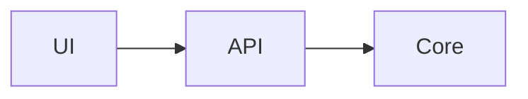
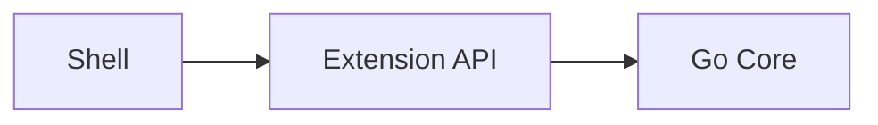

# Ideas

Personal project ideas + docs. Built with Next.js and Fumadocs.

## Develop

```bash
bun install
bun dev
```

- Garden: http://localhost:3000
- Example docs: http://localhost:3000/dev-kit

```bash
bun run build
bun run start
```

## Add a project

1. Create `content/projects/{slug}/`
2. Add `meta.json` with `"root": true` and a `pages` list
3. Add `index.mdx` (and more pages as needed)
4. Open `http://localhost:3000/{slug}`

The folder name **is** the URL segment.

### `meta.json` example

```json
{
  "title": "My Project",
  "description": "Short project blurb",
  "root": true,
  "pages": [
    "---Intro---",
    "index",
    "vision",
    "---Architecture---",
    "system-overview",
    "---Engineering---",
    "open-questions"
  ]
}
```

Use `---Section---` strings to group pages in the sidebar.

## Writing docs

### Language

- **Body copy:** Vietnamese is fine for explanations.
- **Titles, nav labels, section headings:** prefer English when a Vietnamese phrase sounds awkward or calqued (e.g. use `Performance budgets`, not “Ngân sách hiệu năng”; `Idea Garden`, not “Vườn ý tưởng”).
- **Technical terms:** keep common English nouns (`vault`, `plugin`, `sync`, `MCP`, `Extension API`) and explain them in Vietnamese around them.
- **This README:** English.

### Page shape (template)

Every deep-dive page should follow this order:

1. Frontmatter: `title`, `description`
2. H1 matching the title
3. One short lead paragraph
4. **Primary diagram** (Mermaid) when the page is architectural / flow-heavy
5. Short Vietnamese explanation (a few paragraphs, not a wall of text)
6. Structured detail: lists, tables, Callout, Steps, Tabs
7. Optional “Next” Cards to related pages

### Mermaid

Fenced Mermaid blocks work:

````md

````

Prefer a diagram on: system overview, runtime, data/sync, security, MCP, and module boundary pages.

### MDX page template

```mdx
---
title: System overview
description: One-sentence summary of this page.
---

# System overview

Short lead in Vietnamese (or mixed). Keep English tech terms.



## Key points

- Point one
- Point two

import { Callout } from 'fumadocs-ui/components/callout';
import { Cards, Card } from 'fumadocs-ui/components/card';

<Callout title="Note">
Short callout text.
</Callout>

<Cards>
  <Card title="Related page" href="/my-project/related" description="Why click next" />
</Cards>
```

### Useful components

Import from `fumadocs-ui` as needed:

- `Callout` — warnings / notes
- `Cards` / `Card` — next links
- `Steps` / `Step` — procedures
- `Tabs` / `Tab` — alternate views

### Do / Don't

| Do | Don't |
|---|---|
| Short pages with a clear job | Dump a 1000-line design doc into one MDX |
| Diagram first on complex topics | Walls of prose with no structure |
| Keep English terms that developers already use | Force awkward Vietnamese calques for titles |
| Rewrite for clarity from source notes | Machine-translate huge English blobs verbatim |

## Project layout

```
content/projects/{slug}/   # MDX + meta.json
app/page.tsx               # Idea Garden
app/[project]/...         # Fumadocs pages at /{slug}
components/mdx/            # MDX helpers (Mermaid, …)
lib/source.ts              # Content loader (baseUrl: '/')
```

## Scripts

| Script | Purpose |
|---|---|
| `bun dev` | Local development |
| `bun run build` | Production build |
| `bun run start` | Serve production build |
| `bun run lint` | ESLint |
| `bun run types:check` | Generate MDX types + `tsc` |
