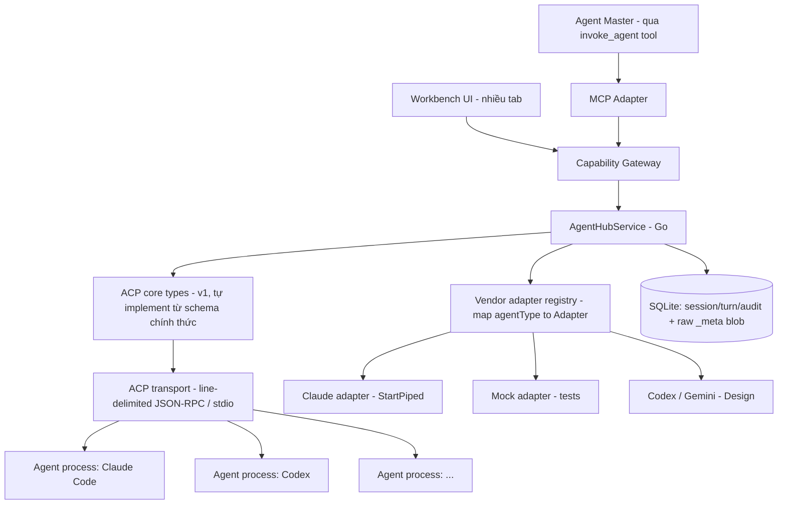
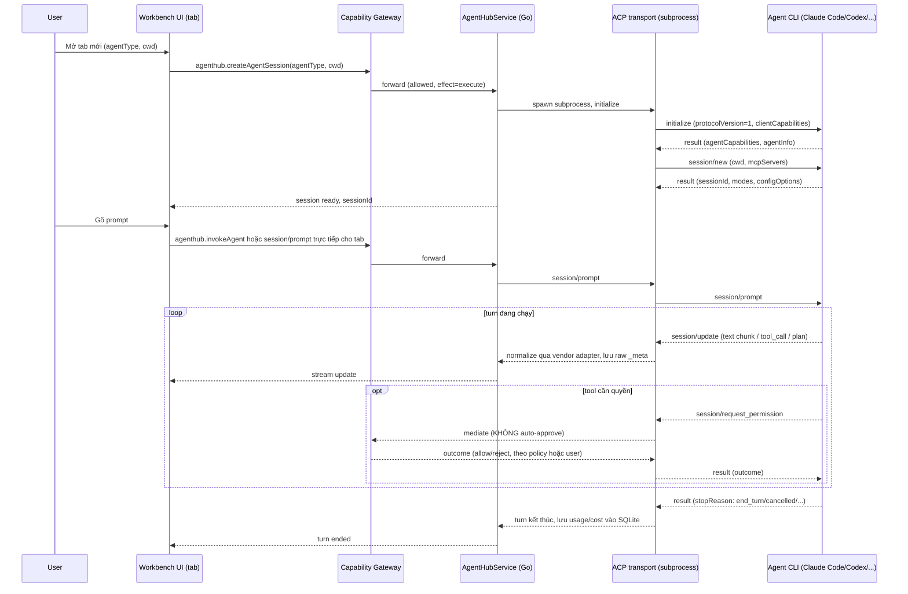
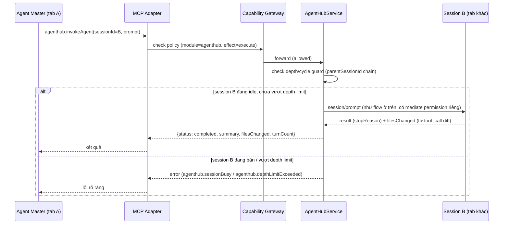

# Agent Hub (Multi-Agent Sessions)

Agent Hub là module built-in giúp DevKit tập trung chạy nhiều AI coding agent
(Claude Code, Codex, Gemini CLI, …) song song, mỗi agent một "tab" độc lập,
quản lý qua Capability Gateway như mọi module khác. Trên nền đó, module mở thêm
khả năng **agent-gọi-agent**: chọn 1 agent làm "master", cấp cho nó 1 tool để
tự gọi sang agent khác lấy kết quả — không cần con người điều phối thủ công.

import { Callout } from 'fumadocs-ui/components/callout';

<Callout type="info" title="Implemented — Phase 4 v1 closed (Claude-only)">
Phase 4 đóng với runtime: `internal/acp`, `internal/agenthub` (mock + Claude),
bridge/UI multi-tab, MCP `agenthub.*`, spawn qua
`sandbox.DefaultRunner().StartPiped(...)` (fail-closed). **Codex / Gemini
adapters vẫn Design** — thêm sau, không chặn đóng Phase 4. Chưa claim
production-verified vs Claude Code thật trong CI — smoke desktop. **Next:**
[Workbench UI (Phase 5)](/dev-kit/roadmap#phase-5--workbench-ui) theo
`dev-kit-app/DESIGN.md` (UI đủ flex cho vendor/tab). Sandbox:
[/dev-kit/sandbox](/dev-kit/sandbox). Status:
[Implementation status](/dev-kit/implementation-status).
</Callout>

Module đăng ký qua `ModuleManifest` như `vault`/`notes`/`db`/`ssh`/`tools`/`codegraph` hiện có — không tạo registry riêng. Đúng invariant #1 của `docs/architecture/devkit-architecture.md`: mọi call, từ UI lẫn từ agent master qua MCP, đi qua cùng `AppService.call` + Capability Gateway, không có đường tắt.

## Vì sao module riêng, không gộp vào Code Graph

Đã cân nhắc và quyết định tách: Code Graph là read-only index/query service (subprocess ngắn hạn, effect chủ yếu `read`). Agent Hub là orchestration layer cho tiến trình dài hạn (nhiều agent chạy song song, effect `execute` liên tục). Hai lifecycle và security surface khác nhau hoàn toàn. Agent Hub **tiêu thụ** Code Graph như một tool bình thường qua Capability Gateway (agent trong 1 tab có thể gọi `codegraph.getApiFlow`), không chia sẻ code nội bộ.

## BRD — Business requirement

### Vấn đề

Dev dùng nhiều agent CLI khác nhau (Claude Code, Codex, Gemini CLI...) nhưng phải tự mở nhiều terminal rời rạc, không nơi nào theo dõi tập trung trạng thái/chi phí/lịch sử các phiên đó. Khi cần chia một việc lớn cho nhiều agent làm song song, người dùng phải tự copy-paste kết quả qua lại — không có cơ chế để 1 agent tự gọi agent khác.

### Mục tiêu (goals)

- Chạy nhiều agent CLI song song, mỗi agent 1 tab, quản lý tập trung trong DevKit (mở/đóng/xem trạng thái/chi phí).
- Cho phép 1 agent (master) gọi 1 agent khác qua tool để giao subtask, nhận kết quả về, không cần con người chuyển tiếp thủ công.
- **Kiến trúc đủ "flex" để thêm agent vendor mới mà không sửa core**: đã xác nhận bằng thực nghiệm thật rằng dù cùng ACP wire format, mỗi vendor nhét dữ liệu khác nhau vào field mở rộng (`_meta`) — core logic không được giả định cấu trúc riêng của bất kỳ vendor nào.
- Tận dụng lại pattern Capability Gateway/MCP đã chốt cho Code Graph, không phát minh cơ chế permission/audit riêng cho agent-to-agent.

### Actors

| Actor | Nhu cầu |
|---|---|
| Developer dùng DevKit | Mở nhiều agent CLI trong nhiều tab, theo dõi trạng thái/chi phí, review kết quả từng phiên |
| Agent master (qua MCP) | Gọi 1 agent khác để thực hiện subtask, nhận kết quả (`summary`, `filesChanged`) về |
| Người triển khai module | Cần ranh giới rõ giữa core (vendor-agnostic) và adapter (vendor-specific) để thêm vendor mới không sửa lan ra toàn bộ codebase |

### Functional requirements

| ID | Requirement |
|---|---|
| FR-1 | User mở được 1 agent session mới (chọn `agentType` + working directory). *Hình thái "1 tab mỗi agent" đã được thay bằng swarm tree — xem [UI](#ui--ba-bề-mặt-design).* |
| FR-2 | Mỗi session là 1 tiến trình con ACP độc lập (agent CLI/adapter chạy qua stdio), không chia sẻ state với session khác. |
| FR-3 | UI hiển thị real-time các `session/update` (text chunk, tool call + status, plan) khi agent đang chạy turn. |
| FR-4 | Mọi `session/request_permission` từ agent con **phải** qua Capability Gateway để quyết định — không có chế độ auto-approve mặc định (khác hẳn dev tool tham khảo dùng khi research, vốn auto-approve mọi request). |
| FR-5 | Expose MCP tool `agenthub.invokeAgent` (+ `listAgents`/`createAgentSession`/`getSessionStatus`/`cancelAgent`) để 1 agent (đang chạy trong 1 tab) gọi sang agent khác. |
| FR-6 | `invokeAgent` có depth/cycle guard — chặn agent A gọi B gọi lại A vô hạn. |
| FR-7 | Mỗi agent vendor (Claude/Codex/Gemini...) có 1 adapter riêng implement chung 1 interface; core orchestration không đọc trực tiếp field riêng của vendor nào. |
| FR-8 | Field mở rộng (`_meta`) của mọi message luôn được lưu nguyên dạng raw JSON song song với field đã normalize — không silently drop dữ liệu vendor chưa được adapter xử lý. |

### Non-functional requirements

| ID | Requirement |
|---|---|
| NFR-1 | Target ACP **protocol version 1** cho v1 của module (bản các agent CLI thật đang implement, có `fs`/`terminal` client-side surface để Gateway mediate). Protocol version 2 (draft, breaking redesign — bỏ hẳn `fs`/`terminal`, đổi hoàn toàn prompt lifecycle) để sau, gate qua feature flag khi ổn định, không target ngay từ đầu. |
| NFR-2 | Transport layer (line-delimited JSON-RPC/stdio) tách khỏi type layer (struct theo protocol version) — thêm version mới chỉ thêm bộ struct + dispatcher, không viết lại transport. |
| NFR-3 | Mọi call — UI lẫn agent master qua MCP — đi qua cùng `AppService.call` + Capability Gateway, không có đường tắt riêng cho agent-to-agent. |
| NFR-4 | Subprocess phải cancel/timeout được. Thực nghiệm cho thấy agent không luôn tự thoát khi đóng stdin (`agent did not exit on stdin EOF`) — bắt buộc có timeout kill sau `session/cancel`, fallback SIGTERM rồi SIGKILL nếu vẫn không thoát. |
| NFR-5 | Session data (transcript, cost, usage) lưu local mặc định, không sync ra ngoài — derived/cache data có thể chứa nội dung proprietary của project đang mở, giống nguyên tắc đã áp cho index Code Graph. |
| NFR-6 | `session/request_permission` phải có timeout riêng ở tầng Gateway — nếu không có quyết định kịp thời (UI không phản hồi, policy không khớp rule nào), mặc định **reject** (fail closed), không phải allow. |

### Out of scope (v1)

- Router thông minh tự động chọn agent theo intent — v1 chỉ có `invokeAgent` tường minh theo `sessionId`, không có "agent nào phù hợp nhất cho việc này".
- Nhiều client cùng đồng bộ xem 1 session (kiểu AHP mutex-over-ACP cho collaboration) — v1 chỉ 1 UI điều khiển 1 session.
- Target ACP protocol version 2.
- Tự động phát hiện/cài đặt agent CLI mới trên máy user — v1 chỉ hỗ trợ agent đã có adapter được viết sẵn trong DevKit.

### Acceptance criteria

- Mở 2 tab với 2 `agentType` khác nhau, chạy song song không tranh chấp resource, không rò state giữa 2 session.
- Agent master gọi `agenthub.invokeAgent` tới 1 session khác đang idle → nhận lại `summary` + `filesChanged` đúng shape thiết kế, session đó không bị 2 turn chạy chồng.
- Permission request từ agent con hiển thị thật trên UI (hoặc match policy rule đã lưu) — không có request nào bị tự động allow ngầm.
- Kill cứng 1 agent subprocess (giả lập crash) → session chuyển `status: error` rõ ràng trong vài giây, UI không treo, các tab khác không bị ảnh hưởng.
- Thêm 1 vendor mới (giả lập, ví dụ mock agent) chỉ cần viết 1 file adapter mới implement `VendorAdapter`, đăng ký vào registry — không phải sửa `AgentHubService` hay bất kỳ struct core nào.

## Flow

### Tab lifecycle — dựa trên trace thật (initialize → session/new → prompt turn → permission)

### `invokeAgent` — agent master gọi agent khác

## Technical design

### Components

- **ACP transport (Go, tự implement)** — line-delimited JSON-RPC 2.0 qua stdio, quản lý lifecycle subprocess (spawn, `session/cancel`, SIGTERM→SIGKILL timeout). Không phụ thuộc package community bên ngoài — lý do: đây là core dependency chạm tới execute-permission, rủi ro bus-factor của 1 package chưa ai official-support không chấp nhận được cho phần này.

  > **Nguyên tắc này hiện chỉ giữ được ở nửa phía client.** Phía agent với vendor Claude là `@agentclientprotocol/claude-agent-acp` (Zed Industries, Apache-2.0) — đúng loại package community mà lý do trên loại trừ, và nó nằm ngay trong đường execute-permission. Không có bridge ACP nào của Anthropic: `claude` CLI không nói ACP, và scope `@agentclientprotocol/*` trên npm do Zed giữ.
  >
  > Phụ thuộc còn sâu hơn "spawn binary của họ": cách ly permission của DevKit đi qua `session/new` `_meta.claudeCode.options` — **extension riêng của package đó, không thuộc spec ACP**. Hai thứ bám vào đó: `settingSources: []` (chặn `~/.claude/settings.json` của người dùng cấp allow rule vượt cổng) và `settings.hooks.PreToolUse` (chặn tool đọc credential mà jail buộc phải bind RW). Package đổi đường là cả hai lặng lẽ mất, agent vẫn chạy bình thường.
  >
  > Chốt lại bằng test, không bằng niềm tin: `TestClaudeACPMetaChannelStillWorks` chạy agent thật và assert hook thực sự chặn. Hook được cài qua đúng kênh với `settingSources`, nên một assert phủ cả hai. Đã verify chiều ngược lại — đổi tên option làm test đỏ.
- **ACP core types (protocol v1)** — struct Go cho request/response/notification theo schema v1 chính thức (`initialize`, `session/new`, `session/load`, `session/prompt`, `session/cancel`, `session/update`, `session/request_permission`, `fs/*`, `terminal/*`, content block, tool call, plan, session mode). Mọi field `_meta` trên các struct này khai báo kiểu `json.RawMessage` — **core không bao giờ parse cứng nội dung `_meta`**.
- **Vendor adapter registry** — `map[AgentType]VendorAdapter`. Mỗi adapter chịu trách nhiệm:
  1. Biết cách spawn agent tương ứng qua `sandbox.DefaultRunner().StartPiped`
     (binary path hoặc `npx <package>`, biến môi trường auth cần thiết) — **không**
     dùng unsandboxed `exec` / `acp.StartProcess` cho vendor thật.
  2. Normalize `_meta` thành model chung DevKit dùng nội bộ (`NormalizedUsage{cost, rateLimit}`, `NormalizedToolResult{stdout, stderr, ...}`) — ví dụ vendor Claude đã quan sát thật: `_meta.claudeCode.toolResponse`, `_meta._claude/rateLimit`, `_meta._claude/origin`, `_meta.permission.changes`. Codex/Gemini gần như chắc chắn có shape khác — mỗi vendor tự viết adapter riêng, core không đụng tới.
  3. Khai báo custom extension method vendor hỗ trợ (ví dụ Claude có `_session/steering`, `_session/goal` — không phải core spec) để UI biết bật/tắt tính năng theo từng tab.
- **AgentHubService (Go)** — orchestrate session lifecycle, gọi Capability Gateway cho **mọi** `session/request_permission` (không có nhánh auto-approve nào trong service này), quản lý depth/cycle guard cho `invokeAgent`, ghi SQLite (session, turn, usage/cost đã normalize, và raw `_meta` blob để audit/debug không mất dữ liệu).
- **Storage** — SQLite riêng cho session/turn/audit log (không qua vault/crypto envelope, cùng lý do như Code Graph: đây là derived/operational data, không phải secret cần mã hóa — nhưng vẫn không sync ra ngoài mặc định vì có thể chứa nội dung proprietary).
- **Bridge + MCP adapter** — cùng gọi `AgentHubService`, cùng đi qua Capability Gateway, đúng pattern đã dùng cho Code Graph.

### Vì sao cần lớp "flex" này — bằng chứng thực nghiệm

Khi test `@agentclientprotocol/claude-agent-acp` thật (không phải suy luận từ docs), quan sát được:

- Field chuẩn ACP (`content`, `rawOutput`) cho tool result thường chỉ có tóm tắt sơ sài (`"(Bash completed with no output)"`).
- Dữ liệu chi tiết thật (stdout/stderr đầy đủ, cost theo USD, rate limit status, cấu trúc policy khi user chọn "allow always") **chỉ nằm trong `_meta`, theo namespace riêng của Claude** (`claudeCode`, `_claude/*`).
- Docs chính thức phần `error.mdx` hiện là placeholder rỗng — không có danh sách error code chuẩn để dựa vào, hành vi lỗi thực tế phải quan sát per-vendor.

Kết luận thiết kế: **core layer chỉ nên cam kết với phần schema đã chuẩn hóa chính thức**; mọi thứ nằm trong `_meta` hoặc ngoài spec (error cụ thể, custom method) phải đi qua vendor adapter. Đây không phải phỏng đoán trước mà là quan sát trực tiếp từ 1 vendor thật — nên thiết kế interface `VendorAdapter` ngay từ v1, không để "thêm sau".

### MCP tool surface

| Tool | Effect | Mô tả |
|---|---|---|
| `agenthub.listAgents` | `read` | Liệt kê session đang mở (tab), kèm `status` |
| `agenthub.createAgentSession` | `execute` | Spawn 1 agent CLI mới (`agentType`, `cwd`); nếu gọi từ trong 1 session khác, `depth = parent.depth + 1`. Parent lấy từ identity của caller, không từ tham số; `cwd` phải nằm trong `projectPath` của cha (xem [Agent identity](#agent-identity--ranh-giới-giữa-các-session-implemented)) |
| `agenthub.invokeAgent` | `execute` | Gửi prompt vào 1 session, chờ turn xong hoặc timeout (blocking ở v1), trả kết quả |
| `agenthub.getSessionStatus` | `read` | Poll trạng thái 1 session |
| `agenthub.cancelAgent` | `execute` | `session/cancel` cho turn đang chạy trong 1 session. **Design:** chỉ với tới cây con của caller |

`invokeAgent` là **blocking/sync ở v1** (giữ đúng semantics mà agent CLI vốn đã quen khi tự gọi subagent nội bộ, không bơm thêm concept job/polling mới); chuyển sang async job pattern là việc mở sau nếu blocking call thực sự gây nghẽn, không phải build sẵn.

### Data model tối thiểu

`AgentSession` giữ: `id`, `agentType` (`claude` | `codex` | `gemini` | …),
`projectPath`, `status` (`idle` | `running` | `awaiting_permission` | `error` |
`done`), `parentSessionId` (ai đã spawn session này, null nếu là gốc), `depth`
(0 khi không có parent), `title` (lấy từ `session_info_update` nếu vendor hỗ
trợ), `createdAt`.

`TurnRecord` giữ: `sessionId`, `stopReason`, `usage` đã normalize (cost, token —
do vendor adapter quy đổi), và `rawMeta` — toàn bộ `_meta` chưa parse, giữ
nguyên cho audit.

### Error handling

- ACP core spec **chưa định nghĩa error code chuẩn** (`error.mdx` là placeholder) — thiết kế không dựa vào bộ mã lỗi ACP-specific không tồn tại. Mọi lỗi transport/subprocess (pipe đóng bất thường, timeout, crash) map về error code riêng của DevKit (`agenthub.*`), không cố suy đoán mã ACP.
- Agent không tự thoát khi đóng stdin (quan sát thật) → sau `session/cancel`, có timeout chờ thoát tự nhiên, hết hạn thì SIGTERM, vẫn không thoát thì SIGKILL.
- `session/request_permission` không có phản hồi kịp thời → mặc định **reject** (fail closed), không phải allow — khác hẳn hành vi auto-approve của dev tool dùng lúc research.
- Query `invokeAgent` vào session không tồn tại / đã đóng → `agenthub.sessionNotFound`, không trả kết quả rỗng ngầm định.
- Vượt depth limit → `agenthub.depthLimitExceeded`, chặn trước khi spawn thêm session.
- **Design:** target ngoài cây con của caller → `ErrNotDescendant` (bridge map
  permission denied); `cwd` ngoài `projectPath` cha → `ErrCwdOutsideParent`;
  `callerSessionId` khác identity thật → `ErrCallerMismatch` (cả hai map
  validation_failed); không tìm thấy proxy `devkit-mcp` → `ErrProxyNotFound`
  (unavailable). Mọi lỗi này xảy ra **trước khi spawn** — không để lại process
  hay socket mồ côi.

### Agent identity & ranh giới giữa các session (Implemented)

Đã triển khai trong `internal/identity`, `internal/mcp/session_host.go` và kiểm chứng qua `internal/agenthub/service_identity_test.go`, `internal/mcp/identity_test.go`. Cơ chế này giải quyết lỗ hổng được chỉ ra trong đợt review 2026-09-05 (xem [Security controls](/dev-kit/security-controls)): trước đây runtime không phân biệt agent nào đang gọi, 56 MCP handler bỏ qua session, `PermissionWaiter` và `interaction.Hub` chỉ giữ một pending cho cả app, và `createAgentSession` không kiểm soát `cwd`. Hệ thống đóng toàn bộ nhóm vấn đề này bằng một cơ chế thống nhất.

**Identity = socket.** Mỗi hub session được một unix socket riêng
`<UserConfigDir>/DevKit/agents/<16 hex đầu session id>.sock` (rút gọn vì
`sun_path` macOS giới hạn 104 byte; vượt là lỗi rõ, không cắt ngầm). DevKit
gắn `Caller{agent, sessionID}` ngay lúc `Accept`, không có bước xác thực nào,
vì **chỉ sandbox của đúng agent đó** được nối vào socket đó
(`Policy.AllowUnixSockets`, xem [Sandbox](/dev-kit/sandbox)). Kẻ giả mạo phải
thắng kernel, không phải thắng code. Socket chung `mcp.sock` giữ nguyên cho
terminal của người dùng với identity `user-terminal`. Chi tiết phía MCP:
[MCP / Agent § Caller identity](/dev-kit/mcp-agent#caller-identity--socket-riêng-cho-từng-agent-hub-session-implemented).

**Thứ tự tạo session đảo lại.** `CreateSession` hiện `adapter.Open` trước rồi
mới sinh UUID (`service.go:70-110`); phải sinh id trước → mở socket cho id đó
→ `Open` với `cwd` + socket được phép + `mcpServers` → persist. `agenthub`
không import được `mcp` (chiều ngược đã có) nên khai báo một interface nhỏ
"mở endpoint MCP cho session id, trả cấu hình `mcpServers` + đường dẫn socket
+ hàm đóng"; `mcp` cung cấp implementation, nối ở `main.go` — cùng pattern
`EnvLookup`. `VendorAdapter.Open(ctx, cwd)` thành `Open(ctx, spec)` với
`cwd`, socket được phép, `mcpServers`; Codex/Gemini sau này nhận cùng spec.

**Quy tắc hậu duệ.** Service đọc caller từ `ctx`:
- Caller **agent**: `CreateSession` ép parent = caller (tham số
  `callerSessionId` lệch → `ErrCallerMismatch`); depth luôn tính từ row của
  caller nên `CheckDepth` không còn đường né; `Invoke` / `Cancel` / `Get` /
  `List` chỉ với tới **cây con** của caller (`ancestorContains` đã có). Session
  người tạo từ UI không thuộc cây con của agent nào.
- Caller **ui / user-terminal**: như hôm nay; `CheckCycle` giữ cho đường này.

**`cwd`.** Caller agent: rỗng → kế thừa `projectPath` cha; có giá trị →
`EvalSymlinks` rồi phải là subpath của `projectPath` cha. Mọi caller: từ chối
`/` và đúng thư mục home — không cái nào là project, và đây là tiền đề của
chuỗi tấn công trong review. Khi có Workspace registry, nới thành "path đã
đăng ký trong workspace của cha".

**Pending không còn single-slot.** `PermissionWaiter` giữ map theo pending id,
một pending mỗi caller; `Complete(id, …)` giữ hợp đồng. `PendingPermission`
mang caller; bridge làm giàu title + depth để dialog hiện *"Agent «…» (depth
2) xin: …"*. Session đóng → hook `OnSessionClosed(id)` (set ở `main.go`) để
`interaction.Hub` quên `allow_always` của session đó.

**Không đổi trong spec này:** `invokeAgent` vẫn blocking; `MaxDepth = 3`;
`codegraph.*` vẫn `project:active` (cần [Workspace](/dev-kit/workspace)).

**Đã kiểm chứng end-to-end (2026-09-05).** Một session Claude thật, spawn
trong sandbox, gọi được `env.listTags` của DevKit: dòng audit
`caller = agent:<uuid>` / `env:read` / `tag:list` / `allowed` join đúng vào
`agent_sessions`. Đó là bằng chứng cho cả chuỗi — socket riêng theo session,
middleware đóng dấu caller, gateway kiểm capability, SQLite lưu kèm caller và
timestamp.

### Vendor agent cần gì để xác thực (Implemented)

Jail giấu `$HOME`, và thiết kế ban đầu **giả định agent dùng API key**. Đăng
nhập bằng subscription thì không: agent bắt tay ACP xong rồi chết ở lượt prompt
đầu tiên với `-32000 Authentication required` (đo được: ~70ms, session sang
`error`, không turn nào). Bốn thứ phải có, mỗi thứ tìm ra bằng cách đo lỗi kế
tiếp — không cái nào suy ra được từ đọc code:

| Cần | Vì sao | Biểu hiện khi thiếu |
|---|---|---|
| `~/.claude` + `~/.claude.json` read-write | config và session state của Claude Code | không đọc được settings |
| Keychain | OAuth token thật nằm ở đó — xem [Sandbox § AllowKeychain](/dev-kit/sandbox#allowkeychain-implemented) | `Authentication required` |
| `USER` (+ `LOGNAME`) trong env allowlist | auth subscription resolve tài khoản qua đây | `Authentication required` **dù keychain đọc được** |
| `mcpServers` luôn có mặt trong `session/new` | schema v1 bắt buộc, `omitempty` làm nó biến mất | `-32602 Invalid params` |

Grant là **đúng hai path**, không bao giờ cả `$HOME` — có test khoá điều đó.
Đây là nhượng bộ có chủ ý: bất cứ thứ gì chạy trong jail đó đọc được credential
của agent. Đổi lại, agent do DevKit spawn mới hoạt động được với tài khoản
subscription.

`ClaudeOptions.Command` ưu tiên binary `claude-agent-acp` đã cài; `npx -y` chỉ
là fallback kèm cảnh báo, vì npx cần `~/.npm` ghi được — thứ jail không có.
Binary Node còn cần cả cây `node_modules` của nó trong `ReadOnlyPaths`, nếu
không sẽ `ERR_MODULE_NOT_FOUND` ở import đầu tiên.

### UI — ba bề mặt (Design)

Thiết kế: [Figma page 17 · Agent Hub](https://www.figma.com/design/3dOzSZBYY7QtzANFTCfEe8/DevKit?node-id=904-2).

**Thay cho mô hình "mỗi agent một tab".** Tab hợp lý khi có hai ba agent và bạn
ngồi trong module Agent Hub. Nó hỏng ở hai điểm khi swarm lớn: tab strip không
diễn tả được quan hệ cha→con mà `authorizeTarget` cưỡng chế, và tab **giam agent
bên trong module** — trong khi cả điểm của swarm là chúng chạy tiếp lúc bạn làm
việc ở Notes hay CodeGraph. Per-session tab chưa từng được implement (xem
[Implementation status](/dev-kit/implementation-status)), nên đây là thay một kế
hoạch, không phải thay một thứ đang chạy.

Ba bề mặt, mỗi cái phủ một thời điểm khác nhau:

| Bề mặt | Kích thước | Lúc nào | Việc |
|---|---|---|---|
| `Agent / Rail` | 320×856, khớp `panel-surface` | panel mở, ở bất kỳ module nào | Hội thoại với agent đang chọn + strip chuyển bầy; permission hiện **inline** |
| `Agent / Permission Toast` | 420, nổi góc dưới-phải | panel đóng, hoặc đang ở module khác | Xin quyền kèm đủ danh tính |
| `Agent / Dock Badge` | 16 (count) / 8 (dot) | không có gì khác trên màn hình | Tồn đọng: có N agent đang chờ bạn |

Toast là **sự kiện**, badge là **trạng thái**. Thiếu badge thì một request đến
lúc bạn rời máy sẽ không để lại dấu vết nào — mà gate fail-closed sau 60 giây,
nên "không dấu vết" nghĩa là lượt của agent đã bị từ chối và không ai biết vì sao.

**Permission không bao giờ là modal.** Request chặn *agent*, không chặn *người*.
Modal cướp mất module đang làm dở, đúng thứ swarm sinh ra để tránh. Thẻ nằm
inline trong rail; khi rail đóng thì thành toast.

**Mọi thẻ permission nêu agent nào đang xin**, kèm depth và working directory.
Với một agent đó là trang trí; với N agent nó là khác biệt giữa duyệt có cơ sở và
duyệt mù. Đây chính là dữ liệu mà [caller identity](#agent-identity--ranh-giới-giữa-các-session-implemented)
mới bắt đầu cung cấp.

**Toast cố ý không có "Allow always".** Đó là bề mặt ít ngữ cảnh nhất — bạn đang
ở module khác, không thấy transcript. Một grant sống lâu hơn cả lượt phải được
cấp từ rail, nơi nhìn được đủ. Toast có nút "Open rail" cho đúng việc đó.

**Toast hiện deadline chứ không giấu.** `interaction.DefaultTimeout` là 60 giây và
fail-closed; một toast tự tắt sẽ từ chối lượt của agent trong im lặng.

Trong module Agent Hub: `Agent Hub / Sidebar Content` (264×836) là bầy dưới dạng
**cây** — thụt lề chính là chuỗi cha→con, cũng là ranh giới một agent được phép
với tới; `Agent Hub / Content` (1136×804 — bằng `content-slot`, tức
`content-surface` 852 trừ 48 của tab strip) là bản đọc rộng: header có chuỗi
cha, transcript đầy đủ, composer ở đáy. Cả hai không tự tô nền — slot của shell
sở hữu surface, xem [Shell primitives](/dev-kit/shell-primitives).

**Chi phí hiện ngay trên ô nhập, không ở sidebar.** `Agent / Composer`
(1096×172 ở content, 280×144 ở rail) là **một khung viền bao đúng ô nhập** —
không bao transcript — và dải meta nằm bên trong khung đó, ngay trên field:
số lượt + chi phí luỹ kế bên trái, vendor + phiên bản agent bên phải. Đó là dữ
liệu **agent tự báo** (`usage_update` và `_meta._claude/rateLimit` của lượt),
nên nó thuộc về chỗ sinh ra nó — cái lượt bạn đang sắp gửi — chứ không phải một
cột tiền trong danh sách agent, nơi nó sẽ bị đọc thành bảng xếp hạng. Không có
đường phân cách giữa composer và transcript: viền của composer **chính là** ranh
giới đó.

Composer **biến mất** ở `State=Error` và `State=Empty` của cả hai bề mặt: phiên
chết hoặc chưa có phiên thì không có gì để gửi tới, và một ô nhập vô hiệu vẫn
mời người ta gõ vào.

**Chat dùng anatomy của shadcn `Message`.** Tên layer trong Figma trùng tên slot
để map 1:1: `MessageAvatar`, `MessageContent`, `MessageHeader`, `Bubble` →
`BubbleContent`, `MessageFooter`; `align` start cho agent, end cho người dùng.

Một lưu ý chỉ đúng cho Figma, **không** mang sang code: bubble ở đó phải có
variant `Width` (Rail / Wide) vì Figma không cho override `maxWidth` lẫn chiều
rộng text bên trong instance. Trong React thì `max-w-[…]` là đủ — đừng sinh hai
biến thể component chỉ vì hạn chế của công cụ thiết kế.

**Transcript render đúng những gì ACP phát ra, không hơn.** Một `ToolCall` mang
`content` ở **ba dạng** (`content` với content block, `diff` với `path`/`oldText`/
`newText`, `terminal` với `terminalId`), thêm `kind` (9 giá trị, từ `read` tới
`execute`) và `locations` (`path` + `line`) mà spec nói client nên render để làm
follow-along. Content block thì có `text`, `image`, `audio`, `resource_link`,
`resource`. Mỗi khối dưới đây tồn tại vì một trong những thứ đó, không phải vì
chat nào cũng có.

Component có sẵn trên page 17 (số trong ngoặc là số variant):

| Component | Kích thước | Phủ việc gì |
|---|---|---|
| `Agent / State` (5) | 34–61×16 | `Status` Idle / Running / Awaiting / Error / Closed |
| `Agent / Row` (3) | 264×56 | một agent trong cây bầy — `State` Rest / Hover / Selected |
| `Agent / Message` (4) | 272–720×72–136 | bubble chat, `Align` Start/End × `Width` Rail/Wide |
| `Agent / Message Rich` (1) | 720×436 | mẫu chốt ngôn ngữ markdown của câu trả lời — xem dưới |
| `Agent / Image` (1) | 400×257 | content block `image`: khung 16:9 + tên file + kích thước |
| `Agent / Code Block` (2) | 536×136 | code trong câu trả lời — `State` Default / Collapsed |
| `Agent / File Chip` (1) | 178×24 | `resource_link` và `locations` — `path` + `:line` |
| `Agent / Thinking` (2) | 536×32–88 | khối reasoning — `State` Collapsed / Expanded |
| `Agent / Tool Call` (5) | 536×72–96 | `State` Pending / Running / Awaiting / Done / Failed, kèm icon `kind` và hàng `locations` |
| `Agent / Tool Diff` (1) | 536×168 | `ToolCallContent` `diff` — dùng lại `Diff / Line` của page 08 |
| `Agent / Tool Terminal` (3) | 536×96–112 | `ToolCallContent` `terminal` — `State` Running / Exited / Failed |
| `Agent / Plan` (1) | 536×180 | `session/update` kind `plan` |
| `Agent / Invoke Result` (1) | 536×220 | kết quả `invokeAgent` (`summary`, `filesChanged`) |
| `Agent / Rate Limit` (2) | 536×40 | `_meta._claude/rateLimit` — `Level` Warning / Exhausted |
| `Agent / Session Error` (2) | 536×124 | `Cause` Crashed / Denied — banner kèm mã lỗi DevKit |
| `Agent / Permission Request` (2) | 272×180–208 | thẻ inline trong rail — `Env` Open / Locked |
| `Agent / Permission Toast` (2) | 420×220–248 | `Env` Open / Locked, khi rail đóng hoặc ở module khác |
| `Agent / Dock Badge` (2) | 16 / 8 | `State` Waiting (count) / Running (dot) |
| `Agent / New Session` (2) | 440×304–352 | tạo phiên — `State` Default / Error |
| `Agent / Meta Inspector` (1) | 544×444 | `_meta` thô của một `session/update` |
| `Agent / Menu` (2) | 320×168 | popover của composer — `Mode` Commands (`available_commands_update`) / Context |
| `Agent / Jump To Latest` (1) | 128×24 | pill nổi khi transcript đã cuộn lên |
| `Agent / Composer` (6) | 1096×164–200 / 280×146–182 | `Size` Wide/Rail × `State` Idle / Streaming / Attached |
| `Agent / Rail` (2) | 320×856 | bề mặt panel — `State` Conversation / Empty |
| `Agent Hub / Sidebar Content` (1) | 264×836 | cây bầy trong module |
| `Agent Hub / Content` (3) | 1136×804 | bản đọc rộng — `State` Conversation / Empty / Error |

**Composer có ba trạng thái, không phải bốn.** `Idle` gửi, `Streaming` biến nút
gửi thành **stop** (`session/cancel`), `Attached` hiện hàng file đính kèm bên
trong khung nhập. "Streaming + có đính kèm" không phải trạng thái có thật —
đính kèm biến mất khi gửi — nên đây là **một trục ba giá trị**, không phải hai
trục nhân nhau.

**Markdown của agent nói cùng ngôn ngữ với phần còn lại của app.** `Agent /
Message Rich` là **một** mẫu chốt toàn bộ các dạng thay vì tách component cho
từng loại: heading dùng `Title/16` (thang không có 14/15, bậc trên 13 là 16),
đoạn văn `Body/13`, list có marker `text/tertiary` thụt treo, inline code là chip
`surface/base` chữ `Code/12` (mono nhỏ hơn sans 1px), link `status/info` gạch
chân, blockquote có vạch trái 2px, bảng header `Label/12` trên `surface/base`.
Đoạn chứa inline code dùng auto-layout **WRAP** giống `para-with-links` của
[Notes](/dev-kit/notes) — cùng một cách giải, không phát minh lại.

**Code không bao giờ xuống dòng.** Ở rail 288px, mono 12 mà wrap thì không đọc
được; `Agent / Code Block` và `Agent / Tool Terminal` để phần thân hug chiều
rộng tự nhiên và cho khung cắt — tức là một vùng **cuộn ngang**. Đường dẫn trong
header thì truncate một dòng, không wrap.

Bốn màn hình lắp sẵn trong `App Shell` để đọc cùng lúc: **A** trong module Agent
Hub (rail đóng), **B** rail mở đè lên module khác, **C** rail đóng và permission
đến bằng toast, **D** một phiên crash. Toàn bộ page 17 đã bind 100% text style,
spacing và radius theo [Design system](/dev-kit/design-system).

<Callout type="info" title="Chưa vẽ, có chủ đích">
Con trỏ đang stream trong bubble (là override nội dung, không phải component),
vạch phân cách lượt và timestamp trong transcript, nút xoá trên chip đính kèm.
Không cái nào bị protocol bắt buộc; thêm khi có nhu cầu thật.
</Callout>

### Known ceiling (v1)

- Chỉ target ACP protocol version 1; agent nào chỉ hỗ trợ v2 chưa dùng được.
- Adapter shipped: **mock** (tests) + **Claude** (spawn qua `sandbox.StartPiped`).
  Codex/Gemini vẫn Design — thêm theo cùng `VendorAdapter`, không rework core.
- Router tự động chọn agent theo intent chưa có — v1 chỉ gọi tường minh theo `sessionId`.
- Chưa có multi-client đồng bộ xem 1 session (kiểu AHP) — ngoài scope v1.
- Claude adapter chưa được claim production-verified trong CI với Claude Code thật.
- UI mới là **Design**: chưa có code nào của `Agent / Rail`, toast hay dock badge.
  `frontend/src/workbench/AgentCompanion.tsx` là bản một-agent đi trước, chưa có
  strip chuyển bầy lẫn cây cha→con.
- **Sandbox vendor phải tắt khi spawn qua DevKit.** Trên macOS sandbox không
  lồng được (`sandbox_apply: Operation not permitted`, đo 2026-09-05); Claude
  Code `/sandbox` / Codex sandbox bật bên trong jail DevKit làm mọi lệnh bash
  của agent fail ngầm. Adapter chịu trách nhiệm đảm bảo điều này — xem
  [Sandbox](/dev-kit/sandbox) và ADR-009.

## Kế hoạch ACP — phần surface còn thiếu

Đo ngày 2026-09-06 trên `claude-agent-acp` 0.74.0. Ba con số định hình toàn bộ phần dưới:

- `initialize` của DevKit (`internal/agenthub/adapter_claude.go`) gửi **duy nhất `clientInfo`** — không khai báo `clientCapabilities` nào. Agent vì thế không biết DevKit hỗ trợ gì, và mặc định coi như không hỗ trợ gì cả.
- Doc này (§ Technical design) đặc tả 13 mục cho ACP core types; `internal/acp/types_v1.go` hiện có **6**. Thiếu: `session/load`, `fs/*`, `terminal/*`, và các struct tool call / plan / session mode.
- Agent phát **15** `sessionUpdate` kind; `internal/agenthub/update.go` parse **6**. Chín kind còn lại rơi vào `UpdateUnknown` (nay đã có `OnUnknownUpdate` báo mỗi kind một lần/session — chính nó tìm ra `session_info_update` mang title).

Agent tự khai (`agentCapabilities`) những thứ DevKit chưa dùng: `loadSession`, `promptCapabilities.image`, `promptCapabilities.embeddedContext`, `mcpCapabilities.http`/`sse`, `auth.logout`, và `sessionCapabilities` gồm `close`, `delete`, `fork`, `list`, `resume`, `subagents`, `additionalDirectories`.

### T0 — Đo trước, đừng xây (Đã đo 2026-09-06)

Kết quả, trên `claude-agent-acp` 0.74.0. Cách đo: dựng client ACP tối thiểu, khai capability, chạy turn thật, đếm method agent gọi ngược.

- **`fs/*` và `terminal/*`: agent không dùng.** Khai đủ `fs.readTextFile`, `fs.writeTextFile`, `terminal: true`, rồi chạy ba ca — đọc file trong cwd, ghi file **ngoài** cwd, chạy lệnh Bash. Agent gọi ngược đúng `session/request_permission` (2 lần) và **không một lần** `fs/*` hay `terminal/*`; nó tự đọc/ghi trong process của mình. Kết luận: **Capability Gateway không mediate được file access của agent qua ACP với vendor này** — cửa duy nhất là `session/request_permission` (đã có) và `PreToolUse` hook (đã có). Bỏ mục `fs/*` khỏi T2; giữ log ở `UnknownMethod` để biết nếu điều này đổi.
- **`clientCapabilities` rỗng đang làm mất dữ liệu.** Cùng một prompt spawn hai subagent, chỉ khác một field: khai `subagents: {}` làm `agent_message_chunk` nhảy từ **2 lên 13**. Đó là `forwardSubagentText` trong adapter bật lên. Nghĩa là **hôm nay DevKit đang mất toàn bộ text của subagent**, không phải vì chưa render mà vì chưa hỏi. Đây là bug, không phải tính năng thiếu.
- **Kind `subagent_*` cần thêm gì đó nữa.** Khai `subagents: {}` mở được text nhưng vẫn chưa thấy `subagent_spawned` / `subagent_state_update`. Đường còn lại trong adapter là "air extension": `clientCapabilities._meta` phải mang version + danh sách capability, với `nativeSubagentSessions` (hoặc `_meta["subagent-transcript"] = true` cho bản transcript). Chưa xác minh — **đừng implement theo suy đoán**, đo tiếp trước.

### T0 — công cụ để đo lại

Kết luận ở trên đúng với một version của một vendor, nên hai công cụ dưới ở lại trong repo để đo lại khi nghi ngờ, thay vì phải dựng client tạm lần nữa.

- `ClaudeOptions.OnUnknownMethod` (`internal/agenthub/adapter_claude.go`) báo mỗi method agent→client chưa implement, một lần mỗi process; `main.go` ghi ra log kèm 300 ký tự params. Trước đó `UnknownMethod` trả lỗi cho agent và **không ghi gì** — comment của `internal/acp/handler.go` lấy đúng `fs/*` làm ví dụ, nên một `fs/read_text_file` gọi vào mỗi turn từ Phase 4 tới giờ cũng sẽ không để lại dấu vết nào. Đây là thứ sẽ báo nếu kết luận "agent không dùng `fs/*`" hết đúng.
- `DEVKIT_CLAUDE_CAPTURE_PROMPT` mở khoá prompt của `TestClaudeACPCapture`, vốn hardcode một kịch bản read/edit/shell. Kind chưa model chỉ xuất hiện khi turn làm việc khác, và sửa test mỗi lần đổi câu hỏi thì câu hỏi sau lại phải sửa nữa.

### T1 — Đã đặc tả, agent hỗ trợ, vá bug đang tồn tại

- **Khai báo `clientCapabilities` trong `initialize`.** Điều kiện tiên quyết cho mọi mục còn lại: agent quyết định gọi `fs/*`, gửi ảnh, hay dùng terminal dựa trên đúng field này. Hiện DevKit im lặng nên agent không bao giờ thử.
- **`session/load`.** Agent khai `loadSession: true`. `internal/agenthub/service.go` đã tự ghi lỗi mà method này vá: sau khi process khởi động lại, row trong store sống lâu hơn runtime trong memory, và `Invoke`/`Cancel` trả `ErrUnavailable` cho những session mồ côi đó. Đây là mục có căn cứ chắc nhất — doc yêu cầu, agent hỗ trợ, và nó sửa một khiếm khuyết đã biết chứ không thêm tính năng.

### T2 — Mở rộng theo đúng thứ agent quảng cáo

- **Subagent.** `sessionCapabilities.subagents` cộng hai kind `subagent_spawned` / `subagent_state_update` chưa model. Cây swarm ở `_Slot / Sidebar Content` tồn tại chính là để hiển thị dữ liệu này; hiện nó chỉ vẽ được session do người tạo. Phụ thuộc capture ở T0.
- **Prompt không chỉ có text.** `acp.PromptRequest` đã model `[]ContentBlock` đúng chuẩn, nhưng `SessionRuntime.Prompt` trong `internal/agenthub/adapter.go` nhận `string`, bóp mất chỗ đó. Hệ quả nhìn thấy được: nút "Add context" trên `AgentComposer` và component `AgentImage` (dựng theo Figma) không có đường nào nhận đính kèm. Đổi chữ ký là mở khoá cả `promptCapabilities.image` lẫn `embeddedContext`.
- **`fs/*` và `terminal/*`.** NFR-1 gọi đây là client-side surface để Gateway mediate — tức mọi file access của agent lẽ ra đi qua Capability Gateway. Hiện agent dùng tool Read/Write riêng, ghi thẳng vào đĩa trong sandbox, Gateway không thấy gì; cùng loại điểm mù với cổng permission. **Nhưng chưa chứng minh được agent sẽ dùng**: trong bundle có plumbing (`readTextFile`/`writeTextFile` proxy qua `methods.client.fs.*`) mà không tìm ra call site. Gate mục này sau kết quả T0.
- **`fork` / `list` / `delete` / `resume`.** Đáng chú ý `delete`: `Service.DeleteSession` hiện chỉ xoá row phía DevKit, agent có `delete` riêng — cần biết hai bên có phải cùng một thứ không trước khi coi là đã xong.

### T3 — Dọn tầng

Struct tool call, plan, session mode: doc đặt ở `internal/acp`, code thực tế nằm trong `internal/agenthub/update.go`. Chọn một — dời code, hoặc sửa doc — nhưng không để hai bên nói khác nhau, vì đó là cách một đặc tả trở nên vô dụng.

### Hoãn có chủ đích

Protocol v2 (đã ghi out-of-scope ở [roadmap](/dev-kit/roadmap) Phase 4). Codegen struct từ `schema/v1` — vẫn là câu hỏi mở bên dưới, và T1 không đợi nó.

### Thứ tự đề nghị

T0 trước vì nó rẻ và nó quyết định `fs/*` có đáng làm không. Rồi `clientCapabilities` + `session/load` (T1) vì cả hai đã có căn cứ và không phụ thuộc phép đo nào. Subagent và prompt content block sau đó, theo thứ tự capture về trước.

## Open questions

- Chuẩn hóa Go struct bằng codegen từ JSON schema chính thức (`schema/v1`) hay viết tay? Codegen giảm rủi ro lệch field khi upstream cập nhật, nhưng thêm bước build phụ thuộc vào việc theo dõi release của `agentclientprotocol` org.
- Session data (transcript, cost) có nên cho phép opt-in sync không, hay tuyệt đối local-only như NFR-5 đề ra? (liên quan tới câu hỏi sync đã có ở [Open questions](/dev-kit/open-questions))
- Vendor thứ 2 nên ưu tiên viết adapter là Codex hay Gemini CLI — cần biết cả hai có ACP-compatible adapter chính thức/community ở mức trưởng thành tương đương `claude-agent-acp` không trước khi cam kết.
- `fs/*` và `terminal/*` có thực sự được `claude-agent-acp` gọi không, hay chỉ là plumbing chưa dùng? Quyết định cả việc Capability Gateway có mediate được file access của agent hay không — đo bằng T0 trước khi cam kết.
- Ai chịu trách nhiệm theo dõi version bump từ `agentclientprotocol` org theo thời gian — nên có ADR riêng ghi rõ (giống ADR-002) thay vì để ngầm định.

import { Cards, Card } from 'fumadocs-ui/components/card';

<Cards>
  <Card title="Tasks" href="/dev-kit/tasks" description="Design — board kiểu Jira; agent claim task, kết quả turn tự đẩy task sang review" />
  <Card title="Code Graph (Java)" href="/dev-kit/codegraph" description="Module liên quan mật thiết — Agent Hub tiêu thụ Code Graph như 1 tool bình thường qua Gateway" />
  <Card title="MCP / Agent" href="/dev-kit/mcp-agent" description="Model chung cho mọi MCP tool, bao gồm agenthub" />
  <Card title="Plugins" href="/dev-kit/plugins" description="Pattern ModuleManifest mà agenthub sẽ theo" />
  <Card title="Technical contracts" href="/dev-kit/technical-contracts" description="Bridge/Capability Gateway boundary hiện có" />
</Cards>
