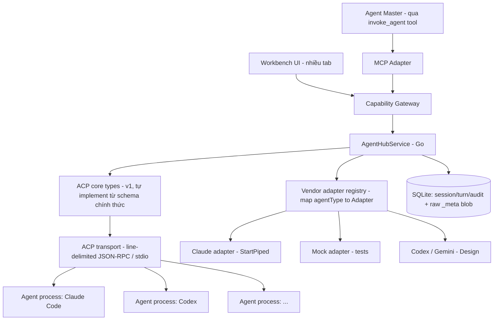
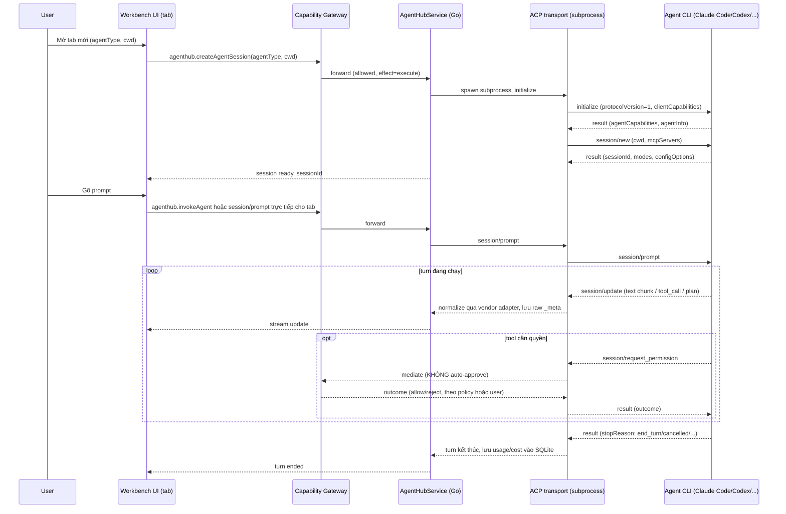
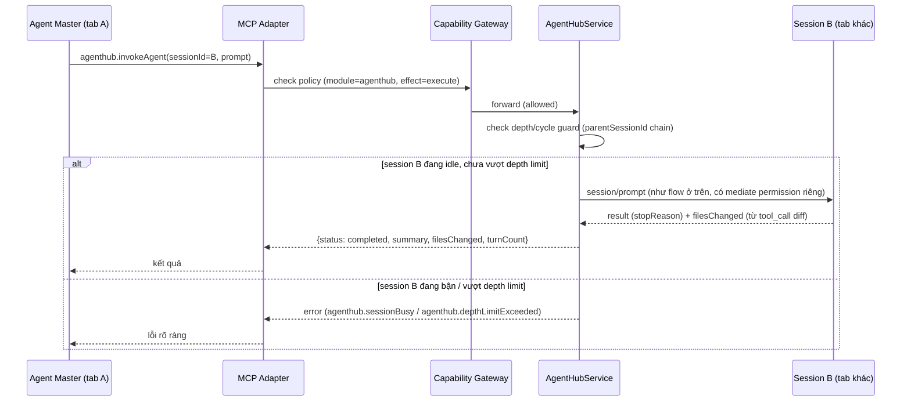

# Agent Hub (Multi-Agent Sessions)

Agent Hub là module built-in giúp DevKit tập trung chạy nhiều AI coding agent
(Claude Code, Codex, Gemini CLI, …) song song, mỗi agent một "tab" độc lập,
quản lý qua Capability Gateway như mọi module khác. Trên nền đó, module mở thêm
khả năng **agent-gọi-agent**: chọn 1 agent làm "master", cấp cho nó 1 tool để
tự gọi sang agent khác lấy kết quả — không cần con người điều phối thủ công.

import { Callout } from 'fumadocs-ui/components/callout';

<Callout type="info" title="Implemented — Phase 4 v1 closed (Claude-only)">
Phase 4 đóng với runtime: `internal/acp`, `internal/agenthub` (mock + Claude),
bridge/UI multi-tab, MCP `agenthub.*`, spawn qua
`sandbox.DefaultRunner().StartPiped(...)` (fail-closed). **Codex / Gemini
adapters vẫn Design** — thêm sau, không chặn đóng Phase 4. Chưa claim
production-verified vs Claude Code thật trong CI — smoke desktop. **Next:**
[Workbench UI (Phase 5)](/dev-kit/roadmap#phase-5--workbench-ui) theo
`dev-kit-app/DESIGN.md` (UI đủ flex cho vendor/tab). Sandbox:
[/dev-kit/sandbox](/dev-kit/sandbox). Status:
[Implementation status](/dev-kit/implementation-status).
</Callout>

Module đăng ký qua `ModuleManifest` như `vault`/`notes`/`db`/`ssh`/`tools`/`codegraph` hiện có — không tạo registry riêng. Đúng invariant #1 của `docs/architecture/devkit-architecture.md`: mọi call, từ UI lẫn từ agent master qua MCP, đi qua cùng `AppService.call` + Capability Gateway, không có đường tắt.

## Vì sao module riêng, không gộp vào Code Graph

Đã cân nhắc và quyết định tách: Code Graph là read-only index/query service (subprocess ngắn hạn, effect chủ yếu `read`). Agent Hub là orchestration layer cho tiến trình dài hạn (nhiều agent chạy song song, effect `execute` liên tục). Hai lifecycle và security surface khác nhau hoàn toàn. Agent Hub **tiêu thụ** Code Graph như một tool bình thường qua Capability Gateway (agent trong 1 tab có thể gọi `codegraph.getApiFlow`), không chia sẻ code nội bộ.

## BRD — Business requirement

### Vấn đề

Dev dùng nhiều agent CLI khác nhau (Claude Code, Codex, Gemini CLI...) nhưng phải tự mở nhiều terminal rời rạc, không nơi nào theo dõi tập trung trạng thái/chi phí/lịch sử các phiên đó. Khi cần chia một việc lớn cho nhiều agent làm song song, người dùng phải tự copy-paste kết quả qua lại — không có cơ chế để 1 agent tự gọi agent khác.

### Mục tiêu (goals)

- Chạy nhiều agent CLI song song, mỗi agent 1 tab, quản lý tập trung trong DevKit (mở/đóng/xem trạng thái/chi phí).
- Cho phép 1 agent (master) gọi 1 agent khác qua tool để giao subtask, nhận kết quả về, không cần con người chuyển tiếp thủ công.
- **Kiến trúc đủ "flex" để thêm agent vendor mới mà không sửa core**: đã xác nhận bằng thực nghiệm thật rằng dù cùng ACP wire format, mỗi vendor nhét dữ liệu khác nhau vào field mở rộng (`_meta`) — core logic không được giả định cấu trúc riêng của bất kỳ vendor nào.
- Tận dụng lại pattern Capability Gateway/MCP đã chốt cho Code Graph, không phát minh cơ chế permission/audit riêng cho agent-to-agent.

### Actors

| Actor | Nhu cầu |
|---|---|
| Developer dùng DevKit | Mở nhiều agent CLI trong nhiều tab, theo dõi trạng thái/chi phí, review kết quả từng phiên |
| Agent master (qua MCP) | Gọi 1 agent khác để thực hiện subtask, nhận kết quả (`summary`, `filesChanged`) về |
| Người triển khai module | Cần ranh giới rõ giữa core (vendor-agnostic) và adapter (vendor-specific) để thêm vendor mới không sửa lan ra toàn bộ codebase |

### Functional requirements

| ID | Requirement |
|---|---|
| FR-1 | User mở được 1 agent session mới (chọn `agentType` + working directory) → xuất hiện thành 1 tab. |
| FR-2 | Mỗi tab là 1 tiến trình con ACP độc lập (agent CLI/adapter chạy qua stdio), không chia sẻ state với tab khác. |
| FR-3 | UI hiển thị real-time các `session/update` (text chunk, tool call + status, plan) khi agent đang chạy turn. |
| FR-4 | Mọi `session/request_permission` từ agent con **phải** qua Capability Gateway để quyết định — không có chế độ auto-approve mặc định (khác hẳn dev tool tham khảo dùng khi research, vốn auto-approve mọi request). |
| FR-5 | Expose MCP tool `agenthub.invokeAgent` (+ `listAgents`/`createAgentSession`/`getSessionStatus`/`cancelAgent`) để 1 agent (đang chạy trong 1 tab) gọi sang agent khác. |
| FR-6 | `invokeAgent` có depth/cycle guard — chặn agent A gọi B gọi lại A vô hạn. |
| FR-7 | Mỗi agent vendor (Claude/Codex/Gemini...) có 1 adapter riêng implement chung 1 interface; core orchestration không đọc trực tiếp field riêng của vendor nào. |
| FR-8 | Field mở rộng (`_meta`) của mọi message luôn được lưu nguyên dạng raw JSON song song với field đã normalize — không silently drop dữ liệu vendor chưa được adapter xử lý. |

### Non-functional requirements

| ID | Requirement |
|---|---|
| NFR-1 | Target ACP **protocol version 1** cho v1 của module (bản các agent CLI thật đang implement, có `fs`/`terminal` client-side surface để Gateway mediate). Protocol version 2 (draft, breaking redesign — bỏ hẳn `fs`/`terminal`, đổi hoàn toàn prompt lifecycle) để sau, gate qua feature flag khi ổn định, không target ngay từ đầu. |
| NFR-2 | Transport layer (line-delimited JSON-RPC/stdio) tách khỏi type layer (struct theo protocol version) — thêm version mới chỉ thêm bộ struct + dispatcher, không viết lại transport. |
| NFR-3 | Mọi call — UI lẫn agent master qua MCP — đi qua cùng `AppService.call` + Capability Gateway, không có đường tắt riêng cho agent-to-agent. |
| NFR-4 | Subprocess phải cancel/timeout được. Thực nghiệm cho thấy agent không luôn tự thoát khi đóng stdin (`agent did not exit on stdin EOF`) — bắt buộc có timeout kill sau `session/cancel`, fallback SIGTERM rồi SIGKILL nếu vẫn không thoát. |
| NFR-5 | Session data (transcript, cost, usage) lưu local mặc định, không sync ra ngoài — derived/cache data có thể chứa nội dung proprietary của project đang mở, giống nguyên tắc đã áp cho index Code Graph. |
| NFR-6 | `session/request_permission` phải có timeout riêng ở tầng Gateway — nếu không có quyết định kịp thời (UI không phản hồi, policy không khớp rule nào), mặc định **reject** (fail closed), không phải allow. |

### Out of scope (v1)

- Router thông minh tự động chọn agent theo intent — v1 chỉ có `invokeAgent` tường minh theo `sessionId`, không có "agent nào phù hợp nhất cho việc này".
- Nhiều client cùng đồng bộ xem 1 session (kiểu AHP mutex-over-ACP cho collaboration) — v1 chỉ 1 UI điều khiển 1 session.
- Target ACP protocol version 2.
- Tự động phát hiện/cài đặt agent CLI mới trên máy user — v1 chỉ hỗ trợ agent đã có adapter được viết sẵn trong DevKit.

### Acceptance criteria

- Mở 2 tab với 2 `agentType` khác nhau, chạy song song không tranh chấp resource, không rò state giữa 2 session.
- Agent master gọi `agenthub.invokeAgent` tới 1 session khác đang idle → nhận lại `summary` + `filesChanged` đúng shape thiết kế, session đó không bị 2 turn chạy chồng.
- Permission request từ agent con hiển thị thật trên UI (hoặc match policy rule đã lưu) — không có request nào bị tự động allow ngầm.
- Kill cứng 1 agent subprocess (giả lập crash) → session chuyển `status: error` rõ ràng trong vài giây, UI không treo, các tab khác không bị ảnh hưởng.
- Thêm 1 vendor mới (giả lập, ví dụ mock agent) chỉ cần viết 1 file adapter mới implement `VendorAdapter`, đăng ký vào registry — không phải sửa `AgentHubService` hay bất kỳ struct core nào.

## Flow

### Tab lifecycle — dựa trên trace thật (initialize → session/new → prompt turn → permission)

### `invokeAgent` — agent master gọi agent khác

## Technical design

### Components

- **ACP transport (Go, tự implement)** — line-delimited JSON-RPC 2.0 qua stdio, quản lý lifecycle subprocess (spawn, `session/cancel`, SIGTERM→SIGKILL timeout). Không phụ thuộc package community bên ngoài — lý do: đây là core dependency chạm tới execute-permission, rủi ro bus-factor của 1 package chưa ai official-support không chấp nhận được cho phần này.
- **ACP core types (protocol v1)** — struct Go cho request/response/notification theo schema v1 chính thức (`initialize`, `session/new`, `session/load`, `session/prompt`, `session/cancel`, `session/update`, `session/request_permission`, `fs/*`, `terminal/*`, content block, tool call, plan, session mode). Mọi field `_meta` trên các struct này khai báo kiểu `json.RawMessage` — **core không bao giờ parse cứng nội dung `_meta`**.
- **Vendor adapter registry** — `map[AgentType]VendorAdapter`. Mỗi adapter chịu trách nhiệm:
  1. Biết cách spawn agent tương ứng qua `sandbox.DefaultRunner().StartPiped`
     (binary path hoặc `npx <package>`, biến môi trường auth cần thiết) — **không**
     dùng unsandboxed `exec` / `acp.StartProcess` cho vendor thật.
  2. Normalize `_meta` thành model chung DevKit dùng nội bộ (`NormalizedUsage{cost, rateLimit}`, `NormalizedToolResult{stdout, stderr, ...}`) — ví dụ vendor Claude đã quan sát thật: `_meta.claudeCode.toolResponse`, `_meta._claude/rateLimit`, `_meta._claude/origin`, `_meta.permission.changes`. Codex/Gemini gần như chắc chắn có shape khác — mỗi vendor tự viết adapter riêng, core không đụng tới.
  3. Khai báo custom extension method vendor hỗ trợ (ví dụ Claude có `_session/steering`, `_session/goal` — không phải core spec) để UI biết bật/tắt tính năng theo từng tab.
- **AgentHubService (Go)** — orchestrate session lifecycle, gọi Capability Gateway cho **mọi** `session/request_permission` (không có nhánh auto-approve nào trong service này), quản lý depth/cycle guard cho `invokeAgent`, ghi SQLite (session, turn, usage/cost đã normalize, và raw `_meta` blob để audit/debug không mất dữ liệu).
- **Storage** — SQLite riêng cho session/turn/audit log (không qua vault/crypto envelope, cùng lý do như Code Graph: đây là derived/operational data, không phải secret cần mã hóa — nhưng vẫn không sync ra ngoài mặc định vì có thể chứa nội dung proprietary).
- **Bridge + MCP adapter** — cùng gọi `AgentHubService`, cùng đi qua Capability Gateway, đúng pattern đã dùng cho Code Graph.

### Vì sao cần lớp "flex" này — bằng chứng thực nghiệm

Khi test `@agentclientprotocol/claude-agent-acp` thật (không phải suy luận từ docs), quan sát được:

- Field chuẩn ACP (`content`, `rawOutput`) cho tool result thường chỉ có tóm tắt sơ sài (`"(Bash completed with no output)"`).
- Dữ liệu chi tiết thật (stdout/stderr đầy đủ, cost theo USD, rate limit status, cấu trúc policy khi user chọn "allow always") **chỉ nằm trong `_meta`, theo namespace riêng của Claude** (`claudeCode`, `_claude/*`).
- Docs chính thức phần `error.mdx` hiện là placeholder rỗng — không có danh sách error code chuẩn để dựa vào, hành vi lỗi thực tế phải quan sát per-vendor.

Kết luận thiết kế: **core layer chỉ nên cam kết với phần schema đã chuẩn hóa chính thức**; mọi thứ nằm trong `_meta` hoặc ngoài spec (error cụ thể, custom method) phải đi qua vendor adapter. Đây không phải phỏng đoán trước mà là quan sát trực tiếp từ 1 vendor thật — nên thiết kế interface `VendorAdapter` ngay từ v1, không để "thêm sau".

### MCP tool surface

| Tool | Effect | Mô tả |
|---|---|---|
| `agenthub.listAgents` | `read` | Liệt kê session đang mở (tab), kèm `status` |
| `agenthub.createAgentSession` | `execute` | Spawn 1 agent CLI mới (`agentType`, `cwd`); nếu gọi từ trong 1 session khác, `depth = parent.depth + 1` |
| `agenthub.invokeAgent` | `execute` | Gửi prompt vào 1 session, chờ turn xong hoặc timeout (blocking ở v1), trả kết quả |
| `agenthub.getSessionStatus` | `read` | Poll trạng thái 1 session |
| `agenthub.cancelAgent` | `execute` | `session/cancel` cho turn đang chạy trong 1 session |

`invokeAgent` là **blocking/sync ở v1** (giữ đúng semantics mà agent CLI vốn đã quen khi tự gọi subagent nội bộ, không bơm thêm concept job/polling mới); chuyển sang async job pattern là việc mở sau nếu blocking call thực sự gây nghẽn, không phải build sẵn.

### Data model tối thiểu

`AgentSession` giữ: `id`, `agentType` (`claude` | `codex` | `gemini` | …),
`projectPath`, `status` (`idle` | `running` | `awaiting_permission` | `error` |
`done`), `parentSessionId` (ai đã spawn session này, null nếu là gốc), `depth`
(0 khi không có parent), `title` (lấy từ `session_info_update` nếu vendor hỗ
trợ), `createdAt`.

`TurnRecord` giữ: `sessionId`, `stopReason`, `usage` đã normalize (cost, token —
do vendor adapter quy đổi), và `rawMeta` — toàn bộ `_meta` chưa parse, giữ
nguyên cho audit.

### Error handling

- ACP core spec **chưa định nghĩa error code chuẩn** (`error.mdx` là placeholder) — thiết kế không dựa vào bộ mã lỗi ACP-specific không tồn tại. Mọi lỗi transport/subprocess (pipe đóng bất thường, timeout, crash) map về error code riêng của DevKit (`agenthub.*`), không cố suy đoán mã ACP.
- Agent không tự thoát khi đóng stdin (quan sát thật) → sau `session/cancel`, có timeout chờ thoát tự nhiên, hết hạn thì SIGTERM, vẫn không thoát thì SIGKILL.
- `session/request_permission` không có phản hồi kịp thời → mặc định **reject** (fail closed), không phải allow — khác hẳn hành vi auto-approve của dev tool dùng lúc research.
- Query `invokeAgent` vào session không tồn tại / đã đóng → `agenthub.sessionNotFound`, không trả kết quả rỗng ngầm định.
- Vượt depth limit → `agenthub.depthLimitExceeded`, chặn trước khi spawn thêm session.

### Known ceiling (v1)

- Chỉ target ACP protocol version 1; agent nào chỉ hỗ trợ v2 chưa dùng được.
- Adapter shipped: **mock** (tests) + **Claude** (spawn qua `sandbox.StartPiped`).
  Codex/Gemini vẫn Design — thêm theo cùng `VendorAdapter`, không rework core.
- Router tự động chọn agent theo intent chưa có — v1 chỉ gọi tường minh theo `sessionId`.
- Chưa có multi-client đồng bộ xem 1 session (kiểu AHP) — ngoài scope v1.
- Claude adapter chưa được claim production-verified trong CI với Claude Code thật.

## Open questions

- Chuẩn hóa Go struct bằng codegen từ JSON schema chính thức (`schema/v1`) hay viết tay? Codegen giảm rủi ro lệch field khi upstream cập nhật, nhưng thêm bước build phụ thuộc vào việc theo dõi release của `agentclientprotocol` org.
- Session data (transcript, cost) có nên cho phép opt-in sync không, hay tuyệt đối local-only như NFR-5 đề ra? (liên quan tới câu hỏi sync đã có ở [Open questions](/dev-kit/open-questions))
- Vendor thứ 2 nên ưu tiên viết adapter là Codex hay Gemini CLI — cần biết cả hai có ACP-compatible adapter chính thức/community ở mức trưởng thành tương đương `claude-agent-acp` không trước khi cam kết.
- Ai chịu trách nhiệm theo dõi version bump từ `agentclientprotocol` org theo thời gian — nên có ADR riêng ghi rõ (giống ADR-002) thay vì để ngầm định.

import { Cards, Card } from 'fumadocs-ui/components/card';

<Cards>
  <Card title="Code Graph (Java)" href="/dev-kit/codegraph" description="Module liên quan mật thiết — Agent Hub tiêu thụ Code Graph như 1 tool bình thường qua Gateway" />
  <Card title="MCP / Agent" href="/dev-kit/mcp-agent" description="Model chung cho mọi MCP tool, bao gồm agenthub" />
  <Card title="Plugins" href="/dev-kit/plugins" description="Pattern ModuleManifest mà agenthub sẽ theo" />
  <Card title="Technical contracts" href="/dev-kit/technical-contracts" description="Bridge/Capability Gateway boundary hiện có" />
</Cards>
