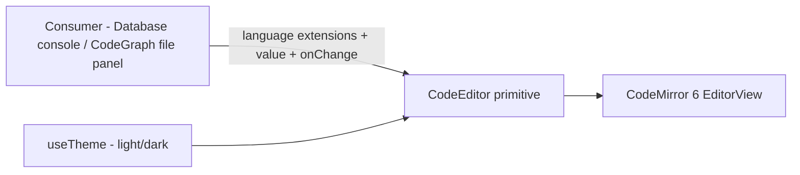

# Code editor

Primitive editor dùng chung dựng trên **CodeMirror 6**, sống ở
`frontend/src/components/code-editor/` (song song `components/editor/` của
Plate — khác thư viện, khác mục đích, tách thư mục riêng). Bản thân primitive
**không biết ngôn ngữ nào cả** — consumer tự mang extension
(`@codemirror/lang-sql`, `@codemirror/lang-json`, ...) vào, giữ primitive nhẹ
và không phình theo số consumer.

import { Callout } from 'fumadocs-ui/components/callout';
import { Cards, Card } from 'fumadocs-ui/components/card';

<Callout type="warn" title="Design only">
Chưa có runtime. Consumer đầu tiên:
[Database § Query console](/dev-kit/database#query-console-gợi-ý-cú-pháp--bảng--cột);
consumer thứ 2: [Code Graph § File editing](/dev-kit/codegraph#file-editing-add-on-v1).
</Callout>

## API — không biết ngôn ngữ, không biết schema

Props chỉ có 4: `value` + `onChange` (controlled), `readOnly`, và `extensions`
— mảng `Extension` của CodeMirror do **consumer tự mang** (`sql(...)`,
`java()`, `json()`, `yaml()`, `markdown()`). Primitive không import bất kỳ
language package nào.

- **Consumer mang `extensions` riêng** — Database console truyền
  `sql({ dialect, schema })` (`@codemirror/lang-sql`; dialect theo `engine`,
  schema từ `db_schema_cache`, xem
  [Database](/dev-kit/database#query-console-gợi-ý-cú-pháp--bảng--cột));
  CodeGraph truyền `java()`/`json()`/`yaml()`/`markdown()` (mỗi hàm từ
  package riêng — `@codemirror/lang-java`, `-json`, `-yaml`, `-markdown`,
  không cần config, gọi thẳng) tuỳ đuôi file đang mở. Primitive **không** có
  logic if/else theo consumer — chỉ nhận mảng extension và truyền vào
  `EditorState.create`.
- **`readOnly`** — dùng `EditorState.readOnly.of(true)` (facet của
  `@codemirror/state`), **không phải** `EditorView.editable` — 2 facet khác
  nhau: `readOnly` chặn lệnh sửa (commands/extension edit tự tắt), `editable`
  chỉ kiểm soát DOM có `contentEditable`/focus được hay không. Primitive chỉ
  cần cái đầu cho use case "xem không cho sửa" (vd version cũ của
  note/query) — chưa có consumer dùng ngay nhưng chừa sẵn đúng API, không
  đoán nhầm 2 facet với nhau lúc implement.

## Reconfigure động: `Compartment`, không remount editor

Khi consumer đổi `extensions` giữa lúc editor đang mở — Database console đổi
profile (dialect/schema khác), CodeGraph mở file khác (ngôn ngữ khác) — primitive
**không** được unmount/remount cả `EditorView` (mất undo history, giật con
trỏ). Dùng
[`Compartment`](https://codemirror.net/docs/ref/#state.Compartment)
(`@codemirror/state`) — bọc phần "language extension" trong 1 compartment lúc
khởi tạo, đổi qua `view.dispatch({ effects: compartment.reconfigure(newExt) })`
khi prop đổi:

Cụ thể: tạo 1 `Compartment` cho phần language, bọc `extensions` ban đầu bằng
`compartment.of(...)` lúc dựng `EditorView`, rồi mỗi lần prop `extensions` đổi
thì effect trong React wrapper dispatch `compartment.reconfigure(...)` — không
dựng lại `EditorView`.

Đây là pattern chính thức của CodeMirror cho "dynamic configuration" — không
phải giải pháp riêng của DevKit, primitive chỉ áp dụng đúng cách thư viện đã
thiết kế sẵn.

## Theme — ăn theo `useTheme()`

`resolvedTheme` (`"light"`/`"dark"`, từ `frontend/src/theme/ThemeProvider.tsx`)
chọn CodeMirror theme extension tương ứng — đổi theme app tự đổi theo, không
cần consumer tự xử lý riêng.

## Vì sao tách khỏi `components/editor/` (Plate)

Plate là rich-text editor cho Notes (WYSIWYG, block-based). CodeMirror là
plain-text/code editor (line-based, syntax highlight qua tokenizer, không
phải block schema). Hai thư viện, hai mục đích, hai bộ dependency hoàn toàn
khác nhau — gộp chung thư mục chỉ vì cùng là "editor" sẽ gây nhầm lẫn, tách
riêng `components/code-editor/` rõ ràng hơn.

## Consumers

- **Database § Query console** — SQL dialect theo `engine`, schema-aware
  completion từ `db_schema_cache`. Xem
  [Database](/dev-kit/database#query-console-gợi-ý-cú-pháp--bảng--cột).
- **Code Graph § File editing** — browse + edit file trong project đang mở,
  Ctrl+S ghi thẳng xuống disk, highlight Java/JSON/YAML/Markdown ở v1. Xem
  [Code Graph](/dev-kit/codegraph#file-editing-add-on-v1).

## Non-goals

- LSP (go-to-definition, rename, diagnostics) — chỉ syntax highlight + basic
  editing, không phải ngôn ngữ server thật.
- Collaborative editing / multi-cursor nhiều user.
- Format-on-save, lint tự động — thuộc phạm vi consumer nếu cần, không phải
  trách nhiệm của primitive.

<Cards>
  <Card title="Database" href="/dev-kit/database#query-console-gợi-ý-cú-pháp--bảng--cột" description="Consumer đầu tiên — SQL + schema completion" />
  <Card title="Code Graph" href="/dev-kit/codegraph#file-editing-add-on-v1" description="Consumer thứ 2 — browse + edit file trong project" />
  <Card title="Notes" href="/dev-kit/notes" description="components/editor/ (Plate) — rich-text, khác mục đích với CodeMirror" />
  <Card title="Frontend performance" href="/dev-kit/frontend-performance" description="Virtualize file tree lớn cho CodeGraph" />
</Cards>
