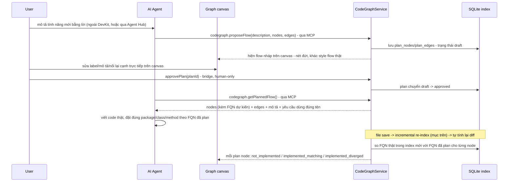

# Plan-first flow (Code Graph)

Add-on v1 của [Code Graph](/dev-kit/codegraph), tách riêng vì đây là design độc
lập nhất trong module: nó đảo ngược hướng dùng thông thường — thay vì trích flow
**từ** code có sẵn ([Code Graph § Flow](/dev-kit/codegraph#flow)), user mô tả 1
tính năng mới bằng lời và agent vẽ flow trước.

import { Callout } from 'fumadocs-ui/components/callout';

Đảo ngược hướng dùng thông thường của module này — thay vì trích flow **từ**
code có sẵn (mục Query flow ở trên), user mô tả 1 tính năng mới bằng lời,
**agent tự đề xuất 1 flow nháp** (class/method chưa tồn tại + lời gọi dự
định) lên cùng canvas của [Graph UI](/dev-kit/codegraph#graph-ui-node-link-add-on-v1), user
xem/sửa/duyệt, agent code theo đúng flow đã duyệt. DevKit tự động so khớp
code thật với flow đã duyệt sau mỗi lần re-index, không cần user tự nhìn
bằng mắt.

## Matching: so tên đầy đủ (FQN), không đụng vào code

Đổi từ thiết kế đầu (Javadoc tag) — tag để lại dấu vết trong source mà user
không yêu cầu, vi phạm nguyên tắc "không sửa code ngoài ý user" (cùng tinh
thần đã áp cho [File editing](/dev-kit/codegraph#file-editing-add-on-v1): DevKit chỉ ghi file
khi user chủ động Ctrl+S). Matching giờ dựa thẳng vào
**fully-qualified name** (`package.ClassName.methodName`) — mỗi plan node có
1 FQN dự kiến ngay từ lúc đề xuất, agent được yêu cầu tạo đúng class/method
tên đó. Không hash tên trước khi so — hash không tăng độ tin cậy so với so
chuỗi trực tiếp (2 chuỗi giống nhau thì hash cũng giống nhau, khác nhau thì
hash cũng khác; hash chỉ thêm 1 bước tính toán, không đổi bản chất phép so
sánh), nên so thẳng FQN cho đơn giản và dễ debug hơn (đọc được ngay class/
method nào, không phải tra ngược từ hash).

Ví dụ: plan node "Xử lý hoàn tiền" mang FQN dự kiến
`com.acme.refund.RefundService.process`. Agent tạo đúng class `RefundService`
với method `process` trong package `com.acme.refund` → node khớp, không cần
thêm bất cứ dấu vết nào trong source.

<Callout type="warn" title="Đánh đổi thật: rename phá link">
Khác Javadoc tag (sống được qua rename), so theo FQN thì **agent hoặc user
đổi tên sau đó sẽ làm mất link** — node quay lại `not_implemented` dù code
vẫn đúng chức năng. Đây là đánh đổi có chủ đích: ưu tiên "không đụng code"
hơn "match bền vững qua mọi rename". Bù lại bằng `CodeGraphRelinkPlanNode`
(dưới) — sửa lại FQN plan trỏ tới khi có rename hợp lý, không phải sống
chung vĩnh viễn với link gãy.
</Callout>

## 4 trạng thái mỗi plan node

| Trạng thái | Điều kiện |
|---|---|
| `not_implemented` | Không có class/method thật nào trong index khớp đúng FQN đã plan |
| `pending_enhancement` | **Có** FQN khớp (method đã tồn tại), nhưng **thiếu 1+ cạnh** plan yêu cầu đi ra từ node đó — method cũ, cần sửa/thêm case mới |
| `implemented_matching` | Có FQN khớp; **mọi** cạnh đi ra từ node đó trong plan đều có cạnh thật tương ứng (kể cả trường hợp node không có cạnh nào cần thêm) |
| `implemented_diverged` | Có FQN khớp, mọi cạnh plan đã thoả; có thêm cạnh thật **không nằm trong plan** — không phải lỗi, chỉ là khác dự kiến, hiển thị riêng (không chặn gì, không coi là fail) |

Cạnh plan trỏ tới 1 node chưa implement (`not_implemented`) thì cạnh đó tự
nhiên chưa "thoả" — không cần trạng thái riêng cho cạnh, suy ra từ trạng thái
2 đầu node. Overload cùng tên khác tham số: FQN kèm luôn danh sách kiểu tham
số nếu plan có cung cấp, để giảm nhầm; plan không cung cấp kiểu tham số thì
so theo tên method thôi, chấp nhận rủi ro nhầm overload như 1 giới hạn v1.

**Node tham chiếu method cũ chỉ `implemented_matching` ngay lập tức nếu
plan không yêu cầu thêm cạnh nào từ nó** — FQN khớp sẵn tại thời điểm
`proposeFlow`, nhưng nếu plan **cũng** thêm 1 cạnh mới đi ra từ node đó (=
cần enhance method cũ để gọi thêm gì đó mới), node đó sinh ra ở
`pending_enhancement`, không phải `implemented_matching` — vì bản thân
method tồn tại không có nghĩa là đã làm xong phần enhance.

### Cách biểu diễn 1 enhancement: thêm node mới, không "diff nội dung method"

Không cố phát hiện "method cũ có bị sửa logic bên trong không" (cần diff
nội dung method — phức tạp, không hợp mô hình graph node/edge đang có). Thay
vào đó: **thêm 1 plan node mới** đại diện cho phần logic/case mới, nối cạnh
từ method cũ tới node mới đó — method cũ **giữ nguyên FQN**, chỉ cần có thêm
đúng cạnh gọi tới phần mới là auto-diff nhận ra ngay, dùng lại đúng cơ chế
so cạnh đã có, không thêm khái niệm nào mới.

Ví dụ tiếp: `NotificationService.send` (method cũ) cần thêm case xử lý
refund — thay vì cố track "nội dung `send()` có đổi không", plan thêm node
mới `NotificationService.buildRefundMessage` + 1 cạnh `send → buildRefundMessage`:

| Thay đổi trong plan | Nội dung |
|---|---|
| Node `send` (method cũ) | Chuyển sang `pending_enhancement` — đã có cạnh mới cần thoả |
| Node mới "Case refund trong notification" | FQN dự kiến `com.acme.notification.NotificationService.buildRefundMessage`, `kind = method`, sinh ra ở `not_implemented` |
| Cạnh mới `send → buildRefundMessage` | `condition` = "chỉ khi type == REFUND" — agent ghi lúc lên plan, đọc được từ `GetCodeSnippet`, không phải verify sau |

Agent implement `buildRefundMessage` + sửa `send()` gọi tới nó → cạnh thật
xuất hiện → `pn-004` tự chuyển `pending_enhancement` → `implemented_matching`,
`pn-005` tự chuyển `not_implemented` → `implemented_matching` — cùng 1 cơ
chế so cạnh, không cần logic riêng cho "enhancement" như 1 khái niệm khác
biệt.

<Callout type="warn" title="Giới hạn thật: enhancement không thêm cạnh mới thì không phát hiện được">
Nếu phần cần sửa **không** biểu diễn được bằng 1 cạnh mới (vd chỉ đổi điều
kiện `if`, sửa 1 giá trị mặc định, không gọi thêm method nào) — hệ thống
không có cách phát hiện, node vẫn hiện `implemented_matching` dù thực ra cần
sửa. Đây là giới hạn thật của mô hình graph node/edge, không phải bug —
enhancement không có lời gọi mới thì nằm ngoài khả năng track của auto-diff.
</Callout>

## Trạng thái tổng thể của plan — tính động, không lưu riêng

Suy ra ngay từ tập trạng thái các node, không cần bảng/field lưu thêm:

| Trạng thái tổng thể | Điều kiện |
|---|---|
| `complete` | Mọi node đều `implemented_matching` hoặc `implemented_diverged` — không còn `not_implemented`/`pending_enhancement` nào |
| `in_progress` | Có ít nhất 1 node `not_implemented`/`pending_enhancement`, và ít nhất 1 node khác đã `implemented_matching`/`implemented_diverged` |
| `not_started` | Toàn bộ node còn `not_implemented` (chưa node nào từng chạm tới, kể cả `pending_enhancement`) |

**Trường hợp đặc biệt: `proposeFlow` trả về `complete` ngay lập tức** — khi
toàn bộ method trong plan đã tồn tại sẵn và flow nối đúng với code thực tế
(mọi node tham chiếu method cũ, không node nào mới), plan sinh ra đã
`complete` — không cần vòng approve → agent implement nào cả, vì không còn
gì để làm. `CodeGraphProposeFlow`/`CodeGraphGetPlanProgress` đều trả kèm
trạng thái tổng thể này, để agent/UI biết ngay "xong rồi" mà không phải tự
đếm từng node trong response.

## Diff tính lại tự động sau mỗi incremental re-index — không cần user bấm gì

Ăn theo [Incremental re-index](/dev-kit/codegraph#incremental-re-index-add-on-v1) đã tự chạy
nền theo file save: mỗi lần affected set được re-resolve xong, so lại FQN
trong đúng phần vừa đổi với `plan_nodes`, cập nhật trạng thái liên quan —
tiến độ trên canvas tự cập nhật live trong lúc agent đang code, không phải
đợi user tự re-index hay refresh tay.

## Bridge & MCP mới

| Method | Nơi gọi | Capability | Ghi chú |
|---|---|---|---|
| `CodeGraphProposeFlow` | MCP (`codegraph.proposeFlow`), effect `execute` | `codegraph:plan` | Nằm trong nhóm **MCP write chỉ chạm metadata plan** — xem [Ranh giới write](#ranh-giới-agent-chỉ-write-được-metadata-plan). Plan ở trạng thái draft chưa có hiệu lực gì tới khi user duyệt, khác hẳn mọi MCP write khác (Notes/Database/Kafka) vốn có tác dụng ngay. Mỗi node cần 1 FQN dự kiến, không chỉ label; cạnh nối tới method cũ có điều kiện thì kèm `condition` (xem dưới). |
| `CodeGraphApprovePlan` | Bridge, UI-only | `codegraph:plan` | Human-only, giống `KafkaConnect`/`SSHTrustHostKey` — duyệt plan luôn là quyết định của con người. Duyệt 1 lần cho **toàn bộ** plan — không cần duyệt riêng từng node/cạnh khi agent implement. |
| `CodeGraphGetPlannedFlow` | MCP (`codegraph.getPlannedFlow`), effect `read` | `codegraph:plan` | Trả kèm FQN từng node + yêu cầu rõ "phải tạo đúng package/class/method tên này" trong response — nhắc agent mỗi lần gọi, không dựa vào agent tự nhớ. |
| `CodeGraphGetPlanProgress` | MCP (`codegraph.getPlanProgress`), effect `read` | `codegraph:plan` | Trạng thái từng node **+ trạng thái tổng thể** (`complete`/`in_progress`/`not_started`) — agent dùng để tự biết đã làm tới đâu, kể cả sau khi mất context/mở lại phiên mới. |
| `CodeGraphRelinkPlanNode` | MCP (`codegraph.relinkPlanNode`), effect `execute` | `codegraph:plan` | Đổi FQN 1 plan node trỏ tới — dùng khi agent (có lý do chính đáng, vd tránh trùng tên) hoặc user đổi tên khác plan ban đầu. Cũng chỉ sửa metadata plan, không đụng code — cùng mức rủi ro thấp như `proposeFlow`, expose MCP được. |

## Ranh giới: agent chỉ write được metadata plan

<Callout type="warn" title="Sửa lại một câu đã sai từ đầu">
Bảng trên từng ghi `CodeGraphProposeFlow` là **"ngoại lệ duy nhất cho phép
agent write qua MCP trong toàn DevKit"**. Câu đó sai ngay tại thời điểm viết:
`CodeGraphRelinkPlanNode` ở hai dòng dưới cũng là MCP `effect: execute`, tức
cũng là agent write. Thêm `CodeGraphReplyPlanNode` thành cái thứ 3.
</Callout>

Đếm số ngoại lệ là cách phát biểu sai — nó hỏng mỗi lần thêm method. Nguyên
tắc thật:

> Agent write được qua MCP **chỉ trong phạm vi metadata của plan**, và không
> method nào trong nhóm đó có hiệu lực cho tới khi con người đọc hoặc duyệt.

| Method | Ghi cái gì | Vì sao an toàn để expose MCP |
|---|---|---|
| `CodeGraphProposeFlow` | `plan_nodes`/`plan_edges`, trạng thái draft | Chưa `approvePlan` thì plan không dẫn tới hành động nào |
| `CodeGraphRelinkPlanNode` | `plan_nodes.fqn` | Chỉ đổi node plan trỏ tới đâu, không đụng code |
| `CodeGraphReplyPlanNode` | `plan_node_comments` | Chỉ là text cho người đọc |

Ngoài phạm vi này agent **không** write được gì qua MCP ở module Code Graph —
`CodeGraphWriteFile` cố tình chỉ có ở bridge, không expose MCP, đúng nguyên
tắc "DevKit chỉ ghi file khi user chủ động Ctrl+S" ở
[File editing](/dev-kit/codegraph#file-editing-add-on-v1).

## Điều kiện trên cạnh: dữ liệu plan-time, human review — không phải AI verify runtime

Khi 1 cạnh nối tới method cũ cần enhance (`pending_enhancement`), agent lên
plan **đã phải đọc** [`GetCodeSnippet`](/dev-kit/codegraph#click-node--xem-code-dùng-chung-cho-node-cũ-lẫn-node-mới-đã-implement)
của method đó để biết chỗ nào cần thêm case — nó **đã hiểu điều kiện** ngay
lúc đó, miễn phí (dùng chính context đang có, không cần gọi gì thêm). Ghi
thẳng hiểu biết đó vào `condition` của cạnh trong cùng lần `proposeFlow`,
hiện lên graph lúc user duyệt:

Điều kiện được lưu ngay trên cạnh (`condition`), cùng bảng `plan_edges` với
hai đầu node.

- **User xem điều kiện trên canvas lúc duyệt plan** (nhãn trên cạnh, vd "chỉ
  khi type == REFUND") — verify xảy ra ở bước con người review **trước khi**
  code được viết, không phải máy kiểm tra lại **sau khi** đã viết xong.
- **Không cần verify runtime lại điều kiện này** — auto-diff sau implement
  (mục trên) chỉ kiểm tra cạnh có tồn tại thật không (wiring), không kiểm
  tra lại điều kiện text có đúng 100% với code thật hay không. `condition`
  là tài liệu hỗ trợ human review, không phải assertion máy tự chạy.
- **Đã cân nhắc và bỏ: spawn 1 agent riêng để "verify"/"enhance index"
  sau khi implement.** Không có tác dụng thật — bất kỳ agent nào cần hiểu
  điều kiện của 1 method đều chỉ cần gọi `GetCodeSnippet` (đã có, rẻ, đúng
  ranh giới method) và tự đọc bằng context của chính nó; spawn riêng 1 agent
  session khác để đọc lại đúng thứ agent gốc đã đọc được là tốn thêm 1 vòng
  gọi mà không thu thêm thông tin gì mới — đi ngược mục tiêu tiết kiệm token
  ban đầu của cả module này.

## Comment trên plan node

`condition` trên cạnh (mục trên) là chiều **agent nói với người**. Chiều ngược
lại — người xem plan rồi bảo agent "chỗ này làm khác đi" — trước đây không có
chỗ nào để ghi: user chỉ sửa được `label`/`description`/cạnh, tức là **sửa đè
lên chữ của agent**, mất luôn ranh giới ai đề xuất gì và ai phản hồi gì.
`plan_node_comments` là chỗ đó, tách khỏi `description`.

**Comment agent đọc được** — trả kèm trong `getPlannedFlow`, không phải ghi
chú riêng của người dùng. Đây là quyết định có hệ quả: comment **điều khiển
implementation**, nên UI phải nói thẳng ra chứ không để user tưởng mình đang
ghi nhớ cá nhân.

### Gửi vào đúng phiên đang chạy, không phải hàng đợi

Điểm dễ làm sai nhất: comment **không** phải row ghi vào DB chờ agent poll.
Khi đang có `AgentSession` implement plan đó, comment đi thẳng vào phiên ấy
bằng `session/prompt` (xem [Agent Hub § Tab lifecycle](/dev-kit/agent-hub#tab-lifecycle--dựa-trên-trace-thật-initialize--sessionnew--prompt-turn--permission)),
kèm phạm vi là node đang mở. Câu trả lời về theo chính luồng `session/update`
đang nuôi khung chat.

`session_id` trên `plan_node_comments` ghi lại comment đó đã đi vào phiên nào
— để sau này đọc lại thread còn biết nó thuộc lần chạy nào, không phải để
route.

| Trạng thái phiên | UI | Chuyện gì xảy ra với tin nhắn |
|---|---|---|
| `idle`, `running` | **Live** — `claude · <plan>` / running | Vào phiên ngay như một prompt |
| `awaiting_permission` | **Blocked** — waiting for permission | **Xếp sau** prompt xin quyền; user phải giải quyết ở Agent Hub trước |
| `error` | session ended with an error | Không tới được agent; lưu lại chờ `getPlannedFlow` |
| `done`, chưa có phiên | **None** — no agent session / queued | Lưu lại, giao khi agent gọi `getPlannedFlow` lần sau |

`awaiting_permission` **bắt buộc có trạng thái riêng** — đó là ca user bấm gửi
mà không có gì xảy ra. Gộp nó vào Live là thiết kế ra một nút im lặng.

<Callout type="warn" title="Cùng phiên nghĩa là cùng cuộc hội thoại">
Comment trên node **đi vào chung conversation** với chat ở SplitPanel — nó là
một prompt có phạm vi, **không phải kênh riêng**. Câu trả lời của agent hiện
ở cả hai nơi. Đánh đổi có chủ đích: đổi lấy việc agent phản hồi ngay trong
ngữ cảnh nó đang làm, thay vì đọc lại comment ở một lần `getPlannedFlow` sau
đó với context đã mất.
</Callout>

### Agent trả lời được = ngoại lệ MCP write thứ 2

Agent trả lời được nghĩa là thêm 1 MCP write nữa. Nó nằm gọn trong
[ranh giới đã định](#ranh-giới-agent-chỉ-write-được-metadata-plan): chỉ ghi
text vào metadata plan, không đụng code, không có hiệu lực gì cho tới khi con
người đọc.

| Method | Nơi gọi | Capability | Ghi chú |
|---|---|---|---|
| `CodeGraphCommentPlanNode` | Bridge, UI-only | `codegraph:plan` | Người viết. Có phiên đang chạy thì đồng thời `session/prompt` vào phiên đó; không thì chỉ lưu. |
| `CodeGraphReplyPlanNode` | MCP (`codegraph.replyPlanNode`), effect `execute` | `codegraph:plan` | Agent trả lời. Ngoại lệ write thứ 2, lý do ngay trên. |

### Non-goals của comment

- **Resolve/reopen comment** — thread là để đọc, không phải issue tracker.
- **Comment trên cạnh** — cạnh đã có `condition`; thêm thread nữa là 2 chỗ ghi
  cùng một loại ý định.
- **Comment sống qua `proposeFlow` mới** — 1 plan active/project, plan mới thay
  plan cũ thì thread đi cùng nó, không migrate sang node trùng FQN.

## Storage: `plan_nodes`/`plan_edges`, cùng SQLite index (không phải vault)

| Bảng | Giữ cái gì |
|---|---|
| `plan_nodes` | 1 node plan: label, mô tả, FQN dự kiến, `kind` (class/method), `status` (4 trạng thái ở trên) |
| `plan_edges` | Cạnh giữa 2 plan node, kèm `condition` (nhãn điều kiện cho human review) |
| `plan_node_comments` | Thread trên node: tác giả, nội dung, thời điểm, và `session_id` của phiên agent đã nhận comment đó |

Cùng lý do index chính không nằm trong `vault_items` — đây là dữ liệu thiết
kế/derived, không phải secret. **1 plan active tại 1 thời điểm** cho mỗi
project (giống "1 project active" gốc) — đề xuất plan mới trong lúc plan cũ
chưa xong thì thay thế, không giữ lịch sử nhiều plan song song ở v1.

## Non-goals

- Fuzzy-match khi FQN không khớp tuyệt đối (vd chỉ đổi 1 ký tự) — so đúng
  tuyệt đối hoặc coi như chưa implement, không đoán "có thể là node này".
- Versioning nhiều plan song song, lịch sử plan cũ — 1 plan active/project.
- Agent tự động resume/tiếp tục implement khi bị ngắt giữa chừng — agent tự
  gọi `getPlanProgress` để biết trạng thái, DevKit không chủ động nhắc lại.
- Tự động phát hiện rename để relink — `CodeGraphRelinkPlanNode` là hành
  động tường minh (agent hoặc user tự gọi), DevKit không tự đoán "chắc đây
  là node bị đổi tên".
- AI verify/enhance index qua agent-spawn riêng — xem lý do bỏ ở mục
  "Điều kiện trên cạnh" trên đây; `condition` do agent tự ghi lúc lên plan
  (đọc `GetCodeSnippet`) là đủ, không cần lớp xác minh chạy sau.

import { Cards, Card } from 'fumadocs-ui/components/card';

<Cards>
  <Card title="Code Graph" href="/dev-kit/codegraph" description="Module gốc — index, query flow, file editing, graph UI" />
  <Card title="Agent Hub" href="/dev-kit/agent-hub" description="Phiên agent nhận comment trên plan node qua session/prompt" />
  <Card title="MCP / Agent" href="/dev-kit/mcp-agent" description="Model chung cho MCP tool và effect read/execute" />
  <Card title="Technical contracts" href="/dev-kit/technical-contracts" description="Capability codegraph:plan trong bridge contract" />
  <Card title="Open questions" href="/dev-kit/open-questions" />
</Cards>
