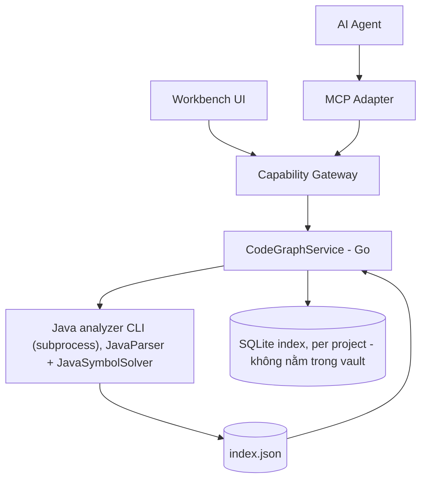
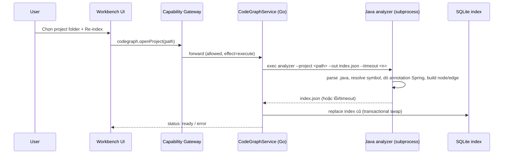
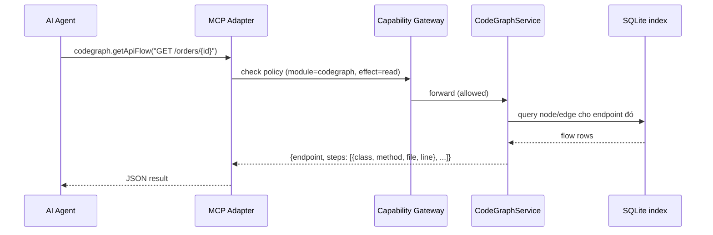
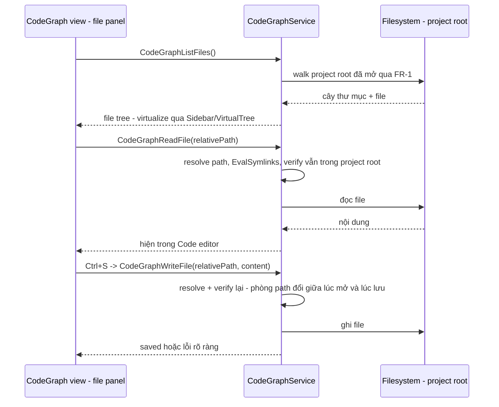
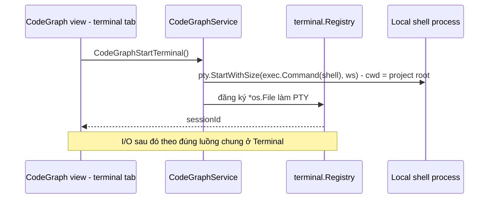

# Code Graph (Java)

Code Graph là module built-in tương lai giúp DevKit mở một project Java bất kỳ trên máy, build index (class/method/annotation/call) và graph flow (API endpoint → service → repository), rồi expose kết quả đó cho cả UI lẫn AI agent qua MCP. Mục tiêu chính là để agent (Claude, Cursor, ...) query nhanh "flow của API này chạy qua đâu" thay vì phải tự đọc rải rác nhiều file.

import { Callout } from 'fumadocs-ui/components/callout';

<Callout type="warn" title="Design only">
Trang này là design cho một module chưa có runtime trong DevKit checkout hiện tại. Không có `internal/codegraph` hay `internal/mcp` tại thời điểm viết. Đây là tài liệu để người triển khai đọc và implement theo, không phải mô tả behavior hiện tại. Trạng thái implementation thật nằm ở [Implementation status](/dev-kit/implementation-status).
</Callout>

Module đăng ký qua `ModuleManifest` như `vault`/`notes`/`db`/`ssh`/`tools` hiện có — không tạo cơ chế registry riêng. MCP là transport mới vào cùng Capability Gateway, đúng model đã chốt ở [MCP / Agent](/dev-kit/mcp-agent) và `docs/architecture/mcp-agent-integration.md`.

## BRD — Business requirement

### Vấn đề

Khi AI agent hoặc dev mới cần hiểu "API `POST /orders` chạy qua những lớp nào, gọi gì tiếp theo", cách duy nhất hiện nay là tự đọc code thủ công hoặc nhờ agent quét toàn bộ repo mỗi lần — chậm, tốn context, dễ sai vì agent phải tự suy luận thay vì đọc từ một nguồn sự thật đã phân tích sẵn.

### Mục tiêu (goals)

- Cho phép mở một Java project local và build index về cấu trúc code (class, method, annotation, call, DI).
- Trả lời nhanh câu hỏi "flow của API endpoint X đi qua những lớp/hàm nào" dưới dạng structured data.
- Expose index đó cho AI agent qua MCP tool, để agent lấy thông tin mà không phải tự đọc lại toàn bộ source mỗi lần.
- Tận dụng cùng index cho các tính năng tương lai (BRD generation, data-flow diagram) mà không phải đổi engine phân tích.

### Actors

| Actor | Nhu cầu |
|---|---|
| Developer dùng DevKit | Mở project, trigger index, xem nhanh flow của 1 API trong UI |
| AI agent (qua MCP) | Query flow/endpoint/symbol để trả lời câu hỏi của user mà không cần đọc raw source |
| Người triển khai module | Cần thiết kế đủ rõ để build đúng scope v1, biết ceiling để không over-engineer |

### Functional requirements

| ID | Requirement |
|---|---|
| FR-1 | User mở được một Java project (chọn folder) làm project "active" trong module — chỉ 1 project active tại một thời điểm cho v1. |
| FR-2 | Hệ thống parse toàn bộ source `.java` trong project, resolve symbol ở mức best-effort (source trong project + reflection cho JDK + jar tìm được cục bộ). |
| FR-3 | Hệ thống nhận diện annotation Spring-style: `@RestController`, `@RequestMapping`, `@GetMapping`/`@PostMapping`/..., `@Service`, `@Repository`, `@Autowired`/constructor injection. |
| FR-4 | Với mỗi API endpoint phát hiện được, hệ thống dựng được chuỗi flow `Controller method → Service method(s) → Repository method(s)` kèm file:line từng bước. |
| FR-5 | Index được lưu local, load lại được giữa các lần mở app mà không cần re-parse nếu project chưa đổi (tới khi user chủ động re-index). |
| FR-6 | Expose MCP tool để agent: list endpoint, lấy flow của 1 endpoint, search symbol theo tên. |
| FR-7 | UI tối thiểu: chọn folder, nút "Re-index", danh sách endpoint dạng list, click vào xem flow dạng text/tree. |
| FR-8 | Method/call không resolve được vẫn xuất hiện trong index ở trạng thái "unresolved" thay vì làm fail toàn bộ lần index đó. |

### Non-functional requirements

| ID | Requirement |
|---|---|
| NFR-1 | Không yêu cầu project target phải build thành công (không chạy `mvn`/`gradle build`) — chỉ cần source đọc được. |
| NFR-2 | Không thêm JVM bundling vào DevKit installer; hệ thống dùng `java` có sẵn trên máy user (assumption hợp lý vì user đang phân tích project Java, tức máy họ vốn đã cần JDK). |
| NFR-3 | Mọi call — từ UI lẫn từ MCP — đi qua cùng `AppService.call` + Capability Gateway, không có đường tắt riêng cho MCP (đúng invariant #1 của `docs/architecture/devkit-architecture.md`). |
| NFR-4 | Index không được sync ra ngoài máy (không phải sync target) — đây là derived/cache data cục bộ, có thể chứa tên class/method của code proprietary. |
| NFR-5 | Analyzer subprocess phải cancel/timeout được — không được treo UI hoặc block MCP call vô thời hạn. |

### Out of scope (v1)

- Đa ngôn ngữ (chỉ Java trước).
- Multi-project registry (chỉ 1 project active — xem [Open questions](/dev-kit/open-questions) nếu cần mở rộng sau).
- Graph UI dạng node-link canvas kéo thả — v1 chỉ có list/tree text.
- Data-flow analysis (field/biến đi xuyên method) và BRD generation tự động — index v1 chỉ cần đủ nguyên liệu (AST + resolved symbol) để xây tính năng này *sau*, không phải build luôn.
- Chạy `mvn`/`gradle` để resolve classpath chính xác tuyệt đối.

### Acceptance criteria

- Mở một project Spring Boot mẫu (controller/service/repository 3 lớp) → index chạy xong, không lỗi.
- Gọi `codegraph.getApiFlow` với 1 endpoint có thật trong project mẫu → trả về đúng chuỗi `Controller → Service → Repository` với file:line khớp source.
- Tắt `java` khỏi PATH → mở project trả lỗi rõ ràng (`codegraph.jvmNotFound`), UI không crash, MCP trả structured error thay vì treo.
- Project có 1 method gọi qua interface không resolve được → index vẫn build xong, node đó đánh dấu `unresolved`, các phần khác của flow vẫn đúng.
- Agent gọi MCP tool khi project chưa từng được mở → trả lỗi rõ ràng thay vì index rỗng ngầm định.

## Flow

### Index build flow

### Query flow (MCP)

## Technical design

### Components

- **Java analyzer CLI** — jar riêng, bundle cùng DevKit, dùng JavaParser + JavaSymbolSolver. One-shot: nhận project path, xuất `index.json` (nodes: class/method + annotation; edges: call/DI). Không phải long-running process, không cần RPC protocol — invoke lại mỗi lần index.
- **`internal/codegraph`** (Go) — orchestrate exec subprocess, đọc `index.json`, ghi vào SQLite, expose query method (`GetApiFlow`, `ListEndpoints`, `SearchSymbol`).
- **Storage** — SQLite riêng cho index (không dùng `vault_items`/không qua crypto envelope, vì đây là derived data từ source code, không phải secret). Key theo project path/hash; replace toàn bộ khi re-index.
- **Bridge + MCP adapter** — cả hai gọi cùng service method, cùng đi qua Capability Gateway, theo đúng pattern trong [Technical contracts](/dev-kit/technical-contracts).

### MCP tool surface

| Tool | Effect | Mô tả |
|---|---|---|
| `codegraph.openProject` | `execute` | Trigger parse + build index cho 1 project path |
| `codegraph.listEndpoints` | `read` | Liệt kê endpoint đã phát hiện trong project active |
| `codegraph.getApiFlow` | `read` | Trả flow `Controller → Service → Repository` cho 1 endpoint |
| `codegraph.searchSymbol` | `read` | Tìm class/method theo tên |
| `codegraph.readFile` | `read` | Đọc nguyên văn 1 file trong project active — path verify lại phía Go, xem [File editing](#file-editing-add-on-v1) |

Naming và effect đi theo đúng convention đã định nghĩa ở `docs/architecture/mcp-agent-integration.md` (`<module>.<action><Resource>`, mọi tool phải khai báo `Effect`).

### Performance contract

Code Graph là workload đặc biệt nặng dù UI v1 mới là list/tree/text: index Java
thực tế có thể có hàng chục nghìn symbol và hàng trăm nghìn call edge. Người
implement phải tuân theo
[Frontend performance architecture → Code Graph](/dev-kit/frontend-performance#code-graph):

- frontend không nhận hoặc giữ toàn bộ `index.json`;
- list/search/flow/neighborhood API phải bounded, cursor-based và tách
  summary/detail;
- index progress phải throttle, cancel được và gắn project/index version để
  job cũ không overwrite project mới;
- list/tree phải virtualize và chỉ expand/query phần user đang xem;
- graph canvas tương lai không render toàn project bằng DOM/SVG: dùng
  Canvas/WebGL, viewport culling, level-of-detail và layout ở Go/Worker.

Performance contract này là điều kiện thiết kế API v1, không chờ tới lúc thêm
node-link visualization mới retrofit.

### Error handling

- `java` không có trên PATH → lỗi `codegraph.jvmNotFound`, không crash.
- Subprocess timeout (project lớn) → cancel được, trả `operation_cancelled` theo đúng error contract chung (`internal/apperrors`).
- Call/method không resolve được → node `unresolved` trong index, không fail toàn bộ lần build.
- Query khi chưa có project nào từng được index → lỗi rõ ràng, không trả kết quả rỗng ngầm định.

### Known ceiling (v1)

- Symbol resolution là best-effort: source trong project + reflection JDK + jar cục bộ tìm được (vd `~/.m2`) — **không** chạy `mvn`/`gradle` để resolve classpath chính xác. Project dùng dependency lạ hoặc multi-module phức tạp có thể có call chưa resolve được.
- Data-flow (field/biến đi qua đâu) và BRD generation **chưa** nằm trong v1 — index v1 (AST + resolved symbol) là nền đủ để build hai tính năng này sau mà không phải đổi engine, nhưng cần thêm một lớp phân tích riêng khi làm.
- Chỉ 1 project active — chưa có multi-project registry.
- File editing (xem dưới) chưa có LSP/lint/format-on-save — chỉ edit text
  thuần + syntax highlight.
- `WriteFile` không expose MCP — agent không tự sửa source code được, chỉ
  đọc (`codegraph.readFile`).

## File editing (add-on v1)

"Mở project" (FR-1) không chỉ để index Java — **project ở đây là 1 folder
bất kỳ**, index Java chỉ là phần MVP phân tích, không phải giới hạn của khái
niệm "project". User cần sửa trực tiếp file trong project đó (không riêng
`.java`, cả config/doc cạnh code) mà không phải rời DevKit mở editor khác.
Đây **không** phải module riêng — nằm ngay trong UI CodeGraph, dùng chung
`activeProject` đã có ở FR-1. Editor dùng
[Code editor](/dev-kit/code-editor) (CodeMirror 6 primitive dùng chung).

### Functional requirements bổ sung

| ID | Requirement |
|---|---|
| FR-9 | File panel liệt kê **toàn bộ** file trong project active (không giới hạn `.java`) dạng tree, virtualize qua [Sidebar § Hiệu năng khi nội dung sidebar lớn](/dev-kit/sidebar#hiệu-năng-khi-nội-dung-sidebar-lớn) cho project lớn. |
| FR-10 | Click 1 file mở nội dung trong [Code editor](/dev-kit/code-editor). Syntax highlight `.java`/`.json`/`.yaml`/`.md` ở v1 — file đuôi khác vẫn mở/sửa được, chỉ không tô màu cú pháp. |
| FR-11 | Lưu = **Ctrl+S thủ công**, ghi thẳng xuống file thật trên disk — không autosave (khác Notes). |
| FR-12 | Path ngoài project root, kể cả qua symlink, bị reject ở cả `ReadFile` lẫn `WriteFile` — không tin path nhận từ UI mà không verify lại phía Go mỗi lần gọi. |

### Capability mới

| Method | Capability | Scope |
|---|---|---|
| `CodeGraphListFiles` | `codegraph:fs` | `project:active` |
| `CodeGraphReadFile` | `codegraph:fs` | `file:<relative-path>` |
| `CodeGraphWriteFile` | `codegraph:fs` | `file:<relative-path>` |

- **Verify path mỗi lần, không tin cache** — `relativePath` từ UI resolve
  thành absolute path, `filepath.EvalSymlinks` rồi so prefix với project root
  đã mở; lệch → reject, không đọc/ghi. Chạy lại bước này ở **cả**
  `ReadFile` lẫn `WriteFile` (không chỉ lúc `ListFiles`) — project root có
  thể đổi giữa lúc mở file và lúc user bấm lưu (đổi project active, hoặc file
  bị move/symlink đổi target giữa chừng).
- **`WriteFile` không có trong MCP tool surface** — sửa source code trực
  tiếp qua agent rủi ro cao hơn hẳn các MCP write khác đã có (Notes/Database),
  giữ human-only. `ReadFile` **có** expose (`codegraph.readFile`, effect
  `read`) — agent đọc nguyên văn 1 file để có context, cùng mức rủi ro với
  `getApiFlow`/`searchSymbol` đã expose.

### Non-goals bổ sung

- LSP thật (go-to-definition ngoài phạm vi flow đã index, rename symbol,
  refactor) — chỉ edit text thuần + syntax highlight.
- Format-on-save / lint tự động.
- Multi-file find & replace.

## Terminal cục bộ (build/test/run project)

File editing (trên) đủ để sửa nhanh — nhưng build/test/run project (`mvn
test`, `./gradlew build`, chạy app) cần shell thật, không phải chạy 1 lệnh
đơn lẻ. Dùng [Terminal](/dev-kit/terminal) (primitive dùng chung, consumer
đầu tiên là SSH) — CodeGraph là implementation "local" của primitive đó.

- **`cwd` = project root đang mở** (FR-1) — terminal mở sẵn đúng thư mục,
  không cần user tự `cd`.
- **Không qua `internal/sandbox`** — user tự tay gõ lệnh trong terminal của
  chính mình, khác agent CLI subprocess (luôn cách ly); bọc sandbox vào đây
  chỉ cản trở (thiếu quyền mount/`sudo` bình thường) mà không thêm an toàn
  thật. Chi tiết lý do: [Terminal § Bảo mật](/dev-kit/terminal#bảo-mật-local-shell-không-qua-internalsandbox).
- **Đóng tab kill process ngay** — build/test đang chạy dở bị dừng, không
  chạy nền qua lúc chuyển tab.
- Capability mới `codegraph:terminal` (scope `project:active`) cho
  `CodeGraphStartTerminal` — I/O sau đó (`TerminalWrite`/`TerminalResize`/
  `TerminalClose`) dùng `terminal:io` chung, xem
  [Terminal § Capability](/dev-kit/terminal#capability-terminalio-tách-khỏi-capability-tạo-session).

## Open questions

- Multi-project registry có cần cho v2 không, hay 1-project-active là đủ lâu dài? (xem [Open questions](/dev-kit/open-questions))
- Khi thêm data-flow analysis sau này, có cần versioned schema riêng cho index để tránh phải re-index toàn bộ khi thêm field mới không?

import { Cards, Card } from 'fumadocs-ui/components/card';

<Cards>
  <Card title="Frontend performance" href="/dev-kit/frontend-performance#code-graph" description="Bounded bridge API, virtual tree/list và graph renderer contract" />
  <Card title="Code editor" href="/dev-kit/code-editor" description="CodeMirror 6 primitive dùng cho file editing" />
  <Card title="Sidebar" href="/dev-kit/sidebar" description="VirtualTree cho file panel project lớn" />
  <Card title="MCP / Agent" href="/dev-kit/mcp-agent" description="Model chung cho mọi MCP tool, bao gồm codegraph" />
  <Card title="Plugins" href="/dev-kit/plugins" description="Pattern ModuleManifest mà codegraph sẽ theo" />
  <Card title="Technical contracts" href="/dev-kit/technical-contracts" description="Bridge/Capability Gateway boundary hiện có" />
  <Card title="Implementation status" href="/dev-kit/implementation-status" description="Trạng thái thật của từng module theo checkout" />
</Cards>
