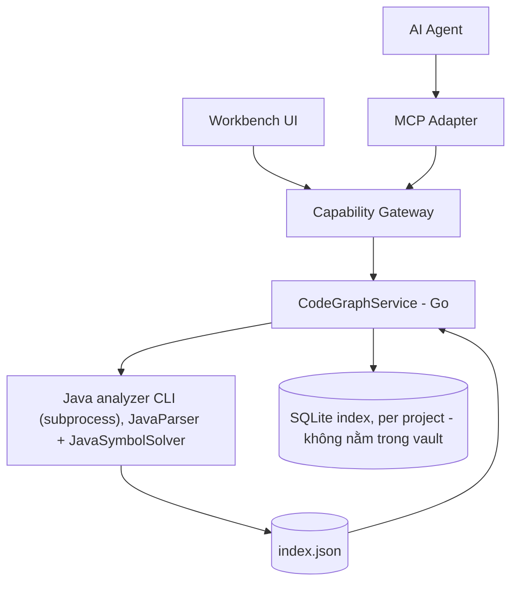
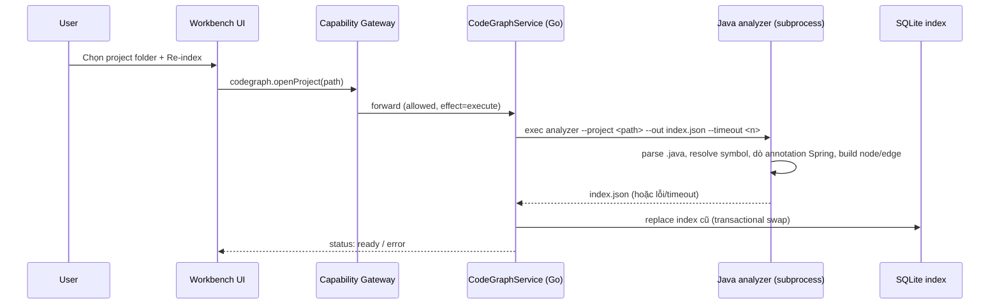
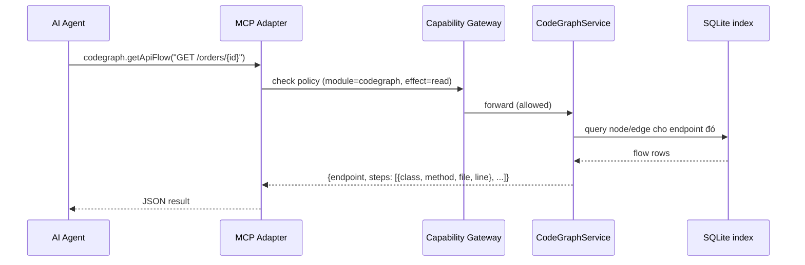
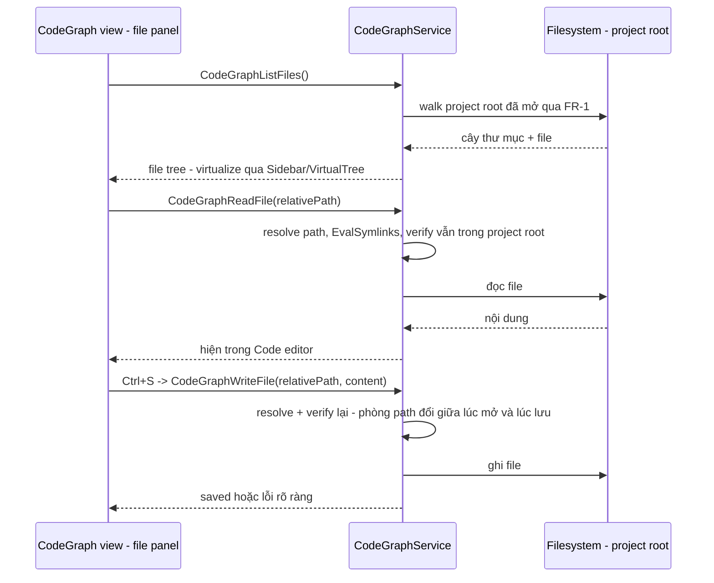
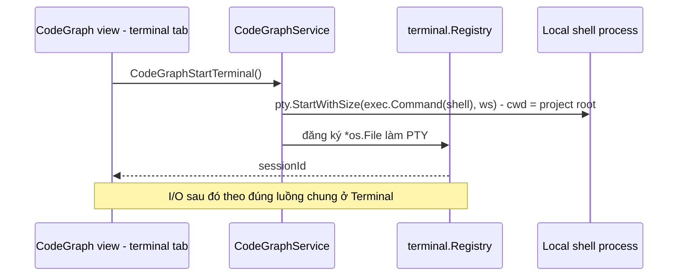
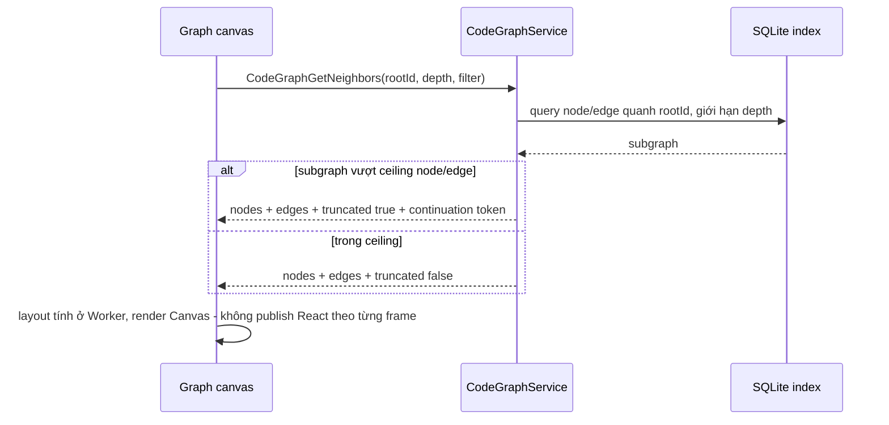
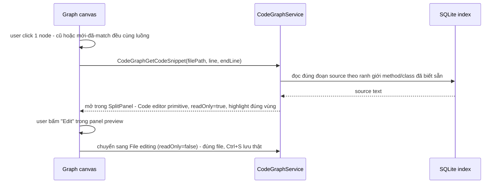
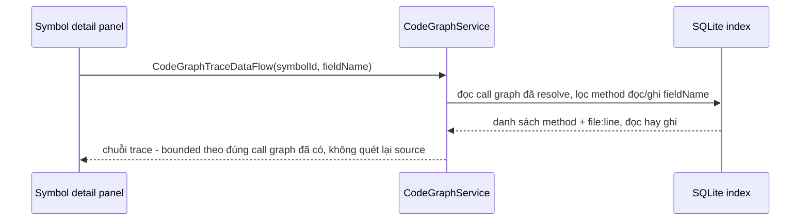
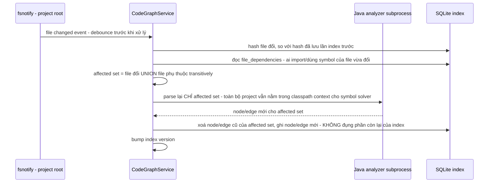
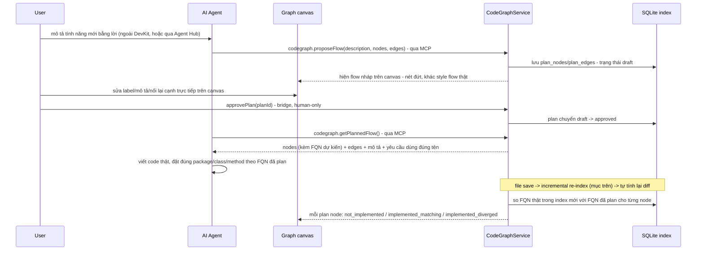

# Code Graph (Java)

Code Graph là module built-in tương lai giúp DevKit mở một project Java bất kỳ trên máy, build index (class/method/annotation/call) và graph flow (API endpoint → service → repository), rồi expose kết quả đó cho cả UI lẫn AI agent qua MCP. Mục tiêu chính là để agent (Claude, Cursor, ...) query nhanh "flow của API này chạy qua đâu" thay vì phải tự đọc rải rác nhiều file.

import { Callout } from 'fumadocs-ui/components/callout';

<Callout type="info" title="Implemented">
Code Graph (Java) hiện đã được triển khai đầy đủ trong DevKit (`dev-kit-app`):
- **Analyzer CLI**: JavaParser + JavaSymbolSolver trong thư mục `analyzer/`, đóng gói CLI parse AST, extract class/method/annotation và trace flow Controller → Service → Repository.
- **Go Core**: `internal/codegraph/` quản lý project active, gọi analyzer subprocess, lưu SQLite index cục bộ, sinh plan và expose bridge API.
- **MCP Tools**: `codegraph.listEndpoints`, `codegraph.getApiFlow`, `codegraph.searchSymbols`, `codegraph.getProjectStructure`, `codegraph.generatePlan` qua `internal/mcp/tools_codegraph*.go`.
- **Frontend Workbench UI**: `frontend/src/modules/codegraph/` (Endpoints, Flow Diagram, Graph View, FileTree, Plan Generator) tích hợp CodeMirror 6 editor primitive (`frontend/src/components/code-editor/CodeEditor.tsx`).
</Callout>



Module đăng ký qua `ModuleManifest` như `vault`/`notes`/`db`/`ssh`/`tools` hiện có — không tạo cơ chế registry riêng. MCP là transport mới vào cùng Capability Gateway, đúng model đã chốt ở [MCP / Agent](/dev-kit/mcp-agent) và `docs/architecture/mcp-agent-integration.md`.

## BRD — Business requirement

### Vấn đề

Khi AI agent hoặc dev mới cần hiểu "API `POST /orders` chạy qua những lớp nào, gọi gì tiếp theo", cách duy nhất hiện nay là tự đọc code thủ công hoặc nhờ agent quét toàn bộ repo mỗi lần — chậm, tốn context, dễ sai vì agent phải tự suy luận thay vì đọc từ một nguồn sự thật đã phân tích sẵn.

### Mục tiêu (goals)

- Cho phép mở một Java project local và build index về cấu trúc code (class, method, annotation, call, DI).
- Trả lời nhanh câu hỏi "flow của API endpoint X đi qua những lớp/hàm nào" dưới dạng structured data.
- Expose index đó cho AI agent qua MCP tool, để agent lấy thông tin mà không phải tự đọc lại toàn bộ source mỗi lần.
- Tận dụng cùng index cho các tính năng tương lai (BRD generation, data-flow diagram) mà không phải đổi engine phân tích.

### Actors

| Actor | Nhu cầu |
|---|---|
| Developer dùng DevKit | Mở project, trigger index, xem nhanh flow của 1 API trong UI |
| AI agent (qua MCP) | Query flow/endpoint/symbol để trả lời câu hỏi của user mà không cần đọc raw source |
| Người triển khai module | Cần thiết kế đủ rõ để build đúng scope v1, biết ceiling để không over-engineer |

### Functional requirements

| ID | Requirement |
|---|---|
| FR-1 | User mở được một Java project (chọn folder) làm project "active" trong module — chỉ 1 project active tại một thời điểm cho v1. |
| FR-2 | Hệ thống parse toàn bộ source `.java` trong project, resolve symbol ở mức best-effort (source trong project + reflection cho JDK + jar tìm được cục bộ). |
| FR-3 | Hệ thống nhận diện annotation Spring-style: `@RestController`, `@RequestMapping`, `@GetMapping`/`@PostMapping`/..., `@Service`, `@Repository`, `@Autowired`/constructor injection. |
| FR-4 | Với mỗi API endpoint phát hiện được, hệ thống dựng được chuỗi flow `Controller method → Service method(s) → Repository method(s)` kèm file:line từng bước. |
| FR-5 | Index được lưu local, load lại được giữa các lần mở app mà không cần re-parse nếu project chưa đổi (tới khi user chủ động re-index). |
| FR-6 | Expose MCP tool để agent: list endpoint, lấy flow của 1 endpoint, search symbol theo tên. |
| FR-7 | UI tối thiểu: chọn folder, nút "Re-index", danh sách endpoint dạng list, click vào xem flow dạng text/tree. |
| FR-8 | Method/call không resolve được vẫn xuất hiện trong index ở trạng thái "unresolved" thay vì làm fail toàn bộ lần index đó. |

### Non-functional requirements

| ID | Requirement |
|---|---|
| NFR-1 | Không yêu cầu project target phải build thành công (không chạy `mvn`/`gradle build`) — chỉ cần source đọc được. |
| NFR-2 | Không thêm JVM bundling vào DevKit installer; hệ thống dùng `java` có sẵn trên máy user (assumption hợp lý vì user đang phân tích project Java, tức máy họ vốn đã cần JDK). |
| NFR-3 | Mọi call — từ UI lẫn từ MCP — đi qua cùng `AppService.call` + Capability Gateway, không có đường tắt riêng cho MCP (đúng invariant #1 của `docs/architecture/devkit-architecture.md`). |
| NFR-4 | Index không được sync ra ngoài máy (không phải sync target) — đây là derived/cache data cục bộ, có thể chứa tên class/method của code proprietary. |
| NFR-5 | Analyzer subprocess phải cancel/timeout được — không được treo UI hoặc block MCP call vô thời hạn. |

### Out of scope (v1)

- Đa ngôn ngữ (chỉ Java trước — vẫn giữ nguyên qua toàn bộ các add-on bên
  dưới, kể cả Graph UI/Plan-first flow).
- Multi-project registry (chỉ 1 project active — xem [Open questions](/dev-kit/open-questions) nếu cần mở rộng sau).
- Chạy `mvn`/`gradle` để resolve classpath chính xác tuyệt đối.
- BRD generation **tự động** (DevKit tự sinh prose) — xem
  [Data flow analysis & BRD](#data-flow-analysis--brd-add-on-v1): DevKit chỉ
  expose dữ liệu giàu hơn, agent tự viết BRD, không phải DevKit tự làm.

<Callout type="info" title="Đã địa chỉ ở add-on bên dưới">
"Graph UI dạng node-link" và "Data-flow analysis" từng ghi ở đây là out of
scope — giờ đã thiết kế ở [Graph UI](#graph-ui-node-link-add-on-v1) và
[Data flow analysis](#data-flow-analysis--brd-add-on-v1), xem 2 mục đó thay
vì coi đây là giới hạn còn hiệu lực.
</Callout>

### Acceptance criteria

- Mở một project Spring Boot mẫu (controller/service/repository 3 lớp) → index chạy xong, không lỗi.
- Gọi `codegraph.getApiFlow` với 1 endpoint có thật trong project mẫu → trả về đúng chuỗi `Controller → Service → Repository` với file:line khớp source.
- Tắt `java` khỏi PATH → mở project trả lỗi rõ ràng (`codegraph.jvmNotFound`), UI không crash, MCP trả structured error thay vì treo.
- Project có 1 method gọi qua interface không resolve được → index vẫn build xong, node đó đánh dấu `unresolved`, các phần khác của flow vẫn đúng.
- Agent gọi MCP tool khi project chưa từng được mở → trả lỗi rõ ràng thay vì index rỗng ngầm định.

## Flow

### Index build flow



### Query flow (MCP)



## Technical design

### Components

- **Java analyzer CLI** — jar riêng, bundle cùng DevKit, dùng JavaParser + JavaSymbolSolver. One-shot: nhận project path, xuất `index.json` (nodes: class/method + annotation; edges: call/DI). Không phải long-running process, không cần RPC protocol — invoke lại mỗi lần index.
- **`internal/codegraph`** (Go) — orchestrate exec subprocess, đọc `index.json`, ghi vào SQLite, expose query method (`GetApiFlow`, `ListEndpoints`, `SearchSymbol`).
- **Storage** — SQLite riêng cho index (không dùng `vault_items`/không qua crypto envelope, vì đây là derived data từ source code, không phải secret). Key theo project path/hash; replace toàn bộ khi re-index.
- **Bridge + MCP adapter** — cả hai gọi cùng service method, cùng đi qua Capability Gateway, theo đúng pattern trong [Technical contracts](/dev-kit/technical-contracts).

### Bridge & capability

| Method | Capability | Scope |
|---|---|---|
| `CodeGraphOpenProject` | `codegraph:index` | `project:new` |
| `CodeGraphListEndpoints` | `codegraph:read` | `project:active` |
| `CodeGraphGetApiFlow` | `codegraph:read` | `project:active` |
| `CodeGraphSearchSymbol` | `codegraph:read` | `project:active` |

4 capability tách theo đúng bản chất hành động, cùng lý do đã áp cho
Kafka (`kafka:connect` khác `kafka:produce`) và Database
(`db:query` khác `db:admin`):

- **`codegraph:index`** — riêng cho `OpenProject`, vì đây là hành động
  **mutating** (trigger parse + ghi đè index), khác hẳn 3 method còn lại chỉ
  đọc. Scope `project:new` vì mở project mới, chưa có project nào active để
  gắn `project:active`.
- **`codegraph:read`** — đọc index đã build (endpoint/flow/symbol), scope cố
  định `project:active` (không phải theo ID cụ thể — CodeGraph chỉ có 1
  project active tại 1 thời điểm, FR-1). Add-on sau này
  ([Graph UI](#graph-ui-node-link-add-on-v1)'s `GetNeighbors`,
  [Data flow](#data-flow-analysis--brd-add-on-v1)'s `TraceDataFlow`,
  [Incremental re-index](#incremental-re-index-add-on-v1)'s
  `GetBlastRadius`/`WaitForIndexReady`) đều dùng chung capability này — cùng
  bản chất "đọc index/metadata", khác `codegraph:fs` (đọc/ghi **nội dung
  file** thật, có path validation riêng, xem [File editing](#file-editing-add-on-v1)).

### MCP tool surface

| Tool | Effect | Mô tả |
|---|---|---|
| `codegraph.openProject` | `execute` | Trigger parse + build index cho 1 project path |
| `codegraph.listEndpoints` | `read` | Liệt kê endpoint đã phát hiện trong project active |
| `codegraph.getApiFlow` | `read` | Trả flow `Controller → Service → Repository` cho 1 endpoint |
| `codegraph.searchSymbol` | `read` | Tìm class/method theo tên |
| `codegraph.listFiles` | `read` | Liệt kê toàn bộ file trong project active (không riêng `.java`) — trước đây chỉ có ở bridge cho UI, thiếu bản MCP nên agent phải suy gián tiếp qua `listEndpoints`/`searchSymbol`, xem [File editing](#file-editing-add-on-v1) |
| `codegraph.readFile` | `read` | Đọc nguyên văn 1 file trong project active — path verify lại phía Go, xem [File editing](#file-editing-add-on-v1) |
| `codegraph.getCodeSnippet` | `read` | Đúng đoạn method/class theo `filePath`+`line`+`endLine` (ranh giới AST đã biết) — nhẹ hơn `readFile` cho use case "xem nhanh", xem [Graph UI § Click node](#graph-ui-node-link-add-on-v1) |
| `codegraph.getNeighbors` | `read` | Subgraph quanh 1 node, bounded theo depth/ceiling — xem [Graph UI](#graph-ui-node-link-add-on-v1) |
| `codegraph.traceDataFlow` | `read` | Trace 1 field/parameter theo call graph đã resolve — xem [Data flow analysis](#data-flow-analysis--brd-add-on-v1) |
| `codegraph.getBlastRadius` | `read` | File nào phụ thuộc (import/dùng symbol) vào 1 file cho trước — xem [Incremental re-index § Blast radius](#incremental-re-index-add-on-v1) |
| `codegraph.waitForIndexReady` | `read` | Block tới khi mọi re-index đang chờ/đang chạy xong — tránh đọc trạng thái cũ do debounce, xem [Incremental re-index § Sync](#incremental-re-index-add-on-v1) |

Naming và effect đi theo đúng convention đã định nghĩa ở `docs/architecture/mcp-agent-integration.md` (`<module>.<action><Resource>`, mọi tool phải khai báo `Effect`).

### Performance contract

Code Graph là workload đặc biệt nặng dù UI v1 mới là list/tree/text: index Java
thực tế có thể có hàng chục nghìn symbol và hàng trăm nghìn call edge. Người
implement phải tuân theo
[Frontend performance architecture → Code Graph](/dev-kit/frontend-performance#code-graph):

- frontend không nhận hoặc giữ toàn bộ `index.json`;
- list/search/flow/neighborhood API phải bounded, cursor-based và tách
  summary/detail;
- index progress phải throttle, cancel được và gắn project/index version để
  job cũ không overwrite project mới;
- list/tree phải virtualize và chỉ expand/query phần user đang xem;
- graph canvas tương lai không render toàn project bằng DOM/SVG: dùng
  Canvas/WebGL, viewport culling, level-of-detail và layout ở Go/Worker.

Performance contract này là điều kiện thiết kế API v1, không chờ tới lúc thêm
node-link visualization mới retrofit.

### Error handling

- `java` không có trên PATH → lỗi `codegraph.jvmNotFound`, không crash.
- Subprocess timeout (project lớn) → cancel được, trả `operation_cancelled` theo đúng error contract chung (`internal/apperrors`).
- Call/method không resolve được → node `unresolved` trong index, không fail toàn bộ lần build.
- Query khi chưa có project nào từng được index → lỗi rõ ràng, không trả kết quả rỗng ngầm định.

### Known ceiling (v1)

- Symbol resolution là best-effort: source trong project + reflection JDK + jar cục bộ tìm được (vd `~/.m2`) — **không** chạy `mvn`/`gradle` để resolve classpath chính xác. Project dùng dependency lạ hoặc multi-module phức tạp có thể có call chưa resolve được.
- Data-flow (field/biến đi qua đâu) và BRD generation **chưa** nằm trong v1 — index v1 (AST + resolved symbol) là nền đủ để build hai tính năng này sau mà không phải đổi engine, nhưng cần thêm một lớp phân tích riêng khi làm.
- Chỉ 1 project active — chưa có multi-project registry.
- File editing (xem dưới) chưa có LSP/lint/format-on-save — chỉ edit text
  thuần + syntax highlight.
- `WriteFile` không expose MCP — agent không tự sửa source code được, chỉ
  đọc (`codegraph.readFile`).

## File editing (add-on v1)

"Mở project" (FR-1) không chỉ để index Java — **project ở đây là 1 folder
bất kỳ**, index Java chỉ là phần MVP phân tích, không phải giới hạn của khái
niệm "project". User cần sửa trực tiếp file trong project đó (không riêng
`.java`, cả config/doc cạnh code) mà không phải rời DevKit mở editor khác.
Đây **không** phải module riêng — nằm ngay trong UI CodeGraph, dùng chung
`activeProject` đã có ở FR-1. Editor dùng
[Code editor](/dev-kit/code-editor) (CodeMirror 6 primitive dùng chung).



### Functional requirements bổ sung

| ID | Requirement |
|---|---|
| FR-9 | File panel liệt kê **toàn bộ** file trong project active (không giới hạn `.java`) dạng tree, virtualize qua [Sidebar § Hiệu năng khi nội dung sidebar lớn](/dev-kit/sidebar#hiệu-năng-khi-nội-dung-sidebar-lớn) cho project lớn. |
| FR-10 | Click 1 file mở nội dung trong [Code editor](/dev-kit/code-editor). Syntax highlight `.java`/`.json`/`.yaml`/`.md` ở v1 — file đuôi khác vẫn mở/sửa được, chỉ không tô màu cú pháp. |
| FR-11 | Lưu = **Ctrl+S thủ công**, ghi thẳng xuống file thật trên disk — không autosave (khác Notes). |
| FR-12 | Path ngoài project root, kể cả qua symlink, bị reject ở cả `ReadFile` lẫn `WriteFile` — không tin path nhận từ UI mà không verify lại phía Go mỗi lần gọi. |

### Capability mới

| Method | Capability | Scope |
|---|---|---|
| `CodeGraphListFiles` | `codegraph:fs` | `project:active` |
| `CodeGraphReadFile` | `codegraph:fs` | `file:<relative-path>` |
| `CodeGraphGetCodeSnippet` | `codegraph:fs` | `file:<relative-path>` |
| `CodeGraphWriteFile` | `codegraph:fs` | `file:<relative-path>` |

- **Verify path mỗi lần, không tin cache** — `relativePath` từ UI resolve
  thành absolute path, `filepath.EvalSymlinks` rồi so prefix với project root
  đã mở; lệch → reject, không đọc/ghi. Chạy lại bước này ở **cả**
  `ReadFile` lẫn `WriteFile` (không chỉ lúc `ListFiles`) — project root có
  thể đổi giữa lúc mở file và lúc user bấm lưu (đổi project active, hoặc file
  bị move/symlink đổi target giữa chừng).
- **`WriteFile` không có trong MCP tool surface** — sửa source code trực
  tiếp qua agent rủi ro cao hơn hẳn các MCP write khác đã có (Notes/Database),
  giữ human-only. `ReadFile`/`ListFiles` **có** expose (`codegraph.readFile`/
  `codegraph.listFiles`, effect `read`) — agent đọc nguyên văn 1 file hoặc
  liệt kê cây file để có context, cùng mức rủi ro với `getApiFlow`/
  `searchSymbol` đã expose.

### Non-goals bổ sung

- LSP thật (go-to-definition ngoài phạm vi flow đã index, rename symbol,
  refactor) — chỉ edit text thuần + syntax highlight.
- Format-on-save / lint tự động.
- Multi-file find & replace.

## Terminal cục bộ (build/test/run project)

File editing (trên) đủ để sửa nhanh — nhưng build/test/run project (`mvn
test`, `./gradlew build`, chạy app) cần shell thật, không phải chạy 1 lệnh
đơn lẻ. Dùng [Terminal](/dev-kit/terminal) (primitive dùng chung, consumer
đầu tiên là SSH) — CodeGraph là implementation "local" của primitive đó.



- **`cwd` = project root đang mở** (FR-1) — terminal mở sẵn đúng thư mục,
  không cần user tự `cd`.
- **Không qua `internal/sandbox`** — user tự tay gõ lệnh trong terminal của
  chính mình, khác agent CLI subprocess (luôn cách ly); bọc sandbox vào đây
  chỉ cản trở (thiếu quyền mount/`sudo` bình thường) mà không thêm an toàn
  thật. Chi tiết lý do: [Terminal § Bảo mật](/dev-kit/terminal#bảo-mật-local-shell-không-qua-internalsandbox).
- **Đóng tab kill process ngay** — build/test đang chạy dở bị dừng, không
  chạy nền qua lúc chuyển tab.
- Capability mới `codegraph:terminal` (scope `project:active`) cho
  `CodeGraphStartTerminal` — I/O sau đó (`TerminalWrite`/`TerminalResize`/
  `TerminalClose`) dùng `terminal:io` chung, xem
  [Terminal § Capability](/dev-kit/terminal#capability-terminalio-tách-khỏi-capability-tạo-session).

## Graph UI (node-link, add-on v1)

`frontend-performance.mdx § Code Graph` đã định sẵn performance contract cho
phần này từ trước — Canvas/WebGL, viewport culling, layout tính ở Go/Worker,
subgraph theo root/depth/filter có ceiling. Method `getNeighbors` từng được
**nhắc tên** ở đó nhưng chưa bao giờ định nghĩa thật — mục này định nghĩa cụ
thể, đúng khung đã có, không quyết lại từ đầu.



### `CodeGraphGetNeighbors` — method mới, đúng khung đã định sẵn

Capability `codegraph:read` / scope `project:active` — cùng nhóm với
[Bridge & capability](#bridge--capability) gốc, không phải capability mới.

```go
func (s *Service) GetNeighbors(ctx context.Context, rootID string, depth int, filter NeighborFilter) (Subgraph, error)

type Subgraph struct {
    Nodes        []Node
    Edges        []Edge
    Truncated    bool
    Continuation string // dùng để UI "Xem thêm" nếu Truncated
}

type Node struct {
    ID       string
    Label    string
    Kind     string // class | method
    Layer    string // controller | service | repository | unknown
    FilePath string // rỗng nếu node chưa có code thật (plan node not_implemented)
    Line     int
    EndLine  int    // ranh giới method/class thật, JavaParser đã biết sẵn lúc index
}
```

- **Mặc định mở neighborhood nhỏ** quanh 1 endpoint/symbol đã chọn (từ list/tree hiện có) — không có nút "render toàn project graph", đúng nguyên tắc đã ghi ở `frontend-performance.mdx`.
- **Ceiling node/edge cứng** — vượt ngưỡng thì `Truncated = true` kèm `Continuation`, UI hiện nút "Xem thêm" thay vì tự tải hết.
- **Layout cache theo index version** — pan/zoom/select không gọi lại `GetNeighbors`; chỉ query lại khi user expand node mới hoặc index đổi version sau re-index.
- **Màu theo layer, không phải thuộc tính tự do** — tô theo layer đã phát hiện qua annotation (`@RestController`/`@Service`/`@Repository`/khác, FR-3 gốc), tái dùng đúng phân loại có sẵn, không thêm hệ màu song song.

### Click node → xem code, dùng chung cho node cũ lẫn node mới đã implement

`FilePath`/`Line`/`EndLine` trên `Node` **có với mọi node đã có code thật** —
không phân biệt node đó vốn là code cũ (luôn có) hay là 1
[plan node](#plan-first-flow-vẽ-trước-agent-implement-auto-diff-tiến-độ-add-on-v1)
vừa chuyển sang `implemented_matching`/`implemented_diverged` (khi đó FQN đã
match ra đúng file:line thật). Plan node còn `not_implemented` thì 3 field
này rỗng — UI hiện "Chưa implement" thay vì cố mở file không tồn tại.



```go
func (s *Service) GetCodeSnippet(ctx context.Context, filePath string, line, endLine int) (CodeSnippet, error)

type CodeSnippet struct {
    FilePath string // echo lại path đã yêu cầu - kết quả tự chứa đủ, không bắt caller tự giữ lại input để đối chiếu
    Line     int    // ranh giới THẬT đã dùng - có thể khác input nếu input nằm giữa 1 method, tự snap về đầu method đó
    EndLine  int    // ranh giới THẬT đã dùng, cùng lý do trên
    Source   string // đúng đoạn source từ Line tới EndLine, ranh giới AST đã biết lúc index
    Language string // "java" | "json" | "yaml" | "markdown" - suy từ đuôi file, Code editor dùng để chọn language extension
    FQN      string // fully-qualified name của symbol đang xem, rỗng nếu không map được (file không phải .java, hoặc snippet không khớp đúng 1 symbol)
}
```

- **Trả lại `FilePath`/`Line`/`EndLine` thật đã dùng**, không chỉ echo input —
  nếu caller gọi với `line` nằm giữa thân method (không phải đúng dòng đầu),
  kết quả tự "snap" về ranh giới thật của method chứa dòng đó; response cần
  tự nói rõ ranh giới nào đã thực sự được dùng, không bắt caller tự đối
  chiếu lại input để suy ra.

- **`CodeGraphGetCodeSnippet(filePath, line, endLine)`** — trả **đúng đoạn**
  method/class (ranh giới đã biết từ AST lúc index, không phải cửa sổ ±N dòng
  đoán chừng) — khác `CodeGraphReadFile` (đọc cả file, dùng cho edit thật).
  Tách riêng 2 method vì 2 mục đích khác nhau (xem nhanh vs sửa), cùng lý do
  đã tách `ListForeignKeys` khỏi `ListColumns` ở [Database](/dev-kit/database#listforeignkeys--method-riêng-tách-khỏi-listcolumns).
- **`FQN` đi kèm** — không chỉ trả text thô, để cả UI (label panel preview)
  lẫn agent (đối chiếu với plan node đang xem, khỏi tự suy ngược từ
  `filePath`+`line`) đều dùng được thẳng, không phải gọi thêm method khác để
  biết đang xem symbol nào.
- **Preview dùng lại đúng [Code editor](/dev-kit/code-editor) primitive**,
  chỉ bật `readOnly` (`EditorState.readOnly.of(true)`, xem trang đó) — không
  xây component preview riêng. Muốn sửa thật thì bấm "Edit", chuyển sang
  đúng luồng [File editing](#file-editing-add-on-v1) đã có (Ctrl+S, ghi
  xuống disk thật) — preview và edit là 2 chế độ của cùng 1 component, không
  phải 2 component khác nhau.
- **Panel hiện qua `SplitPanel`** (shared shell primitive, xem
  [Shell primitives](/dev-kit/shell-primitives)) — không che mất canvas
  đang xem, giữ nguyên vị trí/zoom đang thao tác.

## Data flow analysis & BRD (add-on v1)

### Data flow: bounded, theo yêu cầu — không phân tích toàn project lúc index

Trace 1 field/parameter cụ thể **do user chọn làm điểm bắt đầu**, đi theo
đúng những method call đã resolve sẵn trong index (không phân tích lại từ
đầu) — không tự động phân tích data-flow của toàn bộ field/biến trong
project lúc build index, tránh nổ thời gian index ban đầu cho project lớn.
Capability `codegraph:read` / scope `project:active` — cùng nhóm gốc, không
phải capability mới.



- Trace **chỉ đi theo call graph đã index** — field/biến chỉ theo dõi được
  trong phạm vi method đã resolve; field dùng qua reflection/dynamic proxy
  (Spring hay dùng) rơi vào diện "unresolved" giống call thường, không phải
  giới hạn riêng của data-flow.
- Không cache trace — tính lại mỗi lần gọi (đã bounded, rẻ), không thêm bảng
  lưu trữ mới.

### BRD: DevKit expose dữ liệu giàu hơn, **không** tự sinh prose

Không thêm tầng gọi LLM riêng trong `internal/codegraph` — khác mọi module
khác trong DevKit (Notes/Database/Kafka đều chỉ expose dữ liệu qua MCP, để
agent đang kết nối tự viết), giữ nguyên đúng pattern đó. Việc DevKit cần làm
là **làm giàu dữ liệu flow đã có** để agent viết BRD tốt hơn, không phải tự
viết BRD:

- `getApiFlow`/`getNeighbors` trả thêm **Javadoc summary** của method (nếu
  có) — JavaParser đã parse comment sẵn trong lúc build AST, chỉ cần giữ lại
  thay vì bỏ qua như v1.
- Trả thêm **tên + kiểu tham số** đầy đủ (không chỉ tên method) — đủ để agent
  suy ra hành vi mà không phải tự mở file đọc signature.
- `CodeGraphTraceDataFlow` (trên) là 1 nguồn dữ liệu nữa agent có thể gọi khi
  cần hiểu sâu hơn trước khi viết BRD.

Không thêm MCP tool `codegraph.generateBRD` — agent tự tổng hợp từ
`getApiFlow`/`getNeighbors`/`traceDataFlow`, đúng vai trò của agent trong
kiến trúc này.

## Incremental re-index (add-on v1)

Index v1 luôn **replace toàn bộ** mỗi lần re-index (transactional swap) —
đúng cho project nhỏ/vừa nhưng project lớn sửa 1 file vẫn phải re-parse +
re-resolve lại **hết**. Nâng cấp thành incremental thật — chỉ re-resolve
phần bị ảnh hưởng — cần thêm 1 dependency graph giữa các file, chưa có ở v1.



### Bảng mới: `file_dependencies` — nền tảng cho incremental

```sql
file_dependencies(project_id, file_path, depends_on_file_path)
```

Ghi trong lúc `JavaSymbolSolver` resolve symbol (đã tự biết file nào import/
dùng class của file nào — hiện đang bị bỏ qua sau khi xuất `index.json`, chỉ
cần giữ lại thay vì tính lại). Reverse-query bảng này (`depends_on_file_path
= ?`) cho ra đúng affected set khi 1 file đổi.

### Blast radius — expose `file_dependencies` ra ngoài, không chỉ dùng nội bộ

`file_dependencies` ban đầu chỉ để tính affected set cho incremental
re-index — cùng dữ liệu đó cũng trả lời được câu hỏi "sửa file này ảnh hưởng
tới file nào khác", hữu ích cho agent (hoặc user) muốn biết trước hậu quả
trước khi sửa 1 class dùng chung, không phải tự grep thủ công:

```go
func (s *Service) GetBlastRadius(ctx context.Context, filePath string) ([]string, error)
```

Reverse-query đúng bảng đã có (`depends_on_file_path = filePath`) — không
thêm bảng/tính toán mới, chỉ thêm 1 method đọc dữ liệu đã tồn tại sẵn.

### Sync: đảm bảo index mới nhất trước khi tin kết quả

Vì re-index chạy nền có debounce (~500ms–1s), agent gọi `getPlanProgress`
(hoặc bất kỳ query nào dựa vào index) ngay sau khi vừa sửa file có thể ăn
phải trạng thái **chưa kịp cập nhật**:

```go
func (s *Service) WaitForIndexReady(ctx context.Context) (version int, err error)
```

Block tới khi không còn re-index nào đang chờ debounce/đang chạy, trả về
version hiện tại — agent gọi method này trước khi tin kết quả từ bất kỳ
query nào khác, thay vì tự đoán/poll thủ công.

### Capability mới

| Method | Capability | Scope |
|---|---|---|
| `CodeGraphGetBlastRadius` | `codegraph:read` | `project:active` |
| `CodeGraphWaitForIndexReady` | `codegraph:read` | `project:active` |

Cả 2 đọc **index/metadata** (dependency graph, trạng thái re-index), không
đọc nội dung file thật — đúng nhóm `codegraph:read` như
`listEndpoints`/`getApiFlow`/`searchSymbol` (xem
[Bridge & capability](#bridge--capability) gốc), không phải `codegraph:fs`.

### Trigger: tự động theo file save (`fsnotify`), có debounce

- **`github.com/fsnotify/fsnotify`** (dependency Go mới) watch project root
  sau khi mở project (FR-1) — không cần user tự bấm "Re-index" mỗi lần sửa
  file, đúng tinh thần "IDE kiểu mới" thay vì thao tác thủ công lặp lại.
- **Debounce ~500ms–1s** sau event cuối cùng trước khi xử lý — tránh
  re-index storm khi save nhiều file cùng lúc (vd "Save All" trong editor
  ngoài, hoặc git checkout branch khác).
- **Cancel job cũ nếu có event mới trong lúc đang xử lý** — cùng nguyên tắc
  cancel/version-token đã có ở `frontend-performance.mdx` (job cũ không được
  overwrite kết quả mới).
- Vẫn giữ nút **"Re-index" thủ công** cho full re-build (vd nghi ngờ index
  lệch, hoặc lần đầu mở project) — incremental không thay thế hoàn toàn full
  index, chỉ là đường nhanh cho thay đổi nhỏ.

<Callout type="warn" title="Rủi ro thật: sai affected set">
Nếu `file_dependencies` thiếu 1 cạnh (vd dùng qua reflection không resolve
được), incremental sẽ **bỏ sót** file cần re-resolve — index có thể lệch dần
qua nhiều lần incremental mà không ai biết, cho tới khi full re-index mới lộ
ra khác biệt. Không có cách phát hiện tự động lệch này ở v1 — đây là lý do
vẫn giữ nút full re-index thủ công, không bỏ hẳn.
</Callout>

## Plan-first flow: vẽ trước, agent implement, auto-diff tiến độ (add-on v1)

Đảo ngược hướng dùng thông thường của module này — thay vì trích flow **từ**
code có sẵn (mục Query flow ở trên), user mô tả 1 tính năng mới bằng lời,
**agent tự đề xuất 1 flow nháp** (class/method chưa tồn tại + lời gọi dự
định) lên cùng canvas của [Graph UI](#graph-ui-node-link-add-on-v1), user
xem/sửa/duyệt, agent code theo đúng flow đã duyệt. DevKit tự động so khớp
code thật với flow đã duyệt sau mỗi lần re-index, không cần user tự nhìn
bằng mắt.



### Matching: so tên đầy đủ (FQN), không đụng vào code

Đổi từ thiết kế đầu (Javadoc tag) — tag để lại dấu vết trong source mà user
không yêu cầu, vi phạm nguyên tắc "không sửa code ngoài ý user" (cùng tinh
thần đã áp cho [File editing](#file-editing-add-on-v1): DevKit chỉ ghi file
khi user chủ động Ctrl+S). Matching giờ dựa thẳng vào
**fully-qualified name** (`package.ClassName.methodName`) — mỗi plan node có
1 FQN dự kiến ngay từ lúc đề xuất, agent được yêu cầu tạo đúng class/method
tên đó. Không hash tên trước khi so — hash không tăng độ tin cậy so với so
chuỗi trực tiếp (2 chuỗi giống nhau thì hash cũng giống nhau, khác nhau thì
hash cũng khác; hash chỉ thêm 1 bước tính toán, không đổi bản chất phép so
sánh), nên so thẳng FQN cho đơn giản và dễ debug hơn (đọc được ngay class/
method nào, không phải tra ngược từ hash).

```text
Plan node: {label: "Xử lý hoàn tiền", fqn: "com.acme.refund.RefundService.process"}
Agent implement đúng: class RefundService { void process(...) { ... } } trong package com.acme.refund
-> match theo đúng FQN, không cần thêm gì trong code
```

<Callout type="warn" title="Đánh đổi thật: rename phá link">
Khác Javadoc tag (sống được qua rename), so theo FQN thì **agent hoặc user
đổi tên sau đó sẽ làm mất link** — node quay lại `not_implemented` dù code
vẫn đúng chức năng. Đây là đánh đổi có chủ đích: ưu tiên "không đụng code"
hơn "match bền vững qua mọi rename". Bù lại bằng `CodeGraphRelinkPlanNode`
(dưới) — sửa lại FQN plan trỏ tới khi có rename hợp lý, không phải sống
chung vĩnh viễn với link gãy.
</Callout>

### 4 trạng thái mỗi plan node

| Trạng thái | Điều kiện |
|---|---|
| `not_implemented` | Không có class/method thật nào trong index khớp đúng FQN đã plan |
| `pending_enhancement` | **Có** FQN khớp (method đã tồn tại), nhưng **thiếu 1+ cạnh** plan yêu cầu đi ra từ node đó — method cũ, cần sửa/thêm case mới |
| `implemented_matching` | Có FQN khớp; **mọi** cạnh đi ra từ node đó trong plan đều có cạnh thật tương ứng (kể cả trường hợp node không có cạnh nào cần thêm) |
| `implemented_diverged` | Có FQN khớp, mọi cạnh plan đã thoả; có thêm cạnh thật **không nằm trong plan** — không phải lỗi, chỉ là khác dự kiến, hiển thị riêng (không chặn gì, không coi là fail) |

Cạnh plan trỏ tới 1 node chưa implement (`not_implemented`) thì cạnh đó tự
nhiên chưa "thoả" — không cần trạng thái riêng cho cạnh, suy ra từ trạng thái
2 đầu node. Overload cùng tên khác tham số: FQN kèm luôn danh sách kiểu tham
số nếu plan có cung cấp, để giảm nhầm; plan không cung cấp kiểu tham số thì
so theo tên method thôi, chấp nhận rủi ro nhầm overload như 1 giới hạn v1.

**Node tham chiếu method cũ chỉ `implemented_matching` ngay lập tức nếu
plan không yêu cầu thêm cạnh nào từ nó** — FQN khớp sẵn tại thời điểm
`proposeFlow`, nhưng nếu plan **cũng** thêm 1 cạnh mới đi ra từ node đó (=
cần enhance method cũ để gọi thêm gì đó mới), node đó sinh ra ở
`pending_enhancement`, không phải `implemented_matching` — vì bản thân
method tồn tại không có nghĩa là đã làm xong phần enhance.

#### Cách biểu diễn 1 enhancement: thêm node mới, không "diff nội dung method"

Không cố phát hiện "method cũ có bị sửa logic bên trong không" (cần diff
nội dung method — phức tạp, không hợp mô hình graph node/edge đang có). Thay
vào đó: **thêm 1 plan node mới** đại diện cho phần logic/case mới, nối cạnh
từ method cũ tới node mới đó — method cũ **giữ nguyên FQN**, chỉ cần có thêm
đúng cạnh gọi tới phần mới là auto-diff nhận ra ngay, dùng lại đúng cơ chế
so cạnh đã có, không thêm khái niệm nào mới.

Ví dụ tiếp: `NotificationService.send` (method cũ) cần thêm case xử lý
refund — thay vì cố track "nội dung `send()` có đổi không", plan thêm node
mới `NotificationService.buildRefundMessage` + 1 cạnh `send → buildRefundMessage`:

```sql
-- pn-004 (method cũ) không còn matching ngay — có cạnh mới cần thoả
UPDATE plan_nodes SET status = 'pending_enhancement' WHERE plan_node_id = 'pn-004';

-- node mới đại diện phần logic thêm vào
INSERT INTO plan_nodes (project_id, plan_node_id, label, description, fqn, kind, status) VALUES
('proj-1', 'pn-005', 'Case refund trong notification',
 'send() cần thêm nhánh xử lý khi notification type = REFUND',
 'com.acme.notification.NotificationService.buildRefundMessage', 'method', 'not_implemented');

-- cạnh mới: method cũ giờ gọi thêm tới phần logic mới, kèm điều kiện agent
-- đã đọc được từ GetCodeSnippet lúc lên plan (không phải verify sau)
INSERT INTO plan_edges (project_id, from_plan_node_id, to_plan_node_id, condition) VALUES
('proj-1', 'pn-004', 'pn-005', 'chỉ khi type == REFUND');
```

Agent implement `buildRefundMessage` + sửa `send()` gọi tới nó → cạnh thật
xuất hiện → `pn-004` tự chuyển `pending_enhancement` → `implemented_matching`,
`pn-005` tự chuyển `not_implemented` → `implemented_matching` — cùng 1 cơ
chế so cạnh, không cần logic riêng cho "enhancement" như 1 khái niệm khác
biệt.

<Callout type="warn" title="Giới hạn thật: enhancement không thêm cạnh mới thì không phát hiện được">
Nếu phần cần sửa **không** biểu diễn được bằng 1 cạnh mới (vd chỉ đổi điều
kiện `if`, sửa 1 giá trị mặc định, không gọi thêm method nào) — hệ thống
không có cách phát hiện, node vẫn hiện `implemented_matching` dù thực ra cần
sửa. Đây là giới hạn thật của mô hình graph node/edge, không phải bug —
enhancement không có lời gọi mới thì nằm ngoài khả năng track của auto-diff.
</Callout>

### Trạng thái tổng thể của plan — tính động, không lưu riêng

Suy ra ngay từ tập trạng thái các node, không cần bảng/field lưu thêm:

| Trạng thái tổng thể | Điều kiện |
|---|---|
| `complete` | Mọi node đều `implemented_matching` hoặc `implemented_diverged` — không còn `not_implemented`/`pending_enhancement` nào |
| `in_progress` | Có ít nhất 1 node `not_implemented`/`pending_enhancement`, và ít nhất 1 node khác đã `implemented_matching`/`implemented_diverged` |
| `not_started` | Toàn bộ node còn `not_implemented` (chưa node nào từng chạm tới, kể cả `pending_enhancement`) |

**Trường hợp đặc biệt: `proposeFlow` trả về `complete` ngay lập tức** — khi
toàn bộ method trong plan đã tồn tại sẵn và flow nối đúng với code thực tế
(mọi node tham chiếu method cũ, không node nào mới), plan sinh ra đã
`complete` — không cần vòng approve → agent implement nào cả, vì không còn
gì để làm. `CodeGraphProposeFlow`/`CodeGraphGetPlanProgress` đều trả kèm
trạng thái tổng thể này, để agent/UI biết ngay "xong rồi" mà không phải tự
đếm từng node trong response.

### Diff tính lại tự động sau mỗi incremental re-index — không cần user bấm gì

Ăn theo [Incremental re-index](#incremental-re-index-add-on-v1) đã tự chạy
nền theo file save: mỗi lần affected set được re-resolve xong, so lại FQN
trong đúng phần vừa đổi với `plan_nodes`, cập nhật trạng thái liên quan —
tiến độ trên canvas tự cập nhật live trong lúc agent đang code, không phải
đợi user tự re-index hay refresh tay.

### Bridge & MCP mới

| Method | Nơi gọi | Capability | Ghi chú |
|---|---|---|---|
| `CodeGraphProposeFlow` | MCP (`codegraph.proposeFlow`), effect `execute` | `codegraph:plan` | **Ngoại lệ duy nhất** cho phép agent "write" qua MCP trong toàn DevKit — plan ở trạng thái draft chưa có hiệu lực gì tới khi user duyệt, khác hẳn mọi MCP write khác (Notes/Database/Kafka) vốn có tác dụng ngay. Mỗi node cần 1 FQN dự kiến, không chỉ label; cạnh nối tới method cũ có điều kiện thì kèm `condition` (xem dưới). |
| `CodeGraphApprovePlan` | Bridge, UI-only | `codegraph:plan` | Human-only, giống `KafkaConnect`/`SSHTrustHostKey` — duyệt plan luôn là quyết định của con người. Duyệt 1 lần cho **toàn bộ** plan — không cần duyệt riêng từng node/cạnh khi agent implement. |
| `CodeGraphGetPlannedFlow` | MCP (`codegraph.getPlannedFlow`), effect `read` | `codegraph:plan` | Trả kèm FQN từng node + yêu cầu rõ "phải tạo đúng package/class/method tên này" trong response — nhắc agent mỗi lần gọi, không dựa vào agent tự nhớ. |
| `CodeGraphGetPlanProgress` | MCP (`codegraph.getPlanProgress`), effect `read` | `codegraph:plan` | Trạng thái từng node **+ trạng thái tổng thể** (`complete`/`in_progress`/`not_started`) — agent dùng để tự biết đã làm tới đâu, kể cả sau khi mất context/mở lại phiên mới. |
| `CodeGraphRelinkPlanNode` | MCP (`codegraph.relinkPlanNode`), effect `execute` | `codegraph:plan` | Đổi FQN 1 plan node trỏ tới — dùng khi agent (có lý do chính đáng, vd tránh trùng tên) hoặc user đổi tên khác plan ban đầu. Cũng chỉ sửa metadata plan, không đụng code — cùng mức rủi ro thấp như `proposeFlow`, expose MCP được. |

### Điều kiện trên cạnh: dữ liệu plan-time, human review — không phải AI verify runtime

Khi 1 cạnh nối tới method cũ cần enhance (`pending_enhancement`), agent lên
plan **đã phải đọc** [`GetCodeSnippet`](#click-node--xem-code-dùng-chung-cho-node-cũ-lẫn-node-mới-đã-implement)
của method đó để biết chỗ nào cần thêm case — nó **đã hiểu điều kiện** ngay
lúc đó, miễn phí (dùng chính context đang có, không cần gọi gì thêm). Ghi
thẳng hiểu biết đó vào `condition` của cạnh trong cùng lần `proposeFlow`,
hiện lên graph lúc user duyệt:

```sql
plan_edges(project_id, from_plan_node_id, to_plan_node_id, condition)
```

- **User xem điều kiện trên canvas lúc duyệt plan** (nhãn trên cạnh, vd "chỉ
  khi type == REFUND") — verify xảy ra ở bước con người review **trước khi**
  code được viết, không phải máy kiểm tra lại **sau khi** đã viết xong.
- **Không cần verify runtime lại điều kiện này** — auto-diff sau implement
  (mục trên) chỉ kiểm tra cạnh có tồn tại thật không (wiring), không kiểm
  tra lại điều kiện text có đúng 100% với code thật hay không. `condition`
  là tài liệu hỗ trợ human review, không phải assertion máy tự chạy.
- **Đã cân nhắc và bỏ: spawn 1 agent riêng để "verify"/"enhance index"
  sau khi implement.** Không có tác dụng thật — bất kỳ agent nào cần hiểu
  điều kiện của 1 method đều chỉ cần gọi `GetCodeSnippet` (đã có, rẻ, đúng
  ranh giới method) và tự đọc bằng context của chính nó; spawn riêng 1 agent
  session khác để đọc lại đúng thứ agent gốc đã đọc được là tốn thêm 1 vòng
  gọi mà không thu thêm thông tin gì mới — đi ngược mục tiêu tiết kiệm token
  ban đầu của cả module này.

### Storage: `plan_nodes`/`plan_edges`, cùng SQLite index (không phải vault)

```sql
plan_nodes(project_id, plan_node_id, label, description, fqn, kind, status)
plan_edges(project_id, from_plan_node_id, to_plan_node_id, condition)
```

Cùng lý do index chính không nằm trong `vault_items` — đây là dữ liệu thiết
kế/derived, không phải secret. **1 plan active tại 1 thời điểm** cho mỗi
project (giống "1 project active" gốc) — đề xuất plan mới trong lúc plan cũ
chưa xong thì thay thế, không giữ lịch sử nhiều plan song song ở v1.

### Non-goals

- Fuzzy-match khi FQN không khớp tuyệt đối (vd chỉ đổi 1 ký tự) — so đúng
  tuyệt đối hoặc coi như chưa implement, không đoán "có thể là node này".
- Versioning nhiều plan song song, lịch sử plan cũ — 1 plan active/project.
- Agent tự động resume/tiếp tục implement khi bị ngắt giữa chừng — agent tự
  gọi `getPlanProgress` để biết trạng thái, DevKit không chủ động nhắc lại.
- Tự động phát hiện rename để relink — `CodeGraphRelinkPlanNode` là hành
  động tường minh (agent hoặc user tự gọi), DevKit không tự đoán "chắc đây
  là node bị đổi tên".
- AI verify/enhance index qua agent-spawn riêng — xem lý do bỏ ở mục
  "Điều kiện trên cạnh" trên đây; `condition` do agent tự ghi lúc lên plan
  (đọc `GetCodeSnippet`) là đủ, không cần lớp xác minh chạy sau.

## Open questions

- Multi-project registry có cần cho v2 không, hay 1-project-active là đủ lâu dài? (xem [Open questions](/dev-kit/open-questions))
- Khi thêm data-flow analysis sau này, có cần versioned schema riêng cho index để tránh phải re-index toàn bộ khi thêm field mới không?

import { Cards, Card } from 'fumadocs-ui/components/card';

<Cards>
  <Card title="Frontend performance" href="/dev-kit/frontend-performance#code-graph" description="Bounded bridge API, virtual tree/list và graph renderer contract" />
  <Card title="Code editor" href="/dev-kit/code-editor" description="CodeMirror 6 primitive dùng cho file editing" />
  <Card title="Sidebar" href="/dev-kit/sidebar" description="VirtualTree cho file panel project lớn" />
  <Card title="MCP / Agent" href="/dev-kit/mcp-agent" description="Model chung cho mọi MCP tool, bao gồm codegraph" />
  <Card title="Plugins" href="/dev-kit/plugins" description="Pattern ModuleManifest mà codegraph sẽ theo" />
  <Card title="Technical contracts" href="/dev-kit/technical-contracts" description="Bridge/Capability Gateway boundary hiện có" />
  <Card title="Implementation status" href="/dev-kit/implementation-status" description="Trạng thái thật của từng module theo checkout" />
</Cards>
