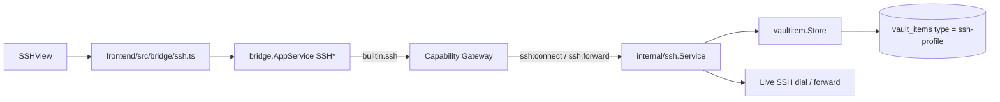

# SSH

Trang này mô tả built-in module **SSH** (ActivityBar title `SSH`, view id
`ssh.connections`). Secrets nằm trong vaultitem substrate; lifecycle Master
Password nằm ở [Vault](/dev-kit/vault).

> Database (`internal/database` + ActivityBar `Database`) là module sibling
> riêng — **không** nằm trong scope trang này. Evidence DB xem
> [Implementation status](/dev-kit/implementation-status).

## Vaultitem contract

| Field | Value |
|---|---|
| Record `type` | `ssh-profile` |
| Payload `key_id` | `ssh-secret` |
| Metadata (plaintext) | `name`, `host`, `port`, `username`, `auth_method`, `host_key_fingerprint` |
| Payload (encrypted) | password **hoặc** private-key PEM (`auth_method` = `password` \| `key`) |

- Passphrase của encrypted PEM **không** persist — chỉ truyền per-operation từ UI
  rồi zeroize sau parse.
- Forward sessions **không** phải vault item (in-memory runtime only).

## UI & runtime flows (`SSHView`)

1. **Profile CRUD** — create (name/host/port/username/auth/secret) → list →
   select → delete. Delete profile cũng dừng mọi forward gắn profile đó.
2. **Host-key TOFU** — `ObserveHostKey` dừng handshake trước auth và trả
   SHA-256 fingerprint; user approve → `TrustHostKey` ghi fingerprint vào
   metadata. Dial với pin rỗng **luôn reject**; pin sai reject (exact match).
3. **Test connection** — dial + auth với secret đã seal; không mở shell dài.
4. **Run command** — one-shot remote command; UI có field passphrase tùy chọn;
   output trả về `CombinedOutput`.
5. **TCP forwarding** — start/list/stop local (`-L`) hoặc remote (`-R`):
   - Listen chỉ **loopback** (không public bind).
   - Không persist qua restart; stop / delete profile / app shutdown đều cleanup.
   - Capability riêng `ssh:forward`.

## Bridge & capability

| Method | Capability | Scope |
|---|---|---|
| `SSHListProfiles` | `ssh:connect` | `profile:list` |
| `SSHCreateProfile` | `ssh:connect` | `profile:new` |
| `SSHDeleteProfile` | `ssh:connect` | `profile:<id>` |
| `SSHObserveHostKey` | `ssh:connect` | `profile:<id>` |
| `SSHTrustHostKey` | `ssh:connect` | `profile:<id>` |
| `SSHTestConnection` | `ssh:connect` | `profile:<id>` |
| `SSHRunCommand` | `ssh:connect` | `profile:<id>` |
| `SSHStartForward` | `ssh:forward` | `profile:<id>` |
| `SSHListForwards` | `ssh:forward` | `forward:list` |
| `SSHStopForward` | `ssh:forward` | `forward:<id>` |

Subject luôn `builtin.ssh`. Profile ID là 24 lowercase hex (opaque qua
`recordID()`). Grants thật ở `internal/app/container.go`; manifest chỉ
declaration metadata (`ssh:connect`, `ssh:forward`).

Packages: `internal/ssh/{ssh,hostkeys,forwarding}.go`,
`internal/bridge/ssh.go`, `frontend/src/modules/ssh/{SSHView,manifest}.ts`,
`frontend/src/bridge/ssh.ts`.

## MCP tool surface (design)

Xem cơ chế chung + rationale ở [MCP / Agent](/dev-kit/mcp-agent).

| MCP tool | Effect | Map sang | Ghi chú |
|---|---|---|---|
| `ssh.listProfiles` | `read` | `builtin.ssh` / `ssh:connect` / `profile:list` | Chỉ metadata (`host`, `username`...), không có secret |
| `ssh.testConnection` | `execute` | `builtin.ssh` / `ssh:connect` / `profile:<id>` | |
| `ssh.runCommand` | `execute` (`destructiveHint`) | `builtin.ssh` / `ssh:connect` / `profile:<id>` | Rủi ro cao nhất trong toàn bộ MCP tool surface hiện có — ứng viên đầu tiên cần policy review chặt hơn default-allow |

**Không expose qua MCP ở v1**:

- `SSHObserveHostKey` / `SSHTrustHostKey` — TOFU là quyết định bảo mật cần con
  người xác nhận; agent tự trust host-key mới sẽ vô hiệu hóa chống MITM đã
  thiết kế ở [ADR-007](/dev-kit/architecture-decisions#adr-007-verified-tls-for-remote-db-and-exact-ssh-host-key-pinning).
- `SSHCreateProfile` / `SSHDeleteProfile` — tạo profile nhận secret trực tiếp
  qua tham số; để v2 sau khi có UI permission review cho MCP.
- `SSHStartForward` / `SSHListForwards` / `SSHStopForward` — mở tunnel network
  do agent khởi tạo là blast-radius lớn, giữ nguyên non-goal bên dưới.

## Non-goals (MVP)

- Public-facing tunnel / unrestricted network bind
- Persist forward definitions across restart
- Per-destination allowlist hoặc enterprise policy
- Team share connection profile qua cloud plaintext
- Custom CA pinning ngoài system trust (N/A cho SSH host-key path hiện tại)

## Known limitations

- Host-key trust UX vẫn manual (observe → approve).
- Passphrase đi qua bridge call metadata — phụ thuộc redaction + UI không log.
- Target host/port do user chọn; chưa có policy prompt giàu hơn.

import { Cards, Card } from 'fumadocs-ui/components/card';

<Cards>
  <Card title="Vault" href="/dev-kit/vault" description="Keyring/DEK + vaultitem substrate" />
  <Card title="Implementation status" href="/dev-kit/implementation-status" description="SSH evidence + remaining scope" />
  <Card title="Technical contracts" href="/dev-kit/technical-contracts" description="Bridge SSH family" />
  <Card title="Architecture decisions" href="/dev-kit/architecture-decisions" description="ADR-007: host-key pinning" />
  <Card title="Security controls" href="/dev-kit/security-controls" description="SSH pinning + forward loopback" />
</Cards>
