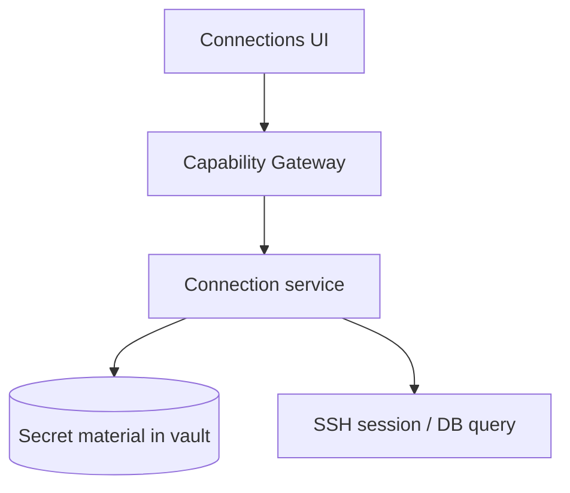

# Connections

Module connections quản lý profile SSH/DB và metadata kết nối — secrets nằm trong vault.

## Scope (hiện tại)

- Lưu profile SSH/PostgreSQL trong vault; không hardcode secret trong config plaintext.
- SSH: test connection, trust host-key pin, chạy lệnh từ shell UI.
- PostgreSQL: query và schema browse qua connection pool với TLS verify-full mặc định cho remote host.
- Đóng/cleanup session rõ ràng sau thao tác.

Tunnel/port forwarding là capability target — chưa có trong runtime hiện tại.

## Non-goals (MVP)

- Enterprise policy phức tạp
- Chia sẻ connection cho team qua cloud plaintext
- SSH tunnel / port forwarding

import { Cards, Card } from 'fumadocs-ui/components/card';

<Cards>
  <Card title="Implementation status" href="/dev-kit/implementation-status" description="SSH partial: no tunnel/forwarding" />
  <Card title="Architecture decisions" href="/dev-kit/architecture-decisions" description="ADR-007: TLS và host-key pinning" />
</Cards>
