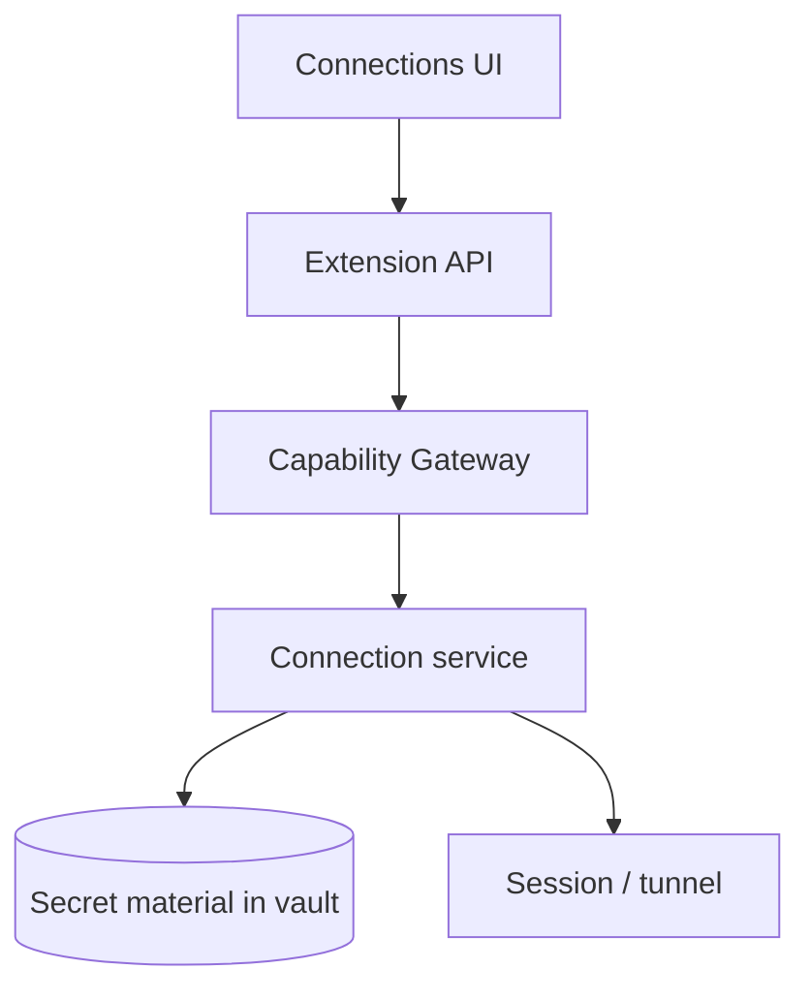

# Connections

Module connections quản lý profile SSH/DB và metadata kết nối — secrets nằm trong vault.

## Phạm vi

- Lưu profile, không hardcode secret trong config plaintext.
- Mở session theo nhu cầu; đóng/cleanup rõ ràng.
- Audit thao tác nhạy cảm (connect, reveal, copy secret).

## Non-goals MVP

- Enterprise policy phức tạp
- Chia sẻ connection cho team qua cloud plaintext
