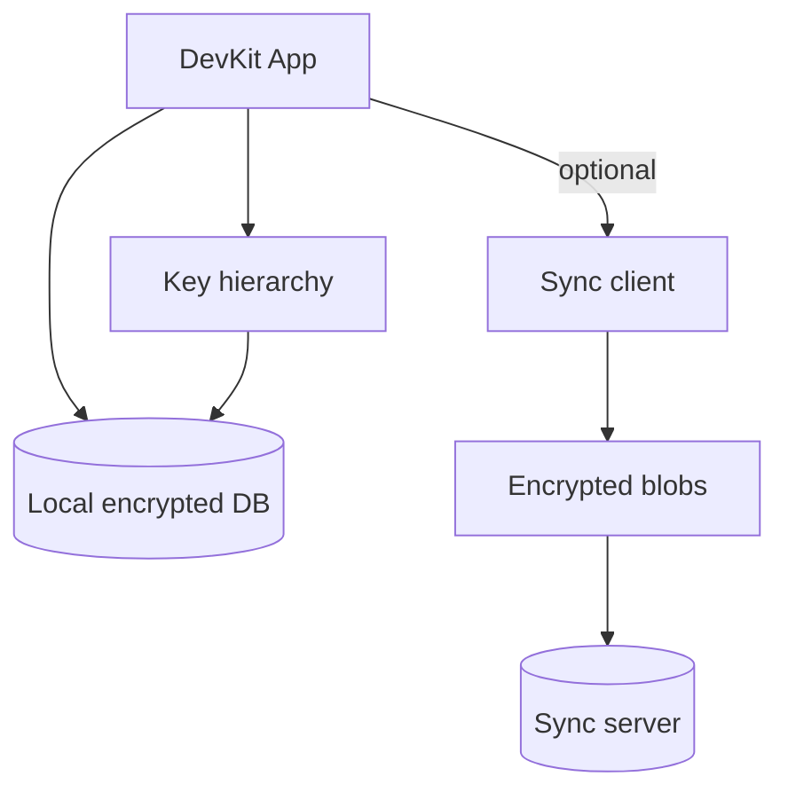

# Data & sync

Dữ liệu sống trên máy trước. Sync là lớp tùy chọn: client mã hóa, server lưu blob.

## Local-first

- Notes, snippets, connection profiles, secrets thuộc vault local.
- App phải dùng được khi mất mạng.
- Schema local cần migration-friendly ngay từ đầu.

## Zero-knowledge sync

1. Client mã hóa trước khi upload.
2. Server lưu blob + metadata tài khoản — không cần plaintext.
3. Thiết bị khác tải blob về và giải mã bằng khóa local.

## Do / Don't (MVP)

| Do | Don't |
|---|---|
| Backup/sync blob đã mã hóa | Realtime collaborative editing |
| Multi-device personal sync | Team vault sharing |
| Migration protocol rõ | Server-side search trên plaintext |

import { Cards, Card } from 'fumadocs-ui/components/card';

<Cards>
  <Card title="Vault & notes" href="/dev-kit/vault" />
  <Card title="Security model" href="/dev-kit/security" />
</Cards>
