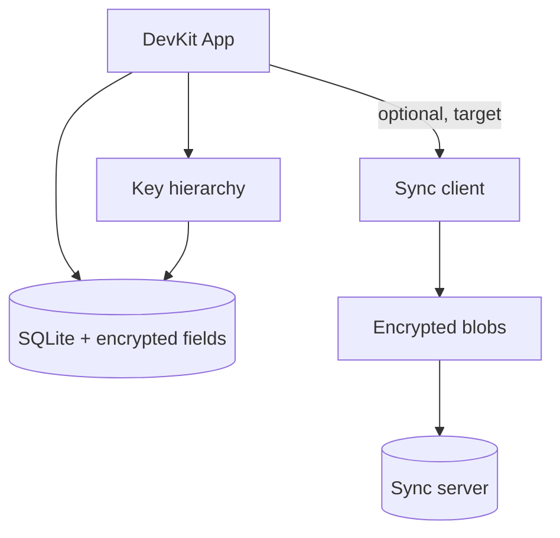

# Data & sync

Dữ liệu sống trên máy trước (local-first). Sync là lớp tùy chọn target: client phải mã hóa trước upload; server chỉ lưu blob.

## Local-first

- Notes, connection profiles, secrets thuộc vault local.
- App phải dùng được khi mất mạng.
- Schema local cần migration-friendly ngay từ đầu.

## Local encryption (hiện tại)

SQLite (`devkit.db`) lưu record JSON; các field nhạy cảm (note body, credentials) được mã hóa ở **application layer** bằng vault DEK — không phải full-database encryption (SQLCipher). Metadata như title/host có thể plaintext để list/search khi vault locked. Chi tiết: [ADR-004](/dev-kit/architecture-decisions#adr-004-application-layer-encrypted-records-instead-of-sqlcipher).

Notes, database profiles và SSH profiles giờ dùng chung một bảng `vault_items`
qua store thống nhất `internal/vaultitem` — xem [ADR-008](/dev-kit/architecture-decisions#adr-008-unified-vault_items-store-for-built-in-item-types). Mỗi item mang sẵn hai field làm **nền cho sync**:

- `key_version` — cho phép rotate DEK và re-wrap mà không phá record cũ.
- `sync_state` (mặc định `"local"`) — đánh dấu trạng thái đồng bộ của từng item.

Sync client hiện đã có queue/cursor, authenticated HTTP push/pull, remote apply
transaction và automatic capture local create/update/delete của `vault_items`.

## Phase 3 sync client (implemented partially)

- `internal/sync` định nghĩa change contract, idempotency, retry/conflict state
  và opaque ciphertext payload.
- Application orchestration: `internal/syncclient` (connect / syncnow / conflicts)
  và `internal/syncconflict` (detail + resolve strategies).
- Persistence adapters: `internal/syncstore` (outbox, cursors, remote apply,
  identity, local mutations, conflict capture/resolve). SQLite kernel /
  migrations vẫn ở `internal/storage`.
- `ReplicationEnvelope` mã hoá toàn bộ record bytes, gồm metadata và nested
  payload envelope; plaintext metadata không được đưa vào outbox transport.
- `sync_outbox` và `sync_cursors` được tạo bằng migration m7, không backfill
  hoặc thay đổi dữ liệu hiện có trong `vault_items`.
- `internal/auth` dùng Authorization Code + PKCE S256 với system browser và
  loopback callback `127.0.0.1`; refresh token rotation nằm trong OS keychain,
  còn access token chỉ giữ runtime. Gateway origin production được pin là
  `https://api.synx.io.vn`, không nhận endpoint/token từ UI.
- Handshake `/v1/sync/session` lấy account identity từ authenticated server
  response; transport refresh access token trước request và redirect bị từ chối.
- HTTP push/pull yêu cầu HTTPS, trừ explicit loopback development endpoint;
  request, response, batch và ciphertext đều bounded.
- Remote snapshots được decrypt/validate ở client rồi apply cùng cursor trong
  một SQLite transaction. Account binding, monotonic entity version, tombstone
  và append-only operation journal ngăn account switch/replay fail-open.
- Capability-gated bridge và minimal Sync UI chỉ expose non-secret status/counts.
- Phase 3C dùng migration m10: local write atomically cập nhật `vault_items`,
  account-neutral entity head và durable mutation intent. Cách này giữ CRUD
  local-first trước lần authenticated connect đầu tiên và không mint account ID local.
- `SyncNow` materialize intents theo thứ tự commit thành AAD-bound encrypted
  outbox, sau đó mới push. Handoff crash giữa enqueue/intent cleanup là idempotent.
- First `Connect` không claim account; durable binding chỉ xảy ra khi user chọn
  `SyncNow`. Shared snapshot size cap ngăn oversized record kẹt toàn bộ queue,
  và version mới không được vượt predecessor chưa synced của cùng entity.
- Push ACK chỉ đánh dấu record `synced` khi operation/version vẫn là local head;
  stale ACK và tombstone chưa ACK không được overwrite/resurrect local state.
- Conflict resolve phía client đã có (xem mục dưới). Companion Java backend đã
  implement durable PostgreSQL arbitration, account/device session, revoke
  enforcement, push/pull và gateway-signed identity boundary. Single-device
  deployment smoke đã pass ngày 2026-08-10 (session, push, pull, apply); còn
  thiếu convergence/retry/revocation matrix trên stack deploy thật.

## Conflict resolution (Git-style) — client implemented

> Xử lý conflict theo mô hình **Git**: **không tự chọn thắng**, giữ record ở
> trạng thái conflict với **cả hai bản** để user tự giải quyết.
> Client-side list → capture theirs → resolve đã có runtime + mock-server E2E.
> Production SaaS arbitration vẫn xem [`/dev-kit/saas-backend`](/dev-kit/saas-backend).

Khi push bị server báo conflict (device khác đã tiến version cho cùng record):

1. Record đánh dấu `sync_state = "conflict"`; **ours** = bản local hiện tại.
2. Lần pull kế, op remote cùng entity của record đó (đang bị apply-guard từ chối) được
   **giữ lại làm "theirs"** thay vì bỏ đi — client lưu bản remote cạnh bản local
   (`sync_conflicts` / migration m11; m15 cho phép "theirs" là một delete op không có
   record body — `theirs_snapshot` nullable, `remote_operation` phân biệt).
3. UI hiển thị **ours vs theirs** (tương tự `<<<<<<< ours / ======= / >>>>>>> theirs`),
   user chọn: **Use ours** (giữ local), **Use theirs** (lấy remote), hoặc **Edit/merge**
   (chỉ cho note text). **Secret không merge ngầm** — chỉ chọn một bên.
   UI đích: **3-pane merge kiểu JetBrains** (Local | Result editable | Remote);
   MVP hiện dùng marker inline trong `ResolvePanel`. Item secret (db/ssh) rút gọn
   còn 2 lựa chọn ours/theirs.
4. Sau khi giải quyết: ghi nội dung đã chọn thành **version mới = remote_head + 1**, xóa
   trạng thái conflict + "theirs", record trở lại `local` và sync bình thường ⇒ hai device
   hội tụ.

Packages: `internal/syncclient.Conflicts`, `internal/syncconflict`,
`internal/syncstore` conflict adapters, bridge `SyncConflicts` /
`SyncConflictDetail` / `SyncResolveConflict`, UI
`frontend/src/modules/sync/ResolvePanel.tsx`. Dev/E2E: `cmd/mocksyncserver`.

Không có auto-resolution: mọi conflict cần hành động của user (giống Git yêu cầu resolve
trước khi tiếp tục). Chi tiết cross-device version/head arbitration ở
[SaaS sync backend](/dev-kit/saas-backend).

### Divergence capture semantics (m15)

Mọi op remote bị apply-guard từ chối **chống lại local lineage chưa sync** (outbox rows
không synced hoặc mutation intents chưa materialize) đều được capture làm "theirs" và
op được consume — **pull cursor luôn tiến**, không có op hợp lệ nào wedge toàn bộ account:

- Op remote **cũ hơn hoặc bằng** ledger head khi local đang dirty (offline multi-edit
  trong lúc peer push thắng) — version bất đối xứng, capture bất kể thứ tự version.
- Op remote **mới hơn** chống lại row đang dirty hoặc tombstone chưa ACK (trash-vs-edit,
  update-vs-delete) — capture; delete được lưu không snapshot.
- Op remote **cũ hơn** head local đã sync sạch (clean ledger) — stale replay, consume
  như no-op (monotonic version không rollback; server arbitration đảm bảo content
  đã được apply/ack trước đó).
- **Delete-vs-delete** không phải divergence (cùng kết quả): remote tombstone được apply
  và local delete intent trùng hàng bị supersede.
- Chỉ còn 2 lỗi batch-fatal: type không bất biến bị đổi (corruption) và operation ID
  reuse với content khác (corruption).

Ledger timing: local head (m10) **tiến tại materialization**, trước khi server ack —
đây là lý do các op cũ hơn dirty local head phải capture thay vì skip. Khi resolve,
account ledger được reset về `remote_entity_version` của bản theirs (server truth)
để intent re-materialize tại `remote_head + 1` luôn ship được.

### Outbox dead-letter

Row không thể chuẩn bị push (data hỏng — preparation error) được retry tối đa
**5 lần liên tiếp**, sau đó chuyển `failed` (dead-letter, `MarkFailed`) và ngừng
retry mỗi SyncNow; report có counter `push_failed` để UI surface "needs attention".
Row failed vẫn giữ thứ tự nhân quả (server từ chối version gap) — record cần user
xử lý. Lỗi transport/network vẫn là retry thường (không dead-letter).

## Zero-knowledge sync (target)

Thiết kế mục tiêu cho sync future:

1. Client mã hóa trước khi upload.
2. Server lưu blob + metadata tài khoản — không cần plaintext.
3. Thiết bị khác tải blob về và giải mã bằng khóa local.

## Do / Don't (MVP)

| Do | Don't |
|---|---|
| Backup/sync blob đã mã hóa | Realtime collaborative editing |
| Multi-device personal sync | Team vault sharing |
| Migration protocol rõ | Server-side search trên plaintext |

import { Cards, Card } from 'fumadocs-ui/components/card';

<Cards>
  <Card title="SaaS sync backend" href="/dev-kit/saas-backend" description="Spring Boot 4 + Gateway MVC + Keycloak + PG18" />
  <Card title="Vault" href="/dev-kit/vault" />
  <Card title="Notes" href="/dev-kit/notes" description="Conflict resolve strategy merge (notes-only)" />
  <Card title="Security model" href="/dev-kit/security" />
  <Card title="Architecture decisions" href="/dev-kit/architecture-decisions" description="ADR-004: application-layer encryption" />
</Cards>
