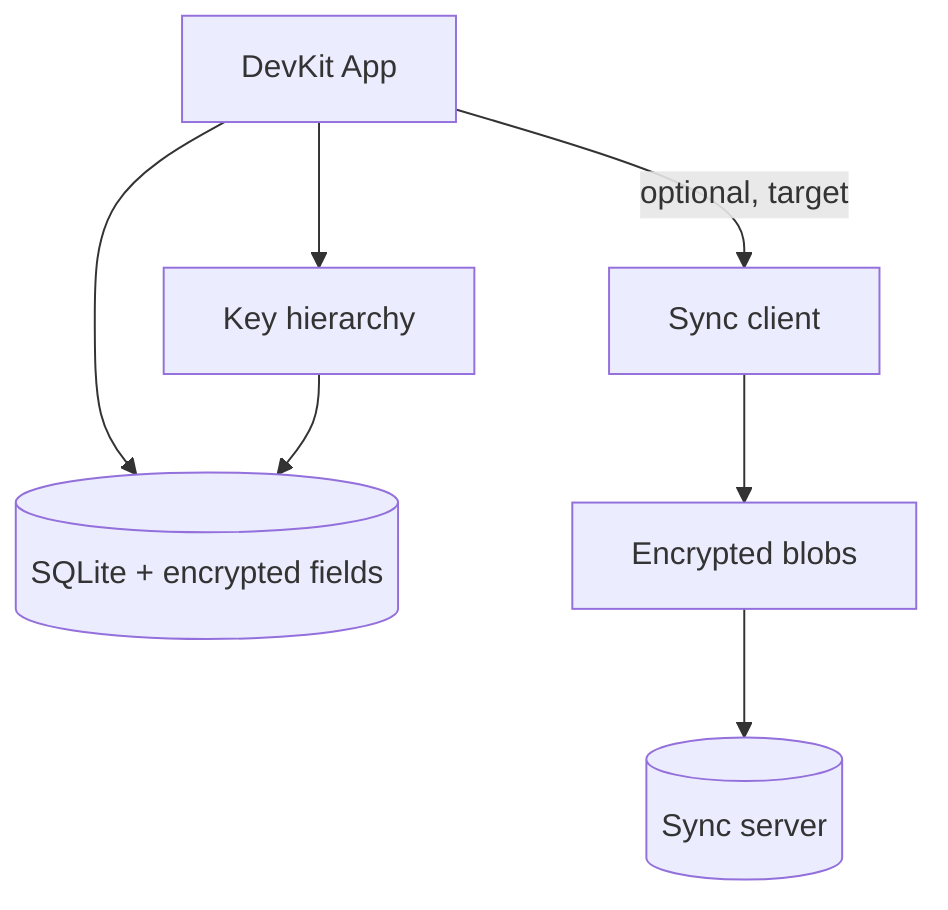

# Data & sync

Dữ liệu sống trên máy trước (local-first). Sync là lớp tùy chọn target: client phải mã hóa trước upload; server chỉ lưu blob.

## Local-first

- Notes, connection profiles, secrets thuộc vault local.
- App phải dùng được khi mất mạng.
- Schema local cần migration-friendly ngay từ đầu.

## Local encryption (hiện tại)

SQLite (`devkit.db`) lưu record JSON; các field nhạy cảm (note body, credentials) được mã hóa ở **application layer** bằng vault DEK — không phải full-database encryption (SQLCipher). Metadata như title/host có thể plaintext để list/search khi vault locked. Chi tiết: [ADR-004](/dev-kit/architecture-decisions#adr-004-application-layer-encrypted-records-instead-of-sqlcipher).

Notes, database profiles và SSH profiles giờ dùng chung một bảng `vault_items`
qua store thống nhất `internal/services/vaultitem` — xem [ADR-008](/dev-kit/architecture-decisions#adr-008-unified-vault_items-store-for-built-in-item-types). Mỗi item mang sẵn hai field làm **nền cho sync tương lai**:

- `key_version` — cho phép rotate DEK và re-wrap mà không phá record cũ.
- `sync_state` (mặc định `"local"`) — đánh dấu trạng thái đồng bộ của từng item.

Sync client hiện đã có queue/cursor, authenticated HTTP push/pull, remote apply
transaction và automatic capture local create/update/delete của `vault_items`.

## Phase 3B sync client (implemented partially)

- `internal/sync` định nghĩa change contract, idempotency, retry/conflict state
  và opaque ciphertext payload.
- `ReplicationEnvelope` mã hoá toàn bộ record bytes, gồm metadata và nested
  payload envelope; plaintext metadata không được đưa vào outbox transport.
- `sync_outbox` và `sync_cursors` được tạo bằng migration m7, không backfill
  hoặc thay đổi dữ liệu hiện có trong `vault_items`.
- Handshake `/v1/sync/session` lấy account identity từ authenticated server
  response; bearer chỉ giữ runtime và redirect bị từ chối.
- HTTP push/pull yêu cầu HTTPS, trừ explicit loopback development endpoint;
  request, response, batch và ciphertext đều bounded.
- Remote snapshots được decrypt/validate ở client rồi apply cùng cursor trong
  một SQLite transaction. Account binding, monotonic entity version, tombstone
  và append-only operation journal ngăn account switch/replay fail-open.
- Capability-gated bridge và minimal Sync UI chỉ expose non-secret status/counts.
- Phase 3C dùng migration m10: local write atomically cập nhật `vault_items`,
  account-neutral entity head và durable mutation intent. Cách này giữ CRUD
  local-first trước lần authenticated connect đầu tiên và không mint account ID local.
- `SyncNow` materialize intents theo thứ tự commit thành AAD-bound encrypted
  outbox, sau đó mới push. Handoff crash giữa enqueue/intent cleanup là idempotent.
- First `Connect` không claim account; durable binding chỉ xảy ra khi user chọn
  `SyncNow`. Shared snapshot size cap ngăn oversized record kẹt toàn bộ queue,
  và version mới không được vượt predecessor chưa synced của cùng entity.
- Push ACK chỉ đánh dấu record `synced` khi operation/version vẫn là local head;
  stale ACK và tombstone chưa ACK không được overwrite/resurrect local state.
- Chưa có production backend. Entity-version arbitration và conflict-resolution
  UX cho nhiều device cùng sửa offline vẫn là scope còn lại.

## Zero-knowledge sync (target)

Thiết kế mục tiêu cho sync future:

1. Client mã hóa trước khi upload.
2. Server lưu blob + metadata tài khoản — không cần plaintext.
3. Thiết bị khác tải blob về và giải mã bằng khóa local.

## Do / Don't (MVP)

| Do | Don't |
|---|---|
| Backup/sync blob đã mã hóa | Realtime collaborative editing |
| Multi-device personal sync | Team vault sharing |
| Migration protocol rõ | Server-side search trên plaintext |

import { Cards, Card } from 'fumadocs-ui/components/card';

<Cards>
  <Card title="Vault & notes" href="/dev-kit/vault" />
  <Card title="Security model" href="/dev-kit/security" />
  <Card title="Architecture decisions" href="/dev-kit/architecture-decisions" description="ADR-004: application-layer encryption" />
</Cards>
