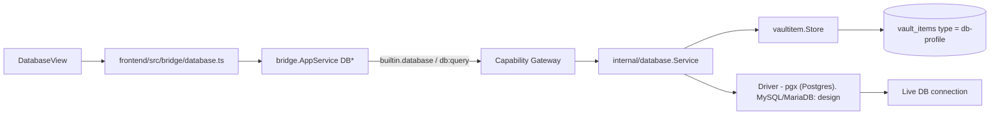

# Database

Trang này mô tả built-in module **Database** (`internal/database`, ActivityBar
`Database`). Trước đây chỉ được nhắc gián tiếp trong `vault.mdx`/`connections.mdx`
như "module sibling" — trang này gom lại thành nguồn sự thật riêng, đúng pattern
đã dùng cho SSH/Notes. Secrets nằm trong vaultitem substrate; vault lifecycle
(Master Password/DEK) xem [Vault](/dev-kit/vault).

## Vaultitem contract (hiện tại — chỉ Postgres)

| Field | Value |
|---|---|
| Record `type` | `db-profile` |
| Payload `key_id` | `db-password` |
| Metadata (plaintext) | `Host`, `Port`, `Database`, `Username`, `SSLMode` |
| Payload (encrypted) | `Password` |

Driver hiện tại là `pgx` (`internal/database/pool.go`) — chỉ nói chuyện được
với PostgreSQL. Không có field phân biệt engine trong metadata vì chưa cần —
đây chính là phần phải thêm khi mở rộng driver (xem phần Design bên dưới).

## TLS default

Remote profile mặc định `sslmode=verify-full`; chỉ cho phép `sslmode=disable`
trên loopback dev host, remote + insecure TLS bị reject
(`ErrInsecureTLSForRemoteHost`) — [ADR-007](/dev-kit/architecture-decisions#adr-007-verified-tls-for-remote-db-and-exact-ssh-host-key-pinning).

## Bridge & capability

| Method | Capability | Scope |
|---|---|---|
| `DBListProfiles` | `db:query` | `profile:list` |
| `DBCreateProfile` | `db:query` | `profile:new` |
| `DBDeleteProfile` | `db:query` | `profile:<id>` |
| `DBTestConnection` | `db:query` | `profile:<id>` |
| `DBQuery` | `db:query` | `profile:<id>` |

Subject luôn `builtin.database`. Packages: `internal/database/{database,pool}.go`,
`internal/bridge/database.go`, `frontend/src/modules/database/DatabaseView.tsx`,
`frontend/src/bridge/database.ts`.

## Design: mở rộng MySQL/MariaDB

import { Callout } from 'fumadocs-ui/components/callout';

<Callout type="warn" title="Design only — phần dưới đây">
`internal/database` hiện tại chỉ implement Postgres. Phần này là thiết kế cho
việc thêm driver, chưa có runtime.
</Callout>

- **Driver abstraction** — tách 1 interface `Driver` (`Connect`, `Query`,
  `TestConnection`, `Close`) mà `pgx` implement hiện tại phải map vào; thêm
  implementation mới cho MySQL/MariaDB thay vì rẽ nhánh if/else trong service.
- **MariaDB dùng chung code path với MySQL** — cùng wire protocol
  (MySQL-compatible), nên chỉ cần 1 driver `mysql`, không viết driver thứ 3
  riêng. Khác biệt (nếu có) chỉ ở default port/TLS option, xử lý ở config chứ
  không phải ở tầng driver.
- **Thêm field `engine`** (`postgres` | `mysql` | `mariadb`) vào metadata
  plaintext của `db-profile`. Đây là thay đổi shape metadata — phải theo đúng
  "Compatibility rules" đã chốt ở [Technical contracts](/dev-kit/technical-contracts#compatibility-rules):
  field mới phải có default an toàn cho record cũ. Vì DevKit greenfield (chưa
  có data thật), default `engine = "postgres"` cho profile hiện tại là đủ,
  không cần migration/backfill job riêng.
- **TLS default cho driver mới phải giữ tinh thần ADR-007** — verify-full cho
  remote, không hạ chuẩn bảo mật chỉ vì thêm engine mới.
- **Factory chọn driver theo `engine`** tại nơi hiện đang khởi tạo `pgx.Pool`
  — 1 chỗ thay đổi, không lan ra `bridge`/`capability` (chữ ký `DBQuery` không
  đổi).

### Known ceiling

- Chưa hỗ trợ SSH tunnel riêng cho profile DB — muốn tunnel thì dùng
  [SSH](/dev-kit/ssh) forwarding thủ công.
- Connection pooling (`pool.go`) hiện viết riêng cho `pgx`; cần generalize khi
  thêm driver thứ 2, chưa thiết kế chi tiết pool behavior cho MySQL/MariaDB.
- Không tự phân biệt SELECT vs mutating query ở tầng nào cả (UI lẫn MCP) —
  mọi `DBQuery` coi như có thể phá dữ liệu.

## MCP tool surface (design)

Xem cơ chế chung + rationale ở [MCP / Agent](/dev-kit/mcp-agent).

| MCP tool | Effect | Map sang | Ghi chú |
|---|---|---|---|
| `db.listProfiles` | `read` | `builtin.database` / `db:query` / `profile:list` | Chỉ metadata, không có password |
| `db.testConnection` | `execute` | `builtin.database` / `db:query` / `profile:<id>` | |
| `db.query` | `execute` (`destructiveHint`) | `builtin.database` / `db:query` / `profile:<id>` | Không phân biệt SELECT/UPDATE — coi mọi query là có thể phá dữ liệu |

**Không expose qua MCP ở v1**: `DBCreateProfile` / `DBDeleteProfile` — nhận
password trực tiếp qua tham số, để v2 sau khi có UI permission review cho MCP.

## Non-goals (MVP)

- Multi-engine query builder / ORM layer trong DevKit.
- Connection pooling nâng cao (read replica routing, load balancing).
- Custom CA pinning ngoài system trust (giống SSH, chưa implement).

import { Cards, Card } from 'fumadocs-ui/components/card';

<Cards>
  <Card title="Vault" href="/dev-kit/vault" description="Thin adapter db-profile trên vaultitem" />
  <Card title="SSH" href="/dev-kit/ssh" description="Cùng pattern connection-profile" />
  <Card title="MCP / Agent" href="/dev-kit/mcp-agent" />
  <Card title="Technical contracts" href="/dev-kit/technical-contracts" description="Bridge Database family" />
  <Card title="Architecture decisions" href="/dev-kit/architecture-decisions" description="ADR-007: verify-full TLS" />
</Cards>
