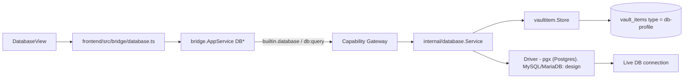

# Database

Trang này mô tả built-in module **Database** (`internal/database`, ActivityBar
`Database`). Trước đây chỉ được nhắc gián tiếp trong `vault.mdx`/`connections.mdx`
như "module sibling" — trang này gom lại thành nguồn sự thật riêng, đúng pattern
đã dùng cho SSH/Notes. Secrets nằm trong vaultitem substrate; vault lifecycle
(Master Password/DEK) xem [Vault](/dev-kit/vault).



## Vaultitem contract (hiện tại — chỉ Postgres)

| Field | Value |
|---|---|
| Record `type` | `db-profile` |
| Payload `key_id` | `db-password` |
| Metadata (plaintext) | `Host`, `Port`, `Database`, `Username`, `SSLMode` |
| Payload (encrypted) | `Password` |

Driver hiện tại là `pgx` (`internal/database/pool.go`) — chỉ nói chuyện được
với PostgreSQL. Không có field phân biệt engine trong metadata vì chưa cần —
đây chính là phần phải thêm khi mở rộng driver (xem phần Design bên dưới).

## TLS default và giới hạn runtime (hiện tại — Postgres)

- Remote profile mặc định `sslmode=verify-full`; chỉ cho phép `sslmode=disable`
  trên loopback dev host, remote + insecure TLS bị reject
  (`ErrInsecureTLSForRemoteHost`) — [ADR-007](/dev-kit/architecture-decisions#adr-007-verified-tls-for-remote-db-and-exact-ssh-host-key-pinning).
- TLS trust dùng **system CA store của `pgx`** — không có custom CA pinning
  riêng (giống SSH, cũng chưa implement).
- Query timeout **30s**; kết quả cap `DefaultMaxRows = 200` — 2 giới hạn này
  do DevKit tự enforce ở tầng service, không phụ thuộc driver.
- Vault phải **unlocked** trước khi tạo profile hoặc query, vì password field
  encrypt/decrypt qua vault DEK. Chi tiết vận hành: [Operations § Database connection prerequisites](/dev-kit/operations#database-connection-prerequisites).

## Bridge & capability

| Method | Capability | Scope |
|---|---|---|
| `DBListProfiles` | `db:query` | `profile:list` |
| `DBCreateProfile` | `db:query` | `profile:new` |
| `DBDeleteProfile` | `db:query` | `profile:<id>` |
| `DBTestConnection` | `db:query` | `profile:<id>` |
| `DBQuery` | `db:query` | `profile:<id>` |
| `DBSetActiveProfile` (design) | `db:query` | `profile:<id>` |
| `DBActiveProfile` (design) | `db:query` | `profile:active` |

Subject luôn `builtin.database`. Packages: `internal/database/{database,pool}.go`,
`internal/bridge/database.go`, `frontend/src/modules/database/DatabaseView.tsx`,
`frontend/src/bridge/database.ts`.

`DBSetActiveProfile`/`DBActiveProfile` là 2 method mới cho phần "active profile
cho agent" — xem [MCP tool surface](#mcp-tool-surface-design) bên dưới. UI hiện
tại (`DBQuery` nhận `profileId` tường minh mỗi lần gọi, nhiều tab/profile dùng
song song được) **không đổi gì** — 2 method này chỉ phục vụ agent qua MCP.

## Design: multi-engine driver abstraction

import { Callout } from 'fumadocs-ui/components/callout';

<Callout type="warn" title="Design only — toàn bộ phần này">
`internal/database` hiện tại chỉ implement Postgres qua `pgx`, đi thẳng không
qua interface trung gian. Phần dưới đây thiết kế lại thành driver abstraction
thật để nhận MySQL/MariaDB mà không rẽ nhánh if/else theo engine trong
service — chưa có runtime.
</Callout>

Bản trước của trang này chỉ nói "thêm 1 driver MySQL, generalize pool sau" —
không đủ, vì bỏ qua ít nhất 4 điểm khác biệt thật giữa Postgres và
MySQL-family mà nếu không thiết kế trước sẽ vỡ khi implement. Từng điểm dưới
đây có quyết định rõ ràng, không để "tính sau".

### 1. `Driver` interface — chốt method shape trước khi viết driver thứ 2

```text
type Driver interface {
    Dial(ctx context.Context, cfg ConnConfig) (Conn, error)
}

type Conn interface {
    Ping(ctx context.Context) error
    Query(ctx context.Context, sql string, args ...any) (Rows, error)
    ListSchemas(ctx context.Context) ([]string, error)
    ListTables(ctx context.Context, schema string) ([]TableInfo, error)
    ListColumns(ctx context.Context, schema, table string) ([]ColumnInfo, error)
    Close() error
}

type ConnConfig struct {
    Engine   string // "postgres" | "mysql" | "mariadb"
    Host     string
    Port     int
    Database string
    Username string
    Password string // từ vault, không log
    SSLMode  string
    Options  map[string]string // engine-specific escape hatch, xem mục 6
}
```

`pgx` hiện tại phải được bọc lại đúng interface này — không phải viết thêm 1
interface song song rồi giữ code path `pgx` cũ chạy tắt.

### 2. Schema browse phải thành method riêng, không phải SQL cứng Postgres

Hiện tại schema browse (list schema/table/column trên UI) chạy bằng SQL
catalog cứng (kiểu `pg_catalog`/Postgres-specific) qua `DBQuery` — cách này
**không portable**: MySQL/MariaDB không có `pg_catalog`. Design mới tách
`ListSchemas`/`ListTables`/`ListColumns` thành method riêng trên `Conn`, mỗi
driver tự implement bằng catalog phù hợp — cả Postgres lẫn MySQL/MariaDB đều
hỗ trợ `information_schema` theo chuẩn ANSI đủ tốt để dùng chung logic ở tầng
gọi, chỉ khác câu SQL cụ thể bên trong từng driver. Cần thêm bridge method
mới (`DBListSchemas`, `DBListTables`) — đây là mở rộng bridge surface thật,
không phải chi tiết nội bộ.

### 3. Placeholder syntax khác nhau — không cố "tự động sửa"

Postgres dùng `$1, $2`; MySQL/MariaDB dùng `?`. `DBQuery` nhận SQL thô từ UI/agent,
DevKit **không** parse SQL để tự chuyển đổi placeholder giữa các engine (rủi ro
sai lệch cao, dễ vỡ với SQL phức tạp). Quyết định: caller (UI hoặc agent qua
MCP) phải tự viết SQL đúng cú pháp placeholder của `engine` đã chọn trong
profile — đây là **known limitation ghi rõ**, không phải lỗ hổng ngầm. UI nên
hiển thị `engine` của profile đang chọn ngay cạnh ô nhập query để giảm nhầm.

### 4. Pool: `pgx` có pool riêng, MySQL driver đi qua `database/sql`

Đây là bất đối xứng thật, không phải chi tiết vặt: `pgx` dùng pool native
(`pgxpool`) không qua `database/sql`; driver MySQL phổ biến
(`go-sql-driver/mysql`) là 1 `database/sql` driver, pool đến từ
`database/sql.DB`. `Driver.Dial` phải trả về `Conn` đã che giấu khác biệt này
— caller (`internal/database.Service`) chỉ thấy `Conn`, không biết bên dưới
là `pgxpool.Pool` hay `sql.DB`. Pool config (`MaxOpenConns`, idle timeout) vẫn
là 1 bộ tham số chung ở tầng `ConnConfig`/service, map xuống implementation
tương ứng của từng driver.

### 5. TLS/CA trust và auth handshake — không giả định "cứ thế mà chạy"

- Postgres/`pgx` dùng system CA store sẵn có. MySQL driver **không** tự làm
  vậy — phải đăng ký `tls=custom` kèm CA pool tương đương thủ công
  (`mysql.RegisterTLSConfig`), nếu không remote MySQL với `verify-full`-style
  sẽ không hoạt động đúng như kỳ vọng của ADR-007.
- MySQL 8 mặc định dùng auth plugin `caching_sha2_password` — cần xác nhận
  driver + phiên bản server tương thích khi implement, không giả định driver
  nào cũng handshake được; đây là rủi ro tương thích thật cần test với MySQL 8
  thật trước khi coi driver "xong".

### 6. Metadata: field chung + `driver_options` cho phần không generalize được

Thêm `engine` (`postgres` | `mysql` | `mariadb`) vào metadata — record cũ
default `engine = "postgres"` (an toàn theo
["Compatibility rules"](/dev-kit/technical-contracts#compatibility-rules),
DevKit greenfield nên không cần migration job riêng). Ngoài field chung
(`Host`/`Port`/`Database`/`Username`/`SSLMode`), thêm `driver_options` dạng
map tự do cho phần đặc thù từng engine (ví dụ MySQL cần path CA cert riêng)
— cùng kỹ thuật "raw passthrough cho phần không chuẩn hóa được" đã dùng cho
`_meta` ở [Agent Hub](/dev-kit/agent-hub) (mục "Vì sao cần lớp flex này"):
field chuẩn hóa nằm ở struct chính, phần chưa/không chuẩn hóa được nằm ở bag
riêng, không ép hết vào 1 shape cứng.

### 7. MariaDB: cùng driver với MySQL, nhưng không giả định 100% giống hệt

Giữ nguyên quyết định dùng chung driver `mysql` cho cả MariaDB (cùng wire
protocol) — **nhưng** không coi đó là tương đương tuyệt đối: MariaDB khác
MySQL ở auth plugin mặc định, xử lý kiểu `JSON`, và một số system variable.
V1 chỉ cam kết đúng phạm vi đã dùng (connect, query, schema browse cơ bản) đã
verify trên MariaDB thật — không quảng cáo "tương thích hoàn toàn" khi chưa
test.

### Acceptance criteria bổ sung (multi-engine)

- Profile `engine=mysql` connect thành công tới MySQL 8 thật, `ListTables`
  trả đúng danh sách.
- Profile `engine=mariadb` connect thành công tới MariaDB 10.x thật bằng cùng
  driver `mysql`, không cần code path riêng.
- Query dùng sai placeholder syntax cho engine đã chọn (vd `$1` gửi vào MySQL
  profile) → lỗi rõ ràng từ driver, không phải silent wrong result.
- Đổi `engine` của 1 profile đã tồn tại (nếu UI cho phép) → `port`/`SSLMode`
  default gợi ý đổi theo engine mới, không giữ nguyên default cũ của Postgres.

### Known ceiling

- Chưa hỗ trợ SSH tunnel riêng cho profile DB — muốn tunnel thì dùng
  [SSH](/dev-kit/ssh) forwarding thủ công.
- Không tự phân biệt SELECT vs mutating query ở tầng nào cả (UI lẫn MCP) —
  mọi `DBQuery` coi như có thể phá dữ liệu.
- Không tự động chuyển đổi placeholder syntax giữa engine (mục 3) — chấp
  nhận đây là giới hạn v1, không phải bug.

## MCP tool surface (design)

Xem cơ chế chung + rationale ở [MCP / Agent](/dev-kit/mcp-agent).

| MCP tool | Effect | Map sang | Ghi chú |
|---|---|---|---|
| `db.listProfiles` | `read` | `builtin.database` / `db:query` / `profile:list` | Chỉ metadata, không có password |
| `db.testConnection` | `execute` | `builtin.database` / `db:query` / `profile:<id>` | Nhận `profileId` tường minh — test 1 profile cụ thể, không đụng active profile |
| `db.activeProfile` | `read` | `builtin.database` / `db:query` / `profile:active` | Trả `{profileId?}` — agent chỉ đọc, không tự đổi |
| `db.query` | `execute` (`destructiveHint`) | `builtin.database` / `db:query` / `profile:active` | Không nhận `profileId` — chạy trên **active profile cho agent**. Không phân biệt SELECT/UPDATE — coi mọi query là có thể phá dữ liệu. Hỏi quyền theo policy env tag (xem dưới) |

**"Hỏi quyền theo policy env tag"**: cần thêm field bắt buộc `env` vào
metadata `db-profile` — không có trong bảng Vaultitem contract hiện tại (vì
đó là mô tả runtime Postgres đã Implemented; `env` là field mới, design
only). `DBCreateProfile` phải reject nếu thiếu `env`. Giá trị `env` là tên 1
tag trong registry [Environments](/dev-kit/environments) (`dev`/`stg`/`prod`
mặc định, tạo thêm tùy chỉnh được). `db.query` qua MCP tra
`requiresConfirmation` của tag đó trước khi chạy — nếu bật, phải xác nhận
tương tác mỗi lần gọi, không có `allow_always`. `env=prod` luôn bật (khóa
cứng); `dev`/`stg` mặc định tắt nhưng bật lên được. Chi tiết cơ chế:
[MCP / Agent § `env` bắt buộc](/dev-kit/mcp-agent). `db.listProfiles`/
`db.testConnection`/`db.activeProfile` không bị luật này — chỉ đọc
metadata/status hoặc test kết nối tạm thời.

**Không expose qua MCP ở v1**: `DBCreateProfile` / `DBDeleteProfile` — nhận
password trực tiếp qua tham số, để v2 sau khi có UI permission review cho MCP.
`DBSetActiveProfile` cũng **không** expose qua MCP — chọn active profile luôn
là hành động của con người, cùng nguyên tắc human-only action đã áp cho unlock
vault / trust SSH host-key.

### Active profile cho agent — không đổi resource model hiện có

`db.query` qua MCP dùng khái niệm **active profile riêng cho agent**, tách biệt
hoàn toàn khỏi cách UI hoạt động hôm nay:

- UI (`DBQuery` qua bridge) **không đổi gì** — vẫn nhận `profileId` tường minh
  mỗi lần gọi, vẫn dùng song song nhiều profile được (ví dụ 2 tab query 2
  profile khác nhau) nếu implement cho phép, đúng cách connection pool hiện
  tại (`pool.go`) đã hoạt động.
- Agent qua MCP thì khác: `db.query` không nhận `profileId`. Nếu agent gọi mà
  chưa có active profile, DevKit hiện popup cho user chọn 1 trong các profile
  đã lưu (giống hệt cơ chế đã thiết kế cho [Kafka UI](/dev-kit/kafka), mục
  "Agent gọi khi chưa có cluster active"); lựa chọn giữ nguyên (sticky) tới
  khi user tự đổi qua `DatabaseView` hoặc sidebar.
- Khác Kafka: đây **không** phải ràng buộc tài nguyên (Kafka giới hạn vì chỉ
  giữ đúng 1 live broker connection). Với Database, "active profile" chỉ là
  lớp chọn target cho agent — pool/connection thật phía dưới vẫn hoạt động y
  hệt hiện tại, không giới hạn số profile có connection sống cùng lúc.
- Timeout cho popup và fallback khi DevKit chạy headless áp dụng y hệt NFR-9
  của Kafka UI.

## Non-goals (MVP)

- Multi-engine query builder / ORM layer trong DevKit.
- Connection pooling nâng cao (read replica routing, load balancing).
- Custom CA pinning ngoài system trust (giống SSH, chưa implement).

import { Cards, Card } from 'fumadocs-ui/components/card';

<Cards>
  <Card title="Vault" href="/dev-kit/vault" description="Thin adapter db-profile trên vaultitem" />
  <Card title="SSH" href="/dev-kit/ssh" description="Cùng pattern connection-profile" />
  <Card title="MCP / Agent" href="/dev-kit/mcp-agent" />
  <Card title="Technical contracts" href="/dev-kit/technical-contracts" description="Bridge Database family" />
  <Card title="Architecture decisions" href="/dev-kit/architecture-decisions" description="ADR-007: verify-full TLS" />
</Cards>
