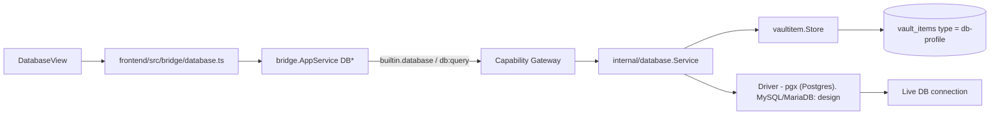
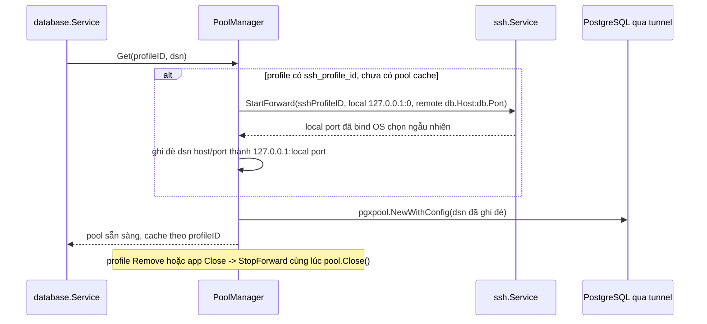
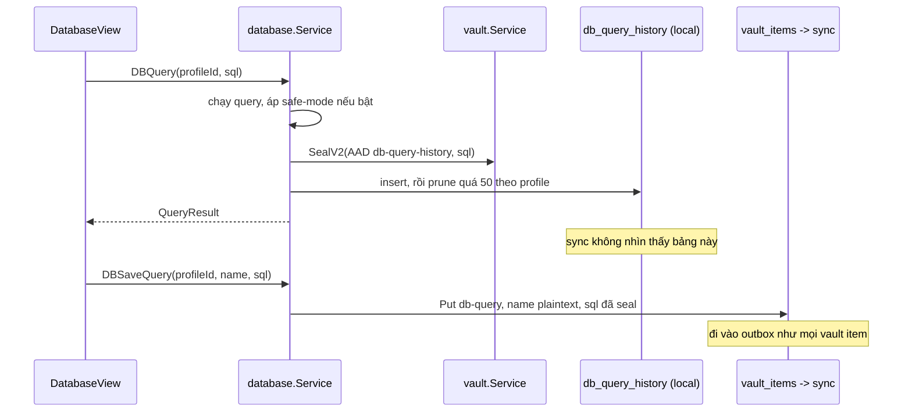
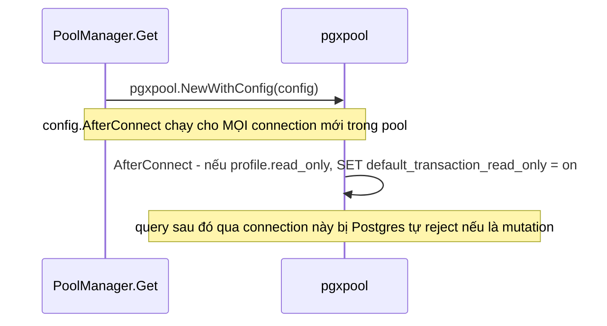
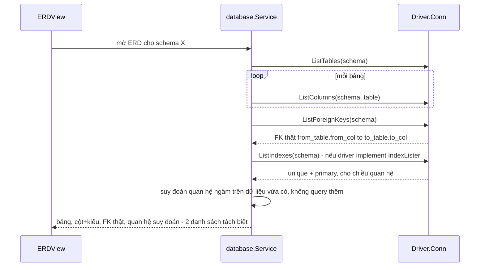
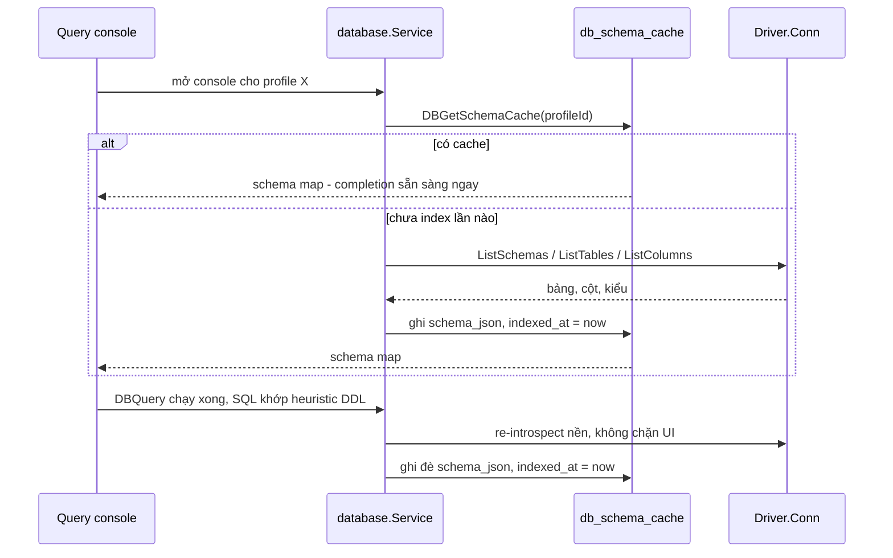

# Database

Trang này mô tả built-in module **Database** (`internal/database`, ActivityBar
`Database`). Trước đây chỉ được nhắc gián tiếp trong `vault.mdx`/`connections.mdx`
như "module sibling" — trang này gom lại thành nguồn sự thật riêng, đúng pattern
đã dùng cho SSH/Notes. Secrets nằm trong vaultitem substrate; vault lifecycle
(Master Password/DEK) xem [Vault](/dev-kit/vault).



## Vaultitem contract (hiện tại — chỉ Postgres)

| Field | Value |
|---|---|
| Record `type` | `db-profile` |
| Payload `key_id` | `db-password` |
| Metadata (plaintext) | `Host`, `Port`, `Database`, `Username`, `SSLMode`, **`env`** |
| Payload (encrypted) | `Password` |

- **`env` (Implemented):** tên tag trong [Environments](/dev-kit/environments).
  `DBCreateProfile` reject nếu thiếu hoặc tag không tồn tại. UI create form có
  dropdown env (`EnvListTags`).
- Driver hiện tại là `pgx` (`internal/database/pool.go`) — chỉ PostgreSQL.
  Không có field `engine` trong metadata vì chưa cần — thêm khi mở rộng
  driver (xem Design bên dưới).

### Thử kết nối trước khi lưu

`DBTestConnection` nhận `profileID`, nên nó chỉ thử được profile **đã tồn tại**.
Màn New connection thì chưa có profile — nút "Test connection" ở đó không có hợp
đồng nào chống lưng, và bắt người dùng lưu một profile có thể sai rồi mới biết
là đổi thứ tự sai.

`DBTestNewConnection` nhận nguyên `CreateProfileInput`:

- **Không ghi gì cả** — validate `env` và `sslmode` y hệt `DBCreateProfile`, dial,
  ping, đóng. Không tạo vault item, không đụng `PoolManager` (không có
  `profileID` để cache theo, và một connection thử nghiệm không nên sống tiếp).
- **Không expose qua MCP** — nhận password trực tiếp qua tham số, cùng lý do đã
  loại `DBCreateProfile`/`DBDeleteProfile` khỏi tool surface.
- **Password không vào audit.** Metadata chỉ ghi engine và host.

`CreateProfileInput` đồng thời nhận thêm `ssh_profile_id`: dialog tạo mới có ô
chọn tunnel, và nếu phải tạo rồi mới `DBUpdateProfileOptions` thì có một khoảng
profile tồn tại với đường kết nối sai — đúng thứ `ErrSSHProfileMissing` sinh ra
để tránh.

## TLS default và giới hạn runtime (hiện tại — Postgres)

- Remote profile mặc định `sslmode=verify-full`; chỉ cho phép `sslmode=disable`
  trên loopback dev host, remote + insecure TLS bị reject
  (`ErrInsecureTLSForRemoteHost`) — [ADR-007](/dev-kit/architecture-decisions#adr-007-verified-tls-for-remote-db-and-exact-ssh-host-key-pinning).
- TLS trust dùng **system CA store của `pgx`** — không có custom CA pinning
  riêng (giống SSH, cũng chưa implement).
- Query timeout **30s**; kết quả cap `DefaultMaxRows = 200` — 2 giới hạn này
  do DevKit tự enforce ở tầng service, không phụ thuộc driver.
- Vault phải **unlocked** trước khi tạo profile hoặc query, vì password field
  encrypt/decrypt qua vault DEK. Chi tiết vận hành: [Operations § Database connection prerequisites](/dev-kit/operations#database-connection-prerequisites).

## Bridge & capability

| Method | Capability | Scope | Ghi chú |
|---|---|---|---|
| `DBListProfiles` | `db:query` | `profile:list` | |
| `DBCreateProfile` | `db:query` | `profile:new` | |
| `DBDeleteProfile` | `db:query` | `profile:<id>` | |
| `DBTestConnection` | `db:query` | `profile:<id>` | profile đã lưu |
| `DBTestNewConnection` | `db:query` | `profile:new` | thử **trước khi lưu** — nhận nguyên input, không có id |
| `DBQuery` | `db:query` | `profile:<id>` | |
| `DBSetActiveProfile` (design) | `db:query` | `profile:<id>` | |
| `DBActiveProfile` (design) | `db:query` | `profile:active` | |
| `DBUpdateProfileOptions` | `db:query` | `profile:<id>` | metadata-only, đổi `env`/`ssh_profile_id`/`read_only` không cần tạo lại profile |
| `DBListQueryHistory` | `db:query` | `profile:<id>` | 50 query gần nhất, tự động log |
| `DBSaveQuery` | `db:query` | `profile:<id>` | user đặt tên, không bị prune |
| `DBListSavedQueries` | `db:query` | `profile:<id>` | |
| `DBDeleteSavedQuery` | `db:query` | `query:<id>` | |
| `DBListForeignKeys` | `db:query` | `profile:<id>` | FK khai báo thật từ catalog, không kèm quan hệ suy đoán |
| `DBListIndexes` | `db:query` | `profile:<id>` | index của cả schema — phân biệt 1-1 với 1-N, và tìm bảng nối |
| `DBSaveExportFile` | `db:query` | `profile:<id>` | ghi file export ở Go với quyền `0o600`; webview không có API ghi file |
| `DBIndexSchema` | `db:query` | `profile:<id>` | full introspect + ghi cache, cho console autocomplete + ERD |
| `DBGetSchemaCache` | `db:query` | `profile:<id>` | đọc cache đã index, không đụng DB thật |
| `DBListSchemas` | `db:query` | `profile:<id>` | catalog qua driver, không phải SQL cứng |
| `DBListTables` | `db:query` | `profile:<id>` | |
| `DBListColumns` | `db:query` | `profile:<id>` | |
| `DBListActivity` (design) | `db:query` | `profile:<id>` | snapshot session đang chạy, không phải time-series |
| `DBCancelQuery` (design) | `db:query` | `session:<pid>` | huỷ statement của 1 pid — human-only |
| `DBTerminateSession` (design) | `db:query` | `session:<pid>` | đóng connection của 1 pid — human-only |
| `DBExplain` (design) | `db:query` | `profile:<id>` | lấy kế hoạch, **không** chạy câu lệnh |
| `DBExplainAnalyze` (design) | `db:query` | `profile:<id>` | **chạy thật** trong transaction rồi rollback — theo policy env tag |

Subject luôn `builtin.database`. Packages: `internal/database/{database,pool}.go`,
`internal/bridge/database.go`, `frontend/src/modules/database/DatabaseView.tsx`,
`frontend/src/bridge/database.ts`.

`DBSetActiveProfile`/`DBActiveProfile` là 2 method mới cho phần "active profile
cho agent" — xem [MCP tool surface](#mcp-tool-surface-design) bên dưới. UI hiện
tại (`DBQuery` nhận `profileId` tường minh mỗi lần gọi, nhiều tab/profile dùng
song song được) **không đổi gì** — 2 method này chỉ phục vụ agent qua MCP.

## Design: multi-engine driver abstraction

import { Callout } from 'fumadocs-ui/components/callout';

<Callout type="info" title="Implemented">
`Driver`/`Conn` đã có runtime: `internal/database/driver.go` (interface),
`driver_postgres.go` (pgx bọc lại), `driver_mysql.go` (MySQL + MariaDB qua
`database/sql`). Service không còn rẽ nhánh theo engine.
</Callout>

Bản trước của trang này chỉ nói "thêm 1 driver MySQL, generalize pool sau" —
không đủ, vì bỏ qua ít nhất 4 điểm khác biệt thật giữa Postgres và
MySQL-family mà nếu không thiết kế trước sẽ vỡ khi implement. Từng điểm dưới
đây có quyết định rõ ràng, không để "tính sau".

### 1. `Driver` interface — chốt method shape trước khi viết driver thứ 2

`Driver` chỉ có duy nhất `Dial(ctx, ConnConfig) → Conn`. `Conn` chốt **7
method** — 6 method dưới đây cộng `ListForeignKeys`, xem
[mục ERD](#listforeignkeys--method-riêng-tách-khỏi-listcolumns) cho lý do nó
tách khỏi `ListColumns`. Phần việc **không phải engine nào cũng làm được** nằm
ở interface tuỳ chọn riêng, không nhét vào đây:

| Method | Việc |
|---|---|
| `Ping` | Kiểm tra connection còn sống |
| `Query` | Chạy SQL kèm args, trả `Rows` |
| `ListSchemas` | Danh sách schema |
| `ListTables` | Bảng trong 1 schema, kèm `TableInfo` |
| `ListColumns` | Cột của 1 bảng, kèm `ColumnInfo` |
| `Close` | Đóng connection |

`ConnConfig` mang `Engine` (`postgres` | `mysql` | `mariadb`), `Host`, `Port`,
`Database`, `Username`, `Password` (lấy từ vault, **không log**), `SSLMode`, và
`Options` — map string escape hatch cho tham số engine-specific (xem mục 6).

`pgx` hiện tại phải được bọc lại đúng interface này — không phải viết thêm 1
interface song song rồi giữ code path `pgx` cũ chạy tắt.

**`Query` trả `Rows` với giá trị đã stringify sẵn trong driver.** Đây là điều
kiện để một `QueryResult` duy nhất phục vụ mọi engine — và cũng chính là lý do
[export JSON](#export-kết-quả-query) ra toàn string: kiểu gốc mất ở đây, trước
khi tới bước export. Cắt theo `DefaultMaxRows` nằm ở service chứ không ở driver,
nên giới hạn giống nhau bất kể engine.

### 2. Schema browse phải thành method riêng, không phải SQL cứng Postgres

Hiện tại schema browse (list schema/table/column trên UI) chạy bằng SQL
catalog cứng (kiểu `pg_catalog`/Postgres-specific) qua `DBQuery` — cách này
**không portable**: MySQL/MariaDB không có `pg_catalog`. Design mới tách
`ListSchemas`/`ListTables`/`ListColumns` thành method riêng trên `Conn`, mỗi
driver tự implement bằng catalog phù hợp — cả Postgres lẫn MySQL/MariaDB đều
hỗ trợ `information_schema` theo chuẩn ANSI đủ tốt để dùng chung logic ở tầng
gọi, chỉ khác câu SQL cụ thể bên trong từng driver. Cần thêm bridge method
mới (`DBListSchemas`, `DBListTables`) — đây là mở rộng bridge surface thật,
không phải chi tiết nội bộ.

### 3. Placeholder syntax khác nhau — không cố "tự động sửa"

Postgres dùng `$1, $2`; MySQL/MariaDB dùng `?`. `DBQuery` nhận SQL thô từ UI/agent,
DevKit **không** parse SQL để tự chuyển đổi placeholder giữa các engine (rủi ro
sai lệch cao, dễ vỡ với SQL phức tạp). Quyết định: caller (UI hoặc agent qua
MCP) phải tự viết SQL đúng cú pháp placeholder của `engine` đã chọn trong
profile — đây là **known limitation ghi rõ**, không phải lỗ hổng ngầm. UI nên
hiển thị `engine` của profile đang chọn ngay cạnh ô nhập query để giảm nhầm.

### 4. Pool: `pgx` có pool riêng, MySQL driver đi qua `database/sql`

Đây là bất đối xứng thật, không phải chi tiết vặt: `pgx` dùng pool native
(`pgxpool`) không qua `database/sql`; driver MySQL phổ biến
(`go-sql-driver/mysql`) là 1 `database/sql` driver, pool đến từ
`database/sql.DB`. `Driver.Dial` phải trả về `Conn` đã che giấu khác biệt này
— caller (`internal/database.Service`) chỉ thấy `Conn`, không biết bên dưới
là `pgxpool.Pool` hay `sql.DB`. Pool config (`MaxOpenConns`, idle timeout) vẫn
là 1 bộ tham số chung ở tầng `ConnConfig`/service, map xuống implementation
tương ứng của từng driver.

### 5. TLS/CA trust và auth handshake — không giả định "cứ thế mà chạy"

- Postgres/`pgx` dùng system CA store sẵn có. MySQL driver **không** tự làm
  vậy — phải đăng ký `tls=custom` kèm CA pool tương đương thủ công
  (`mysql.RegisterTLSConfig`), nếu không remote MySQL với `verify-full`-style
  sẽ không hoạt động đúng như kỳ vọng của ADR-007.
- **Qua tunnel, hai engine lệch nhau rõ nhất ở đây.** `pgx` cho phép giữ
  `sslmode=verify-full` rồi pin `TLSConfig.ServerName` về host thật. MySQL không
  có chế độ "system CA + override hostname", nên phải đăng ký hẳn một TLS config
  mang `ServerName`, và **huỷ đăng ký khi đóng connection** — tên config là
  global, để lại là rò rỉ dần.
- MySQL 8 mặc định dùng auth plugin `caching_sha2_password` — cần xác nhận
  driver + phiên bản server tương thích khi implement, không giả định driver
  nào cũng handshake được; đây là rủi ro tương thích thật cần test với MySQL 8
  thật trước khi coi driver "xong".

### 6. Metadata: field chung + `driver_options` cho phần không generalize được

Thêm `engine` (`postgres` | `mysql` | `mariadb`) vào metadata — record cũ
default `engine = "postgres"` (an toàn theo
["Compatibility rules"](/dev-kit/technical-contracts#compatibility-rules),
DevKit greenfield nên không cần migration job riêng). Ngoài field chung
(`Host`/`Port`/`Database`/`Username`/`SSLMode`), thêm `driver_options` dạng
map tự do cho phần đặc thù từng engine (ví dụ MySQL cần path CA cert riêng)
— cùng kỹ thuật "raw passthrough cho phần không chuẩn hóa được" đã dùng cho
`_meta` ở [Agent Hub](/dev-kit/agent-hub) (mục "Vì sao cần lớp flex này"):
field chuẩn hóa nằm ở struct chính, phần chưa/không chuẩn hóa được nằm ở bag
riêng, không ép hết vào 1 shape cứng.

### 7. MariaDB: cùng driver với MySQL, nhưng không giả định 100% giống hệt

Giữ nguyên quyết định dùng chung driver `mysql` cho cả MariaDB (cùng wire
protocol) — **nhưng** không coi đó là tương đương tuyệt đối: MariaDB khác
MySQL ở auth plugin mặc định, xử lý kiểu `JSON`, và một số system variable.
V1 chỉ cam kết đúng phạm vi đã dùng (connect, query, schema browse cơ bản) đã
verify trên MariaDB thật — không quảng cáo "tương thích hoàn toàn" khi chưa
test.

### Acceptance criteria bổ sung (multi-engine)

- Profile `engine=mysql` connect thành công tới MySQL 8 thật, `ListTables`
  trả đúng danh sách.
- Profile `engine=mariadb` connect thành công tới MariaDB 10.x thật bằng cùng
  driver `mysql`, không cần code path riêng.
- Query dùng sai placeholder syntax cho engine đã chọn (vd `$1` gửi vào MySQL
  profile) → lỗi rõ ràng từ driver, không phải silent wrong result.
- Đổi `engine` của 1 profile đã tồn tại (nếu UI cho phép) → `port`/`SSLMode`
  default gợi ý đổi theo engine mới, không giữ nguyên default cũ của Postgres.

### Known ceiling

- Không tự động chuyển đổi placeholder syntax giữa engine (mục 3) — chấp
  nhận đây là giới hạn v1, không phải bug.
- "Không phân biệt SELECT vs mutating" vẫn là **mặc định** — safe-mode (xem
  [Safe-mode / read-only profile](#safe-mode--read-only-profile)) là opt-in,
  không tự bật cho profile nào.
- SSH tunnel (xem [SSH tunnel cho DB profile](#ssh-tunnel-cho-db-profile))
  chỉ hỗ trợ 1 chặng — không hỗ trợ jump-host nhiều lớp (SSH → SSH → DB).
- Suy đoán quan hệ ngầm cho ERD chỉ khớp khoá chính 1 cột, bỏ qua composite
  primary key — xem [Sơ đồ quan hệ (ERD)](#sơ-đồ-quan-hệ-erd).
- Query history/saved query chỉ đọc/ghi được khi vault unlocked (SQL text
  encrypted thật trong payload, khác `note_links` của Notes vốn plaintext).
- Schema cache cho console/ERD chỉ tự refresh khi DDL chạy **qua chính
  console DevKit** — đổi schema từ nơi khác (tool khác, teammate khác) không
  tự cập nhật, cần refresh thủ công.
- `SessionInspector` không suy đoán quan hệ khoá trên MySQL/MariaDB —
  `BlockedBy` chỉ có với Postgres (`pg_blocking_pids`), engine khác để trống.
- Live activity là snapshot theo yêu cầu, không có lịch sử: mở lại là số mới,
  không so sánh được với lần trước. Time-series thuộc module Monitor.
- **`engine` không sửa được sau khi tạo profile.** Đổi engine kéo theo port,
  `sslmode` và cú pháp placeholder mặc định khác hẳn; v1 tạo profile mới thay vì
  cho sửa tại chỗ. `DBUpdateProfileOptions` chỉ đụng `env`/`read_only`/`ssh_profile_id`.
- Profile tạo trước khi có multi-engine không có field `engine`; rỗng được đọc
  là `postgres`, nên không cần migration.
- SSH tunnel v1 không dùng được với SSH profile có passphrase trên private key.
- Query history không sync và không có cách bật — nó nằm ngoài `vault_items`.
- `EXPLAIN ANALYZE` rollback chỉ cuốn ngược phần trong MVCC — sequence,
  `pg_notify` và side effect ra ngoài DB không lùi lại được.
- Query plan v1 chỉ Postgres — MySQL/MariaDB implement `SessionInspector` nhưng
  không implement `QueryPlanner`.
- MySQL/MariaDB không trả `BlockedBy` trong live activity. SQLite `EXPLAIN QUERY PLAN` không có cost nên
  viewer sẽ suy biến thành cây không số liệu khi thêm engine đó.

## SSH tunnel cho DB profile

`internal/ssh` đã có sẵn port-forwarding thật — `StartForward`/`StopForward`/
`ListForwards`, cả local lẫn remote forward, dial qua `*gossh.Client` đã xác
thực (xem [SSH](/dev-kit/ssh)). DB profile nối vào cơ chế này, không viết SSH
plumbing mới.



- **Field mới trên `db-profile`:** `ssh_profile_id` (optional, trỏ
  `ssh-profile` đã có). `Host`/`Port` của DB profile là địa chỉ **nhìn từ
  phía SSH server** khi có tunnel — thường `localhost`/IP nội bộ chỉ SSH
  server thấy được, không phải địa chỉ client gọi trực tiếp.
- **Lifecycle ăn theo `PoolManager`** — pool đã cache theo `profileID`, sống
  suốt vòng đời app (`pool.go:15-16`, comment gốc: "owns... pools for the
  lifetime of the application"). Forward mở lần đầu `Get()` cho profile đó
  (lazy, giống pool), đóng khi `Remove(profileID)`/`Close()` — dùng chung
  đúng lifecycle pool đã có, không thêm cơ chế riêng.
- **TLS vẫn verify theo host thật, không theo loopback.** DSN sau khi ghi đè trỏ
  tới `127.0.0.1`, nhưng certificate của server được cấp cho host thật — để
  nguyên thì `verify-full` fail vì hostname không khớp, và lối thoát duy nhất sẽ
  là hạ TLS, đúng thứ [ADR-007](/dev-kit/architecture-decisions#adr-007-verified-tls-for-remote-db-and-exact-ssh-host-key-pinning)
  cấm. Sau `pgxpool.ParseConfig`, pin `ConnConfig.TLSConfig.ServerName` về host
  gốc của profile. Ghi đè chỉ đụng host/port; credential, database và `sslmode`
  giữ nguyên.
- **Chỉ local forward** (`-L`) — DevKit dial vào port local, SSH server
  forward tới DB thật. Remote forward không liên quan use case này.
- **Port local: động (OS chọn, `0`)** — tránh xung đột giữa nhiều profile
  cùng dùng tunnel một lúc.
- **Auth tái dùng nguyên vẹn** — `dial()` của `ssh.Service` (đã xác thực, đã
  trust host-key) chạy trước; DB profile không lưu thêm secret nào ngoài
  `ssh_profile_id`.
- **v1 chỉ hỗ trợ SSH profile không có passphrase.** `StartForward` nhận
  `passphrase` từ caller, mà tunnel ở đây mở **lazy trong `PoolManager.Get()`**
  — thời điểm đó không có ai để hỏi. Ba lối ra đã cân nhắc: giới hạn ở key không
  passphrase, hỏi user lần đầu mỗi phiên rồi cache trong bộ nhớ như DEK, hoặc
  cất passphrase vào vault. v1 chọn cách thứ nhất vì nó không đóng hai cách kia:
  profile có passphrase bị từ chối bằng lỗi rõ ràng, không phải treo im lặng.
- Không đổi `Driver`/`ConnConfig` (mục multi-engine trên) — tunnel hoạt động
  ở tầng network, trong suốt với driver DB, áp dụng như nhau cho
  Postgres/MySQL/MariaDB.

<Callout type="info" title="Đã chốt: fail rõ ràng">
SSH profile bị xoá trong khi DB profile còn `ssh_profile_id` trỏ tới nó →
`Get()` trả `ErrSSHProfileMissing`, **không** fallback sang kết nối thẳng.

Lý do quyết định như vậy, không phải chỉ vì "sạch hơn": khi có tunnel thì
`Host`/`Port` trên DB profile là địa chỉ **nhìn từ phía SSH server** — thường
là `localhost` hoặc IP nội bộ. Kết nối thẳng tới cặp đó từ máy client không
phải là "cùng đích đến nhưng chậm hơn"; nó là **một đích khác hẳn**, có thể là
một máy khác trong mạng của client. Fallback im lặng vì vậy không chỉ timeout,
nó gửi thông tin kết nối ra sai mạng.

UI: Figma `15 Database` → `Database / 19 Tunnel unavailable`.
</Callout>

### Env, tunnel và safe-mode sửa ở cùng một chỗ

`DBUpdateProfileOptions` đổi `env`, `ssh_profile_id` và `read_only` mà không
phải tạo lại profile, nên cả ba thuộc về **một dialog** chứ không phải ba màn
rời — đều là "connection này hoạt động và được đối xử thế nào", không phải danh
tính của nó. UI: Figma `Database / 17 Connection options`.

**`env` không cùng loại với hai field kia.** `ssh_profile_id` và `read_only` là
tuỳ chọn kết nối; `env` là **chính sách** — nó quyết định `db.query` qua MCP có
phải hỏi xác nhận hay không, và `env=prod` là locked. Vì vậy:

- **Validate y hệt `DBCreateProfile`** — tag phải tồn tại, thiếu thì reject.
  Không được có đường update nào tạo ra trạng thái mà create đã cấm.
- **Validate trên giá trị *mới*, không trên giá trị hiện tại.** Đây là điều
  kiện để sửa được profile đang ở `ErrEnvTagUnresolved`: tag cũ đã bị xoá,
  nhưng vẫn phải gán được tag mới hợp lệ. Nếu validate trạng thái hiện tại
  trước thì profile bị kẹt vĩnh viễn — xem `Database / 25 Env unresolved`.
- **Vẫn human-only, không expose qua MCP** — hạ `env` từ `prod` xuống `local`
  chính là gỡ bỏ yêu cầu xác nhận, nên nó phải là hành động của con người, cùng
  nguyên tắc đã áp cho `DBSetActiveProfile`.
- **Ghi audit** — đây là thay đổi policy, không phải đổi một tuỳ chọn hiển thị.

**Ba field, ba cái giá khác nhau ở runtime** — đừng đối xử như nhau:

| Field | Phải làm gì với pool |
|---|---|
| `env` | Không gì cả — plaintext metadata, không nằm trong DSN |
| `read_only` | **Phải tạo lại pool.** `AfterConnect` chỉ chạy cho connection mới; connection đang nằm trong pool vẫn giữ setting cũ, nên bật safe-mode mà không drop pool sẽ để lọt mutation qua connection cũ |
| `ssh_profile_id` | `StopForward` + đóng pool, lần `Get()` sau mở forward mới và bind port mới |

Dialog hiển thị cặp địa chỉ đã ghi đè (`127.0.0.1:<port động> → host:port thật`)
vì đó là câu trả lời cho câu hỏi người dùng chắc chắn sẽ hỏi khi thấy DevKit nối
tới loopback trong khi profile ghi một host nội bộ.

## Query history và Saved query

2 khái niệm tách biệt, và — khác bản trước của trang này — **2 cơ chế lưu trữ
khác nhau**, vì chúng có yêu cầu đồng bộ ngược nhau:

| | History | Saved query |
|---|---|---|
| Tạo | Tự động, mỗi lần `DBQuery` chạy thành công | User chủ động gọi `DBSaveQuery` |
| Giữ | 50 gần nhất / profile, cũ nhất bị prune | Không giới hạn, không tự xoá |
| Tên | Không có (chỉ SQL + timestamp) | User đặt tên |
| **Sync** | **Không** — dấu vết thao tác của riêng máy này | **Có** — thứ user cố ý muốn mang theo |
| **Nằm ở** | Bảng riêng `db_query_history` | `vault_items`, type `db-query` |

### Vì sao không thể nhét cả hai vào `vault_items`

`vault_items` **sync-bound theo cấu trúc**, không phải theo chính sách:
`SQLMutationRepository.Put` gọi `validateMutationRecord`, hàm này reject mọi
record type không nằm trong `IsSupportedItemType`
(`internal/vaultitem/sqlmutationrepository.go:67,198`), và cùng transaction đó
ghi một outbox operation. Không có khái niệm "record local-only" trong bảng đó.

Nên một type `db-query` duy nhất phân biệt bằng field `kind` sẽ khiến history và
saved **cùng sync hoặc cùng không** — không có cửa giữa. Tách bảng là cách duy
nhất, và nó khiến "history không rời khỏi máy" thành **tính chất cấu trúc** chứ
không phải một cái filter mà ai đó gỡ nhầm là rò rỉ.



### Saved query — record shape

| Field | At rest | Notes |
|---|---|---|
| `type` | `"db-query"` | Type thứ 6, xem Blast radius dưới |
| `metadata` | `{"profile_id":"<24hex>","name":"..."}` plaintext | **Không chứa SQL**; `name` an toàn plaintext như title note |
| `payload` | Envelope V2 của SQL text | AAD `(db-query, <id>, db-query-body)` — SQL ở payload vì có thể chứa literal nhạy cảm |

Không còn field `kind`: bảng nào quyết định loại nào.

<Callout type="warn" title="Blast radius: internal/vaultitem/schema.go">
Thêm `type = "db-query"` đụng 2 switch hardcode dùng chung mọi record type
(`IsSupportedItemType`, `ValidateRecordSchema`). File lõi, và nó cũng là cổng
gác của sync — review kỹ hơn 1 thay đổi cục bộ trong `internal/database`.
</Callout>

### History — bảng cục bộ

- **Bảng riêng, migration mới.** Cột tối thiểu: `id`, `profile_id`,
  `sql_envelope` (blob), `created_at`. Không có cột nào chứa SQL plaintext.
- **Mã hoá bằng `vault.SealV2` / `OpenWithAD` gọi trực tiếp**, không qua
  `vaultitem`. AAD riêng `(db-query-history, <row id>, db-query-body)` để một
  envelope history không thể bị dán sang chỗ khác.
- **Prune bằng SQL thuần** theo `profile_id` + `created_at`, giữ 50. Không cần
  `ListByTypeAndMetaField` — cơ chế đó vẫn còn nợ cho
  [Notes version history](/dev-kit/notes#version-history), nhưng history của DB
  không phải chỗ đòi nó.
- **Xoá profile xoá luôn history của nó.** Nằm ngoài `vault_items` nên không ăn
  theo cascade của vault item; `DeleteProfile` phải tự dọn.

### Chung cho cả hai

- **Vault phải unlocked mới đọc/ghi được** — SQL text encrypted thật, khác
  `note_links` (plaintext, đọc được bất kể vault state). Vault đang lock thì
  `DBListQueryHistory`/`DBListSavedQueries` trả **lỗi, không phải danh sách
  rỗng** — rỗng khiến người dùng hiểu nhầm là "chưa từng query", trong khi thực
  ra chỉ là chưa unlock.
- **Ghi history không được làm hỏng query.** Query đã chạy xong và người dùng có
  kết quả; nếu seal hoặc insert lỗi thì log rồi thôi, không biến một query thành
  công thành lỗi trả về UI.
- Xoá 1 saved query (`DBDeleteSavedQuery`): hard delete luôn — không có khái
  niệm trash cho query (khác Notes).

## Safe-mode / read-only profile

Flag `read_only` mới trên `db-profile` metadata, **mặc định tắt**, opt-in thủ
công qua `DBUpdateProfileOptions`. Bật thì DB tự chặn mutation ở tầng
session/connection — DevKit không tự parse SQL để đoán statement type, giữ
đúng nguyên tắc đã chốt ở mục 3 (không tự đoán/chuyển đổi cú pháp SQL).



- **Cơ chế: `pgxpool.Config.AfterConnect`** — set session-level read-only
  ngay khi 1 connection mới được pool tạo ra, áp dụng cho **mọi** connection
  trong pool (không phải set 1 lần cho cả pool — pool có nhiều connection
  luân phiên). DB tự reject `INSERT`/`UPDATE`/`DELETE`/DDL ở tầng engine thật
  — không phải prefix-check hay parse SQL phía DevKit, nên không bị bypass
  bởi multi-statement hay cú pháp lạ.
- **MySQL hoá ra không cần `driver.Connector` tuỳ chỉnh.** Bản trước của trang
  này dự đoán phải viết một Connector riêng chạy `SET SESSION TRANSACTION READ
  ONLY` sau dial. Không cần: `go-sql-driver/mysql` diễn giải mọi tham số DSN lạ
  thành **session system variable**, nên `?transaction_read_only=1` cho đúng
  đảm bảo per-connection mà `pgx` có được từ `AfterConnect`. Bất đối xứng ở mục
  4 (pool) vẫn đúng; riêng safe-mode thì không.
- **Áp dụng đều cho UI lẫn MCP agent** — vì set ở tầng connection/pool (dùng
  chung `PoolManager`), không phải theo caller. `db.query` qua MCP trên 1
  profile `read_only=true` tự động bị DB chặn mutation, không cần logic
  riêng ở tầng Gateway/MCP.
- **Không thay thế** "không phân biệt SELECT vs mutating" ở Known ceiling —
  đây là opt-in, mặc định mọi profile vẫn như cũ trừ khi user tự bật.
- **Lỗi đến từ DB, không phải DevKit** — mutation bị chặn trả về
  `SQLSTATE 25006 · cannot execute UPDATE in a read-only transaction`. UI phải
  nói rõ ai từ chối, vì người dùng vừa gõ câu lệnh đó và cần biết đây là chính
  sách của profile chứ không phải lỗi cú pháp. UI: Figma
  `Database / 18 Read-only rejected`.
- **Không chặn được cancel/terminate** — `SELECT pg_cancel_backend(4412)` là
  một `SELECT`, nên `default_transaction_read_only` cho nó đi qua. Profile bật
  safe-mode **vẫn giết được session của người khác**. Hai method đó phải có
  gate riêng, xem "Session đang chạy" bên dưới.

## Session đang chạy (live activity)

Trả lời đúng một câu hỏi: *"câu nào đang treo, ai đang khoá ai"*. Đây **không
phải** monitoring theo trục thời gian — ranh giới với module Monitor tương lai
ghi ở [Non-goals](#non-goals-mvp).

<Callout type="info" title="Core Implemented">
Go core đã có: `internal/database/{inspector,inspector_postgres,inspector_mysql}.go`,
bridge `DBListActivity`/`DBCancelQuery`/`DBTerminateSession`. UI vẫn là thiết kế
Figma `15 Database` → `Database / 10 Active queries`.
</Callout>

### Không phải method thứ 7 của `Conn`

`Conn` là surface bắt buộc: mọi driver phải làm được cả 7 method. Activity thì
không — nó nằm ở interface **tuỳ chọn**, driver implement hoặc không:

| | |
|---|---|
| Interface | `SessionInspector` — `ListActivity`, `CancelQuery`, `TerminateSession` |
| Postgres | `pg_stat_activity` + `pg_blocking_pids()`; `pg_cancel_backend` / `pg_terminate_backend` |
| MySQL/MariaDB | `information_schema.PROCESSLIST`; `KILL QUERY <id>` / `KILL <id>` |
| SQLite | **không implement** — không có server thì không có session |

Vì sao tách interface chứ không thêm vào `Conn`: SQLite không có gì để trả, và
`ListActivity` không có tương đương ANSI kiểu `information_schema` — SQL giữa
Postgres và MySQL lệch nhau nhiều hơn hẳn so với schema browse ở mục 2. Service
hỏi `inspector, ok := conn.(SessionInspector)`; `ok == false` thì UI hiện empty
state "engine này không báo cáo session", không phải panel rỗng không giải thích.

### `read_only` KHÔNG chặn cancel/terminate

Bẫy quan trọng nhất của mục này, đã ghi ở
[Safe-mode](#safe-mode--read-only-profile): `pg_cancel_backend` là một `SELECT`
nên safe-mode cho qua. Hai method destructive vì vậy có gate riêng, không dựa
vào `read_only`:

- **Human-only** — không expose qua MCP, cùng nguyên tắc đã áp cho
  `DBSetActiveProfile` và unlock vault.
- **Theo policy env tag** — `env=prod` luôn hỏi xác nhận (locked), giống
  `db.query`. Hộp xác nhận nêu rõ pid, user và câu lệnh sắp bị huỷ.
- **Hai method tách biệt, không gộp thành một "kill"** — huỷ statement khác
  đóng connection. Gộp lại là lấy mất của người dùng lựa chọn nhẹ tay hơn.

### Snapshot, không poll

Refresh thủ công, đúng tiền lệ `db_schema_cache` ở mục "Schema index". Không có
vòng lặp poll, vì cả ba invariant hiện có đều chống lại: connection theo mô
hình on-demand và vault có thể khoá giữa chừng; `env=prod` là always-asks nên
poller sẽ spam popup hoặc cần một standing grant — thứ Capability Gateway sinh
ra để tránh; và một snapshot lặp lại không có nơi lưu vẫn không trả lời được
câu hỏi "có tệ hơn hôm qua không", vốn là việc của module Monitor.

### Query text của session khác là dữ liệu nhạy cảm

`pg_stat_activity.query` và `PROCESSLIST.INFO` trả về SQL **của session khác**,
kèm nguyên literal — có thể chứa email, token, số tiền. Đây là lý do thứ hai,
độc lập với tính destructive, khiến cả ba method human-only. Cũng **không** ghi
vào query history: history là những gì *bạn* đã chạy.

### Trường trả về

| Field | Postgres | MySQL/MariaDB |
|---|---|---|
| `PID` | `pid` | `ID` |
| `State` | `state` | `COMMAND` + `STATE` |
| `Duration` | `now() - xact_start` | `TIME` |
| `User` / `Client` | `usename` / `client_addr` | `USER` / `HOST` |
| `WaitEvent` | `wait_event_type` + `wait_event` | `STATE` |
| `BlockedBy` | `pg_blocking_pids(pid)` | — |
| `Query` | `query` | `INFO` |
| `Application` | `application_name` | — |

`BlockedBy` chỉ có ở Postgres; driver MySQL trả về rỗng. `BlockedBy` là lý do chính người ta mở màn này. pgAdmin/DBeaver hiển thị danh
sách phẳng; UI DevKit vẽ quan hệ khoá thành đường nối giữa hàng khoá và các
hàng bị khoá, đúng nguyên tắc "lines are data" của design system. MySQL không
có tương đương `pg_blocking_pids`; v1 để trống thay vì suy đoán từ
`INNODB_LOCK_WAITS` — khác nhau theo phiên bản, dễ sai.

Session của chính DevKit được đánh dấu và **không** có nút cancel, để người
dùng không tự giết phiên đang thao tác.

## Export kết quả query

Export đúng dữ liệu **đang có trong tay** — `QueryResult{Columns []string,
Rows [][]string}` (`database.go:60-65`) đã tách cột/dòng sẵn, không query lại DB.

- **Theo đúng `DefaultMaxRows` (200)** — export = dump `QueryResult` hiện tại
  ra file, cùng giới hạn UI đang hiển thị. Muốn nhiều hơn 200 dòng thì chỉnh
  query (`LIMIT`/`OFFSET`), không có đường export "full" riêng.
- **CSV: trực tiếp** — mọi cell đã stringify sẵn (`stringify()`,
  `database.go:290`), chỉ cần escape dấu phẩy/xuống dòng theo chuẩn CSV.
- **JSON: mọi field ra string** — `Rows` là `[][]string`, kiểu gốc
  (số/bool/timestamp) đã mất trước khi tới bước export. `{"id": "42"}` chứ
  không phải `{"id": 42}` — giới hạn thật của `QueryResult` hiện tại, không
  phải quyết định riêng của export. Muốn JSON giữ kiểu gốc phải đổi
  `QueryResult` sang giữ giá trị typed thay vì string hoá sớm — ảnh hưởng cả
  UI table đang dùng shape này, ngoài phạm vi feature export.
- **Ghi file an toàn qua Go bridge** — chuỗi hoá dữ liệu (CSV/JSON) chạy ở
  frontend từ `QueryResult` có sẵn, sau đó chuyển nội dung xuống Go qua bridge
  method `DBSaveExportFile(suggestedName, content string)` (`builtin.database` /
  `db:query`). Go mở dialog Save As của Wails (`application.Dialog.SaveFile`)
  và ghi file trực tiếp trên backend, đảm bảo kiểm soát an toàn qua Capability
  Gateway và tránh mở bề mặt ghi file tuỳ ý từ frontend.

## Query plan (EXPLAIN)

<Callout type="info" title="Core Implemented (Postgres)">
Go core đã có: `QueryPlanner` trong `internal/database/inspector.go`, implement
ở `inspector_postgres.go`, bridge `DBExplain`/`DBExplainAnalyze`. MySQL/MariaDB
chưa implement — xem lý do ngay dưới.
</Callout>

### Lại là một interface tuỳ chọn, không phải method thứ 7

Cùng lý do đã áp cho `SessionInspector`, và lần này chênh lệch còn lớn hơn:

| Engine | Lệnh | Hình dạng kết quả |
|---|---|---|
| Postgres | `EXPLAIN (ANALYZE, BUFFERS, FORMAT JSON)` | Cây lồng nhau: cost, rows ước lượng vs thật, thời gian, buffers |
| MySQL 8 | `EXPLAIN FORMAT=JSON`; `EXPLAIN ANALYZE` | Schema khác hẳn; bản ANALYZE chỉ có text dạng cây |
| MariaDB | `ANALYZE FORMAT=JSON` | Khác tiếp |
| SQLite | `EXPLAIN QUERY PLAN` | Ba cột, gần phẳng, **không có cost** |

Interface `QueryPlanner` — `Explain`, `ExplainAnalyze`. Việc phải thêm interface
tuỳ chọn lần thứ hai là bằng chứng pattern đó đúng: `Conn` giữ nguyên 7 method
bắt buộc, còn thứ chỉ một số engine làm được thì không leo lên đó.

**MySQL/MariaDB implement `SessionInspector` nhưng không implement
`QueryPlanner`.** `EXPLAIN ANALYZE` của MySQL trả cây dạng text chứ không phải
JSON mà xương sống chuẩn hoá dựng từ đó; v1 để trống thay vì parse nửa vời — và
đó chính là công dụng của việc interface là tuỳ chọn.

### `EXPLAIN` và `EXPLAIN ANALYZE` là hai hành động khác nhau

`EXPLAIN` chỉ lập kế hoạch. `EXPLAIN ANALYZE` **chạy thật câu lệnh** — trên
`UPDATE`/`DELETE` nghĩa là dữ liệu bị sửa thật. Và DevKit **không parse SQL**
(mục 3 + Known ceiling), nên không thể biết trước câu lệnh có phải mutation hay
không. Không đoán; xử lý bằng cơ chế:

- **ANALYZE luôn chạy trong transaction rồi rollback** — `BEGIN` →
  `EXPLAIN (ANALYZE, …)` → `ROLLBACK`. Mutation bị cuốn ngược, số đo thời gian
  vẫn là số thật.
- **Rollback chỉ bảo vệ những gì nằm trong MVCC.** Sequence đã nhảy thì không
  lùi; `pg_notify` đã bắn thì đã bắn; trigger gọi ra ngoài (dblink, http
  extension) không có gì cuốn lại được. Ghi rõ ở đây để lời hứa an toàn không
  rộng hơn thực tế — cùng loại bẫy với "`read_only` không chặn được terminate".
- **Hai nút riêng trên UI, không phải một toggle.** `Explain` không chạy nên
  không hỏi gì; `Explain analyze` có chạy nên chịu **cùng policy env tag** như
  `db.query` (`env=prod` luôn hỏi xác nhận).
- **Safe-mode có tác dụng thật ở đây** — session `read_only` để chính DB chặn
  mutation ngay trong transaction. Khác với cancel/terminate, chỗ này safe-mode
  bảo vệ được.
- **Chịu chung timeout 30s** vì ANALYZE thực sự chạy query.

### Chuẩn hoá xương sống, giữ nguyên phần còn lại

Chuẩn hoá toàn bộ thì mất thông tin (riêng Postgres đã ~40 loại node, thuộc
tính khác nhau); giữ raw toàn bộ thì UI phải viết riêng cho từng engine. Cắt ở
giữa: **một xương sống nhỏ** (tên thao tác, rows ước lượng, rows thật, thời
gian, node con) đủ để dựng cây và so sánh, còn thuộc tính gốc giữ nguyên trong
bag riêng cho panel chi tiết.

Đây đúng pattern doc đã chọn cho `driver_options` ở mục 6 multi-engine — field
chuẩn hoá ở struct chính, phần không chuẩn hoá được ở bag riêng. Dùng lại, không
phát minh cách thứ hai.

### Plan viewer phải chỉ ra vấn đề, không chỉ vẽ cây

Cái cây không phải giá trị — ai cũng vẽ được. Bốn thứ cần làm nổi:

- **Lệch ước lượng vs thực tế** — nguyên nhân số một của plan tồi. Ước lượng 12
  dòng mà thực tế 1.2 triệu nghĩa là statistics đã cũ. Đánh dấu mọi node lệch
  quá 10 lần.
- **Thời gian dồn ở đâu** — tính theo **self time**, không phải inclusive, nếu
  không node gốc luôn là 100%.
- **Rows removed by filter** — công đã làm rồi vứt đi.
- **Seq Scan trên bảng lớn.**

Hình thức: thời gian vẽ thành **độ rộng thanh** trên mỗi node (dạng flame
graph), không phải cây thuần chữ — khớp principle "lines are data" và dùng lại
ngôn ngữ dòng chảy đã có ở Sync.

### MCP

`db.explain` (`read`) **có** expose: agent tối ưu query cần đọc plan, và lệnh
này không chạy gì. `EXPLAIN ANALYZE` **không** expose qua MCP vì nó thực thi —
cùng nguyên tắc đã áp cho cancel/terminate.

### Ranh giới với module Monitor

`EXPLAIN` nói về **câu query vừa viết**, không có trục thời gian, không cần
retention — thuộc module Database, không phải Monitor.

## Sơ đồ quan hệ (ERD)

Đã dựng cả hai đầu. View ở `frontend/src/modules/database/components/ERDView.tsx`,
vẽ bằng React Flow — cùng thư viện với CodeGraph, không thêm dependency. Bốn
nguồn dữ liệu: `ListTables`/`ListColumns` (đã thiết kế ở mục multi-engine, cho
bảng+cột+kiểu) + `DBListForeignKeys` (FK thật) + `DBListIndexes` (chiều quan
hệ, xem mục dưới) + 1 pass suy đoán quan hệ ngầm không tốn query nào.



### `ListForeignKeys` — method riêng, tách khỏi `ListColumns`

Lý do tách (Phương án A): schema browse (sidebar tree, mở từng bảng khi user
click) và ERD (load toàn schema 1 lần để vẽ) là 2 nhu cầu khác nhau về tần
suất/khối lượng — nhét FK vào `ListColumns` bắt sidebar tree trả FK mỗi lần
mở dù không dùng đến.

`Conn` thêm đúng 1 method thứ 7 — `ListForeignKeys(schema)` — trả danh sách
`ForeignKey`, mỗi cái chỉ 4 field: bảng/cột nguồn và bảng/cột đích.

Mỗi driver tự implement bằng catalog phù hợp — Postgres qua
`information_schema.key_column_usage` + `information_schema.constraint_column_usage`
join `table_constraints WHERE constraint_type = 'FOREIGN KEY'`; MySQL/MariaDB
(khi build) qua `information_schema.KEY_COLUMN_USAGE` lọc
`REFERENCED_TABLE_NAME IS NOT NULL` — cùng chuẩn ANSI `information_schema` đã
chọn cho `ListTables`/`ListColumns` ở mục 2, không cần catalog riêng ngoài
chuẩn.

### Suy đoán quan hệ ngầm (không có FK khai báo thật)

Nhiều schema chỉ liên kết qua tên cột ở tầng code (ORM tự quản), không khai
báo FK constraint thật trong DB — heuristic đặt tên chạy **sau khi** đã có dữ
liệu ERD thật, không tốn thêm query nào:

1. Với mỗi cột **chưa** có trong danh sách FK thật, khớp pattern `<x>_id`.
2. Tìm bảng đích theo thứ tự: `<prefix>_<x>`, `<prefix>_<x>s`, rồi mới `<x>`,
   `<x>s` — trong đó `<prefix>` là tiền tố của **chính bảng nguồn**. Schema
   thật thường đặt tên theo module (`crm_leads`, `his_billing_statements`,
   `ba_user`) và khi đó `crm_leads.customer_id` trỏ tới `crm_customers`, không
   phải `customers`. Bỏ bước này thì heuristic gần như không tìm được gì: trên
   schema thử nghiệm 161 bảng nó nhận ra 2 quan hệ, có tiền tố thì 183.
3. Nếu tìm thấy bảng, bảng đó **không phải chính nó**, và có cột khoá chính
   (`id`) cùng họ kiểu dữ liệu (int/uuid) với cột đang xét → ghi nhận **quan
   hệ suy đoán**. Điều kiện "không phải chính nó" sinh ra từ chính bước tiền
   tố: `crm_customers.customer_id` khớp đúng tên bảng chứa nó.
4. Trả về **danh sách tách biệt** với FK thật — UI (thiết kế sau) vẽ nét đứt
   + nhãn "suy đoán", không trộn chung 1 kiểu đường với FK thật.

<Callout type="warn" title="Best-effort, không phải phát hiện chính xác">
Heuristic dựa thuần vào tên cột — sai cả 2 chiều: bỏ sót quan hệ ngầm nếu
không theo convention `<x>_id`, và có thể suy đoán nhầm nếu tên cột trùng
ngẫu nhiên với 1 bảng không liên quan. Chỉ hỗ trợ khớp **khoá chính 1 cột**
(`id`) — bảng có composite primary key không được heuristic này xét tới, bỏ
qua hoàn toàn (không suy đoán sai còn hơn suy đoán ẩu với composite key).
Composite key **có** được đọc, nhưng cho việc khác: nhận diện bảng nối ở mục
chiều quan hệ bên dưới.
</Callout>

### Chiều quan hệ (1-1, 1-N, N-N) — `IndexLister`

Mũi tên không nói gì về chiều. Ba mức độ chắc chắn khác hẳn nhau, và doc này
tách chúng ra thay vì gộp thành "vẽ chân quạ cho đẹp".

**Đọc được ngay, không tốn gì.** Quan hệ bắt buộc hay tuỳ chọn — `0..N` hay
`1..N` — chính là `NOT NULL` trên cột khoá. `ColumnInfo.Nullable` đã có sẵn
trong `internal/database/driver.go` và đã qua bridge từ lâu mà không ai đọc.
Đây là điều schema **nói**, không phải suy đoán.

**Cần metadata thật.** Phân biệt 1-1 với 1-N chỉ có đúng một cách: cột khoá
ngoại có UNIQUE index hay không. Không có cách nào khác, và đoán theo tên là
bịa. Phát hiện N-N cũng cần khoá chính thật — bảng nối là bảng có PK gồm đúng
tập cột tham chiếu của nó. Cả hai lấy từ cùng một nguồn: `pg_index` bên
Postgres, `information_schema.STATISTICS` bên MySQL.

**Không bao giờ chắc.** Bảng nối mang thêm cột dữ liệu riêng (ngày tạo, trạng
thái, số lượng) là bảng nối hay là thực thể? Ranh giới này con người cũng cãi
nhau, nên bảng nối vẫn ở lại sơ đồ như một node riêng, chỉ gắn nhãn `N–N`.
Gộp nó thành một đường sẽ giấu mất một bảng thường có dữ liệu riêng.

#### Lại là interface tuỳ chọn — `Conn` vẫn 7 method

`IndexLister` ở `internal/database/indexes.go`, đứng cạnh `SessionInspector`
và `QueryPlanner`, không phải method thứ 8 của `Conn`. Driver nào không trả
lời được thì nói thẳng bằng `ErrEngineHasNoIndexes`, và ERD lùi về đọc mọi
quan hệ là một-nhiều — đúng như trước khi có mục này. Thanh điều khiển hiện
cảnh báo "no index data" để người đọc biết mình đang nhìn giới hạn của công
cụ, không phải sự thật về schema.

<Callout type="warn" title="Index đọc thiếu thì bỏ hẳn, không dùng một nửa">
Cả hai driver **từ chối báo cáo** index chúng không đọc trọn vẹn. Index biểu
thức bên Postgres (`indkey` chứa `0`) và functional index bên MySQL
(`COLUMN_NAME` null) trả về thiếu cột; một unique index hai cột mà đọc thành
một cột sẽ khẳng định một tính duy nhất database chưa từng hứa, và ERD vẽ ra
quan hệ 1-1 sai hoàn toàn. Postgres còn bỏ qua partial index — nó chỉ duy
nhất trong phạm vi predicate của nó. Cùng nguyên tắc với heuristic đặt tên:
thiếu một cạnh vẫn hơn sai một cạnh.
</Callout>

Có index thật kéo theo một sửa lỗi: dấu **PK** trên node giờ lấy từ khoá
chính thật, thay vì giả định cột tên `id` là khoá chính. Và vì index là sự
thật database trả về, độc lập với việc FK có được khai báo hay không, nó **nâng
chất lượng của chính phần suy đoán** — trên schema 0 FK khai báo, một unique
index trên `invoice_id` vẫn là bằng chứng thật rằng quan hệ đó là 1-1.

### Đọc được ở quy mô schema thật

Một schema 161 bảng vẽ hết ra là một búi tóc rối, và bảng trung tâm là ca tệ
nhất — `his_patient_reception` có 16 bảng nối vào ở 1 hop. Bốn cơ chế, xếp
theo mức độ ăn thua:

**Layout biết focus.** Thuật toán xếp cũ đóng gói theo cột ngắn nhất và không
quan tâm bảng nào là tâm, nên bảng focus rơi vào đâu tuỳ may và mọi đường phải
cắt ngang canvas để tới nó. Một focus **là hình sao**; vẽ hình sao thành lưới
thì chắc chắn rối. Giờ mỗi hop một cột, quan hệ chạy trái sang phải; trong mỗi
cột thứ tự bám theo vị trí hàng xóm ở cột trước để đường giữa hai cột không
bện vào nhau. Tách ra thành `placeByHop()` trong `ERDView.tsx` để test được
độc lập với React.

**Ẩn cạnh cùng hop.** Phần lớn đường quanh một bảng trung tâm **không** chạm
vào nó — chúng nối các hàng xóm với nhau. Quy tắc: ẩn cạnh nối hai bảng cùng
khoảng cách hop. Ở 1 hop nghĩa là giữ mọi thứ chạm bảng focus; ở 2 hop vẫn giữ
cạnh 1↔2 nên không node nào bị mồ côi. Mặc định bật, có nút tắt.

**Gập cột.** Node chỉ hiện những cột có cạnh đi vào hoặc ra. Có một cái bẫy:
ẩn cột là ẩn luôn `Handle` của nó, và React Flow **lặng lẽ** không vẽ cạnh trỏ
tới handle không tồn tại — nên tập cột-khoá phải tính từ chính danh sách quan
hệ, cả hai chiều, chứ không đoán bằng tên. Node đã mở cũng bị chặn chiều cao và
tự cuộn: một bảng 32 cột nếu để nguyên sẽ cao gấp năm lần node bên cạnh và kéo
lệch cả cột layout.

**Focus và hover.** Bảng đang focus có viền accent — trước đó phải đọc dropdown
mới biết là bảng nào. Hover một bảng thì mọi thứ không dính tới nó mờ đi. Phần
này áp ở bước cuối trước khi đưa vào React Flow, **không** nằm trong memo
layout: hover không được phép gây xếp lại.

<Callout type="warn" title="Animation tắt trên 30 bảng">
Cạnh có animation chạy bằng `stroke-dashoffset`, thứ compositor không tăng tốc
được — mỗi cạnh động là một lần repaint mỗi khung hình. Dưới một focus thì đó
là vài cạnh và đáng; trên toàn schema là 183. Ngưỡng đặt theo số node đang
hiện; chi phí thật nằm ở số cạnh, hai đại lượng này đi cùng nhau ở schema đã
thử nhưng không phải luôn luôn.
</Callout>

Ký hiệu: chân quạ = nhiều, gạch = một, vòng tròn = tuỳ chọn. Cạnh FK khai báo
đặc và đậm hơn cạnh suy đoán — một phỏng đoán theo tên cột không được trông
như ràng buộc database thực sự cưỡng chế. Đường đi gãy vuông chứ không phải
bezier, và **không có nhãn**: nhãn kiểu `employee_id → his_employees.id` trôi
lơ lửng giữa khoảng trống và lặp lại đúng thứ đã có ở dòng cột nó xuất phát và
header node nó đi tới.

## Query console: gợi ý cú pháp / bảng / cột

Console khởi điểm là 1 `<textarea>` trần — nay là CodeMirror trong
`frontend/src/modules/database/components/QueryConsole.tsx`, với schema-aware
completion kiểu DataGrip/JetBrains: gõ tới đâu gợi ý bảng/cột tới đó theo đúng
ngữ cảnh con trỏ (sau `FROM` → tên bảng, sau `WHERE` với bảng đã chọn → cột
của bảng đó).

Editor và bảng kết quả chia nhau chiều cao bằng một splitter kéo được, không
phải một con số cứng: một câu query dài và một tập kết quả rộng cần hai tỉ lệ
khác nhau. Dùng `components/ui/resizable` — tay cầm là `separator` thật nên
kéo được cả bằng bàn phím. Tỉ lệ lưu qua `ui_state`, và chỉ ghi khi người dùng
kéo thật: callback layout của thư viện còn bắn lúc mount và mỗi lần tính lại
ràng buộc.

<Callout type="info" title="Editor engine: CodeMirror 6 — thiết kế ở trang riêng">
Console dùng 1 **CodeMirror 6 primitive dùng chung**, không viết riêng cho
Database — sẽ có module code-edit cơ bản khác dùng lại đúng primitive này.
Phần dựng editor (theme, key bindings, wiring React) thuộc về trang riêng
cho primitive đó, chưa viết. Trang này chỉ nói phần **Database cần cung
cấp**: SQL dialect theo `engine` + schema map cho completion source của
`@codemirror/lang-sql` — không lặp lại chi tiết editor ở đây.
</Callout>

### Schema index — cache cục bộ kiểu JetBrains, không quét lại mỗi lần gõ

- **Index đầy đủ 1 lần, cache cục bộ, đọc lại tức thì** — giống DataGrip:
  lần đầu mở console cho 1 profile, `DBIndexSchema(profileId)` chạy
  `ListSchemas`→`ListTables`→`ListColumns` (đã thiết kế ở mục multi-engine)
  cho toàn schema, ghi vào bảng cache. Lần sau mở lại console — kể cả sau khi
  tắt app — `DBGetSchemaCache(profileId)` đọc thẳng cache: completion sẵn
  sàng ngay, không đợi round-trip DB nào.
- **Bảng cache mới, plaintext, ngoài vault** — cùng tiền lệ `note_links`/
  `env_tags` (chỉ cấu trúc bảng/cột/kiểu, không phải data thật, không nhạy
  cảm):

  ```sql
  db_schema_cache(profile_id TEXT PRIMARY KEY, schema_json TEXT, indexed_at)
  ```

  Migration mới theo đúng khuôn đã dùng cho `env_tags` — cơ học, không cần
  plumbing mới.
- **`schema_json` ghi đúng shape `SQLNamespace` của `@codemirror/lang-sql`**
  — type thật là đệ quy
  (`{[name]: SQLNamespace} | {self, children} | (Completion|string)[]`),
  nên `{schema: {table: [cột...]}}` (2 tầng lồng nhau) là **format có sẵn
  của thư viện**, không phải tự chế cách nhét nhiều schema vào 1 map phẳng.
  `ListSchemas`→`ListTables`→`ListColumns` map thẳng 1:1 vào 3 tầng
  namespace/table/columns này, không cần transform trung gian.
- **Refresh: thủ công + heuristic DDL, không tự động liên tục.** 3 điểm kích
  hoạt index lại:
  1. Chưa từng index profile này (cache rỗng) → tự chạy lần đầu.
  2. User bấm "Refresh schema" (giống nút Synchronize của DataGrip).
  3. Query vừa chạy thành công khớp heuristic DDL (`CREATE`/`ALTER`/`DROP` ở
     đầu câu — cùng mức "best-effort", không phải parser thật, giống suy
     đoán FK ở ERD) → tự refresh nền sau khi query xong, không chặn UI.
- **Hiển thị độ mới** — `indexed_at` hiện cạnh console (vd "Schema cập nhật
  2 giờ trước") để user tự biết khi nào nên refresh thủ công, không âm thầm
  dùng gợi ý cũ mà không ai biết.
- **Dùng chung cho cả ERD** — `db_schema_cache` là nguồn bảng/cột chung cho
  [Sơ đồ quan hệ (ERD)](#sơ-đồ-quan-hệ-erd) thay vì ERD tự
  `ListTables`/`ListColumns` riêng mỗi lần mở; `ListForeignKeys` vẫn fetch
  live mỗi lần (tần suất mở ERD thấp hơn nhiều so với gõ trong console, không
  cần cache riêng).

### SQL dialect theo `engine`

`@codemirror/lang-sql` export sẵn `SQLDialect` theo engine — console chọn
dialect theo `engine` của profile đang mở (mục multi-engine ở trên), khớp
keyword/syntax highlight đúng engine thay vì dùng chung `StandardSQL` cho mọi
profile:

| `engine` | Export CodeMirror |
|---|---|
| `postgres` | `PostgreSQL` |
| `mysql` | `MySQL` |
| `mariadb` | `MariaSQL` **(không phải `MariaDB`** — tên export thật, dễ nhầm khi implement) |

`SQLConfig.defaultSchema` (option có sẵn của `sql()`) nên set theo schema mặc
định của profile (vd `public` cho Postgres) — cho phép gõ tên cột trần không
cần prefix `schema.table.` mọi lúc, đỡ verbose hơn cho use case phổ biến
nhất.

### Bridge mới

| Method | Capability | Scope | Ghi chú |
|---|---|---|---|
| `DBIndexSchema` | `db:query` | `profile:<id>` | full introspect + ghi `db_schema_cache` — blocking lần đầu, chạy nền khi do heuristic DDL kích hoạt |
| `DBGetSchemaCache` | `db:query` | `profile:<id>` | đọc cache, không đụng DB thật |



<Callout type="warn" title="Cache có thể lệch nếu schema đổi từ nơi khác">
Heuristic DDL chỉ bắt được DDL chạy **qua chính console này**. Ai đó đổi
schema bằng tool khác (hoặc teammate khác) thì cache DevKit không tự biết —
chỉ đồng bộ lại khi user bấm refresh thủ công hoặc index lần đầu cho phiên
mới. Đây là giới hạn chấp nhận được (best-effort), không phải bug.
</Callout>

## MCP tool surface (design)

Xem cơ chế chung + rationale ở [MCP / Agent](/dev-kit/mcp-agent).

| MCP tool | Effect | Map sang | Ghi chú |
|---|---|---|---|
| `db.listProfiles` | `read` | `builtin.database` / `db:query` / `profile:list` | Chỉ metadata, không có password |
| `db.testConnection` | `execute` | `builtin.database` / `db:query` / `profile:<id>` | Nhận `profileId` tường minh — test 1 profile cụ thể, không đụng active profile |
| `db.activeProfile` | `read` | `builtin.database` / `db:query` / `profile:active` | Trả `{profileId?}` — agent chỉ đọc, không tự đổi |
| `db.query` | `execute` (`destructiveHint`) | `builtin.database` / `db:query` / `profile:active` | Không nhận `profileId` — chạy trên **active profile cho agent**. Không phân biệt SELECT/UPDATE trừ khi profile `read_only` (xem [Safe-mode](#safe-mode--read-only-profile)). Hỏi quyền theo policy env tag (xem dưới) |
| `db.history.list` | `read` | `builtin.database` / `db:query` / `profile:<id>` | 50 query gần nhất của 1 profile — hữu ích cho agent xem lại đã chạy gì |
| `db.savedQuery.list` | `read` | `builtin.database` / `db:query` / `profile:<id>` | |
| `db.listForeignKeys` | `read` | `builtin.database` / `db:query` / `profile:<id>` | FK thật, cho agent hiểu schema trước khi viết query — **không** kèm quan hệ suy đoán (best-effort, không nên agent coi như ground truth) |
| `db.schema.get` | `read` | `builtin.database` / `db:query` / `profile:<id>` | Đọc `db_schema_cache` — bảng/cột/kiểu cho agent viết SQL đúng tên, không tự index nếu cache rỗng (agent không nên tự trigger full introspect) |

**"Hỏi quyền theo policy env tag" (MCP — Implemented):** field `env` trên
`db-profile` **đã Implemented** (create-time validate + UI dropdown). `db.query`
qua MCP tra `requiresConfirmation` của tag trước khi chạy — nếu bật, xác nhận
mỗi lần gọi (**env thắng** `allow_always`); khi env không bắt confirmation có
thể Allow always. `env=prod` luôn bật (locked). Unresolvable env → fail closed.
Chi tiết: [MCP / Agent](/dev-kit/mcp-agent), [Environments](/dev-kit/environments).
`db.listProfiles` / `db.testConnection` / `db.activeProfile` không bị luật này.

**Không expose qua MCP ở v1**: `DBCreateProfile` / `DBDeleteProfile` — nhận
password trực tiếp qua tham số, để v2 sau khi có UI permission review cho MCP.
`DBSetActiveProfile` cũng **không** expose qua MCP — chọn active profile luôn
là hành động của con người, cùng nguyên tắc human-only action đã áp cho unlock
vault / trust SSH host-key.

`db.explain` **có** expose (`read`) — plan-only, không chạy câu lệnh, và là thứ
agent cần khi tối ưu query. `DBExplainAnalyze` thì **không**, vì nó thực thi.

`DBListActivity`/`DBCancelQuery`/`DBTerminateSession` **không** expose qua MCP,
vì hai lý do độc lập nhau: cancel/terminate là hành động destructive lên tài
nguyên dùng chung, và `ListActivity` trả về SQL nguyên văn của session khác
(xem "Session đang chạy"). Agent cần biết DB đang bận thì đọc kết quả query của
chính nó, không đọc phiên của người khác.

`DBUpdateProfileOptions`/`DBSaveQuery`/`DBDeleteSavedQuery` **cũng không**
expose qua MCP — bật/tắt tunnel hay safe-mode, và chủ động lưu 1 query để
dùng lại, đều là quyết định của con người về cách 1 profile hoạt động lâu
dài, không phải thao tác 1 lần agent cần tự làm; agent chỉ đọc (`db.history.list`,
`db.savedQuery.list`).

### Active profile cho agent — không đổi resource model hiện có

`db.query` qua MCP dùng khái niệm **active profile riêng cho agent**, tách biệt
hoàn toàn khỏi cách UI hoạt động hôm nay:

- UI (`DBQuery` qua bridge) **không đổi gì** — vẫn nhận `profileId` tường minh
  mỗi lần gọi, vẫn dùng song song nhiều profile được (ví dụ 2 tab query 2
  profile khác nhau) nếu implement cho phép, đúng cách connection pool hiện
  tại (`pool.go`) đã hoạt động.
- Agent qua MCP thì khác: `db.query` không nhận `profileId`. Nếu agent gọi mà
  chưa có active profile, DevKit hiện popup cho user chọn 1 trong các profile
  đã lưu (giống hệt cơ chế đã thiết kế cho [Kafka UI](/dev-kit/kafka), mục
  "Agent gọi khi chưa có cluster active"); lựa chọn giữ nguyên (sticky) tới
  khi user tự đổi qua `DatabaseView` hoặc sidebar.
- Khác Kafka: đây **không** phải ràng buộc tài nguyên (Kafka giới hạn vì chỉ
  giữ đúng 1 live broker connection). Với Database, "active profile" chỉ là
  lớp chọn target cho agent — pool/connection thật phía dưới vẫn hoạt động y
  hệt hiện tại, không giới hạn số profile có connection sống cùng lúc.
- Timeout cho popup và fallback khi DevKit chạy headless áp dụng y hệt NFR-9
  của Kafka UI.

## Non-goals (MVP)

- Multi-engine query builder / ORM layer trong DevKit.
- Connection pooling nâng cao (read replica routing, load balancing).
- Custom CA pinning ngoài system trust (giống SSH, chưa implement).
- Jump-host nhiều chặng cho SSH tunnel (SSH → SSH → DB) — 1 tunnel = 1 SSH
  profile trung gian.
- Sửa/ghi đè kết quả query trực tiếp trên bảng kết quả (data editing) — chỉ
  chạy SQL, không có UI edit-cell.
- ERD tự động chạy lại/refresh khi schema đổi — mở lại view mới quét lại.
- **Monitoring theo trục thời gian** — TPS, connection theo giờ, cache hit
  ratio, replication lag, xu hướng slow query. Module Database trả lời *"query
  và schema của tôi đang làm gì"*; *"hệ thống hành xử ra sao theo thời gian"*
  là việc của một module Monitor riêng nối vào Grafana/SigNoz. Ranh giới đó
  cũng là lý do live activity ở trên cố tình dừng ở snapshot: không retention,
  không alerting, không auto-refresh. Module Monitor khi làm sẽ khớp host qua
  `Host` có sẵn trong metadata `db-profile`, không cần thêm field nào bây giờ.

import { Cards, Card } from 'fumadocs-ui/components/card';

<Cards>
  <Card title="Vault" href="/dev-kit/vault" description="Thin adapter db-profile trên vaultitem" />
  <Card title="SSH" href="/dev-kit/ssh" description="StartForward/StopForward — nguồn tunnel dùng lại" />
  <Card title="Notes" href="/dev-kit/notes#version-history" description="ListByTypeAndMetaField — nguồn pattern prune history dùng lại" />
  <Card title="MCP / Agent" href="/dev-kit/mcp-agent" />
  <Card title="Technical contracts" href="/dev-kit/technical-contracts" description="Bridge Database family" />
  <Card title="Architecture decisions" href="/dev-kit/architecture-decisions" description="ADR-007: verify-full TLS" />
</Cards>
