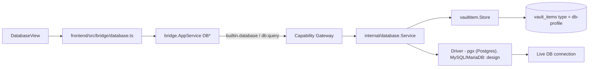
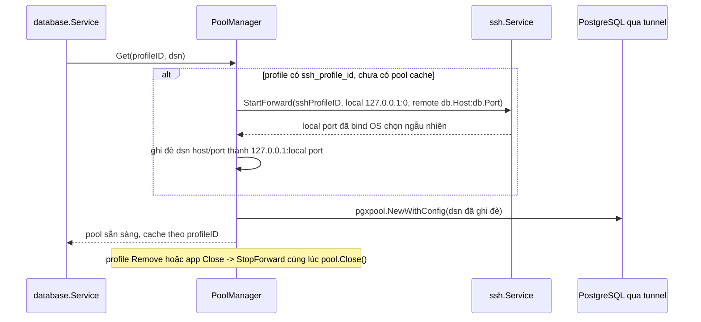
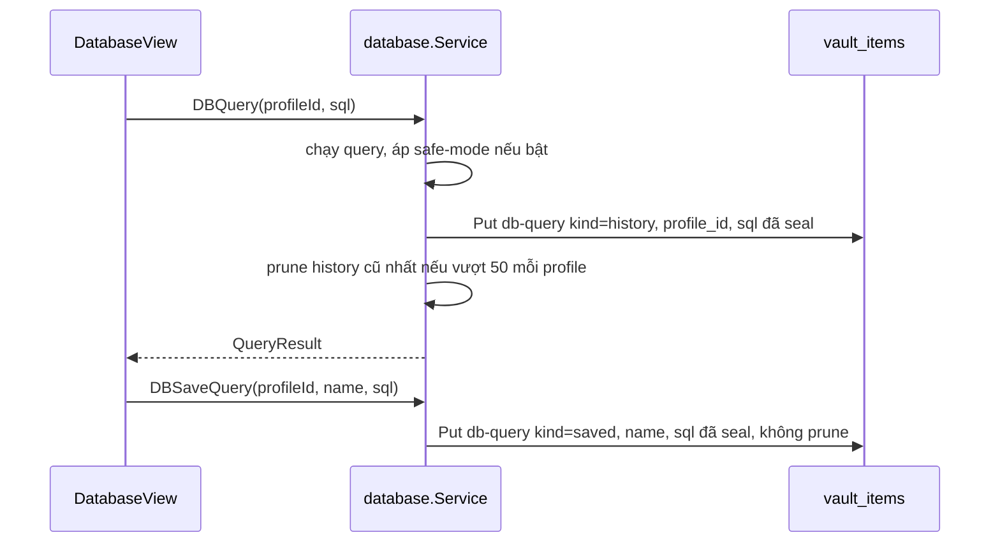
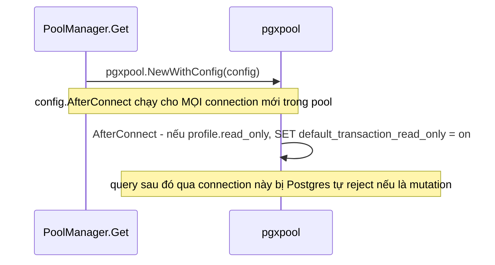
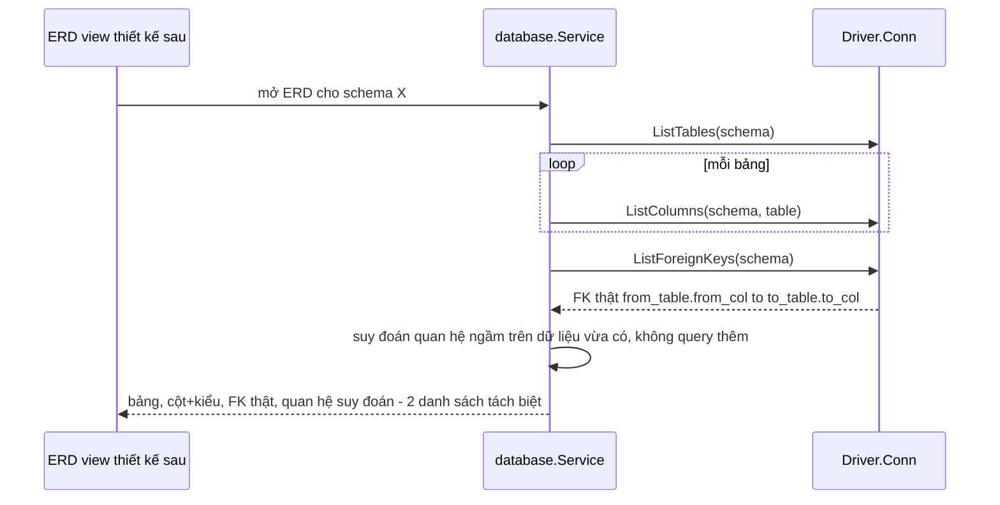
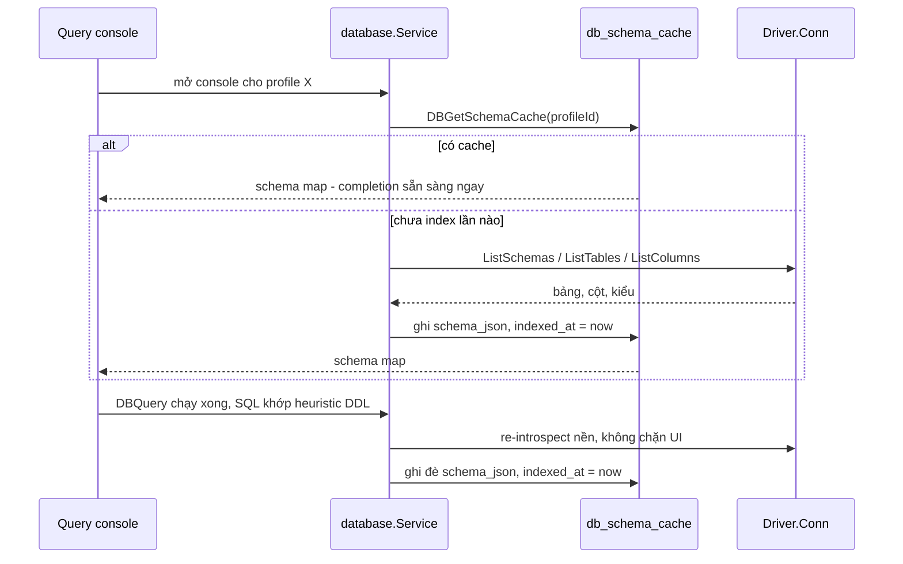

# Database

Trang này mô tả built-in module **Database** (`internal/database`, ActivityBar
`Database`). Trước đây chỉ được nhắc gián tiếp trong `vault.mdx`/`connections.mdx`
như "module sibling" — trang này gom lại thành nguồn sự thật riêng, đúng pattern
đã dùng cho SSH/Notes. Secrets nằm trong vaultitem substrate; vault lifecycle
(Master Password/DEK) xem [Vault](/dev-kit/vault).



## Vaultitem contract (hiện tại — chỉ Postgres)

| Field | Value |
|---|---|
| Record `type` | `db-profile` |
| Payload `key_id` | `db-password` |
| Metadata (plaintext) | `Host`, `Port`, `Database`, `Username`, `SSLMode`, **`env`** |
| Payload (encrypted) | `Password` |

- **`env` (Implemented):** tên tag trong [Environments](/dev-kit/environments).
  `DBCreateProfile` reject nếu thiếu hoặc tag không tồn tại. UI create form có
  dropdown env (`EnvListTags`).
- Driver hiện tại là `pgx` (`internal/database/pool.go`) — chỉ PostgreSQL.
  Không có field `engine` trong metadata vì chưa cần — thêm khi mở rộng
  driver (xem Design bên dưới).

## TLS default và giới hạn runtime (hiện tại — Postgres)

- Remote profile mặc định `sslmode=verify-full`; chỉ cho phép `sslmode=disable`
  trên loopback dev host, remote + insecure TLS bị reject
  (`ErrInsecureTLSForRemoteHost`) — [ADR-007](/dev-kit/architecture-decisions#adr-007-verified-tls-for-remote-db-and-exact-ssh-host-key-pinning).
- TLS trust dùng **system CA store của `pgx`** — không có custom CA pinning
  riêng (giống SSH, cũng chưa implement).
- Query timeout **30s**; kết quả cap `DefaultMaxRows = 200` — 2 giới hạn này
  do DevKit tự enforce ở tầng service, không phụ thuộc driver.
- Vault phải **unlocked** trước khi tạo profile hoặc query, vì password field
  encrypt/decrypt qua vault DEK. Chi tiết vận hành: [Operations § Database connection prerequisites](/dev-kit/operations#database-connection-prerequisites).

## Bridge & capability

| Method | Capability | Scope | Ghi chú |
|---|---|---|---|
| `DBListProfiles` | `db:query` | `profile:list` | |
| `DBCreateProfile` | `db:query` | `profile:new` | |
| `DBDeleteProfile` | `db:query` | `profile:<id>` | |
| `DBTestConnection` | `db:query` | `profile:<id>` | |
| `DBQuery` | `db:query` | `profile:<id>` | |
| `DBSetActiveProfile` (design) | `db:query` | `profile:<id>` | |
| `DBActiveProfile` (design) | `db:query` | `profile:active` | |
| `DBUpdateProfileOptions` | `db:query` | `profile:<id>` | metadata-only, đổi `ssh_profile_id`/`read_only` không cần tạo lại profile |
| `DBListQueryHistory` | `db:query` | `profile:<id>` | 50 query gần nhất, tự động log |
| `DBSaveQuery` | `db:query` | `profile:<id>` | user đặt tên, không bị prune |
| `DBListSavedQueries` | `db:query` | `profile:<id>` | |
| `DBDeleteSavedQuery` | `db:query` | `query:<id>` | |
| `DBListForeignKeys` | `db:query` | `profile:<id>` | FK thật từ DB catalog, cho ERD |
| `DBIndexSchema` | `db:query` | `profile:<id>` | full introspect + ghi cache, cho console autocomplete + ERD |
| `DBGetSchemaCache` | `db:query` | `profile:<id>` | đọc cache đã index, không đụng DB thật |

Subject luôn `builtin.database`. Packages: `internal/database/{database,pool}.go`,
`internal/bridge/database.go`, `frontend/src/modules/database/DatabaseView.tsx`,
`frontend/src/bridge/database.ts`.

`DBSetActiveProfile`/`DBActiveProfile` là 2 method mới cho phần "active profile
cho agent" — xem [MCP tool surface](#mcp-tool-surface-design) bên dưới. UI hiện
tại (`DBQuery` nhận `profileId` tường minh mỗi lần gọi, nhiều tab/profile dùng
song song được) **không đổi gì** — 2 method này chỉ phục vụ agent qua MCP.

## Design: multi-engine driver abstraction

import { Callout } from 'fumadocs-ui/components/callout';

<Callout type="warn" title="Design only — toàn bộ phần này">
`internal/database` hiện tại chỉ implement Postgres qua `pgx`, đi thẳng không
qua interface trung gian. Phần dưới đây thiết kế lại thành driver abstraction
thật để nhận MySQL/MariaDB mà không rẽ nhánh if/else theo engine trong
service — chưa có runtime.
</Callout>

Bản trước của trang này chỉ nói "thêm 1 driver MySQL, generalize pool sau" —
không đủ, vì bỏ qua ít nhất 4 điểm khác biệt thật giữa Postgres và
MySQL-family mà nếu không thiết kế trước sẽ vỡ khi implement. Từng điểm dưới
đây có quyết định rõ ràng, không để "tính sau".

### 1. `Driver` interface — chốt method shape trước khi viết driver thứ 2

```text
type Driver interface {
    Dial(ctx context.Context, cfg ConnConfig) (Conn, error)
}

type Conn interface {
    Ping(ctx context.Context) error
    Query(ctx context.Context, sql string, args ...any) (Rows, error)
    ListSchemas(ctx context.Context) ([]string, error)
    ListTables(ctx context.Context, schema string) ([]TableInfo, error)
    ListColumns(ctx context.Context, schema, table string) ([]ColumnInfo, error)
    Close() error
}

type ConnConfig struct {
    Engine   string // "postgres" | "mysql" | "mariadb"
    Host     string
    Port     int
    Database string
    Username string
    Password string // từ vault, không log
    SSLMode  string
    Options  map[string]string // engine-specific escape hatch, xem mục 6
}
```

`pgx` hiện tại phải được bọc lại đúng interface này — không phải viết thêm 1
interface song song rồi giữ code path `pgx` cũ chạy tắt.

### 2. Schema browse phải thành method riêng, không phải SQL cứng Postgres

Hiện tại schema browse (list schema/table/column trên UI) chạy bằng SQL
catalog cứng (kiểu `pg_catalog`/Postgres-specific) qua `DBQuery` — cách này
**không portable**: MySQL/MariaDB không có `pg_catalog`. Design mới tách
`ListSchemas`/`ListTables`/`ListColumns` thành method riêng trên `Conn`, mỗi
driver tự implement bằng catalog phù hợp — cả Postgres lẫn MySQL/MariaDB đều
hỗ trợ `information_schema` theo chuẩn ANSI đủ tốt để dùng chung logic ở tầng
gọi, chỉ khác câu SQL cụ thể bên trong từng driver. Cần thêm bridge method
mới (`DBListSchemas`, `DBListTables`) — đây là mở rộng bridge surface thật,
không phải chi tiết nội bộ.

### 3. Placeholder syntax khác nhau — không cố "tự động sửa"

Postgres dùng `$1, $2`; MySQL/MariaDB dùng `?`. `DBQuery` nhận SQL thô từ UI/agent,
DevKit **không** parse SQL để tự chuyển đổi placeholder giữa các engine (rủi ro
sai lệch cao, dễ vỡ với SQL phức tạp). Quyết định: caller (UI hoặc agent qua
MCP) phải tự viết SQL đúng cú pháp placeholder của `engine` đã chọn trong
profile — đây là **known limitation ghi rõ**, không phải lỗ hổng ngầm. UI nên
hiển thị `engine` của profile đang chọn ngay cạnh ô nhập query để giảm nhầm.

### 4. Pool: `pgx` có pool riêng, MySQL driver đi qua `database/sql`

Đây là bất đối xứng thật, không phải chi tiết vặt: `pgx` dùng pool native
(`pgxpool`) không qua `database/sql`; driver MySQL phổ biến
(`go-sql-driver/mysql`) là 1 `database/sql` driver, pool đến từ
`database/sql.DB`. `Driver.Dial` phải trả về `Conn` đã che giấu khác biệt này
— caller (`internal/database.Service`) chỉ thấy `Conn`, không biết bên dưới
là `pgxpool.Pool` hay `sql.DB`. Pool config (`MaxOpenConns`, idle timeout) vẫn
là 1 bộ tham số chung ở tầng `ConnConfig`/service, map xuống implementation
tương ứng của từng driver.

### 5. TLS/CA trust và auth handshake — không giả định "cứ thế mà chạy"

- Postgres/`pgx` dùng system CA store sẵn có. MySQL driver **không** tự làm
  vậy — phải đăng ký `tls=custom` kèm CA pool tương đương thủ công
  (`mysql.RegisterTLSConfig`), nếu không remote MySQL với `verify-full`-style
  sẽ không hoạt động đúng như kỳ vọng của ADR-007.
- MySQL 8 mặc định dùng auth plugin `caching_sha2_password` — cần xác nhận
  driver + phiên bản server tương thích khi implement, không giả định driver
  nào cũng handshake được; đây là rủi ro tương thích thật cần test với MySQL 8
  thật trước khi coi driver "xong".

### 6. Metadata: field chung + `driver_options` cho phần không generalize được

Thêm `engine` (`postgres` | `mysql` | `mariadb`) vào metadata — record cũ
default `engine = "postgres"` (an toàn theo
["Compatibility rules"](/dev-kit/technical-contracts#compatibility-rules),
DevKit greenfield nên không cần migration job riêng). Ngoài field chung
(`Host`/`Port`/`Database`/`Username`/`SSLMode`), thêm `driver_options` dạng
map tự do cho phần đặc thù từng engine (ví dụ MySQL cần path CA cert riêng)
— cùng kỹ thuật "raw passthrough cho phần không chuẩn hóa được" đã dùng cho
`_meta` ở [Agent Hub](/dev-kit/agent-hub) (mục "Vì sao cần lớp flex này"):
field chuẩn hóa nằm ở struct chính, phần chưa/không chuẩn hóa được nằm ở bag
riêng, không ép hết vào 1 shape cứng.

### 7. MariaDB: cùng driver với MySQL, nhưng không giả định 100% giống hệt

Giữ nguyên quyết định dùng chung driver `mysql` cho cả MariaDB (cùng wire
protocol) — **nhưng** không coi đó là tương đương tuyệt đối: MariaDB khác
MySQL ở auth plugin mặc định, xử lý kiểu `JSON`, và một số system variable.
V1 chỉ cam kết đúng phạm vi đã dùng (connect, query, schema browse cơ bản) đã
verify trên MariaDB thật — không quảng cáo "tương thích hoàn toàn" khi chưa
test.

### Acceptance criteria bổ sung (multi-engine)

- Profile `engine=mysql` connect thành công tới MySQL 8 thật, `ListTables`
  trả đúng danh sách.
- Profile `engine=mariadb` connect thành công tới MariaDB 10.x thật bằng cùng
  driver `mysql`, không cần code path riêng.
- Query dùng sai placeholder syntax cho engine đã chọn (vd `$1` gửi vào MySQL
  profile) → lỗi rõ ràng từ driver, không phải silent wrong result.
- Đổi `engine` của 1 profile đã tồn tại (nếu UI cho phép) → `port`/`SSLMode`
  default gợi ý đổi theo engine mới, không giữ nguyên default cũ của Postgres.

### Known ceiling

- Không tự động chuyển đổi placeholder syntax giữa engine (mục 3) — chấp
  nhận đây là giới hạn v1, không phải bug.
- "Không phân biệt SELECT vs mutating" vẫn là **mặc định** — safe-mode (xem
  [Safe-mode / read-only profile](#safe-mode--read-only-profile)) là opt-in,
  không tự bật cho profile nào.
- SSH tunnel (xem [SSH tunnel cho DB profile](#ssh-tunnel-cho-db-profile))
  chỉ hỗ trợ 1 chặng — không hỗ trợ jump-host nhiều lớp (SSH → SSH → DB).
- Suy đoán quan hệ ngầm cho ERD chỉ khớp khoá chính 1 cột, bỏ qua composite
  primary key — xem [Sơ đồ quan hệ (ERD)](#sơ-đồ-quan-hệ-erd).
- Query history/saved query chỉ đọc/ghi được khi vault unlocked (SQL text
  encrypted thật trong payload, khác `note_links` của Notes vốn plaintext).
- Schema cache cho console/ERD chỉ tự refresh khi DDL chạy **qua chính
  console DevKit** — đổi schema từ nơi khác (tool khác, teammate khác) không
  tự cập nhật, cần refresh thủ công.

## SSH tunnel cho DB profile

`internal/ssh` đã có sẵn port-forwarding thật — `StartForward`/`StopForward`/
`ListForwards`, cả local lẫn remote forward, dial qua `*gossh.Client` đã xác
thực (xem [SSH](/dev-kit/ssh)). DB profile nối vào cơ chế này, không viết SSH
plumbing mới.



- **Field mới trên `db-profile`:** `ssh_profile_id` (optional, trỏ
  `ssh-profile` đã có). `Host`/`Port` của DB profile là địa chỉ **nhìn từ
  phía SSH server** khi có tunnel — thường `localhost`/IP nội bộ chỉ SSH
  server thấy được, không phải địa chỉ client gọi trực tiếp.
- **Lifecycle ăn theo `PoolManager`** — pool đã cache theo `profileID`, sống
  suốt vòng đời app (`pool.go:15-16`, comment gốc: "owns... pools for the
  lifetime of the application"). Forward mở lần đầu `Get()` cho profile đó
  (lazy, giống pool), đóng khi `Remove(profileID)`/`Close()` — dùng chung
  đúng lifecycle pool đã có, không thêm cơ chế riêng.
- **Chỉ local forward** (`-L`) — DevKit dial vào port local, SSH server
  forward tới DB thật. Remote forward không liên quan use case này.
- **Port local: động (OS chọn, `0`)** — tránh xung đột giữa nhiều profile
  cùng dùng tunnel một lúc.
- **Auth tái dùng nguyên vẹn** — `dial()` của `ssh.Service` (đã xác thực, đã
  trust host-key) chạy trước; DB profile không lưu thêm secret nào ngoài
  `ssh_profile_id`.
- Không đổi `Driver`/`ConnConfig` (mục multi-engine trên) — tunnel hoạt động
  ở tầng network, trong suốt với driver DB, áp dụng như nhau cho
  Postgres/MySQL/MariaDB.

<Callout type="info" title="Open question">
Vault phải unlocked để đọc secret của SSH profile — nếu DB profile có tunnel
mà SSH profile bị xoá sau đó, `Get()` nên fail rõ ràng hay im lặng bỏ qua
tunnel (kết nối thẳng, gần như chắc chắn timeout)? Chưa quyết định, nghiêng
về fail rõ ràng để không âm thầm đổi đường kết nối.
</Callout>

## Query history và Saved query

2 khái niệm tách biệt, cùng 1 record type mới `db-query` (phân biệt qua field
`kind`):

| | History | Saved query |
|---|---|---|
| Tạo | Tự động, mỗi lần `DBQuery` chạy thành công | User chủ động gọi `DBSaveQuery` |
| Giữ | 50 gần nhất / profile, cũ nhất bị prune | Không giới hạn, không tự xoá |
| Tên | Không có (chỉ SQL + timestamp) | User đặt tên |



### Record shape

| Field | At rest | Notes |
|---|---|---|
| `type` | `"db-query"` | Schema-validated — type thứ 6, xem Blast radius dưới |
| `metadata` | `{"profile_id":"<24hex>","kind":"history"\|"saved","name":"..."}` plaintext | `name` chỉ có khi `kind=saved`; **không chứa SQL** |
| `payload` | Envelope V2 của SQL text | AAD `(db-query, <id>, db-query-body)` — SQL nằm ở payload vì có thể chứa literal nhạy cảm, khác `name` (an toàn plaintext như title note) |

<Callout type="warn" title="Blast radius: internal/vaultitem/schema.go">
Cùng lưu ý như `note-version` trước đây — thêm `type = "db-query"` đụng 2
switch hardcode dùng chung mọi record type (`IsSupportedItemType`,
`ValidateRecordSchema`). File lõi, review kỹ hơn 1 thay đổi cục bộ trong
`internal/database`.
</Callout>

- **Retention 50/profile dùng lại đúng cơ chế đã thiết kế cho Notes version
  history** — `ListByTypeAndMetaField("db-query", "profile_id", id)` (xem
  [Notes § Version history](/dev-kit/notes#version-history)) lọc đúng
  history của 1 profile, không quét toàn vault; sort theo `created_at`, xoá
  phần dư quá 50. `kind=saved` **không** đi qua bước prune này dù cùng type.
- **Vault phải unlocked mới đọc/ghi được** — SQL text encrypted thật, khác
  `note_links` (plaintext, đọc được bất kể vault state). Vault đang lock thì
  `DBListQueryHistory`/`DBListSavedQueries` trả lỗi, không phải danh sách
  rỗng (tránh hiểu nhầm "chưa từng query" khi thực ra chỉ là chưa unlock).
- Xoá 1 saved query (`DBDeleteSavedQuery`): hard delete luôn — không có khái
  niệm trash cho query (khác Notes).

## Safe-mode / read-only profile

Flag `read_only` mới trên `db-profile` metadata, **mặc định tắt**, opt-in thủ
công qua `DBUpdateProfileOptions`. Bật thì DB tự chặn mutation ở tầng
session/connection — DevKit không tự parse SQL để đoán statement type, giữ
đúng nguyên tắc đã chốt ở mục 3 (không tự đoán/chuyển đổi cú pháp SQL).



- **Cơ chế: `pgxpool.Config.AfterConnect`** — set session-level read-only
  ngay khi 1 connection mới được pool tạo ra, áp dụng cho **mọi** connection
  trong pool (không phải set 1 lần cho cả pool — pool có nhiều connection
  luân phiên). DB tự reject `INSERT`/`UPDATE`/`DELETE`/DDL ở tầng engine thật
  — không phải prefix-check hay parse SQL phía DevKit, nên không bị bypass
  bởi multi-statement hay cú pháp lạ.
- **Bất đối xứng với MySQL/MariaDB (khi build)** — `AfterConnect` là hook có
  sẵn của `pgx`; `database/sql` (driver MySQL sẽ dùng, xem mục 4 multi-engine)
  **không có hook tương đương built-in** — cần 1 `driver.Connector` tuỳ
  chỉnh chạy `SET SESSION TRANSACTION READ ONLY` ngay sau dial, phức tạp hơn
  hẳn 1 dòng config của pgx. Cùng dạng bất đối xứng đã ghi nhận ở mục 4
  ("Pool: `pgx` có pool riêng, MySQL driver đi qua `database/sql`").
- **Áp dụng đều cho UI lẫn MCP agent** — vì set ở tầng connection/pool (dùng
  chung `PoolManager`), không phải theo caller. `db.query` qua MCP trên 1
  profile `read_only=true` tự động bị DB chặn mutation, không cần logic
  riêng ở tầng Gateway/MCP.
- **Không thay thế** "không phân biệt SELECT vs mutating" ở Known ceiling —
  đây là opt-in, mặc định mọi profile vẫn như cũ trừ khi user tự bật.

## Export kết quả query

Export đúng dữ liệu **đang có trong tay** — `QueryResult{Columns []string,
Rows [][]string}` (`database.go:60-65`) đã tách cột/dòng sẵn, không cần
bridge method mới, không query lại DB.

- **Theo đúng `DefaultMaxRows` (200)** — export = dump `QueryResult` hiện tại
  ra file, cùng giới hạn UI đang hiển thị. Muốn nhiều hơn 200 dòng thì chỉnh
  query (`LIMIT`/`OFFSET`), không có đường export "full" riêng.
- **CSV: trực tiếp** — mọi cell đã stringify sẵn (`stringify()`,
  `database.go:290`), chỉ cần escape dấu phẩy/xuống dòng theo chuẩn CSV.
- **JSON: mọi field ra string** — `Rows` là `[][]string`, kiểu gốc
  (số/bool/timestamp) đã mất trước khi tới bước export. `{"id": "42"}` chứ
  không phải `{"id": 42}` — giới hạn thật của `QueryResult` hiện tại, không
  phải quyết định riêng của export. Muốn JSON giữ kiểu gốc phải đổi
  `QueryResult` sang giữ giá trị typed thay vì string hoá sớm — ảnh hưởng cả
  UI table đang dùng shape này, ngoài phạm vi feature export.
- Chạy phía frontend (đã có `QueryResult` sau khi query xong), qua dialog
  Save As của Wails — không cần capability/bridge method mới.

## Sơ đồ quan hệ (ERD)

Backend only ở lượt này — UI vẽ diagram để sau. Cần 3 nguồn dữ liệu:
`ListTables`/`ListColumns` (đã thiết kế ở mục multi-engine, cho bảng+cột+kiểu)
+ `DBListForeignKeys` (mới, FK thật) + 1 pass suy đoán quan hệ ngầm (không
query thêm).



### `ListForeignKeys` — method riêng, tách khỏi `ListColumns`

Lý do tách (Phương án A): schema browse (sidebar tree, mở từng bảng khi user
click) và ERD (load toàn schema 1 lần để vẽ) là 2 nhu cầu khác nhau về tần
suất/khối lượng — nhét FK vào `ListColumns` bắt sidebar tree trả FK mỗi lần
mở dù không dùng đến.

```text
type Conn interface {
    // ... (đã có: Ping, Query, ListSchemas, ListTables, ListColumns, Close)
    ListForeignKeys(ctx context.Context, schema string) ([]ForeignKey, error)
}

type ForeignKey struct {
    FromTable, FromColumn string
    ToTable, ToColumn     string
}
```

Mỗi driver tự implement bằng catalog phù hợp — Postgres qua
`information_schema.key_column_usage` + `information_schema.constraint_column_usage`
join `table_constraints WHERE constraint_type = 'FOREIGN KEY'`; MySQL/MariaDB
(khi build) qua `information_schema.KEY_COLUMN_USAGE` lọc
`REFERENCED_TABLE_NAME IS NOT NULL` — cùng chuẩn ANSI `information_schema` đã
chọn cho `ListTables`/`ListColumns` ở mục 2, không cần catalog riêng ngoài
chuẩn.

### Suy đoán quan hệ ngầm (không có FK khai báo thật)

Nhiều schema chỉ liên kết qua tên cột ở tầng code (ORM tự quản), không khai
báo FK constraint thật trong DB — heuristic đặt tên chạy **sau khi** đã có dữ
liệu ERD thật, không tốn thêm query nào:

1. Với mỗi cột **chưa** có trong danh sách FK thật, khớp pattern `<x>_id`.
2. Tìm bảng tên `<x>` hoặc `<x>s` (pluralize đơn giản, +s) trong schema.
3. Nếu tìm thấy bảng, và bảng đó có cột khoá chính (`id`) cùng họ kiểu dữ
   liệu (int/uuid) với cột đang xét → ghi nhận **quan hệ suy đoán**
   `<table>.<x>_id ⇢ <x(s)>.id`.
4. Trả về **danh sách tách biệt** với FK thật — UI (thiết kế sau) vẽ nét đứt
   + nhãn "suy đoán", không trộn chung 1 kiểu đường với FK thật.

<Callout type="warn" title="Best-effort, không phải phát hiện chính xác">
Heuristic dựa thuần vào tên cột — sai cả 2 chiều: bỏ sót quan hệ ngầm nếu
không theo convention `<x>_id`, và có thể suy đoán nhầm nếu tên cột trùng
ngẫu nhiên với 1 bảng không liên quan. Chỉ hỗ trợ khớp **khoá chính 1 cột**
(`id`) — bảng có composite primary key không được heuristic này xét tới, bỏ
qua hoàn toàn (không suy đoán sai còn hơn suy đoán ẩu với composite key).
</Callout>

## Query console: gợi ý cú pháp / bảng / cột

Console hiện tại là 1 `<textarea>` trần (`DatabaseView.tsx:182`) — nâng lên
schema-aware completion kiểu DataGrip/JetBrains: gõ tới đâu gợi ý bảng/cột
tới đó theo đúng ngữ cảnh con trỏ (sau `FROM` → tên bảng, sau `WHERE` với
bảng đã chọn → cột của bảng đó).

<Callout type="info" title="Editor engine: CodeMirror 6 — thiết kế ở trang riêng">
Console dùng 1 **CodeMirror 6 primitive dùng chung**, không viết riêng cho
Database — sẽ có module code-edit cơ bản khác dùng lại đúng primitive này.
Phần dựng editor (theme, key bindings, wiring React) thuộc về trang riêng
cho primitive đó, chưa viết. Trang này chỉ nói phần **Database cần cung
cấp**: SQL dialect theo `engine` + schema map cho completion source của
`@codemirror/lang-sql` — không lặp lại chi tiết editor ở đây.
</Callout>

### Schema index — cache cục bộ kiểu JetBrains, không quét lại mỗi lần gõ

- **Index đầy đủ 1 lần, cache cục bộ, đọc lại tức thì** — giống DataGrip:
  lần đầu mở console cho 1 profile, `DBIndexSchema(profileId)` chạy
  `ListSchemas`→`ListTables`→`ListColumns` (đã thiết kế ở mục multi-engine)
  cho toàn schema, ghi vào bảng cache. Lần sau mở lại console — kể cả sau khi
  tắt app — `DBGetSchemaCache(profileId)` đọc thẳng cache: completion sẵn
  sàng ngay, không đợi round-trip DB nào.
- **Bảng cache mới, plaintext, ngoài vault** — cùng tiền lệ `note_links`/
  `env_tags` (chỉ cấu trúc bảng/cột/kiểu, không phải data thật, không nhạy
  cảm):

  ```sql
  db_schema_cache(profile_id TEXT PRIMARY KEY, schema_json TEXT, indexed_at)
  ```

  Migration mới theo đúng khuôn đã dùng cho `env_tags` — cơ học, không cần
  plumbing mới.
- **`schema_json` ghi đúng shape `SQLNamespace` của `@codemirror/lang-sql`**
  — type thật là đệ quy
  (`{[name]: SQLNamespace} | {self, children} | (Completion|string)[]`),
  nên `{schema: {table: [cột...]}}` (2 tầng lồng nhau) là **format có sẵn
  của thư viện**, không phải tự chế cách nhét nhiều schema vào 1 map phẳng.
  `ListSchemas`→`ListTables`→`ListColumns` map thẳng 1:1 vào 3 tầng
  namespace/table/columns này, không cần transform trung gian.
- **Refresh: thủ công + heuristic DDL, không tự động liên tục.** 3 điểm kích
  hoạt index lại:
  1. Chưa từng index profile này (cache rỗng) → tự chạy lần đầu.
  2. User bấm "Refresh schema" (giống nút Synchronize của DataGrip).
  3. Query vừa chạy thành công khớp heuristic DDL (`CREATE`/`ALTER`/`DROP` ở
     đầu câu — cùng mức "best-effort", không phải parser thật, giống suy
     đoán FK ở ERD) → tự refresh nền sau khi query xong, không chặn UI.
- **Hiển thị độ mới** — `indexed_at` hiện cạnh console (vd "Schema cập nhật
  2 giờ trước") để user tự biết khi nào nên refresh thủ công, không âm thầm
  dùng gợi ý cũ mà không ai biết.
- **Dùng chung cho cả ERD** — `db_schema_cache` là nguồn bảng/cột chung cho
  [Sơ đồ quan hệ (ERD)](#sơ-đồ-quan-hệ-erd) thay vì ERD tự
  `ListTables`/`ListColumns` riêng mỗi lần mở; `ListForeignKeys` vẫn fetch
  live mỗi lần (tần suất mở ERD thấp hơn nhiều so với gõ trong console, không
  cần cache riêng).

### SQL dialect theo `engine`

`@codemirror/lang-sql` export sẵn `SQLDialect` theo engine — console chọn
dialect theo `engine` của profile đang mở (mục multi-engine ở trên), khớp
keyword/syntax highlight đúng engine thay vì dùng chung `StandardSQL` cho mọi
profile:

| `engine` | Export CodeMirror |
|---|---|
| `postgres` | `PostgreSQL` |
| `mysql` | `MySQL` |
| `mariadb` | `MariaSQL` **(không phải `MariaDB`** — tên export thật, dễ nhầm khi implement) |

`SQLConfig.defaultSchema` (option có sẵn của `sql()`) nên set theo schema mặc
định của profile (vd `public` cho Postgres) — cho phép gõ tên cột trần không
cần prefix `schema.table.` mọi lúc, đỡ verbose hơn cho use case phổ biến
nhất.

### Bridge mới

| Method | Capability | Scope | Ghi chú |
|---|---|---|---|
| `DBIndexSchema` | `db:query` | `profile:<id>` | full introspect + ghi `db_schema_cache` — blocking lần đầu, chạy nền khi do heuristic DDL kích hoạt |
| `DBGetSchemaCache` | `db:query` | `profile:<id>` | đọc cache, không đụng DB thật |



<Callout type="warn" title="Cache có thể lệch nếu schema đổi từ nơi khác">
Heuristic DDL chỉ bắt được DDL chạy **qua chính console này**. Ai đó đổi
schema bằng tool khác (hoặc teammate khác) thì cache DevKit không tự biết —
chỉ đồng bộ lại khi user bấm refresh thủ công hoặc index lần đầu cho phiên
mới. Đây là giới hạn chấp nhận được (best-effort), không phải bug.
</Callout>

## MCP tool surface (design)

Xem cơ chế chung + rationale ở [MCP / Agent](/dev-kit/mcp-agent).

| MCP tool | Effect | Map sang | Ghi chú |
|---|---|---|---|
| `db.listProfiles` | `read` | `builtin.database` / `db:query` / `profile:list` | Chỉ metadata, không có password |
| `db.testConnection` | `execute` | `builtin.database` / `db:query` / `profile:<id>` | Nhận `profileId` tường minh — test 1 profile cụ thể, không đụng active profile |
| `db.activeProfile` | `read` | `builtin.database` / `db:query` / `profile:active` | Trả `{profileId?}` — agent chỉ đọc, không tự đổi |
| `db.query` | `execute` (`destructiveHint`) | `builtin.database` / `db:query` / `profile:active` | Không nhận `profileId` — chạy trên **active profile cho agent**. Không phân biệt SELECT/UPDATE trừ khi profile `read_only` (xem [Safe-mode](#safe-mode--read-only-profile)). Hỏi quyền theo policy env tag (xem dưới) |
| `db.history.list` | `read` | `builtin.database` / `db:query` / `profile:<id>` | 50 query gần nhất của 1 profile — hữu ích cho agent xem lại đã chạy gì |
| `db.savedQuery.list` | `read` | `builtin.database` / `db:query` / `profile:<id>` | |
| `db.listForeignKeys` | `read` | `builtin.database` / `db:query` / `profile:<id>` | FK thật, cho agent hiểu schema trước khi viết query — **không** kèm quan hệ suy đoán (best-effort, không nên agent coi như ground truth) |
| `db.schema.get` | `read` | `builtin.database` / `db:query` / `profile:<id>` | Đọc `db_schema_cache` — bảng/cột/kiểu cho agent viết SQL đúng tên, không tự index nếu cache rỗng (agent không nên tự trigger full introspect) |

**"Hỏi quyền theo policy env tag" (MCP — Implemented):** field `env` trên
`db-profile` **đã Implemented** (create-time validate + UI dropdown). `db.query`
qua MCP tra `requiresConfirmation` của tag trước khi chạy — nếu bật, xác nhận
mỗi lần gọi (**env thắng** `allow_always`); khi env không bắt confirmation có
thể Allow always. `env=prod` luôn bật (locked). Unresolvable env → fail closed.
Chi tiết: [MCP / Agent](/dev-kit/mcp-agent), [Environments](/dev-kit/environments).
`db.listProfiles` / `db.testConnection` / `db.activeProfile` không bị luật này.

**Không expose qua MCP ở v1**: `DBCreateProfile` / `DBDeleteProfile` — nhận
password trực tiếp qua tham số, để v2 sau khi có UI permission review cho MCP.
`DBSetActiveProfile` cũng **không** expose qua MCP — chọn active profile luôn
là hành động của con người, cùng nguyên tắc human-only action đã áp cho unlock
vault / trust SSH host-key.

`DBUpdateProfileOptions`/`DBSaveQuery`/`DBDeleteSavedQuery` **cũng không**
expose qua MCP — bật/tắt tunnel hay safe-mode, và chủ động lưu 1 query để
dùng lại, đều là quyết định của con người về cách 1 profile hoạt động lâu
dài, không phải thao tác 1 lần agent cần tự làm; agent chỉ đọc (`db.history.list`,
`db.savedQuery.list`).

### Active profile cho agent — không đổi resource model hiện có

`db.query` qua MCP dùng khái niệm **active profile riêng cho agent**, tách biệt
hoàn toàn khỏi cách UI hoạt động hôm nay:

- UI (`DBQuery` qua bridge) **không đổi gì** — vẫn nhận `profileId` tường minh
  mỗi lần gọi, vẫn dùng song song nhiều profile được (ví dụ 2 tab query 2
  profile khác nhau) nếu implement cho phép, đúng cách connection pool hiện
  tại (`pool.go`) đã hoạt động.
- Agent qua MCP thì khác: `db.query` không nhận `profileId`. Nếu agent gọi mà
  chưa có active profile, DevKit hiện popup cho user chọn 1 trong các profile
  đã lưu (giống hệt cơ chế đã thiết kế cho [Kafka UI](/dev-kit/kafka), mục
  "Agent gọi khi chưa có cluster active"); lựa chọn giữ nguyên (sticky) tới
  khi user tự đổi qua `DatabaseView` hoặc sidebar.
- Khác Kafka: đây **không** phải ràng buộc tài nguyên (Kafka giới hạn vì chỉ
  giữ đúng 1 live broker connection). Với Database, "active profile" chỉ là
  lớp chọn target cho agent — pool/connection thật phía dưới vẫn hoạt động y
  hệt hiện tại, không giới hạn số profile có connection sống cùng lúc.
- Timeout cho popup và fallback khi DevKit chạy headless áp dụng y hệt NFR-9
  của Kafka UI.

## Non-goals (MVP)

- Multi-engine query builder / ORM layer trong DevKit.
- Connection pooling nâng cao (read replica routing, load balancing).
- Custom CA pinning ngoài system trust (giống SSH, chưa implement).
- Jump-host nhiều chặng cho SSH tunnel (SSH → SSH → DB) — 1 tunnel = 1 SSH
  profile trung gian.
- Sửa/ghi đè kết quả query trực tiếp trên bảng kết quả (data editing) — chỉ
  chạy SQL, không có UI edit-cell.
- ERD tự động chạy lại/refresh khi schema đổi — mở lại view mới quét lại.

import { Cards, Card } from 'fumadocs-ui/components/card';

<Cards>
  <Card title="Vault" href="/dev-kit/vault" description="Thin adapter db-profile trên vaultitem" />
  <Card title="SSH" href="/dev-kit/ssh" description="StartForward/StopForward — nguồn tunnel dùng lại" />
  <Card title="Notes" href="/dev-kit/notes#version-history" description="ListByTypeAndMetaField — nguồn pattern prune history dùng lại" />
  <Card title="MCP / Agent" href="/dev-kit/mcp-agent" />
  <Card title="Technical contracts" href="/dev-kit/technical-contracts" description="Bridge Database family" />
  <Card title="Architecture decisions" href="/dev-kit/architecture-decisions" description="ADR-007: verify-full TLS" />
</Cards>
