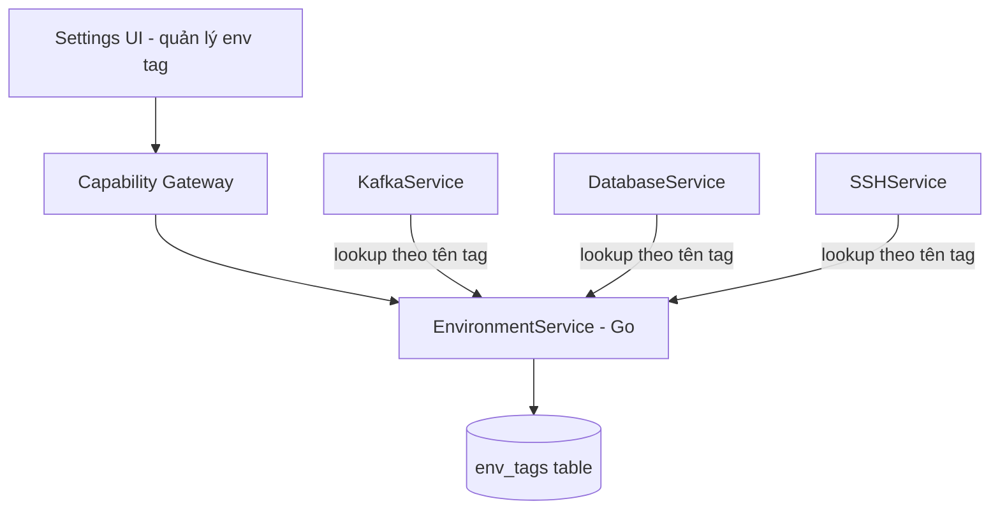

# Environments

Environments là registry dùng chung cho **env tag** (`dev`, `stg`, `prod`, và tag tùy chỉnh) mà user gán vào profile của Kafka/Database/SSH. Mỗi tag mang theo 1 policy — `requiresConfirmation` — quyết định MCP có phải hỏi quyền mỗi lần agent gọi vào active target mang tag đó hay không (kể cả tool `read`). Đây là nơi duy nhất định nghĩa policy này; Kafka/Database/SSH chỉ tra cứu, không tự giữ bản sao.

import { Callout } from 'fumadocs-ui/components/callout';

<Callout type="warn" title="Design only">
Chưa có `internal/environments` trong checkout hiện tại. Trạng thái implementation thật nằm ở [Implementation status](/dev-kit/implementation-status).
</Callout>

## Data model

`env_tags` là bảng riêng trong `internal/storage`, **không** phải vaultitem — env tag không phải secret, không cần vault unlocked để xem/quản lý.

| Field | Value |
|---|---|
| `id` | Opaque record ID |
| `name` | Tên tag, unique (vd `dev`, `stg`, `prod`, hoặc tên tùy chỉnh) |
| `requiresConfirmation` | `bool` — MCP có phải hỏi quyền mỗi lần gọi active target mang tag này không |
| `isBuiltin` | `bool` — `true` cho `dev`/`stg`/`prod`, `false` cho tag user tự tạo |
| `locked` | `bool` — `true` chỉ cho `prod`; `requiresConfirmation` của tag `locked` **không sửa được** |

## Default tag khi cài mới

| Tag | `requiresConfirmation` mặc định | Sửa được không |
|---|---|---|
| `dev` | `false` | Có — user bật lên được nếu muốn |
| `stg` | `false` | Có — user bật lên được nếu muốn |
| `prod` | `true` | **Không** — `locked = true`, luôn hỏi quyền, không cách nào tắt qua UI hay MCP |

`dev`/`stg`/`prod` không xóa được (built-in), tên không đổi được — chỉ
`requiresConfirmation` của `dev`/`stg` sửa được.

## Tag tùy chỉnh

User tạo tag mới ngoài 3 default (vd `qa`, `canary`, `sandbox`) — `isBuiltin = false`, `locked = false`, `requiresConfirmation` tự chọn lúc tạo và sửa được sau đó, không giới hạn như `prod`.

- Tên tag tùy chỉnh không được trùng tag đã có (built-in lẫn custom khác).
- Xóa 1 tag tùy chỉnh đang được ít nhất 1 profile Kafka/Database/SSH tham chiếu → reject (`env.tagInUse`) — bắt profile đổi sang tag khác trước, không xóa ngầm rồi để profile trỏ vào tag không tồn tại.

## Bridge & capability (design)

| Method | Capability | Scope |
|---|---|---|
| `EnvListTags` | `env:read` | `tag:list` |
| `EnvCreateTag` | `env:write` | `tag:new` |
| `EnvUpdateTag` | `env:write` | `tag:<id>` |
| `EnvDeleteTag` | `env:write` | `tag:<id>` |

Subject luôn `builtin.environments`. `EnvUpdateTag`/`EnvDeleteTag` trên tag `locked = true` (tức `prod`) luôn reject với lỗi rõ ràng (`env.tagLocked`), bất kể caller là ai hay grant gì — đây là loại trừ cứng ở tầng service, không phải thứ policy có thể nới ra.

## Cách Kafka/Database/SSH dùng tag

Profile của cả 3 module lưu **tên tag** (string, vd `"prod"`) trong metadata — không copy `requiresConfirmation` vào profile. Khi 1 MCP call chạm active target, service tương ứng (KafkaService/DatabaseService/SSHService) tra cứu tag theo tên qua `EnvironmentService` để lấy `requiresConfirmation` **tại thời điểm gọi** — đổi flag của 1 tag có hiệu lực ngay cho mọi profile đang mang tag đó, không cần sửa từng profile.

Nếu profile tham chiếu 1 tên tag không còn tồn tại (trường hợp hiếm, dữ liệu hỏng) → coi như `requiresConfirmation = true` (fail closed), không phải `false`.

## MCP tool surface (design)

Xem cơ chế chung ở [MCP / Agent](/dev-kit/mcp-agent).

| MCP tool | Effect | Map sang | Ghi chú |
|---|---|---|---|
| `env.listTags` | `read` | `builtin.environments` / `env:read` / `tag:list` | Agent đọc được tag nào yêu cầu xác nhận, để tự cảnh báo user trước khi gọi |

**Không expose `EnvCreateTag`/`EnvUpdateTag`/`EnvDeleteTag` qua MCP** — để agent tự đổi policy xác nhận (kể cả tag không phải `prod`) là tự nới lỏng kiểm soát cho chính nó, đi ngược mục đích cơ chế này sinh ra. Quản lý tag luôn là hành động của con người, cùng nhóm Hard exclusion với unlock vault / trust SSH host-key.

## Rules

- `prod` luôn `requiresConfirmation = true`, không có đường nào tắt được — UI, bridge, và MCP đều enforce lại cùng 1 rule ở tầng `EnvironmentService`, không chỉ chặn ở UI.
- Đổi `requiresConfirmation` của 1 tag không phải `prod` vẫn đi qua `AppService.call` + Capability Gateway như mọi thao tác khác — có audit, có capability check, không phải setting local không kiểm soát.
- Prompt xác nhận (khi `requiresConfirmation = true`) không có `allow_always` — quyết định này thuộc về cơ chế xác nhận, không đổi vì Environments; xem [MCP / Agent](/dev-kit/mcp-agent).

## Non-goals (v1)

- Không có RBAC riêng cho ai được sửa env tag — mọi user có quyền `env:write` đều sửa được (trừ `prod`).
- Không có tag hierarchy/inheritance (vd `prod-us` kế thừa policy từ `prod`) — mỗi tag độc lập.
- Không override `requiresConfirmation` theo từng profile — policy áp theo tag, đồng nhất cho mọi profile mang tag đó.

## Open questions

- Có cần log riêng (ngoài audit chung) mỗi lần `requiresConfirmation` của 1 tag bị đổi — ai đổi, lúc nào, từ giá trị gì sang giá trị gì — để review sau này không?
- Có cần giới hạn số lượng tag tùy chỉnh, hay để tự do?
- Icon/màu cho từng tag (để dialog xác nhận và sidebar hiển thị trực quan) nên cấu hình được hay cố định theo tên tag?

import { Cards, Card } from 'fumadocs-ui/components/card';

<Cards>
  <Card title="Kafka UI" href="/dev-kit/kafka" description="Dùng env tag cho publish/read active cluster" />
  <Card title="Database" href="/dev-kit/database" description="Dùng env tag cho db.query" />
  <Card title="SSH" href="/dev-kit/ssh" description="Dùng env tag cho ssh.runCommand" />
  <Card title="MCP / Agent" href="/dev-kit/mcp-agent" description="Cơ chế active target selection + xác nhận" />
  <Card title="Technical contracts" href="/dev-kit/technical-contracts" description="Capability/scope contract chung" />
</Cards>
