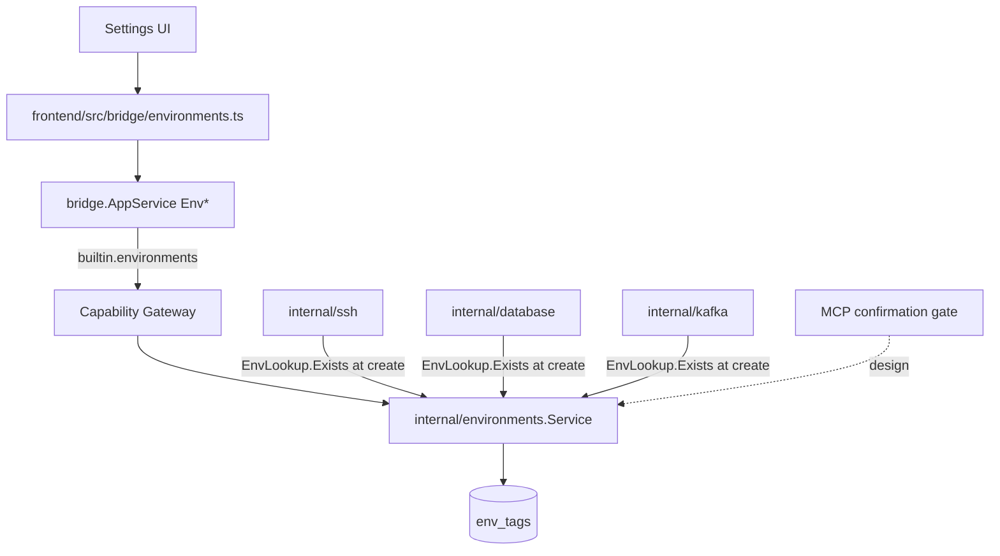

# Environments

Environments là registry dùng chung cho **env tag** (`dev`, `stg`, `prod`, và
tag tùy chỉnh). SSH, Database, và Kafka **bắt buộc** gán một tag hợp lệ khi tạo
profile (validate qua `EnvLookup.Exists`). Mỗi tag mang flag
`requiresConfirmation` — dành cho **MCP confirmation policy** khi module MCP
được triển khai; hiện tại registry + Settings UI đã ship, còn consumer MCP
chưa có.

import { Callout } from 'fumadocs-ui/components/callout';

<Callout type="info" title="Implemented — registry + Settings; MCP gate deferred">
Runtime có `internal/environments`, bảng `env_tags` (migration m12), bridge
`Env*`, và Settings UI. SSH/Database reject create nếu thiếu/`unknown` env.
Phần hỏi quyền MCP theo tag vẫn **design only** — làm khi triển khai
[`/dev-kit/mcp-agent`](/dev-kit/mcp-agent).
</Callout>



## Data model

`env_tags` là bảng riêng trong `internal/storage` (**không** phải vaultitem) —
không cần vault unlocked để list/quản lý.

| Field | Value |
|---|---|
| `id` | 24 lowercase hex (`vaultitem.NewID`) |
| `name` | Unique (vd `dev`, `stg`, `prod`, hoặc custom) |
| `requires_confirmation` | `bool` — policy cho MCP (chưa có reader runtime ngoài Settings) |
| `is_builtin` | `true` cho `dev`/`stg`/`prod` |
| `locked` | `true` chỉ `prod` — không `UpdateTag` / không xóa |

Packages: `internal/environments/{environments,memory,sqlrepository}.go`,
`internal/bridge/environments.go`, `frontend/src/modules/settings/SettingsView.tsx`,
`frontend/src/bridge/environments.ts`.

## Default tags (seed m12)

| Tag | `requiresConfirmation` | Sửa được? |
|---|---|---|
| `dev` | `false` | Có (`UpdateTag`) |
| `stg` | `false` | Có |
| `prod` | `true` | **Không** — `locked`; service trả `ErrTagLocked` |

Builtin không xóa được (`DeleteTag` reject `IsBuiltin` / `Locked`).

## Tag tùy chỉnh

`CreateTag(name, requiresConfirmation)` → `isBuiltin=false`, `locked=false`.
Trùng tên (builtin hoặc custom) → `ErrTagExists`.

**Delete in-use (Implemented):** `DeleteTag` tra `ProfileEnvUsage` (composition
root quét `ssh-profile` / `db-profile` / `kafka-profile` metadata.env). Tag còn
được profile tham chiếu → `ErrTagInUse` (`environment tag is in use`); bridge map
`validation_failed`. Đổi profile sang tag khác rồi mới xóa được.

SSH/DB/Kafka vẫn chỉ validate `Exists` lúc **create**. Khi wire MCP confirmation
gate, reader phải fail-closed nếu tên env trên profile không resolve được
(`requiresConfirmation = true`) — phòng dữ liệu hỏng / race, không thay cho
guard delete.

## Bridge & capability (Implemented)

| Method | Capability | Scope |
|---|---|---|
| `EnvListTags` | `env:read` | `tag:list` |
| `EnvCreateTag` | `env:write` | `tag:new` |
| `EnvUpdateTag` | `env:write` | `tag:<id>` |
| `EnvDeleteTag` | `env:write` | `tag:<id>` |

Subject `builtin.environments`. Grants ở `internal/app/container.go`.
`UpdateTag`/`DeleteTag` trên `prod` (locked) luôn reject ở service layer.

## Cách SSH/Database/Kafka dùng tag (Implemented)

Profile lưu **tên tag** string trong metadata (`env`), không copy
`requiresConfirmation`. Create path:

```text
CreateProfile(..., Env) → reject if Env == "" || !envs.Exists(Env)
```

UI: dropdown env trên `SSHView` / `DatabaseView` / `KafkaView` (load qua
`EnvListTags`).

## MCP tool surface (design — deferred)

Giữ nguyên thiết kế; **không** implement trong đợt này. Xem
[MCP / Agent](/dev-kit/mcp-agent).

| MCP tool | Effect | Map sang | Ghi chú |
|---|---|---|---|
| `env.listTags` | `read` | `builtin.environments` / `env:read` / `tag:list` | Agent đọc policy |

**Không expose** create/update/delete qua MCP — quản lý tag là human-only.

Khi MCP gate có: service tra `requiresConfirmation` **lúc gọi**; đổi flag tag
áp ngay cho mọi profile mang tag đó. Unresolvable env name → fail closed
(`true`).

## Rules

- `prod` luôn `requiresConfirmation = true` ở seed + locked — không tắt được
  qua UI/bridge.
- Đổi flag tag không-locked đi qua `AppService.call` + gateway (có audit).
- Prompt confirmation MCP: có `allow_always` khi tag **không** `requiresConfirmation`;
  khi tag bật (gồm `prod`) **env luôn thắng** — xem [MCP / Agent](/dev-kit/mcp-agent).
  Policy flag vẫn thuộc registry này; dialog/cache thuộc MCP runtime.

## Non-goals (v1)

- RBAC riêng cho ai được sửa tag
- Tag hierarchy/inheritance
- Per-profile override `requiresConfirmation`
- MCP confirmation runtime (phase MCP)

import { Cards, Card } from 'fumadocs-ui/components/card';

<Cards>
  <Card title="SSH" href="/dev-kit/ssh" description="env bắt buộc trên ssh-profile" />
  <Card title="Database" href="/dev-kit/database" description="env bắt buộc trên db-profile" />
  <Card title="Kafka" href="/dev-kit/kafka" description="env bắt buộc trên kafka-profile" />
  <Card title="MCP / Agent" href="/dev-kit/mcp-agent" description="Confirmation gate — design" />
  <Card title="Implementation status" href="/dev-kit/implementation-status" />
  <Card title="Technical contracts" href="/dev-kit/technical-contracts" />
</Cards>
