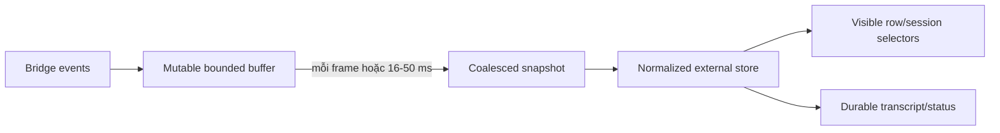

# Frontend performance architecture

Tài liệu này là chuẩn thiết kế và review hiệu năng cho React frontend của
DevKit. Nó không thay thế profiling, cũng không khuyến khích rải `memo`,
`useMemo` hoặc `useCallback` khắp code. Mục tiêu là giữ Workbench phản hồi tốt
khi các module hiện tại và tương lai cùng trưởng thành: nhiều tab, editor nặng,
bảng dữ liệu lớn, graph, stream realtime và background process chạy song song.

import { Callout } from 'fumadocs-ui/components/callout';
import { Cards, Card } from 'fumadocs-ui/components/card';

<Callout type="info" title="Living architecture guide">
Mọi con số là budget để phát hiện regression, không phải lời hứa benchmark cho
mọi máy. Khi code hoặc nghiệp vụ thay đổi, đo lại trên **Wails/WebKit thật** rồi
cập nhật tài liệu cùng evidence. Không suy từ Vite browser dev mode sang desktop
production.
</Callout>

## Phạm vi và nguồn sự thật

Ba lớp hiệu năng phải được đo riêng:

1. **Startup/loading** — JavaScript/CSS/font nào phải parse trước khi shell dùng
   được; module nào được tải theo nhu cầu.
2. **Render/interaction** — lượng React work, DOM, layout, paint và scripting
   phát sinh khi gõ, kéo tab, lọc, scroll hoặc nhận dữ liệu mới.
3. **Background/runtime** — polling, stream, subprocess progress, sync và state
   của tab ẩn có còn tiêu CPU/memory hoặc làm mất dữ liệu hay không.

Kiến trúc hiện tại cần đọc cùng:

- [Runtime & process](/dev-kit/runtime) — shell, bridge, activation.
- [Module tabs](/dev-kit/module-tabs) — tab store và quy tắc giữ view.
- [Shell primitives](/dev-kit/shell-primitives) — title-bar action và split panel.
- [Repo structure](/dev-kit/repo-structure) — dependency/review gate.
- [Implementation status](/dev-kit/implementation-status) — phân biệt runtime
  đã có với thiết kế tương lai.

## Baseline đã có trong checkout frontend

| Control | Trạng thái | Ý nghĩa |
|---|---|---|
| React Compiler | Implemented | Giảm một phần re-render do identity/derived value; không thay virtualization hoặc state design. |
| Lazy module view | Implemented | `lazyModuleView()` + `React.lazy` giữ metadata nhẹ, mỗi module/view thành chunk theo nhu cầu. |
| Suspense + preload | Implemented | View có fallback riêng; Dock/Notes có thể preload trước click mà không kéo module vào startup. |
| Startup budget | Implemented | Production build chạy `scripts/check-performance-budget.mjs`; fail khi initial JS/CSS vượt ngưỡng. |
| Workbench render isolation | Implemented | `WorkbenchViews` tách khỏi high-frequency tab drag; reorder chỉ commit store một lần lúc drop. |
| Notes search coalescing | Implemented | Debounce bridge search, bỏ response cũ và tránh refresh trùng. |
| Offscreen paint hint | Implemented | Notes card/Agent transcript có `content-visibility`; đây chưa phải virtualization. |
| Collection virtualization | Chưa implement | Notes, DB result, Kafka messages, transcript và graph vẫn cần primitive thật. |
| Per-view activity policy | Chưa implement | Tab hiện giữ mounted; chưa có contract suspend/keep-alive/unmount theo nghiệp vụ. |
| Realtime batching | Chưa implement đầy đủ | Agent stream vẫn có thể tạo update React theo từng event. |

Baseline production đo ngày **2026-08-15** sau khi lazy module:

| Asset ban đầu | Số đo | Build ceiling |
|---|---:|---:|
| Initial JavaScript raw | khoảng 548 KiB | 700 KiB |
| Initial JavaScript gzip | khoảng 177 KiB | 225 KiB |
| Initial CSS gzip | khoảng 33 KiB | 45 KiB |

Số đo này chỉ cover asset được `index.html` load/preload. Chunk Notes editor
(Plate) vẫn lớn nhưng không còn nằm trên startup path. Không được tăng ceiling
chỉ để build xanh; phải giải thích dependency mới, đo impact và có quyết định
review rõ ràng.

## Mô hình workload theo nghiệp vụ

Một module phải khai nó thuộc workload nào trước khi chọn kỹ thuật tối ưu.

| Workload | Module/flow | Đặc điểm | Rủi ro chính |
|---|---|---|---|
| Shell lâu sống | Workbench, tabs, Dock, command palette, interaction host | Luôn mounted, nhận state toàn app | Một subscription rộng làm re-render mọi module; polling chạy suốt đời app. |
| Form/control | Vault, Settings, SSH/DB/Kafka profile, publisher | Keystroke thường xuyên, dữ liệu nhỏ | State đặt ở module root làm cây không liên quan render theo từng phím. |
| Collection lớn | Notes grid, DB rows, Kafka messages/groups, Sync conflicts | Dữ liệu tăng theo user/project | DOM tuyến tính, layout/paint dài, memory tăng không giới hạn. |
| Editor stateful | Notes Plate editor, Sync merge result, SQL/payload editor | Draft không được mất khi đổi tab | Unmount/suspend sai làm mất draft hoặc chạy cleanup ngoài ý muốn. |
| Realtime stream | Agent Hub, future terminal/log, indexing progress | Event burst, tiến trình vẫn chạy khi tab ẩn | Update theo từng token/chunk, transcript DOM và memory phình vô hạn. |
| Graph/analysis | Code Graph | Index rất lớn, node/edge/search/layout | Copy payload lớn qua bridge, DOM/SVG quá tải, layout graph block main thread. |
| Background state machine | Sync, SSH forward, Kafka connection, Agent session | Trạng thái nghiệp vụ độc lập với view | Gắn lifecycle process vào component khiến đổi tab làm mất/nhân đôi listener. |

## Contract hiệu năng chung

### 1. Chia component theo tần suất cập nhật

Component boundary phải phản ánh **update frequency**, không chỉ phản ánh bố
cục. Ví dụ `KafkaView` không được là một khối render duy nhất khi user gõ
payload:

```text
KafkaView
├── ConnectionProfileForm     keystroke-local
├── ConnectionStatus          event/status-local
├── TopicExplorer             refresh/query-local
├── VirtualMessageTable       collection/scroll-local
└── PublisherForm             keystroke-local
```

Quy tắc:

- Controlled input giữ state gần input nhất có thể.
- Một keystroke trong editor/publisher không được làm table, graph hoặc sidebar
  không liên quan render lại.
- Tách component trước; chỉ thêm memoization sau khi profiler chứng minh props
  ổn định và subtree thực sự đắt.
- Không chuyển mọi state lên Zustand để né prop; global store sai phạm vi còn
  tạo blast radius lớn hơn local state.

### 2. Phân tầng state ownership

| Loại state | Owner đúng | Ví dụ |
|---|---|---|
| Ephemeral UI | Component gần nhất | dialog open, hover, input draft chưa submit |
| Cross-component trong một module | Store/module provider | selected topic, active Code Graph node |
| Cross-shell | Store chuẩn hóa | tab metadata, session status, module actions |
| Durable business state | Go service/SQLite | notes, profiles, sync conflict, agent transcript đã persist |
| High-frequency transient | Buffer ngoài render + batched snapshot | agent token chunks, indexing progress, terminal bytes |

Store chứa collection phải ưu tiên normalized shape:

```ts
type EntityStore<T> = {
  ids: string[];
  byId: Record<string, T>;
};
```

Row/tab subscribe đúng entity theo ID. Không subscribe cả `sessions[]`,
`nodes[]` hoặc `rows[]` nếu consumer chỉ cần một record. Selector không được
tạo array/object mới mỗi lần nếu không có equality strategy rõ ràng.

Secret và plaintext nhạy cảm không được đưa vào global store chỉ để tối ưu
render. Security/data-lifetime rule của Vault/Notes luôn thắng micro-optimization.

### 3. Collection phải có chiến lược scale

`content-visibility` chỉ giảm layout/paint cho phần ngoài viewport; React
element và DOM node vẫn tồn tại. Collection có thể lớn phải dùng một trong:

- pagination/cursor ở service/bridge;
- virtualization/windowing ở UI;
- progressive disclosure (chỉ mở neighborhood/child khi user yêu cầu);
- bounded result kèm hành động “load more”.

Ngưỡng review mặc định:

| Collection | Khi phải virtualize hoặc page |
|---|---:|
| Card/list đơn giản | trên 200 item hoặc profiler cho thấy commit > 16 ms |
| Table nhiều cột/cell | trên 100 row |
| Transcript/log biến chiều cao | trên 300 rendered block |
| Tree | trên 500 visible flattened node |
| Graph | không render toàn index; luôn viewport/level-of-detail |

Shared virtualization primitive phải giữ được keyboard navigation, focus,
selection, sticky header, scroll restoration theo tab và variable-height item.
Không chấp nhận tối ưu làm mất accessibility hoặc khiến selection nhảy khi row
ra/vào viewport.

### 4. Bridge response cũng là performance boundary

Wails bridge serialize/deserialize dữ liệu giữa Go và JavaScript. Virtualize UI
không đủ nếu backend vẫn trả một JSON payload khổng lồ.

- API list/query cần `limit`, cursor và byte/row ceiling.
- Không trả toàn bộ Code Graph index, transcript hoặc database result qua một call.
- Kết quả cần shape dành cho view hiện tại: summary trước, detail theo ID sau.
- Cancel request cũ khi query/filter đổi; nếu bridge chưa hỗ trợ cancel, ít nhất
  response cũ không được ghi đè query mới.
- Dữ liệu lớn cần đo cả thời gian Go query, serialization, bridge transfer,
  JavaScript parse và React commit.

### 5. Realtime phải batch trước khi vào React

Agent update, terminal/log và progress không được `setState` cho từng token hoặc
byte. Luồng chuẩn:



- Tối đa một React publish mỗi animation frame cho cùng stream.
- Batch boundary không được trì hoãn permission/security prompt; permission là
  control-plane event ưu tiên cao, tách khỏi token stream.
- Transcript/log history phải persist hoặc page; DOM chỉ giữ viewport/window.
- Có retention/buffer ceiling. Khi truncate UI phải hiển thị rõ, không silently
  mất dữ liệu nghiệp vụ cần audit.
- `startTransition` chỉ dùng cho update không khẩn cấp; không bọc controlled
  input hoặc permission decision vào transition.

### 6. Công việc nặng không chạy trong render

Không đặt các việc sau trong JSX, selector thường chạy lại, hoặc synchronous
event handler trên main thread:

- parse/serialize Markdown lớn;
- syntax highlight nhiều block;
- Mermaid render;
- graph layout, clustering, path search;
- JSON pretty-print/diff payload lớn;
- Sync three-way merge preview;
- sort/filter hàng chục nghìn symbol/row.

Ưu tiên Go service nếu computation thuộc domain/index và cần dùng chung với MCP;
ưu tiên Web Worker nếu đó là transform/presentation riêng của UI. Worker output
vẫn phải bounded/incremental, không copy toàn graph qua lại mỗi interaction.

## Tab lifecycle và background work

Hiện tại Workbench mount mọi open tab rồi toggle `contents`/`hidden` để draft
SQL/note và công việc đang chạy không mất. Cách này đúng về behavior hiện tại
nhưng sẽ tăng memory/effect khi số tab và module tăng.

Contract đích cần ba policy:

| Policy | Dùng khi | Ví dụ |
|---|---|---|
| `unmount-when-hidden` | View stateless, mở lại rẻ | Tools, read-only detail nhỏ |
| `suspend-when-hidden` | Giữ state React nhưng dừng effect/render nền | Settings, explorer không chạy job |
| `keep-alive` | Draft/stream đang hoạt động phải sống | note dirty, agent turn running, active terminal |

`React.Activity` có thể là implementation mechanism cho suspend, không phải
business contract. Hidden Activity cleanup Effect; vì vậy **không áp dụng trực
tiếp** cho Notes/Agent Hub hiện tại:

- Notes cleanup đang flush autosave; hide/show có thể save/reload ngoài ý muốn.
- Agent Hub view đang sở hữu listener transcript; cleanup khi ẩn có thể bỏ event.

Trước khi thêm activity policy phải:

1. đưa process/subscription lâu sống ra service hoặc shell-level subscriber;
2. đưa durable draft/transcript khỏi component lifecycle;
3. test đổi tab đúng lúc autosave, permission, stream và reconnect;
4. chỉ sau đó mới cho view suspend/unmount.

Background process không được phụ thuộc vào việc component có đang visible:
SSH forward, Kafka connection, Sync, Code Graph indexing và Agent subprocess đều
thuộc Go/service state machine. UI chỉ subscribe snapshot/progress.

## Quy tắc riêng theo module

### Workbench shell

- Shell luôn mounted nên mọi polling/listener phải có owner và cleanup rõ.
- Tab drag giữ state visual cục bộ; không publish reorder theo từng pointer frame.
- `WorkbenchViews` không được subscribe hover/drag state của Dock/TabStrip.
- Module actions phải register ổn định; keystroke trong module không được gây
  unregister/register title-bar action liên tục.
- Interaction polling hiện tại là debt: ưu tiên bridge event; nếu chưa có thì
  adaptive polling, giảm nhịp khi app hidden và không tạo state object mới khi
  pending không đổi.

### Notes

Nghiệp vụ cần giữ đồng thời dashboard, nhiều note tab, Plate editor và autosave
1.5 giây.

- Search debounce/cancel stale response; không bridge call mỗi keystroke.
- Dashboard virtual grid khi số note vượt ngưỡng; folder/tag count tính một
  lần theo dataset, không lặp join cho mỗi card render.
- Note card chỉ dùng summary; không decrypt/load body cho grid.
- Editor chunk lazy; preload theo intent (hover/focus/open), không startup.
- Editor draft phải sống qua đổi tab. Không suspend/unmount trước khi autosave
  state machine tách khỏi Effect lifecycle và có test mất điện/close-tab.
- Mermaid/syntax highlight chỉ load/render khi block tương ứng visible.
- Plaintext body không được cache global hoặc giữ lâu chỉ vì performance.

### Database

Query result có thể lớn hơn mọi giới hạn render thông thường.

- Bridge phải có row/byte ceiling và cancellation/timeout; UI không nhận toàn
  bộ result vô hạn.
- Table phải virtualize cả row; cân nhắc horizontal column virtualization khi
  schema/result rất rộng.
- Cell formatter không parse JSON/date lại trên mọi render; detail/pretty view
  mở theo yêu cầu.
- SQL draft local theo tab/profile. Gõ SQL không render profile form/result cũ.
- Multi-engine tương lai không được làm UI load driver-specific editor/tooling
  của mọi engine ngay startup.

### SSH

- Profile form, active forwards và command output là ba update domain riêng.
- Forward lifecycle nằm ở Go; ẩn/unmount SSH view không được stop hoặc duplicate
  listener.
- Command/terminal output tương lai dùng batched append + virtual log, không
  nối một string khổng lồ mỗi chunk.
- Passphrase/secret state giữ cục bộ, clear theo lifecycle nghiệp vụ; không đưa
  vào store chung để tránh render.

### Kafka

Nghiệp vụ chỉ giữ một live cluster connection nhưng topic/message/group có thể
rất lớn.

- Topics và consumer groups dùng cursor/search; không render toàn cluster.
- Peek đang bounded (UI tối đa 500) vẫn phải virtualize table vì cell payload
  có thể dài.
- Message payload preview truncate; full value mở detail theo intent.
- Poll/refresh lag phải batch và chỉ update group/partition thay đổi.
- Publisher keystroke không render message table/topic explorer.
- Connection process sống ở Go; view ẩn không disconnect.

### Sync conflict UI

- Conflict list page/cursor; detail chỉ load khi chọn.
- Three-pane merge tương lai virtualize line, đồng bộ scroll có throttle và
  chạy diff/merge ngoài render/main-thread khi input lớn.
- Không giữ decrypted payload của mọi conflict trong list state.
- Sync engine tiếp tục chạy độc lập với view; UI chỉ render status/count/detail.

### Agent Hub

Agent Hub là workload realtime lâu sống, nhiều session song song và permission
fail-closed.

- Chuẩn hóa `sessionsById`, `sessionIds`, transcript metadata theo session.
- Event update theo session chỉ làm subscriber của session đó thay đổi.
- Token/tool-call chunks batch; permission request bypass batch và hiển thị ngay.
- Transcript persist/page; visible DOM virtualize. Không copy toàn bộ transcript
  record cho mỗi token.
- Tab ẩn vẫn nhận status/permission qua shell subscriber; view presentation có
  thể suspend sau khi ownership được tách.
- Có ring/buffer ceiling cho live output, nhưng không làm mất durable history
  hoặc audit cần thiết.
- Thêm vendor mới không được kéo UI/runtime SDK của mọi vendor vào initial chunk.

### Code Graph

Code Graph hiện **Design only** trong checkout app: chưa có
`internal/codegraph` hoặc frontend module. V1 được thiết kế là endpoint list +
flow text/tree, chưa phải node-link canvas. Dù vậy index Java thực tế có thể có
hàng chục nghìn symbol/call edge; phải thiết kế scale ngay từ API đầu tiên để
không khóa đường cho graph UI tương lai.

#### Service/bridge contract

- Analyzer/index nằm ở subprocess + Go/SQLite; frontend không giữ toàn bộ
  `index.json`.
- `listEndpoints`, `searchSymbol`, `getNeighbors`, `getFlow` phải bounded,
  cursor-based và trả summary/detail tách biệt.
- Index progress là throttled event (ví dụ 100-250 ms), không event theo từng
  file/symbol.
- Re-index có cancel, project/version token; progress/result của job cũ không
  được overwrite active project mới.
- Graph query trả subgraph theo root/depth/filter và hard ceiling node/edge.
  Nếu vượt ceiling, trả `truncated` + continuation/expand action rõ ràng.
- Layout position có thể cache theo index version/filter; không gửi lại toàn bộ
  topology mỗi lần pan/select.

#### UI v1: list/tree/text

- Endpoint/symbol list virtualize và search deferred; keyboard navigation vẫn
  phải hoạt động.
- Flow tree flatten theo expanded state; chỉ query/render children khi expand.
- Code preview load file slice theo `file:line`, không load cả project source.
- Index progress/status tách khỏi result pane để progress event không render
  lại tree/code preview.

#### Graph UI tương lai

- Không dùng hàng nghìn DOM/SVG node. Graph vừa/lớn cần Canvas/WebGL renderer,
  viewport culling và level-of-detail/clustering.
- Pan/zoom/hover là state cục bộ của renderer; không publish Zustand/React theo
  từng frame. React quản toolbar, selection summary và panels, không quản từng
  pixel/node transform.
- Graph layout/path/clustering chạy ở Go hoặc Worker. Main thread chỉ nhận
  incremental visible geometry.
- Mặc định mở neighborhood nhỏ quanh endpoint/symbol; user chủ động expand.
  Không có hành động “render toàn project graph” không giới hạn.
- Selection subscribe theo node ID; chọn một node không làm mọi node component
  render lại.
- Có visible node/edge ceiling theo renderer/device profile và fallback tree
  cho máy yếu/accessibility.

### Settings, Environments và Tools

- Dataset nhỏ, ưu tiên code đơn giản; không thêm virtualization/worker vô cớ.
- Form state local; lưu xong mới refresh store liên quan.
- Tool computation lớn (hash file, future encode/compress) chạy Go/Worker, không
  block input thread.

### External plugins tương lai

- Plugin/view phải lazy theo manifest và có per-plugin chunk/resource budget.
- Plugin không được subscribe raw app store hoặc render vào shell high-frequency
  path; chỉ dùng versioned contribution API.
- Host áp ceiling cho event frequency, payload size, background timer và số
  contribution visible.
- Plugin lỗi/chậm phải cô lập, không kéo toàn Workbench xuống cùng.

## Render budgets và scenario gates

Budget ban đầu để review/CI/profiling:

| Scenario | Budget mục tiêu |
|---|---|
| Keystroke trong form/editor thường | không có React commit/main-thread task > 16 ms ở dataset chuẩn |
| Tab switch đã warm | phản hồi thị giác < 50 ms; không restart process nền |
| Module activation lần đầu local chunk | fallback xuất hiện ngay; usable target < 150 ms trên máy chuẩn |
| Scroll collection lớn | không Long Task > 50 ms; giữ frame ổn định, DOM bounded |
| Realtime stream | tối đa 1 React publish/frame/stream; permission không bị batch delay |
| Search/filter | input cập nhật ngay; result có thể deferred/cancel stale |
| Hidden tabs | không render/poll nền trừ behavior nghiệp vụ được khai rõ |
| Code Graph pan/zoom tương lai | renderer-local 60 Hz target; không React state update/frame |

Dataset chuẩn cần có fixture thay vì profile dữ liệu toy:

- Notes: 10.000 summaries, 1.000 folder/tag combinations, note body lớn có
  code/Mermaid.
- Database: 10.000 row × 30 column, cell JSON/text dài.
- Kafka: 500 message payload hỗn hợp + hàng nghìn topic/group summary.
- Agent Hub: 8 session, 2 session stream song song, transcript 50.000 block,
  permission xuất hiện khi tab khác active.
- Sync: 1.000 conflict summary, detail text lớn, future three-pane diff.
- Code Graph: 100.000 symbol, 500.000 edge, endpoint flow sâu và unresolved
  node; UI chỉ nhận/window subgraph bounded.

## Quy trình profiling bắt buộc

1. Chọn scenario + fixture đại diện nghiệp vụ ở trên.
2. Chạy production build trong Wails/WebKit; browser Vite chỉ dùng để khoanh
   vùng nhanh.
3. Ghi React Profiler commit duration/reason và browser/WebKit Performance
   trace (scripting, style, layout, paint, memory).
4. Đo bridge riêng: Go query → serialize → transfer → JS parse → React commit.
5. Sửa một bottleneck có evidence; chạy lại cùng scenario.
6. Lưu before/after và hardware/runtime version trong PR hoặc status doc.
7. Chạy production build budget để chặn regression startup độc lập với render.

Không dùng render count một mình làm kết luận: một render 1 ms có thể rẻ hơn một
render “được memo” nhưng phải compare sâu 20 ms. Đo commit/main-thread/DOM và
memory cùng nhau.

## Checklist cho người viết module

### Trước khi code

- [ ] Xác định workload class và dữ liệu cực đại hợp lý.
- [ ] Xác định state nào local, module, shell, durable và stream buffer.
- [ ] Thiết kế list/query bridge có limit/cursor/byte ceiling.
- [ ] Chọn lifecycle tab: stateless, draft, hay background-running.
- [ ] Xác định computation nào phải ở Go/Worker.
- [ ] Xác định dữ liệu nhạy cảm không được cache/globalize.

### Khi code

- [ ] View đăng ký qua lazy manifest; không static-import module nặng vào shell.
- [ ] Tách component theo update frequency.
- [ ] Selector subscribe đúng entity/field, không cả collection nếu không cần.
- [ ] Collection vượt ngưỡng dùng virtualization/paging/progressive disclosure.
- [ ] Stream batch và bounded; permission/control event có priority riêng.
- [ ] Effect idempotent dưới StrictMode, cleanup không phá nghiệp vụ khi hide.
- [ ] Loading/error/empty/truncated/cancelled states đều rõ ràng.

### Trước merge

- [ ] Production build + startup performance budget pass.
- [ ] Profile fixture chuẩn trên Wails/WebKit.
- [ ] Không có stale response overwrite query/project/session mới.
- [ ] Đổi tab trong lúc autosave/stream/index/sync không mất state hoặc nhân đôi job.
- [ ] Close tab/process cleanup đúng; hidden tab không poll/render vô cớ.
- [ ] Keyboard/focus/accessibility vẫn đúng với virtualization/canvas fallback.
- [ ] PR ghi evidence before/after; không chỉ ghi “đã thêm memo”.

## Những cách tối ưu bị cấm mặc định

- Blanket `React.memo`/`useMemo`/`useCallback` không có profiler evidence.
- Dùng index làm React key cho collection có insert/reorder.
- Render toàn result/index/graph rồi chỉ CSS `display:none` phần ngoài viewport.
- Đưa toàn domain data/secret vào Zustand vì “tránh prop drilling”.
- Debounce controlled input khiến ký tự hiển thị chậm; chỉ defer công việc phụ.
- Tăng bundle budget để hợp thức hóa regression.
- Poll nhanh toàn app khi bridge có thể phát event.
- Gắn subprocess/connection/sync lifecycle vào mount/unmount của view.
- Dùng DOM/SVG cho graph không bounded.

## Trình tự triển khai đề xuất

1. Shared `VirtualList`/`VirtualTable` + fixture/performance harness.
2. Agent Hub normalized store, batched stream và virtual transcript.
3. Database/Kafka bounded bridge response + virtual table.
4. Notes virtual grid và tách autosave state machine khỏi view lifecycle.
5. Shell interaction event/adaptive polling và per-view activity policy.
6. Sync three-pane diff architecture ngoài main thread.
7. Code Graph API bounded/cursor ngay từ v1; virtual tree/list trước, graph
   Canvas/WebGL + worker/Go layout ở phase graph visualization.
8. Plugin resource budget và isolation trước external plugin runtime.

<Cards>
  <Card title="Module tabs" href="/dev-kit/module-tabs" description="Tab lifecycle hiện tại và state-preservation constraints" />
  <Card title="Code Graph" href="/dev-kit/codegraph" description="BRD/index/flow design của workload graph nặng" />
  <Card title="Agent Hub" href="/dev-kit/agent-hub" description="Realtime multi-session workload" />
  <Card title="Runtime" href="/dev-kit/runtime" description="Shell, bridge và lazy activation" />
</Cards>
