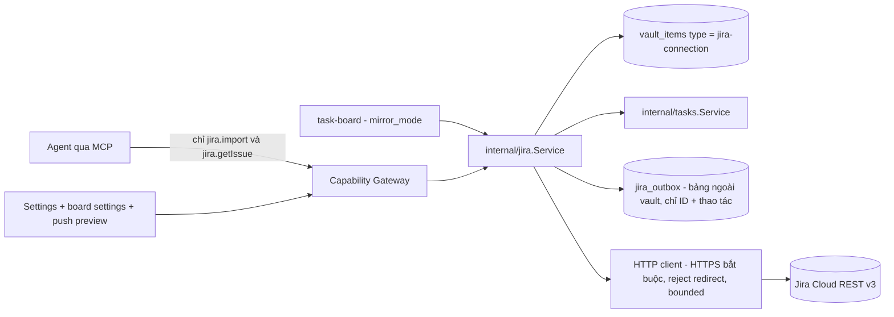
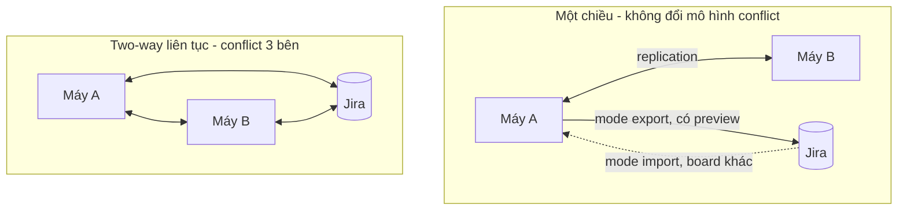
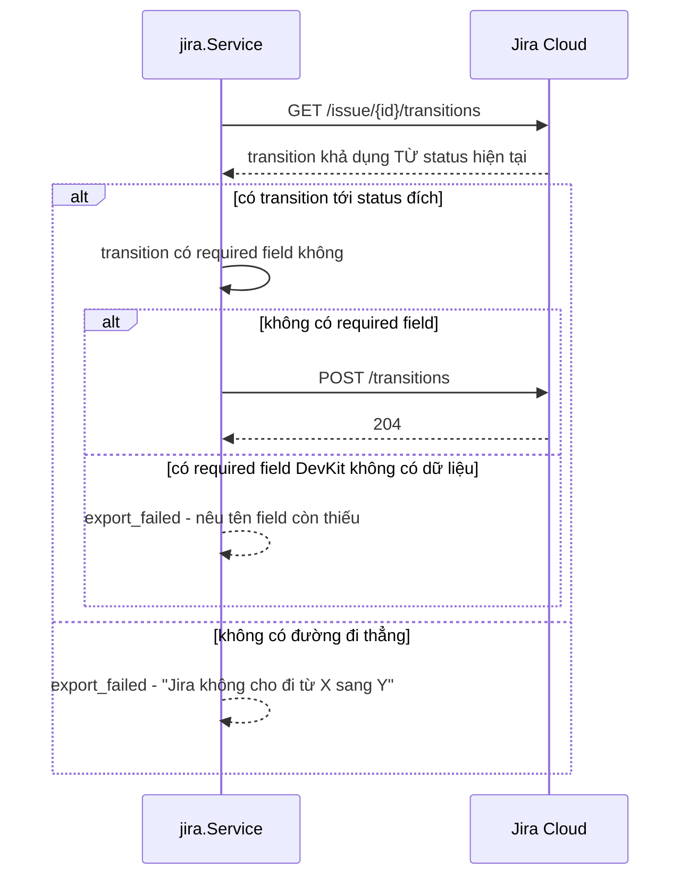
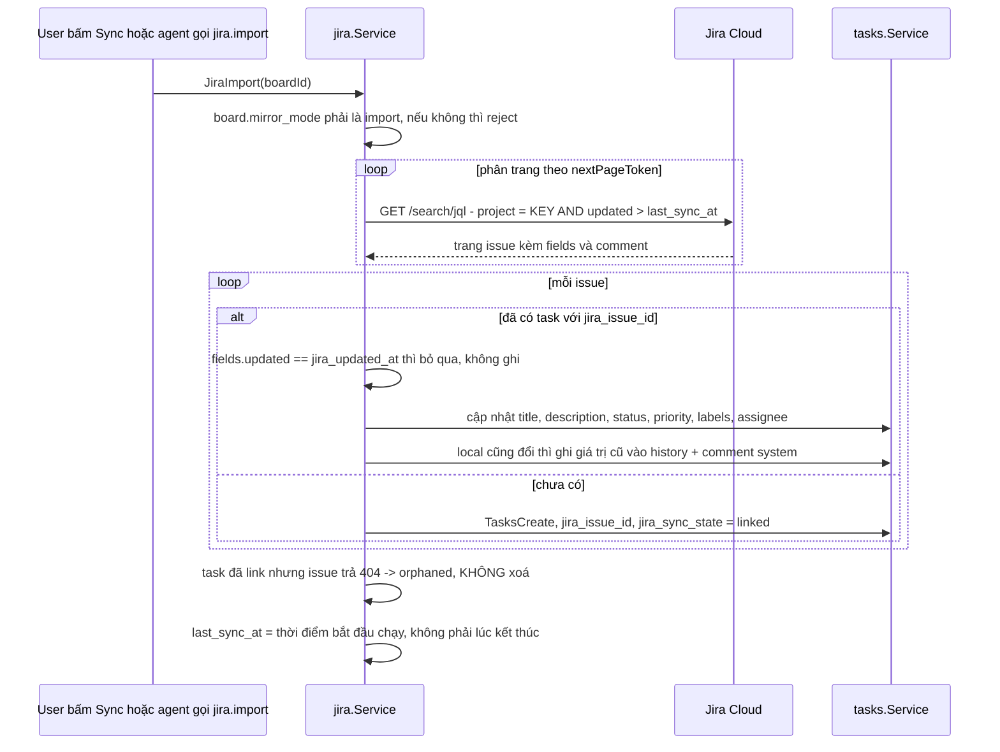
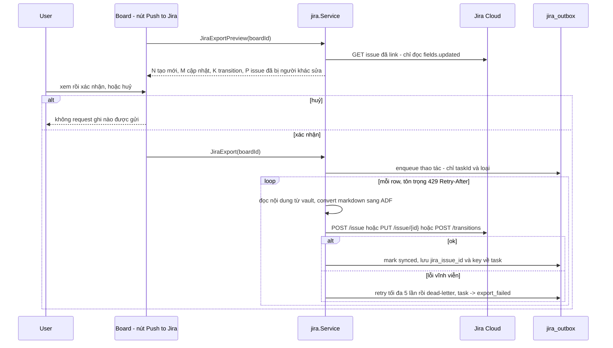

# Jira bridge

Cầu nối giữa [Tasks](/dev-kit/tasks) và **Jira Cloud**: mỗi board chọn đúng
một chiều — `import` (Jira là nguồn sự thật) hoặc `export` (DevKit là nguồn) —
và giữ liên kết bền theo `jira_issue_id` để chạy lại không nhân bản. Đây là
**module đầu tiên của DevKit gửi nội dung ra một SaaS bên thứ ba**, nên trang
này nói thẳng về ranh giới đó trước khi nói về API.

import { Callout } from 'fumadocs-ui/components/callout';
import { Cards, Card } from 'fumadocs-ui/components/card';

<Callout type="warn" title="Design only">
Chưa có runtime. Phụ thuộc [Tasks](/dev-kit/tasks) (Design) và
[Environments](/dev-kit/environments) (Implemented). Thay thế dòng
"Sync board sang Jira/Linear thật" trong
[Tasks § Out of scope](/dev-kit/tasks#out-of-scope-v1).
</Callout>

<Callout type="warn" title="Đây là egress ra bên thứ ba — khác mọi module trước đó">
SSH/Database/Kafka đều kết nối tới host **do user kiểm soát**; sync backend là
zero-knowledge, server không đọc được nội dung ([Data & sync](/dev-kit/data-sync)).
Jira Cloud thì **đọc được toàn bộ** title, description và comment được đẩy lên.
Không sai nguyên tắc — user chủ động bật từng board — nhưng nó là ngoại lệ đầu
tiên với câu "thông tin dự án proprietary không rời máy" mà chính
[Tasks](/dev-kit/tasks) đang viện dẫn làm lý do tồn tại. Module này phải làm
việc đó **rõ ràng và có preview**, không bao giờ ngầm.
</Callout>



## BRD — Business requirement

### Vấn đề

Board của [Tasks](/dev-kit/tasks) chỉ sống trong DevKit. Người dùng làm việc
trong một team đã dùng Jira sẽ rơi vào một trong hai tình huống tệ: hoặc phải
gõ lại backlog của team vào DevKit bằng tay để agent có ngữ cảnh làm việc,
hoặc phải copy kết quả agent làm được ngược lên Jira bằng tay để đồng nghiệp
nhìn thấy. Cả hai đều là lao động thủ công lặp lại đúng thứ mà module Tasks
sinh ra để loại bỏ.

### Mục tiêu (goals)

- Kéo backlog Jira của team về một board local để **agent đọc được ngữ cảnh
  thật** (description, comment, trạng thái) mà không cần người thuật lại.
- Đẩy board local lên Jira để công việc agent làm được **hiện diện với đồng
  nghiệp** mà không phải copy tay.
- Không đụng tới mô hình conflict của [Data & sync](/dev-kit/data-sync) đã
  Implemented và đã pass deployed matrix G1–G4.
- Mọi lần ghi ra ngoài đều **có preview và có xác nhận của người** — không có
  đường nào để agent tự ý đổi tracker của cả team.

### Actors

| Actor | Nhu cầu |
|---|---|
| Developer dùng DevKit | Kéo sprint hiện tại về làm việc; đẩy kết quả lên cho team thấy; biết chính xác cái gì sắp bị đổi trước khi bấm |
| Agent trong Agent Hub | Đọc issue thật (description + comment) để có đủ ngữ cảnh; kéo backlog mới về khi cần |
| Đồng nghiệp trên Jira | Nhìn thấy công việc, và **biết được** comment nào do agent viết chứ không phải người |
| Người triển khai module | Biết rõ chiều nào ghi đè chiều nào, và cái gì bị mất khi chuyển đổi định dạng |

### Functional requirements

| ID | Requirement |
|---|---|
| FR-1 | Tạo được **Jira connection** (site URL, email, API token, `project_key`, **`env` bắt buộc**) — lưu trên `vault_items`, token trong payload mã hoá, cùng pattern `ssh-profile`/`db-profile`/`kafka-profile`. |
| FR-2 | Mỗi board khai `mirror_mode` ∈ `import` \| `export` \| `off` (mặc định `off`) cùng `connection_id`. **Không có mode hai chiều** — xem [Vì sao một chiều](#vì-sao-một-chiều-tại-một-thời-điểm). |
| FR-3 | Liên kết task ↔ issue dùng `jira_issue_id` (số, bền) làm khoá; `jira_issue_key` (`DEV-123`) chỉ để hiển thị vì key đổi khi issue được move project. |
| FR-4 | Chạy import/export lại nhiều lần **không nhân bản** — đã link thì update, chưa link thì tạo. |
| FR-5 | Map trạng thái mặc định qua `statusCategory` của Jira (`new`/`indeterminate`/`done`) ↔ `category` của board (`open`/`active`/`terminal`), ưu tiên khớp tên; board override được bằng `status_map` tường minh. |
| FR-6 | Import kéo issue theo `project` + `updated > last_sync_at`, phân trang; issue không đổi thì không ghi lại record. |
| FR-7 | Import **read-only tuyệt đối** phía Jira: không tạo, không sửa, không transition, không comment ngược. |
| FR-8 | Export có **preview bắt buộc** trước khi gửi: bao nhiêu tạo mới, bao nhiêu update, bao nhiêu transition, và **cảnh báo issue nào đã bị người khác sửa trên Jira** kể từ lần push trước. |
| FR-9 | Export xếp hàng qua outbox có retry + dead-letter — DevKit offline vẫn bấm push được, gửi khi có mạng. |
| FR-10 | Comment do agent viết, khi export lên Jira, **bắt buộc mang prefix nhận dạng** (`[DevKit agent]`) — không được để đồng nghiệp tưởng là người viết. |
| FR-11 | Cả hai chiều, khi bên "thua" có thay đổi bị ghi đè, giá trị cũ được ghi lại vào `history` + comment `kind=system` của task — không mất im lặng. |
| FR-12 | Xoá task local **không** xoá issue trên Jira; chỉ gỡ liên kết. Issue biến mất phía Jira → task chuyển `orphaned`, không bị xoá. |
| FR-13 | Detach thủ công một task khỏi liên kết Jira — task trở thành task local thuần, không còn bị import ghi đè. |
| FR-14 | Agent qua MCP chỉ gọi được `jira.import` và `jira.getIssue`. Mọi thao tác ghi lên Jira và mọi thao tác trên connection là human-only. |

### Non-functional requirements

| ID | Requirement |
|---|---|
| NFR-1 | HTTPS bắt buộc, **không** có ngoại lệ loopback (khác `internal/sync` vốn cho loopback dev); `site_url` phải là https và host hợp lệ — chặn dùng config làm đường SSRF. |
| NFR-2 | Reject redirect; bound request/response/page size; `maxResults` theo cap của Jira (100). Cùng khuôn `HTTPTransport` của [`internal/sync`](/dev-kit/technical-contracts#sync-foundation-contract). |
| NFR-3 | Tôn trọng `429` + `Retry-After` của Jira, backoff luỹ thừa. Đây là API của bên thứ ba — không được spam. |
| NFR-4 | API token không bao giờ vào log, audit metadata, hay error message; `audit.RedactMap` đã che `token` sẵn, nhưng error từ HTTP client phải map về `connection_failed` chứ không pass-through. |
| NFR-5 | Mọi call qua `AppService.call` + Capability Gateway; import từ agent audit kèm `origin = "mcp"` và `session_id`. |
| NFR-6 | Import ghi vào `vault_items` nên cần vault unlocked; export đọc `description` nên cũng cần — trả `vault_locked` structured, không chạy nửa vời. |
| NFR-7 | `jira_outbox` là bảng plaintext ngoài vault chỉ chứa **ID + loại thao tác**, không chứa nội dung; nội dung đọc lại từ vault lúc gửi. Cùng tiền lệ `note_links`/`env_tags`. |
| NFR-8 | Import một project lớn phải bounded và cancel được — không kéo 5.000 issue vào một transaction. |

### Out of scope (v1)

- **Jira Server / Data Center** — REST v2 + wiki markup + PAT auth là một bộ
  adapter và một bộ converter nội dung hoàn toàn khác.
- **OAuth 2.0 (3LO)** — cần đăng ký app + callback; v1 dùng API token.
- **Attachment, custom field, sprint, epic link, worklog, issue link type** —
  xem [Cái gì không đi qua cầu](#cái-gì-không-đi-qua-cầu).
- **Webhook từ Jira** — Jira cần một endpoint public để gọi vào; DevKit là
  loopback-only theo [ADR-006](/dev-kit/architecture-decisions#adr-006-loopback-only-server-mode).
  Vì vậy import **chỉ có polling hoặc thủ công**, không có realtime.
- **JQL tuỳ biến** — v1 cố định `project = <key>`; một board ↔ một project.
- **Linear / GitHub Issues / Asana** — cùng khuôn nhưng khác adapter, làm sau
  nếu có nhu cầu thật.
- **Đi nhiều bước transition** trên Jira — xem [Transition](#transition--jira-không-cho-set-status-trực-tiếp).

### Acceptance criteria

- Tạo connection với API token hợp lệ → `JiraTestConnection` trả về danh sách
  project user có quyền; token sai → `connection_failed`, không lộ chi tiết HTTP.
- Board `mirror_mode = import`, chạy lần đầu → mỗi issue thành một task, status
  khớp đúng `category`; chạy lần hai ngay sau đó → **không** task nào được ghi
  lại (không có issue nào `updated`).
- Issue đổi title trên Jira → import kế tiếp cập nhật task; task local cũng đã
  đổi title từ trước → Jira thắng, giá trị local cũ nằm trong comment `system`.
- Board `mirror_mode = export`, bấm Push → preview liệt kê đúng số tạo mới /
  update / transition; huỷ ở preview → **không** request nào được gửi đi.
- Export một task sang status mà Jira không cho đi thẳng từ status hiện tại →
  row đó `export_failed` với lý do đọc được, các row khác vẫn đi bình thường.
- Comment do agent viết được export → trên Jira hiển thị kèm prefix
  `[DevKit agent]`.
- Xoá task local đã link → issue trên Jira **vẫn còn**.
- Agent gọi `jira.import` trên connection `env = prod` → luôn phải xác nhận,
  kể cả sau khi user đã Allow always ở connection `dev`.
- Agent gọi bất kỳ tool export nào → tool không tồn tại (không phải bị từ chối
  bởi policy).
- Mất mạng giữa chừng khi push → row còn lại ở `pending`, bấm lại gửi tiếp,
  không tạo issue trùng.

## Vì sao một chiều tại một thời điểm

Task đã sync sẵn qua replication của DevKit: máy A ↔ máy B ↔ backend. Cho Jira
làm nguồn ghi thứ hai nghĩa là conflict **ba bên** — bạn sửa offline ở máy A,
sửa offline ở máy B, đồng nghiệp sửa trên Jira.

Mô hình hiện tại không có chỗ cho bên thứ ba: `sync_conflicts` lưu **đúng một**
bản `theirs_snapshot` (migration m11/m15), và `SyncResolveConflict` nhận
`use-ours` \| `use-theirs` \| `merge` — hai lựa chọn, không phải ba. Làm two-way
liên tục nghĩa là thiết kế lại toàn bộ phần đó, tức đụng vào code đã
Implemented và đã pass deployed matrix G1–G4.



Với một chiều, "bên thua" luôn xác định trước theo `mirror_mode`, nên mọi va
chạm giải quyết được bằng một luật đơn giản (bên thắng ghi đè, giá trị cũ vào
history) thay vì một UI resolve mới. Cần cả hai chiều thì dùng **hai board
khác nhau**, mỗi board một chiều — không phải một board hai chiều.

## Data model

### Connection — `type = "jira-connection"`

| Field | At rest | Notes |
|---|---|---|
| `type` | `"jira-connection"` | Schema-validated — record type thứ tư mà Tasks kéo theo |
| `metadata` | `{"name","site_url","email","project_key","env"}` plaintext | `env` bắt buộc, validate qua [Environments](/dev-kit/environments) `EnvLookup.Exists` giống SSH/DB/Kafka |
| `payload` | Envelope V2 của API token | AAD `(jira-connection, <id>, jira-token)`; `key_id` phải = `jira-token` |

<Callout type="warn" title="API token của Jira Cloud không scope được">
Token là **toàn quyền theo tài khoản** — không giới hạn được xuống một project
hay xuống read-only. Nghĩa là một token bị lộ đọc/ghi được mọi thứ tài khoản đó
chạm tới trên Jira, không chỉ project đang mirror. Đây là giới hạn của Jira,
không phải của DevKit; UI phải nói rõ và khuyến nghị tạo token riêng cho DevKit
để revoke được độc lập. Đây cũng là lý do OAuth 3LO (scope được) nằm trong
danh sách làm sau chứ không phải "không cần".
</Callout>

### Board — field thêm vào `task-board`

```json
"jira": {
  "connection_id": "<24hex>",
  "mirror_mode": "import" | "export" | "off",
  "status_map": { "<devkit status id>": "<jira status id>" },
  "last_sync_at": "<RFC3339>",
  "last_export_at": "<RFC3339>"
}
```

Chỉ chứa ID và cấu hình, không chứa secret — an toàn để sync theo record board
như bình thường.

### Task — field thêm vào `task`

| Field | Ý nghĩa |
|---|---|
| `jira_issue_id` | Khoá liên kết **bền** (số). Dùng cái này, không dùng key |
| `jira_issue_key` | `DEV-123` — chỉ để hiển thị và mở link; **đổi** khi issue được move sang project khác |
| `jira_updated_at` | Giá trị `fields.updated` lần cuối thấy — dùng để phát hiện thay đổi ở cả hai chiều |
| `jira_sync_state` | `linked` \| `pending_export` \| `export_failed` \| `orphaned` \| `detached` |

Comment (`task-comment`) thêm `jira_comment_id` để không đẩy trùng.

## Status mapping — `category` đã khớp sẵn

Jira mỗi status có `statusCategory` với đúng ba giá trị. Board của
[Tasks](/dev-kit/tasks#workflow-model--category-mới-là-thứ-logic-dựa-vào) cũng
có đúng ba `category`:

| Jira `statusCategory` | DevKit `category` |
|---|---|
| `new` (To Do) | `open` |
| `indeterminate` (In Progress) | `active` |
| `done` (Done) | `terminal` |

Thuật toán mặc định, **không cần cấu hình gì**:

1. Khớp tên không phân biệt hoa thường trong cùng category (`In Progress` ↔
   `In progress`).
2. Không khớp tên → lấy status **đầu tiên** cùng category theo thứ tự khai báo.
3. Board có `status_map` cho status đó → override, thắng cả hai bước trên.

Bước 2 luôn tìm ra kết quả vì board bắt buộc có **ít nhất một status mỗi
category** (ràng buộc đã chốt ở [Tasks](/dev-kit/tasks)) — ràng buộc đặt ra vì
lý do khác, giờ trả cổ tức ở đây.

Hệ quả tốt: cái gate "agent không tự chuyển sang `terminal`" vẫn đúng nghĩa sau
khi import, vì `Done` của Jira chắc chắn rơi vào `terminal` chứ không phải một
status trung gian nào đó.

## Transition — Jira không cho set status trực tiếp

Jira không có "set status = X". Phải `POST /issue/{id}/transitions` với một
transition id **hợp lệ từ status hiện tại** theo workflow scheme của project.
Còn DevKit thì cố ý **không có transition graph** — mọi status đi được sang mọi
status ([Tasks § Out of scope](/dev-kit/tasks#out-of-scope-v1)).



**Không tự đi nhiều bước** dù về mặt kỹ thuật có thể walk graph. Lý do: mỗi
transition trung gian kích hoạt automation rule, notification và post-function
của Jira ở từng bước — đi vòng qua ba status để tới đích có thể bắn ba lượt mail
cho cả team và chạy vài automation ngoài ý muốn. Tác dụng phụ lên tracker của
người khác không đáng để đổi lấy tiện lợi; báo lỗi rõ để người quyết định.

**Required field trên transition screen** là ca hỏng phổ biến nhất trong thực
tế: nhiều project bắt điền `resolution` khi sang Done. DevKit **không đoán giá
trị** — dừng ở `export_failed` và nêu đúng tên field.

## Chuyển đổi nội dung — ADF

Jira Cloud REST v3 dùng **ADF** (Atlassian Document Format, JSON dạng cây) cho
`description` và `comment.body`. DevKit lưu markdown string
([ADR-010](/dev-kit/architecture-decisions#adr-010-rich-text-plate-note-editor-not-markdown-only)).

| Chiều | Rủi ro | Vì sao |
|---|---|---|
| **Export** markdown → ADF | Thấp | Subset markdown DevKit dùng (heading, list, code block, quote, bold/italic/code, link) **ánh xạ sạch** vào node ADF tương ứng |
| **Import** ADF → markdown | **Lossy** | ADF có node không có tương đương markdown: `panel`, `mediaSingle`, `mention`, `inlineCard`, `status`, `expand`, macro |

Quy tắc degrade khi import — **có đánh dấu, không im lặng**:

| Node ADF | Thành |
|---|---|
| `mention` | `@Tên hiển thị` dạng text thường |
| `inlineCard` / smart link | link markdown bình thường |
| `panel` | blockquote, dòng đầu ghi loại panel |
| `mediaSingle` (attachment) | `[đính kèm: <tên file>](<url Jira>)` — file không tải về (ngoài scope) |
| `status` lozenge | `` `Tên status` `` |
| node lạ | giữ đúng một dòng `<!-- jira:<nodeType> chưa hỗ trợ -->` |

<Callout type="info" title="Vì sao mất mát ở import chấp nhận được">
Ở board `mirror_mode = import`, **Jira mới là nguồn sự thật** — bản đầy đủ luôn
còn nguyên trên Jira, bản local chỉ là bản đọc cho người và agent. Nghĩa là
hướng chuyển đổi lossy chỉ xảy ra đúng ở chiều mà mất mát không phá dữ liệu gốc.
Đây là một hệ quả trực tiếp của quyết định một-chiều-theo-board, không phải may
mắn.
</Callout>

DevKit **không lưu ADF gốc** cạnh markdown — nó sẽ làm phình record đã sync và
tạo nguồn sự thật thứ hai cho cùng một nội dung; cần bản đầy đủ thì mở issue
trên Jira qua `jira_issue_key`.

## Flow

### Import — Jira là nguồn



`last_sync_at` lấy **thời điểm bắt đầu** chạy: issue bị sửa trong lúc import
đang chạy sẽ được kéo lại ở lần sau thay vì lọt qua khe.

Import không gửi bất kỳ request ghi nào tới Jira. Comment tạo local trong board
import mode (kể cả của agent) ở nguyên local, `jira_comment_id = null`.

### Export — DevKit là nguồn, luôn có preview



Preview là **bắt buộc**, không có chế độ "push thẳng". Đây là hành động hướng
ra ngoài và ảnh hưởng tới người khác — cùng lý do
[Kafka](/dev-kit/kafka) giữ `KafkaConnect` là human-only và
[Code Graph](/dev-kit/codegraph) giữ `approvePlan` là human-only.

Cảnh báo "P issue đã bị người khác sửa trên Jira" so `fields.updated` với
`jira_updated_at` — DevKit **phát hiện được** mình sắp ghi đè việc của đồng
nghiệp và nói ra trước, dù mode export nghĩa là DevKit thắng.

### Va chạm hai bên cùng đổi

| Mode | Bên thắng | Bên thua |
|---|---|---|
| `import` | Jira | Giá trị local cũ → `history` + comment `kind=system` |
| `export` | DevKit | Cảnh báo trong preview trước khi ghi đè; giá trị Jira cũ không giữ lại (còn trong history của Jira) |

Không có UI resolve, không có trạng thái conflict mới, không đụng
`sync_conflicts`. Bên thắng xác định trước bởi `mirror_mode` — đó chính là toàn
bộ giá trị của quyết định một chiều.

## Cái gì không đi qua cầu

Ghi rõ để không ai tưởng là bug:

| Không mirror | Vì sao |
|---|---|
| Attachment | Cần storage cho file local + quota; ở import chỉ thành link trỏ về Jira |
| Custom field | Cần một lớp mapping cấu hình phải bảo trì; DevKit lean có chủ đích |
| Sprint / epic link / story point | [Tasks](/dev-kit/tasks) không có khái niệm này (Out of scope v1) |
| Worklog / time tracking | Không có tương đương |
| Issue link type (`blocks`, `relates to`) | Task chỉ có `blocked_by` phẳng, không có kiểu quan hệ |
| Watcher, vote, security level | Khái niệm nhiều-người, DevKit là app cá nhân |
| `session_id`, `plan_node_id`, `history` | Field **local-only** — không có ý nghĩa với Jira, không đẩy lên |

Ngược lại, hai field local-only quan trọng vẫn sống bình thường trên task đã
link: agent vẫn `claim` được task import từ Jira, và task đó vẫn link được tới
plan node của [Code Graph](/dev-kit/codegraph).

## Bridge & capability

Subject luôn `builtin.jira`.

| Method | Capability | Scope | Ghi chú |
|---|---|---|---|
| `JiraListConnections` | `jira:read` | `connection:list` | Chỉ metadata, không token |
| `JiraTestConnection` | `jira:read` | `connection:<id>` | Trả project user có quyền |
| `JiraListProjects` | `jira:read` | `connection:<id>` | Cho form chọn project |
| `JiraGetIssue` | `jira:read` | `connection:<id>` | Đọc một issue không cần link vào board |
| `JiraCreateConnection` | `jira:admin` | `connection:new` | Nhận token trực tiếp |
| `JiraUpdateConnection` | `jira:admin` | `connection:<id>` | |
| `JiraDeleteConnection` | `jira:admin` | `connection:<id>` | Reject nếu còn board đang trỏ tới |
| `JiraSetBoardMirror` | `jira:admin` | `board:<id>` | Đổi `mirror_mode`, `status_map` |
| `JiraImport` | `jira:import` | `board:<id>` | |
| `JiraExportPreview` | `jira:export` | `board:<id>` | Chỉ đọc phía Jira |
| `JiraExport` | `jira:export` | `board:<id>` | Cần một preview token còn hiệu lực |
| `JiraExportStatus` | `jira:read` | `board:<id>` | Trạng thái outbox, row dead-letter |
| `JiraDetachTask` | `jira:admin` | `task:<id>` | Gỡ liên kết, giữ task |

Bốn capability tách theo bản chất, cùng lý do đã áp cho
`kafka:connect`/`kafka:produce`/`kafka:admin`:

- **`jira:read`** — đọc metadata connection và đọc issue.
- **`jira:import`** — ghi vào board local từ Jira. Tách khỏi `jira:read` vì nó
  **có ghi**, chỉ là ghi vào phía local.
- **`jira:export`** — ghi lên Jira. Là capability duy nhất gây tác dụng ngoài
  máy user; cấp riêng để có thể cấp `read`+`import` mà không bao giờ cấp `export`.
- **`jira:admin`** — connection và cấu hình mirror của board.

## MCP tool surface

| MCP tool | Effect | Map sang | Ghi chú |
|---|---|---|---|
| `jira.listConnections` | `read` | `builtin.jira` / `jira:read` / `connection:list` | Không token, không `env` policy của tag khác |
| `jira.getIssue` | `read` | `builtin.jira` / `jira:read` / `connection:<id>` | Gọi ra Jira → hỏi quyền theo `env` tag |
| `jira.import` | `execute` | `builtin.jira` / `jira:import` / `board:<id>` | Gọi ra Jira **và** ghi vào board local → hỏi quyền theo `env` tag |

**Không expose qua MCP, bất kể grant** — hard exclusion cùng nhóm với
`SetupVault` / `SSHTrustHostKey` / `KafkaConnect` / `TasksBoardUpdate`:

- **Mọi thứ export** (`JiraExportPreview`, `JiraExport`) — ghi vào tracker của
  cả team là hành động hướng ra ngoài, ảnh hưởng người ngoài phạm vi DevKit.
  Preview-và-xác-nhận chỉ có nghĩa khi người đọc preview.
- **Connection CRUD** — nhận API token trực tiếp qua tham số; agent client lưu
  tool-input JSON trong transcript của chúng, nằm ngoài biên redaction của
  DevKit (đúng lý do đã ghi ở [MCP / Agent](/dev-kit/mcp-agent)).
- **`JiraSetBoardMirror`** — đổi `mirror_mode` là **đổi chiều ghi đè**. Cho
  agent bật `export` lên là cho nó tự mở đường ghi ra ngoài mà không cần
  `jira:export`.
- **`JiraDetachTask`** — gỡ liên kết là quyết định về việc bỏ theo dõi một
  issue thật.

`jira.import` và `jira.getIssue` đi qua **đúng confirmation gate của
[Environments](/dev-kit/environments)** — connection gắn `env = prod` thì mỗi
lần gọi phải xác nhận, env luôn thắng `allow_always`. Không thêm cơ chế xác
nhận thứ hai.

## UI

- **Settings → Jira** — CRUD connection theo đúng form pattern của
  SSH/Database/Kafka (dropdown `env` load từ `EnvListTags`), nút Test
  connection, cảnh báo token full-account.
- **Board settings** — chọn connection + project + `mirror_mode`, bảng override
  `status_map` (mặc định để trống, hiện mapping tự động đang dùng).
- **Task card / detail** — badge `DEV-123` mở Jira; badge `export_failed` hoặc
  `orphaned` khi có; nút Detach trong overflow menu.
- **Push to Jira** — panel preview đẩy vào `SplitPanel`
  ([Shell primitives](/dev-kit/shell-primitives)), liệt kê theo nhóm
  tạo/cập nhật/transition + danh sách cảnh báo ghi đè, nút xác nhận ở cuối.
- **Sync log** — danh sách row `export_failed` kèm lý do đọc được và nút thử lại.

Board đang ở mode `import` hiển thị rõ trên header là **read-only từ Jira** để
không ai ngạc nhiên khi sửa của mình bị ghi đè ở lần sync sau.

## Error handling

- Toàn bộ lỗi qua `internal/apperrors.AppError`, không tạo bộ code riêng —
  [Error contract](/dev-kit/technical-contracts#error-contract).
- Token sai / site sai / mạng hỏng → `connection_failed`; **không** pass-through
  body lỗi của Jira (có thể chứa chi tiết hạ tầng).
- `JiraImport` trên board `mirror_mode != import` → `validation_failed`, không
  chạy nửa vời.
- `429` → tôn trọng `Retry-After`, không tính vào 5 lần retry của dead-letter
  (đây là backpressure, không phải lỗi).
- Transition không khả dụng / thiếu required field → row `export_failed` với lý
  do cụ thể; **các row khác trong cùng lần push vẫn chạy tiếp** (best-effort
  per-row, cùng semantics `KafkaPublishBatch`).
- Issue trả `404` khi import → task `orphaned`, không xoá.
- Vault locked → `vault_locked` structured.
- `JiraExport` với preview token đã hết hạn hoặc board đã đổi kể từ preview →
  `validation_failed`, bắt xem lại preview. Không push theo một bản chụp cũ.

## Known ceiling (v1)

- **Jira Cloud + API token only** — không Server/DC, không OAuth 3LO.
- **Không realtime**: Jira webhook cần endpoint public, DevKit loopback-only
  ([ADR-006](/dev-kit/architecture-decisions#adr-006-loopback-only-server-mode))
  → chỉ polling hoặc bấm tay.
- Một board ↔ một Jira project; không JQL tuỳ biến, không cross-project.
- Không attachment/custom field/sprint/epic/worklog/issue-link (bảng trên).
- Không đi nhiều bước transition; không đoán giá trị required field.
- ADF → markdown lossy ở chiều import.
- Comment ở board `import` không bao giờ đẩy ngược lên Jira.
- API token không scope được xuống một project.
- Import project rất lớn vẫn là nhiều round-trip tuần tự — bounded và cancel
  được, nhưng không nhanh.
- `parent` (subtask) chỉ link được khi issue cha đã import trong cùng lần chạy
  hoặc lần trước; parent chưa có thì task import ra không có `parent_id`.

## Open questions

- Polling interval cho mode `import`: mặc định **tắt** (chỉ bấm tay) hay bật
  sẵn ở mức thưa? Bật sẵn thì tiêu quota API của user một cách âm thầm.
- Comment do agent viết ở board `export` — đẩy lên Jira kèm prefix
  `[DevKit agent]` (đang thiết kế vậy) hay mặc định giữ local và để user chọn
  từng cái?
- Có cần cả `detached` lẫn nút Detach, hay chỉ cần một badge "khác Jira" là đủ
  và người dùng tự hiểu?
- `JiraDeleteConnection` khi còn board trỏ tới đang reject. Có nên cho xoá kèm
  tự chuyển các board đó về `mirror_mode = off` không, hay bắt user tự xử lý
  trước như `DeleteTag` của [Environments](/dev-kit/environments) đang làm?
- Khi Jira đổi `project_key` (move issue), `jira_issue_key` trên task thành cũ.
  Có nên tự cập nhật key lúc import (đã có `jira_issue_id` để nhận ra) hay giữ
  nguyên và chỉ hiện cảnh báo?
- Module này có nên tổng quát hoá thành `internal/tracker` với adapter
  (Jira/Linear/GitHub Issues) ngay từ v1 không, hay chờ có adapter thứ hai
  thật rồi mới trừu tượng hoá — theo đúng bài học "thiết kế `VendorAdapter` từ
  v1" của [Agent Hub](/dev-kit/agent-hub) so với "không thiết kế trước khi cần"
  của các module khác?

<Cards>
  <Card title="Tasks" href="/dev-kit/tasks" description="Board local mà cầu này nối vào — nguồn của mirror_mode và status category" />
  <Card title="Environments" href="/dev-kit/environments" description="env bắt buộc trên connection; confirmation gate cho jira.import qua MCP" />
  <Card title="Data & sync" href="/dev-kit/data-sync" description="Mô hình conflict hai bên — lý do không làm two-way liên tục" />
  <Card title="MCP / Agent" href="/dev-kit/mcp-agent" description="Hard exclusion và env confirmation gate được tái dùng nguyên" />
  <Card title="Vault" href="/dev-kit/vault" description="jira-connection là thin adapter thứ năm trên vaultitem" />
  <Card title="Security model" href="/dev-kit/security" description="Egress ra bên thứ ba — cần đọc cùng threat model" />
</Cards>
