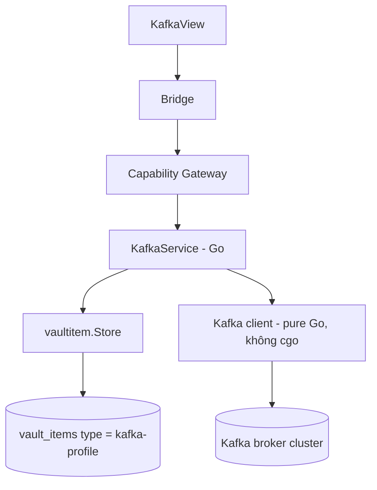
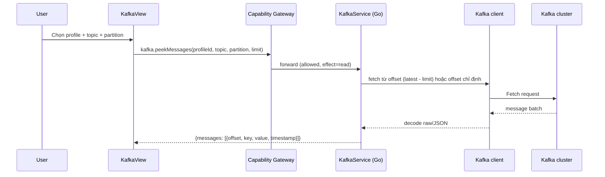

# Kafka UI

Kafka UI là module built-in tương lai giúp dev xem nhanh trạng thái 1 Kafka cluster (topic, message, consumer group lag) ngay trong DevKit thay vì cài riêng 1 desktop client khác hay gõ `kafka-console-consumer` thủ công. V1 **chỉ đọc** — không có produce message, giữ đúng tinh thần least-privilege đã áp cho mọi module khác (agent/UI reachable không có nghĩa mọi action đều mở).

import { Callout } from 'fumadocs-ui/components/callout';

<Callout type="warn" title="Design only">
Trang này là design cho module chưa có runtime trong DevKit checkout hiện tại. Không có `internal/kafka` tại thời điểm viết. Trạng thái implementation thật nằm ở [Implementation status](/dev-kit/implementation-status).
</Callout>

Module đăng ký qua `ModuleManifest` như `vault`/`notes`/`database`/`ssh`/`tools`/`codegraph` hiện có — không tạo registry riêng.

## BRD — Business requirement

### Vấn đề

Khi debug 1 consumer bị lag hoặc muốn xem message thật đang nằm trong topic, dev phải rời DevKit sang 1 tool Kafka UI khác hoặc gõ CLI thủ công — mất context, không tận dụng được connection profile/vault đã có sẵn trong DevKit.

### Mục tiêu (goals)

- Quản lý connection profile Kafka (bootstrap servers, SASL/SSL) qua vault, cùng pattern với SSH/Database.
- List topic, describe partition/replication, peek message gần nhất — không cần rời DevKit.
- Xem consumer group và lag để chẩn đoán nhanh "consumer có đang theo kịp không".
- Expose qua MCP để agent tự tra cứu topic/lag khi debug, không cần hỏi người dùng paste log tay.

### Actors

| Actor | Nhu cầu |
|---|---|
| Developer dùng DevKit | Xem nhanh topic/message/lag mà không rời app, không cài tool khác |
| AI agent (qua MCP) | Tra cứu topic/consumer group khi debug, nhận structured data thay vì phải parse CLI output |
| Người triển khai module | Biết rõ ranh giới read-only v1, không tự ý thêm produce/mutating action |

### Functional requirements

| ID | Requirement |
|---|---|
| FR-1 | User tạo được connection profile Kafka (bootstrap servers, security protocol, SASL mechanism, credential) — lưu qua vaultitem, cùng pattern SSH/Database. |
| FR-2 | List topic trong cluster, kèm số partition + replication factor. |
| FR-3 | Peek N message gần nhất (mặc định nhỏ, ví dụ 50) của 1 topic/partition, từ offset cụ thể hoặc `latest`. |
| FR-4 | List consumer group, kèm lag (current offset vs log-end-offset) theo từng partition. |
| FR-5 | Test connection trước khi lưu profile, trả lỗi rõ ràng nếu auth/broker unreachable. |
| FR-6 | Expose MCP tool cho agent: list profile, list topic, describe topic, peek message, list consumer group. |

### Non-functional requirements

| ID | Requirement |
|---|---|
| NFR-1 | Secret (SASL password, SSL client key) mã hóa qua vaultitem envelope, cùng contract với SSH/DB — không log plaintext. |
| NFR-2 | TLS/SASL default giữ tinh thần [ADR-007](/dev-kit/architecture-decisions#adr-007-verified-tls-for-remote-db-and-exact-ssh-host-key-pinning) — không hạ chuẩn bảo mật cho remote cluster. |
| NFR-3 | Mọi admin call (list topic, describe, peek) phải có timeout, cancel được — không treo UI/MCP nếu broker không phản hồi. |
| NFR-4 | Peek message giới hạn kích thước/số lượng mặc định — không tải nguyên topic lớn vào memory. |
| NFR-5 | Client library thuần Go, không cgo — cùng lý do DevKit đã chọn `modernc.org/sqlite` thay vì driver cgo khác. |

### Out of scope (v1)

- **Produce message** — v1 read-only tuyệt đối, không có nút publish.
- **Schema Registry / Avro / Protobuf decode** — v1 chỉ hiển thị raw bytes hoặc parse JSON nếu payload là JSON text; không tích hợp Confluent Schema Registry.
- Mutating consumer group action (reset offset, rebalance trigger).
- ACL management, multi-cluster mirroring/replication view.
- Produce/consume qua UI dạng terminal tương tác.

### Acceptance criteria

- Tạo 1 profile Kafka hợp lệ, test connection thành công.
- List topic trên cluster có ít nhất 1 topic thật → trả đúng tên + số partition.
- Peek message trên 1 topic có data thật → nội dung khớp message đã biết trước (raw hoặc JSON parse đúng).
- Consumer group có lag thật → số lag hiển thị khớp với giá trị đo được độc lập (vd qua `kafka-consumer-groups.sh`).
- SASL credential sai → lỗi `connection_failed` rõ ràng, không treo UI/MCP.
- Agent gọi `kafka.produce` (nếu vô tình được implement) → phải không tồn tại, không phải bị chặn bởi policy.

## Flow

### Peek message flow

## Technical design

### Components

- **`internal/kafka`** (Go) — orchestrate Kafka client, đọc/ghi vaultitem profile, expose query method (`ListTopics`, `DescribeTopic`, `PeekMessages`, `ListConsumerGroups`).
- **Kafka client library** — pure Go, không cgo (ứng viên: `github.com/twmb/franz-go` hoặc `github.com/segmentio/kafka-go`) — đủ cho admin + consume read-only, không cần producer phức tạp vì v1 không produce.
- **Storage** — connection profile qua `vaultitem.Store` chung, **không** phải store riêng — cùng pattern Notes/Database/SSH theo [ADR-008](/dev-kit/architecture-decisions#adr-008-unified-vault_items-store-for-built-in-item-types). Message/topic data **không** persist — chỉ query on-demand, không cache lâu dài.
- **Bridge + MCP adapter** — cùng gọi `KafkaService`, cùng đi qua Capability Gateway, đúng pattern Code Graph/Agent Hub.

### Vaultitem contract

| Field | Value |
|---|---|
| Record `type` | `kafka-profile` |
| Payload `key_id` | `kafka-secret` |
| Metadata (plaintext) | `name`, `bootstrap_servers` (list), `security_protocol` (`PLAINTEXT`/`SSL`/`SASL_PLAINTEXT`/`SASL_SSL`), `sasl_mechanism` (`PLAIN`/`SCRAM-SHA-256`/`SCRAM-SHA-512`), `username` |
| Payload (encrypted) | SASL password **hoặc** SSL client key |

Nhiều profile cùng lúc (giống SSH/Database) — không phải mô hình "1 active" như Code Graph, vì dev thường có nhiều cluster cố định (dev/staging/prod) cần chuyển qua lại.

### Bridge & capability (design)

| Method | Capability | Scope |
|---|---|---|
| `KafkaListProfiles` | `kafka:connect` | `profile:list` |
| `KafkaCreateProfile` | `kafka:connect` | `profile:new` |
| `KafkaDeleteProfile` | `kafka:connect` | `profile:<id>` |
| `KafkaTestConnection` | `kafka:connect` | `profile:<id>` |
| `KafkaListTopics` | `kafka:connect` | `profile:<id>` |
| `KafkaDescribeTopic` | `kafka:connect` | `profile:<id>` |
| `KafkaPeekMessages` | `kafka:connect` | `profile:<id>` |
| `KafkaListConsumerGroups` | `kafka:connect` | `profile:<id>` |

1 capability `kafka:connect` dùng chung cho toàn bộ — không tách theo action vì v1 toàn bộ đều là read/test, risk profile giống nhau (khác SSH phải tách `ssh:connect`/`ssh:forward` vì `forward` mở network tunnel, risk hẳn khác).

### MCP tool surface (design)

Xem cơ chế chung + rationale ở [MCP / Agent](/dev-kit/mcp-agent).

| MCP tool | Effect | Map sang | Ghi chú |
|---|---|---|---|
| `kafka.listProfiles` | `read` | `builtin.kafka` / `kafka:connect` / `profile:list` | Chỉ metadata, không có secret |
| `kafka.listTopics` | `read` | `builtin.kafka` / `kafka:connect` / `profile:<id>` | |
| `kafka.describeTopic` | `read` | `builtin.kafka` / `kafka:connect` / `profile:<id>` | |
| `kafka.peekMessages` | `read` | `builtin.kafka` / `kafka:connect` / `profile:<id>` | Giới hạn số message mặc định (NFR-4) |
| `kafka.listConsumerGroups` | `read` | `builtin.kafka` / `kafka:connect` / `profile:<id>` | |

Toàn bộ `readOnlyHint = true` — v1 không có tool nào `execute`/`destructiveHint` vì không có produce hay mutating action nào tồn tại. **Không expose `KafkaCreateProfile`/`KafkaDeleteProfile`** qua MCP — nhận secret trực tiếp qua tham số, cùng lý do đã áp cho SSH/Database.

### Error handling

- Broker unreachable / auth fail → `connection_failed`, cùng error contract với SSH/Database (`internal/apperrors`).
- Timeout cho mọi admin call → `operation_cancelled`, không treo UI/MCP vô thời hạn (NFR-3).
- Peek message trên topic/partition không tồn tại → lỗi rõ ràng, không trả mảng rỗng ngầm định.

### Known ceiling (v1)

- Read-only tuyệt đối — không produce, không reset offset, không mutating consumer group action.
- Message decode chỉ raw bytes hoặc JSON text parse — không Avro/Protobuf/Schema Registry.
- Không ACL management, không multi-cluster mirroring view.
- Giới hạn peek mặc định nhỏ (ví dụ 50 message/lần) để tránh treo UI với topic lớn — số cụ thể cần chốt khi implement.

## Open questions

- Giới hạn peek mặc định nên là bao nhiêu message/request — cố định hay user config được?
- Có cần thêm Schema Registry decode (Avro/Protobuf) ở v2 không, hay giữ raw/JSON mãi vì đủ dùng cho debug nhanh?
- Produce message có nên mở ở v2 không, hay giữ Kafka UI vĩnh viễn read-only và để việc produce cho CLI/tool khác chuyên biệt hơn?

import { Cards, Card } from 'fumadocs-ui/components/card';

<Cards>
  <Card title="Vault" href="/dev-kit/vault" description="Substrate mã hóa profile Kafka adapter vào" />
  <Card title="Database" href="/dev-kit/database" description="Cùng pattern connection-profile" />
  <Card title="SSH" href="/dev-kit/ssh" description="Cùng pattern connection-profile" />
  <Card title="MCP / Agent" href="/dev-kit/mcp-agent" />
  <Card title="Architecture decisions" href="/dev-kit/architecture-decisions" description="ADR-007/008: TLS default và unified vault_items" />
</Cards>
