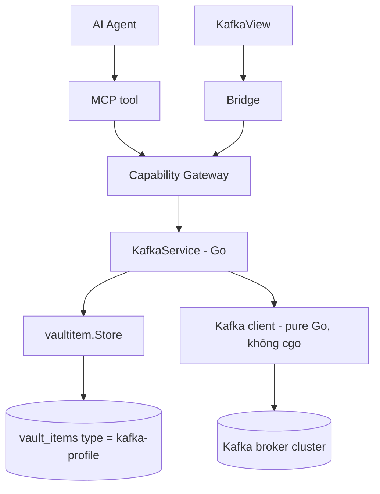
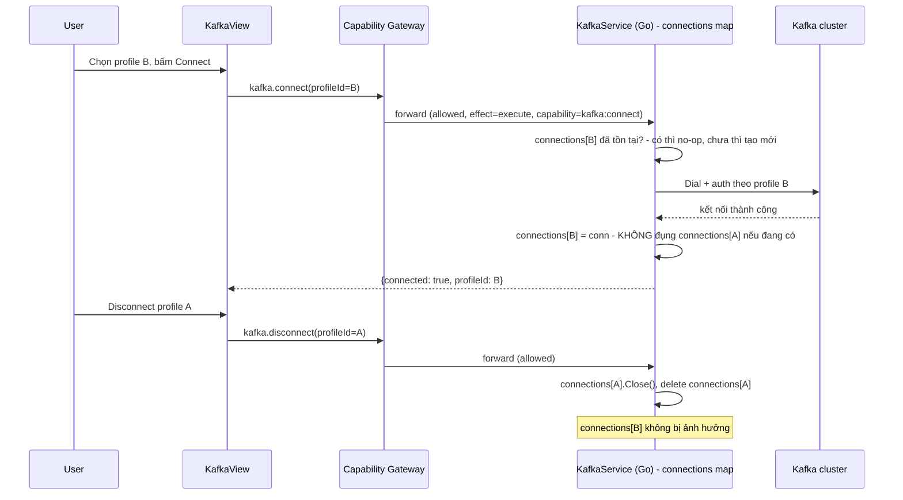
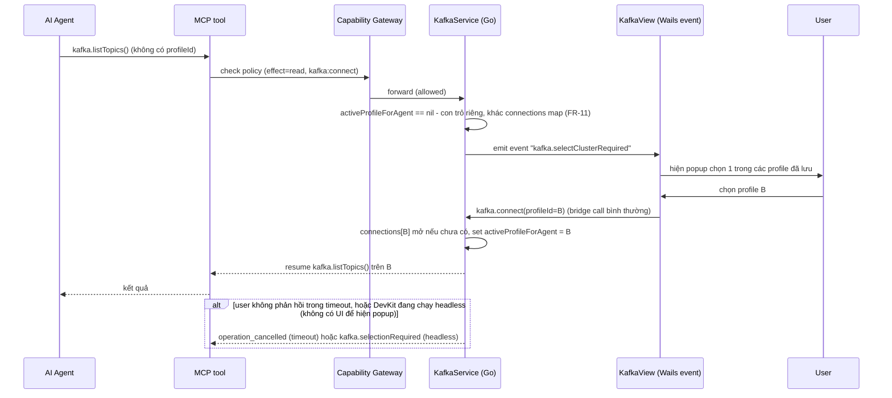
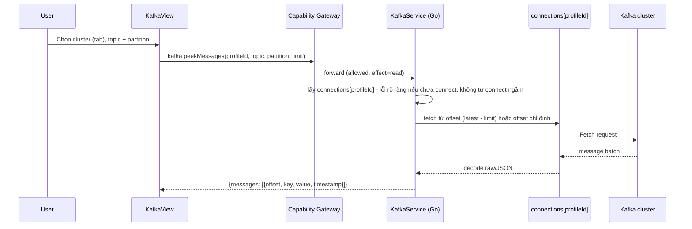
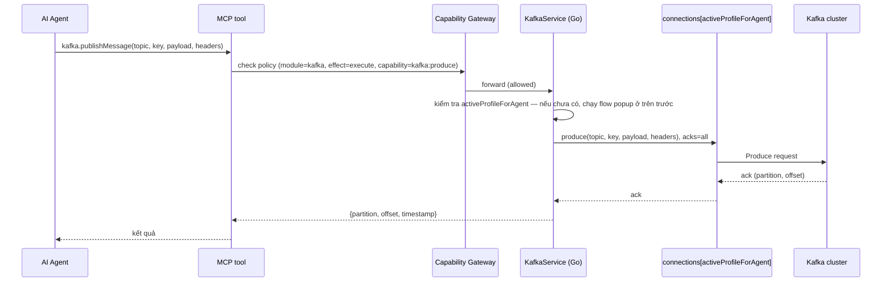
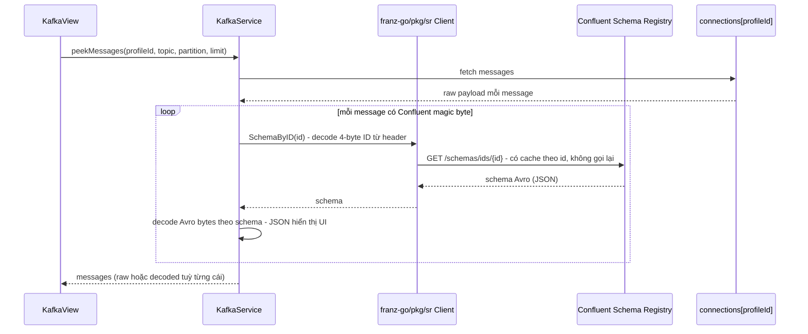
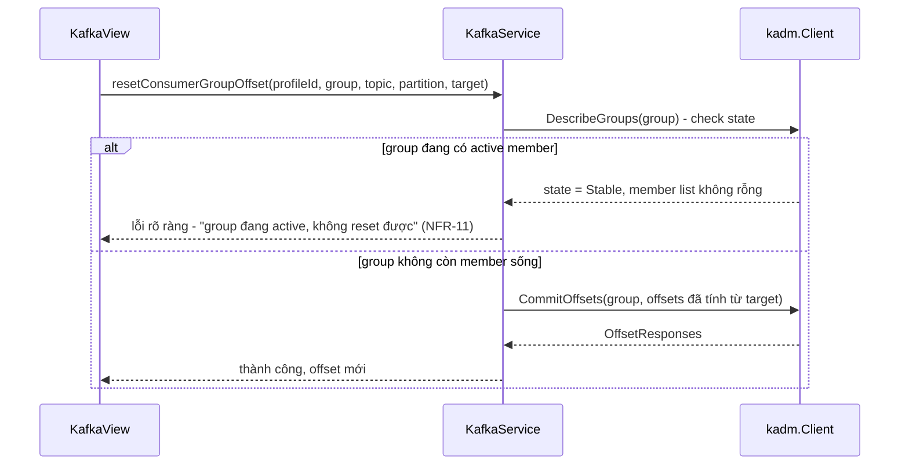
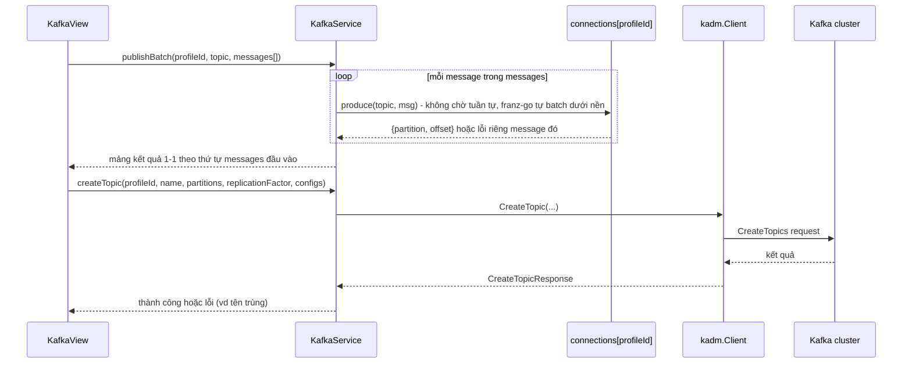

# Kafka UI

Kafka UI là built-in module cho DevKit để làm việc với 1 Kafka cluster — xem topic/partition, peek message, theo dõi consumer group lag, và publish message — mà không rời DevKit hay gõ CLI thủ công. Connection profile (bootstrap servers, SASL/SSL) dùng chung substrate với SSH/Database.

import { Callout } from 'fumadocs-ui/components/callout';

<Callout type="info" title="Implemented — UI + bridge + MCP">
Runtime có `internal/kafka`, bridge `Kafka*`, và UI `KafkaView`. Profiles, connect,
topics, peek, consumer groups, và publish đi qua capability gateway (`kafka:connect` /
`kafka:produce`). MCP tool surface `kafka.*` cũng đã Implemented
(`internal/mcp/tools_kafka.go` + `active_kafka.go`), gồm cluster-selection và env
confirmation gate qua `internal/interaction` — headless thì **fail-fast**, không
auto-approve. Xem [MCP / Agent](/dev-kit/mcp-agent) và
[Implementation status](/dev-kit/implementation-status).
</Callout>

Module đăng ký qua `ModuleManifest` như `vault`/`notes`/`database`/`ssh`/`tools`/`codegraph` hiện có — không tạo registry riêng.

## BRD — Business requirement

### Vấn đề

Khi debug 1 consumer bị lag, muốn xem message thật trong topic, hoặc cần gửi 1 message test để trigger lại 1 flow — dev phải rời DevKit sang tool Kafka UI khác hoặc gõ CLI thủ công, mất context và không tận dụng được connection profile/vault đã có sẵn.

### Mục tiêu (goals)

- Quản lý connection profile Kafka (bootstrap servers, SASL/SSL) qua vault, cùng pattern với SSH/Database.
- List topic, describe partition/replication, peek message gần nhất.
- Xem consumer group và lag để chẩn đoán "consumer có đang theo kịp không".
- Publish message vào topic — cho cả người dùng qua UI và agent qua MCP.
- Expose toàn bộ thao tác trên qua MCP để agent tự tra cứu và publish khi debug, không cần hỏi người dùng làm hộ.

### Actors

| Actor | Nhu cầu |
|---|---|
| Developer dùng DevKit | Xem nhanh topic/message/lag và publish message test, không rời app |
| AI agent (qua MCP) | Tra cứu topic/consumer group và publish message khi debug, nhận structured data thay vì phải parse CLI output |
| Người triển khai module | Biết rõ capability nào gate read, capability nào gate publish, để cấp quyền tách bạch |

### Functional requirements

| ID | Requirement |
|---|---|
| FR-1 | User tạo được connection profile Kafka (bootstrap servers, security protocol, SASL mechanism, credential, **`env` bắt buộc**) — lưu qua vaultitem, cùng pattern SSH/Database đã Implemented (validate qua [Environments](/dev-kit/environments) registry). Lưu được **nhiều** profile cùng lúc. |
| FR-2 | Connect 1 profile để đưa cluster đó thành "online" (`KafkaConnect`). **Nhiều connection sống cùng lúc được** (xem FR-10, superseded model "chỉ 1 connection" ban đầu) — connect profile B **không** đóng connection của profile A. |
| FR-3 | List topic trong cluster đang online, kèm số partition + replication factor. |
| FR-4 | Peek N message gần nhất (mặc định nhỏ, ví dụ 50) của 1 topic/partition trong cluster đang online, từ offset cụ thể hoặc `latest`. |
| FR-5 | List consumer group của cluster đang online, kèm lag (current offset vs log-end-offset) theo từng partition. |
| FR-6 | Test connection cho 1 profile **trước khi lưu** — dùng connection tạm thời riêng, không làm thay đổi cluster đang online. |
| FR-7 | Publish 1 message vào topic của cluster đang online — nhận `key` (optional), `value`/payload, `headers` (optional), `partition` (optional, mặc định để broker tự chọn theo key). Trả về `partition` + `offset` thật của message vừa ghi. |
| FR-8 | Expose MCP tool cho agent: list profile, xem trạng thái connection, list topic, describe topic, peek message, list consumer group, publish message. Không expose `connect`/`disconnect` — chọn cluster luôn là hành động của con người. |
| FR-9 | Khi agent gọi 1 tool cần cluster active mà chưa có, DevKit tự hiện popup cho user chọn 1 trong các profile đã lưu; sau khi chọn, cluster đó giữ nguyên làm active tới khi user tự đổi (vào KafkaView hoặc sidebar) — agent không cần biết/truyền `profileId` ở bất kỳ tool nào. |
| FR-10 | `KafkaService` giữ **nhiều** connection sống cùng lúc, map theo `profileId` (cùng pattern `PoolManager` của [Database](/dev-kit/database), xem Components). Method thao tác trên cluster online (`ListTopics`/`DescribeTopic`/`PeekMessages`/`ListConsumerGroups`/`PublishMessage`/...) nhận **`profileId` tường minh** từ UI — không còn ngầm định "cluster đang online" theo state duy nhất. |
| FR-11 | **"Active cluster cho agent"** (FR-9) là khái niệm **tách biệt** khỏi tập connection UI đang giữ sống — 1 con trỏ riêng, y hệt mô hình `DBSetActiveProfile`/`DBActiveProfile` của Database. Trước FR-10, 2 khái niệm này trùng nhau (chỉ 1 connection nên nó luôn là active); giờ tách bạch thật sự — UI có thể đang mở 3 cluster cùng lúc, agent vẫn chỉ nhắm đúng 1 trong số đó. |
| FR-12 | Decode message Avro khi peek — nếu payload có Confluent wire format (magic byte `0x0` + 4-byte schema ID), tự fetch schema từ Schema Registry theo ID đó, decode ra JSON hiển thị. Payload không phải Avro (không có magic byte) vẫn hiển thị raw/JSON như v1. |
| FR-13 | Encode message Avro khi publish (optional) — user chọn schema (theo subject + version, hoặc schema ID cụ thể) từ Schema Registry, nhập giá trị dạng JSON, DevKit tự encode đúng Confluent wire format trước khi produce. Không chọn schema thì publish raw như v1 (không ép buộc mọi profile phải cấu hình Schema Registry). |
| FR-14 | Reset consumer group offset — cho 1 group + topic + partition (hoặc toàn bộ partition của topic đó), set lại offset về 1 giá trị cụ thể, `earliest`, hoặc `latest`. **Chỉ cho phép khi group không còn active member** (xem Known ceiling) — check trước, reject rõ ràng nếu group đang có consumer sống, không âm thầm chạy rồi bị ghi đè. |
| FR-15 | Publish nhiều message trong 1 call (`KafkaPublishBatch`) — tất cả cùng 1 topic, mỗi message có `key`/`value`/`headers`/`partition` riêng. Trả về mảng kết quả **best-effort theo từng message** (`{partition, offset}` hoặc lỗi riêng) — 1 message fail không chặn các message khác trong batch. |
| FR-16 | Topic management: tạo topic (tên, số partition, replication factor, config tuỳ chọn), xoá topic, đổi config topic đã có (`AlterTopicConfigs`). |
| FR-17 | List consumer group hiển thị breakdown theo **từng member** (client-id, host, danh sách partition member đó đang giữ) — không chỉ tổng lag theo partition như FR-5 v1. Dùng `kadm.DescribeConsumerGroups` + `kadm.Lag` (đã có sẵn trong `franz-go/pkg/kadm`, chưa dùng tới trước bản nâng cấp này). |
| FR-18 | Lag/consumer group view **auto-refresh** khi đang mở (polling interval cố định phía frontend, không cần Wails event push riêng) — không cần user tự bấm lại để thấy số mới. |

### Non-functional requirements

| ID | Requirement |
|---|---|
| NFR-1 | Secret (SASL password, SSL client key) mã hóa qua vaultitem envelope, cùng contract với SSH/DB — không log plaintext. |
| NFR-2 | TLS/SASL default giữ tinh thần [ADR-007](/dev-kit/architecture-decisions#adr-007-verified-tls-for-remote-db-and-exact-ssh-host-key-pinning) — không hạ chuẩn bảo mật cho remote cluster. |
| NFR-3 | Mọi call tới broker (admin lẫn publish) có timeout, cancel được — không treo UI/MCP nếu broker không phản hồi. |
| NFR-4 | Peek message giới hạn kích thước/số lượng mặc định — không tải nguyên topic lớn vào memory. |
| NFR-5 | Client library thuần Go, không cgo — cùng lý do DevKit đã chọn `modernc.org/sqlite` thay vì driver cgo khác. |
| NFR-6 | Producer **không** tự tạo topic khi topic đích chưa tồn tại (`allow.auto.create.topics = false` phía client) — publish vào topic sai tên phải fail rõ ràng, không âm thầm tạo topic rác. |
| NFR-7 | Publish dùng `acks = all` mặc định — chỉ trả thành công khi broker xác nhận ghi, không báo thành công sớm rồi mất message. |
| NFR-8 | **(Sửa theo FR-10)** Đóng 1 connection cụ thể (`KafkaDisconnect(profileId)`) phải atomic — không race với request đang chạy dở trên **đúng connection đó**; request đang chạy dở khi connection bị đóng phải trả lỗi rõ ràng, không panic. Connection của các profile khác **không bị ảnh hưởng** (khác v1 — trước đây đóng 1 = ngầm định đóng "connection duy nhất", giờ mỗi `profileId` độc lập). |
| NFR-9 | Popup chọn cluster (khi agent gọi mà chưa có active) phải có timeout hữu hạn — không block MCP call vô thời hạn chờ user. DevKit chạy headless (không có UI) phải fail ngay thay vì cố hiện popup không tồn tại. |
| NFR-10 | Schema Registry client (`franz-go/pkg/sr`) có timeout/cancel riêng, độc lập với timeout gọi broker (NFR-3) — Schema Registry chậm/down không được treo cả peek/publish nếu message đó hoá ra không phải Avro. |
| NFR-11 | Reset offset **không** silent-succeed nếu group đang active — DevKit tự check (`kadm.DescribeGroups`/`ListGroups` state) trước khi gọi `CommitOffsets`, reject rõ ràng nếu phát hiện member đang sống, không để broker âm thầm ghi đè offset ở lần commit tiếp theo của consumer. |

### Out of scope (v1)

- **Protobuf** — chỉ Avro ở bản nâng cấp này (xem FR-12/FR-13); Protobuf cần resolve descriptor phức tạp hơn hẳn, để sau khi có nhu cầu thật.
- Rebalance trigger thủ công (khác reset offset — FR-14 chỉ đổi offset, không can thiệp assignment).
- ACL management, multi-cluster mirroring/replication view.
- Terminal tương tác kiểu `kafka-console-producer`/`consumer` — cân nhắc rồi bỏ, xem lý do ở
  [Terminal](/dev-kit/terminal#non-goals) (governance/Capability Gateway bị bypass nếu chạy CLI thật kết nối broker riêng).
- Batch publish nhiều **topic** trong 1 call (FR-15 chỉ 1 topic/batch) — atomic/transactional producer.

### Acceptance criteria

- Tạo 1 profile Kafka hợp lệ, test connection thành công (chưa cần connect thật).
- Connect profile A → `kafka.connectionStatus` trả đúng A đang online.
- Đang connect A, connect thêm profile B (FR-10) → **cả 2 cùng online**, `KafkaListTopics(A)`/`KafkaListTopics(B)` trả đúng dữ liệu từng cluster, không lẫn nhau. Agent qua MCP (không truyền `profileId`) vẫn chỉ thấy đúng 1 "active cluster" (FR-11), độc lập với việc UI đang mở mấy connection.
- `KafkaDisconnect(A)` trong lúc B vẫn đang online → B không bị ảnh hưởng, request đang chạy trên B vẫn tiếp tục bình thường.
- Agent gọi `kafka.listTopics`/`kafka.peekMessages`/`kafka.publishMessage` khi **chưa có cluster active** → DevKit hiện popup chọn profile; user chọn xong, call gốc tự resume trên cluster vừa chọn, không phải gọi lại thủ công.
- Peek 1 message Avro thật (có Confluent wire format) trên topic đã đăng ký Schema Registry → hiển thị đúng field decode từ schema, không phải raw byte.
- Publish 1 message chọn schema Avro → message ghi xuống đúng wire format, consume lại bằng tool ngoài hỗ trợ Avro (vd `kafka-avro-console-consumer`) ra đúng nội dung.
- Reset offset cho 1 group **đang có active member** → reject rõ ràng (NFR-11), không chạy.
- Reset offset cho 1 group đã dừng hết consumer → offset đổi đúng giá trị yêu cầu, verify lại bằng `kafka-consumer-groups.sh --describe`.
- `KafkaPublishBatch` với 5 message, 1 message payload lỗi (vd vi phạm schema Avro đã chọn) → 4 message còn lại vẫn ghi thành công, kết quả trả về đúng 4 success + 1 lỗi riêng, không phải toàn bộ batch fail.
- Tạo topic mới qua `KafkaCreateTopic` → xuất hiện ngay trong `KafkaListTopics`, đúng số partition/replication factor đã chọn.
- Xoá topic → biến mất khỏi `KafkaListTopics`, publish vào tên đó sau khi xoá phải fail (NFR-6 vẫn áp dụng, topic không tự tạo lại).
- List consumer group có ít nhất 1 member đang sống → hiển thị đúng client-id/host/partition đang giữ (FR-17), khớp `kafka-consumer-groups.sh --describe --members`.
- User không phản hồi popup trong timeout → `operation_cancelled`, không treo MCP call vô thời hạn.
- DevKit chạy headless và chưa có cluster active → `kafka.selectionRequired` ngay lập tức, không cố hiện popup.
- List topic trên cluster đang online có ít nhất 1 topic thật → trả đúng tên + số partition.
- Peek message trên 1 topic có data thật → nội dung khớp message đã biết trước (raw hoặc JSON parse đúng).
- Consumer group có lag thật → số lag hiển thị khớp với giá trị đo được độc lập (vd qua `kafka-consumer-groups.sh`).
- Publish 1 message qua UI vào topic thật (đã connect cluster đó) → message xuất hiện đúng nội dung khi consume lại bằng tool ngoài (vd `kafka-console-consumer`).
- Agent gọi `kafka.publishMessage` qua MCP với `topic`/`payload` hợp lệ (không truyền `profileId`) khi đã có cluster active đúng ý → nhận lại `partition`+`offset` thật, message consume lại đúng nội dung.
- Publish vào topic không tồn tại → lỗi rõ ràng, topic không bị tự động tạo (NFR-6).
- SASL credential sai → lỗi `connection_failed` rõ ràng, không treo UI/MCP.

## Flow

### Connect / disconnect cluster flow (FR-10 — nhiều connection sống cùng lúc)

<Callout type="warn" title="Supersedes model 'chỉ 1 connection sống' ở v1">
`KafkaService` từng giữ đúng 1 `activeConn` — connect profile khác tự đóng
connection hiện tại (NFR-8 gốc). Từ FR-10, connect nhiều profile cùng lúc
được, mỗi profile 1 connection độc lập — cùng pattern `PoolManager` của
[Database](/dev-kit/database) (`map[profileID]*pgxpool.Pool`, sống suốt vòng
đời app). "Active cluster cho agent" (FR-9/FR-11) tách thành con trỏ riêng,
không còn ngầm định trùng "connection duy nhất".
</Callout>

`kafka.connect`/`kafka.disconnect` là **bridge method, không phải MCP tool** — chỉ UI (KafkaView hoặc sidebar quick-switch) gọi được, agent không tự chọn cluster. Đây là human-only action, cùng nguyên tắc đã áp cho unlock vault / trust SSH host-key. Từ FR-10, cả 2 method đều nhận `profileId` tường minh (trước đây `kafka.disconnect` không cần tham số vì chỉ có 1 connection để đóng).

### Agent gọi khi chưa có cluster active (popup chọn)

Lựa chọn của user **sticky** — giữ nguyên làm active cluster cho tới khi user tự đổi (vào KafkaView hoặc sidebar chọn lại), không tự động reset giữa các lần gọi MCP.

### Peek message flow

### Publish message flow (agent qua MCP)

### Schema Registry decode/encode flow (Avro)

- **`ConfluentHeader.DecodeID`** (`franz-go/pkg/sr`) tách đúng 4-byte schema ID từ 5-byte header chuẩn Confluent — không tự parse tay.
- **Cache schema theo ID trong phiên** — 1 schema ID không đổi nội dung bao giờ (Schema Registry là append-only theo ID), fetch 1 lần dùng lại cho mọi message cùng ID, không gọi `SchemaByID` lặp lại mỗi message.
- **Encode publish** (FR-13) đối xứng: `RegisterSchema`/`SchemaByVersion` lấy đúng schema, encode Avro, `ConfluentHeader.AppendEncode` gắn header trước khi produce.
- Timeout Schema Registry tách riêng (NFR-10) — 1 request tới `Reg` chậm không được treo cả peek đang chờ nhiều message.

### Reset consumer group offset flow

- `target` là 1 offset cụ thể, hoặc `earliest`/`latest` — 2 giá trị đặc biệt tự resolve qua `kadm.ListStartOffsets`/`ListEndOffsets` trước khi `CommitOffsets`.
- **Không expose MCP** — agent tự reset offset là hành động phá dữ liệu tiến trình (consumer có thể đọc lại/bỏ lỡ message thật), giữ human-only cùng nguyên tắc `KafkaConnect`.

### Batch publish + Topic management flow

- Batch publish tận dụng buffering/batching **có sẵn** của `kgo.Client` (franz-go tự gom message thành batch network-level) — không cần tự viết logic gom, chỉ gọi `Produce` liên tục và thu kết quả qua callback, không đổi client library.
- `CreateTopic`/`DeleteTopic`/`AlterTopicConfigs` đều qua `kadm.Client` — **đã có sẵn** trong `internal/kafka/client.go` (`adm *kadm.Client`, hiện chưa dùng gì ngoài giữ tham chiếu), không cần thêm dependency.

## Technical design

### Components

- **`internal/kafka`** (Go) — orchestrate Kafka client, đọc/ghi vaultitem profile, expose query method (`ListTopics`, `DescribeTopic`, `PeekMessages`, `ListConsumerGroups`, `PublishMessage`, và các method mới ở trên). Từ FR-10, giữ `connections map[string]*kafkaConnection` (theo `profileId`, kèm mutex) — **không còn** 1 field `activeConn` duy nhất, cùng pattern `PoolManager` của [Database](/dev-kit/database).
- **Kafka client library**: `github.com/twmb/franz-go` (đã chọn, đã trong `go.mod`) — pure Go, không cgo. `franz-go/pkg/kadm` cho admin operation (topic CRUD, offset reset, describe group/lag) — đã wire sẵn (`adm *kadm.Client`), chỉ chưa dùng tới trước bản nâng cấp này. `franz-go/pkg/sr` cho Schema Registry client (mới, cùng module family, không phải dependency lạ).
- **Avro codec**: `github.com/hamba/avro/v2` (mới) — encode/decode theo schema JSON lấy từ `sr.Client`, `franz-go/pkg/sr` tự nó không làm codec, chỉ là HTTP client cho Schema Registry.
- **Backend → frontend event cho popup chọn cluster** — khi agent gọi 1 tool cần `activeProfileForAgent` mà chưa có, `KafkaService` emit Wails event (`runtime.EventsEmit`) để `KafkaView` hiện popup chọn profile, rồi block call gốc tới khi UI gọi lại `KafkaConnect` hoặc hết timeout. Đây vẫn là hướng backend-initiated push đầu tiên trong DevKit, không đổi từ v1.
- **Storage** — connection profile qua `vaultitem.Store` chung, **không** phải store riêng — cùng pattern Notes/Database/SSH theo [ADR-008](/dev-kit/architecture-decisions#adr-008-unified-vault_items-store-for-built-in-item-types). Message/topic data **không** persist — chỉ query/publish on-demand, không cache lâu dài. Schema Avro cũng **không** cache xuống disk — chỉ cache trong memory theo phiên (mục Schema Registry flow), refetch khi app restart.
- **Bridge + MCP adapter** — cùng gọi `KafkaService`, cùng đi qua Capability Gateway, đúng pattern Code Graph/Agent Hub.

### Vaultitem contract

| Field | Value |
|---|---|
| Record `type` | `kafka-profile` |
| Payload `key_id` | `kafka-secret` |
| Metadata (plaintext) | `name`, `bootstrap_servers` (list), `security_protocol` (`PLAINTEXT`/`SSL`/`SASL_PLAINTEXT`/`SASL_SSL`), `sasl_mechanism` (`PLAIN`/`SCRAM-SHA-256`/`SCRAM-SHA-512`), `username`, **`env`** (`dev`\|`stg`\|`prod`, **bắt buộc**), `schema_registry_url` (optional), `schema_registry_auth` (optional, username cho basic auth nếu registry yêu cầu) |
| Payload (encrypted) | SASL password **hoặc** SSL client key, **và** `schema_registry_password` nếu `schema_registry_auth` có set |

`env` không có giá trị mặc định/rỗng — `KafkaCreateProfile` reject nếu thiếu. Dùng để gắn nhãn rủi ro cho popup xác nhận MCP — xem [MCP / Agent § `env` bắt buộc](/dev-kit/mcp-agent).

`schema_registry_url` **optional** — profile không cấu hình thì peek/publish luôn raw/JSON như v1 (FR-12/13 không ép buộc). Config Schema Registry nằm chung 1 profile với broker, không tách record riêng — cùng vòng đời tạo/sửa/xoá, đơn giản hơn quản lý 2 loại record cho 1 cluster.

Hai tầng tách riêng: **lưu trữ** nhiều profile cùng lúc (giống SSH/Database, vì dev thường có nhiều cluster cố định dev/staging/prod cần cấu hình sẵn), và từ FR-10 **kết nối** cũng nhiều cùng lúc được — không còn giới hạn "1 active" ở tầng connection nữa (khác Code Graph, vẫn giữ đúng 1 project active).

### Bridge & capability (Implemented — cập nhật theo FR-10..FR-18)

| Method | Capability | Scope |
|---|---|---|
| `KafkaListProfiles` | `kafka:connect` | `profile:list` |
| `KafkaCreateProfile` | `kafka:connect` | `profile:new` |
| `KafkaDeleteProfile` | `kafka:connect` | `profile:<id>` |
| `KafkaTestConnection` | `kafka:connect` | `profile:<id>` |
| `KafkaConnect` | `kafka:connect` | `profile:<id>` |
| `KafkaDisconnect` | `kafka:connect` | `profile:<id>` |
| `KafkaConnectionStatus` | `kafka:connect` | `profile:<id>` |
| `KafkaListTopics` | `kafka:connect` | `profile:<id>` |
| `KafkaDescribeTopic` | `kafka:connect` | `profile:<id>` |
| `KafkaPeekMessages` | `kafka:connect` | `profile:<id>` |
| `KafkaListConsumerGroups` | `kafka:connect` | `profile:<id>` |
| `KafkaPublishMessage` | `kafka:produce` | `profile:<id>` |
| `KafkaPublishBatch` | `kafka:produce` | `profile:<id>` |
| `KafkaCreateTopic` | `kafka:admin` | `profile:<id>` |
| `KafkaDeleteTopic` | `kafka:admin` | `profile:<id>` |
| `KafkaAlterTopicConfig` | `kafka:admin` | `profile:<id>` |
| `KafkaResetConsumerGroupOffset` | `kafka:admin` | `profile:<id>` |

3 capability tách riêng: `kafka:connect` (quản lý profile + vòng đời connection + đọc dữ liệu cluster), `kafka:produce` (publish, kể cả batch), và `kafka:admin` **mới** (topic CRUD + reset offset — hành động thay đổi cấu trúc/state cluster, khác hẳn publish 1 message hay chỉ đọc). Tách riêng để có thể cấp `kafka:connect`+`kafka:produce` mà **không** cấp `kafka:admin` — dev thường xuyên publish message test nhưng hiếm khi cần tạo/xoá topic.

**Đổi từ v1**: mọi method (trừ `KafkaListProfiles`/`KafkaCreateProfile`/`KafkaDeleteProfile`/`KafkaTestConnection`) giờ nhận `profileId` tường minh, scope `profile:<id>` thay vì scope cố định `connection` — vì FR-10 cho nhiều connection sống cùng lúc, không còn 1 "connection đang online" duy nhất để ngầm định.

`KafkaConnect`/`KafkaDisconnect` **là bridge method, chỉ UI gọi được** (từ KafkaView hoặc sidebar, hoặc gián tiếp từ popup ở flow "Agent gọi khi chưa có cluster active"). Agent không tự chọn cluster. `KafkaCreateTopic`/`KafkaDeleteTopic`/`KafkaAlterTopicConfig`/`KafkaResetConsumerGroupOffset` — xem quyết định MCP exposure ở mục dưới.

### MCP tool surface

Xem cơ chế chung + rationale ở [MCP / Agent](/dev-kit/mcp-agent).

| MCP tool | Effect | Map sang | Ghi chú |
|---|---|---|---|
| `kafka.listProfiles` | `read` | `builtin.kafka` / `kafka:connect` / `profile:list` | Chỉ metadata, không có secret |
| `kafka.connectionStatus` | `read` | `builtin.kafka` / `kafka:connect` / `profile:active` | Trả `{connected: bool, profileId?}` — agent chỉ đọc được cluster nào đang active, không tự đổi |
| `kafka.listTopics` | `read` | `builtin.kafka` / `kafka:connect` / `profile:active` | Thao tác trên cluster đang active; nếu chưa có → trigger popup chọn, xem flow ở trên. Hỏi quyền theo policy env tag (xem dưới) |
| `kafka.describeTopic` | `read` | `builtin.kafka` / `kafka:connect` / `profile:active` | Input: `topic`. Hỏi quyền theo policy env tag (xem dưới) |
| `kafka.peekMessages` | `read` | `builtin.kafka` / `kafka:connect` / `profile:active` | Input: `topic`, `partition`, `limit?`. Giới hạn số message mặc định (NFR-4). Auto-decode Avro nếu profile có Schema Registry (FR-12) — agent nhận JSON đã decode, không cần tự xử lý wire format. Hỏi quyền theo policy env tag (xem dưới) |
| `kafka.listConsumerGroups` | `read` | `builtin.kafka` / `kafka:connect` / `profile:active` | Kèm breakdown member (FR-17). Hỏi quyền theo policy env tag (xem dưới) |
| `kafka.publishMessage` | `execute` (`destructiveHint`) | `builtin.kafka` / `kafka:produce` / `profile:active` | Input: `topic`, `key?`, `payload`, `headers?`, `partition?`. Output: `{partition, offset, timestamp}`. Cluster đích luôn là cluster đang active — agent không truyền `profileId`. Hỏi quyền theo policy env tag (xem dưới) |
| `kafka.publishBatch` | `execute` (`destructiveHint`) | `builtin.kafka` / `kafka:produce` / `profile:active` | Input: `topic`, `messages[]`. Output: mảng kết quả best-effort (FR-15). Hỏi quyền theo policy env tag (xem dưới) |
| `kafka.createTopic` | `execute` | `builtin.kafka` / `kafka:admin` / `profile:active` | Additive, không phá dữ liệu có sẵn — expose được. Hỏi quyền theo policy env tag (xem dưới) |

`kafka.connect`/`kafka.disconnect` **không phải MCP tool** — cùng lý do "human-only action" đã ghi ở mục Bridge & capability. Cũng **không expose `KafkaCreateProfile`/`KafkaDeleteProfile`** qua MCP — nhận secret trực tiếp qua tham số, cùng lý do đã áp cho SSH/Database.

**Không expose qua MCP**: `kafka.deleteTopic`/`kafka.alterTopicConfig` (phá/đổi cấu trúc topic đã có — khác `createTopic` chỉ thêm mới) và `kafka.resetConsumerGroupOffset` (đổi state tiến trình đang chạy của hệ thống downstream) — cả 3 giữ human-only, agent không tự ý chạy được dù có `kafka:admin`.

**"Hỏi quyền theo policy env tag"**: vì `env` là field bắt buộc trên mọi profile (FR-1), mọi tool `read`/`execute` ở trên (trừ `kafka.listProfiles`/`kafka.connectionStatus`) tra `requiresConfirmation` của tag đó ([Environments](/dev-kit/environments)) trước khi chạy — nếu tag đó bật xác nhận, call phải qua xác nhận tương tác mỗi lần (Allow/Deny), **env luôn thắng** mọi `allow_always` đã nhớ; nếu tag không bật confirmation, dialog có thể Offer Allow always (cache theo tool tới restart). `env=prod` **luôn** bật (khóa cứng); `dev`/`stg` mặc định tắt nhưng bật lên được. Chi tiết: [MCP / Agent](/dev-kit/mcp-agent).

### Error handling

- Broker unreachable / auth fail (`KafkaConnect` hoặc `KafkaTestConnection`) → `connection_failed`, cùng error contract với SSH/Database (`internal/apperrors`).
- Gọi 1 method cần `profileId` (`ListTopics`, `DescribeTopic`, `PeekMessages`, `ListConsumerGroups`, `PublishMessage`, ...) mà profile đó **chưa connect** → lỗi rõ ràng, **không** tự connect ngầm (khác agent qua MCP — agent không truyền `profileId` nên mới cần popup chọn active).
- Agent gọi 1 tool cần cluster active mà chưa có → trigger popup chọn cluster (không lỗi ngay), chờ user chọn trong timeout rồi resume call gốc.
- User không phản hồi popup trong timeout (đề xuất mặc định vài phút, cần chốt số cụ thể khi implement) → `operation_cancelled`.
- DevKit đang chạy headless/server mode (không có UI để hiện popup — [ADR-006](/dev-kit/architecture-decisions#adr-006-loopback-only-server-mode)) và chưa có active cluster → `kafka.selectionRequired` ngay lập tức, không chờ.
- Timeout cho mọi call tới broker (admin lẫn publish) → `operation_cancelled`, không treo UI/MCP vô thời hạn (NFR-3).
- Peek message trên topic/partition không tồn tại → lỗi rõ ràng, không trả mảng rỗng ngầm định.
- Publish vào topic không tồn tại → lỗi rõ ràng, topic **không** tự tạo (NFR-6). Publish không nhận `acks` xác nhận từ broker trong timeout → `operation_cancelled`, không báo thành công khi chưa chắc chắn broker đã ghi.
- Request đang chạy trên 1 connection bị `KafkaDisconnect` giữa chừng (NFR-8) → `operation_cancelled` cho đúng connection đó, connection khác không bị ảnh hưởng, không panic.
- Peek message Avro mà Schema Registry không phản hồi (NFR-10) → lỗi decode riêng cho message đó, **không** chặn các message khác trong cùng lần peek (mỗi message decode độc lập).
- Reset offset khi group đang active (NFR-11) → lỗi rõ ràng ngay từ `DescribeGroups`, không gọi `CommitOffsets`.
- `KafkaPublishBatch` — 1 message lỗi không chặn message khác (FR-15); lỗi trả kèm theo từng message trong mảng kết quả, không phải throw dừng cả batch.
- `KafkaCreateTopic` với tên đã tồn tại → lỗi rõ ràng, không âm thầm no-op hay ghi đè config cũ.

### Known ceiling (v1)

- **Protobuf chưa hỗ trợ** — chỉ Avro (FR-12/13); publish/peek message Protobuf vẫn hiển thị raw bytes như trước nâng cấp.
- Không ACL management, không multi-cluster mirroring view.
- Giới hạn peek mặc định nhỏ (ví dụ 50 message/lần) để tránh treo UI với topic lớn — số cụ thể cần chốt khi implement.
- Reset offset **yêu cầu group không còn active member** (NFR-11) — không có đường "force reset" bất chấp consumer đang chạy, đúng theo semantics thật của Kafka offset commit (dễ bị consumer đang sống ghi đè ngay).
- Batch publish chỉ 1 topic/lần, không atomic (best-effort per-message, FR-15) — cần atomic thật thì phải Kafka transactional producer, ngoài phạm vi.
- Schema decode/encode chỉ dùng cache trong phiên (memory), không persist qua restart — app khởi động lại thì fetch lại từ Schema Registry ở lần dùng đầu tiên.
- Agent qua MCP vẫn chỉ có 1 "active cluster" (FR-11) dù UI giờ xem được nhiều — agent cần cluster khác với cluster đang active chỉ có thể báo cho user, không tự gọi connect.

## Open questions

- Giới hạn peek mặc định nên là bao nhiêu message/request — cố định hay user config được?
- Publish có cần rate limit riêng (per profile hoặc per subject) để tránh agent spam 1 topic thật không?
- Protobuf có cần thêm khi có nhu cầu thật không, hay Avro là đủ lâu dài?
- Timeout mặc định cho popup chọn cluster nên là bao nhiêu — cố định hay theo config?
- Auto-refresh lag (FR-18) nên polling interval bao nhiêu giây — cần cân bằng giữa "thấy số mới nhanh" và "không spam broker mỗi vài giây cho mỗi tab đang mở".
- Giới hạn số connection sống cùng lúc (FR-10) — không giới hạn, hay cap 1 số nhỏ (vd 5) để tránh mở tràn lan rồi quên đóng?

import { Cards, Card } from 'fumadocs-ui/components/card';

<Cards>
  <Card title="Vault" href="/dev-kit/vault" description="Substrate mã hóa profile Kafka adapter vào" />
  <Card title="Database" href="/dev-kit/database" description="PoolManager — nguồn pattern nhiều connection sống cùng lúc" />
  <Card title="SSH" href="/dev-kit/ssh" description="Cùng pattern connection-profile" />
  <Card title="MCP / Agent" href="/dev-kit/mcp-agent" />
  <Card title="Architecture decisions" href="/dev-kit/architecture-decisions" description="ADR-007/008: TLS default và unified vault_items" />
</Cards>
