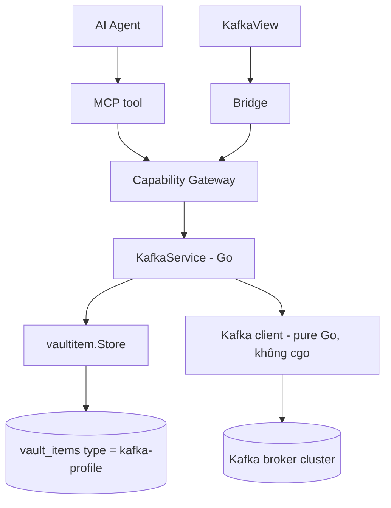
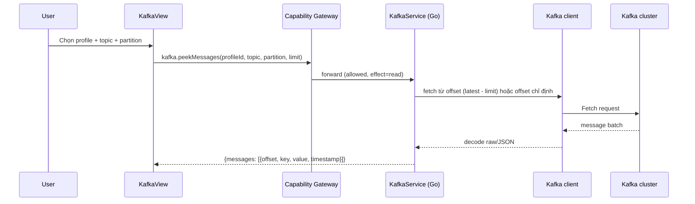
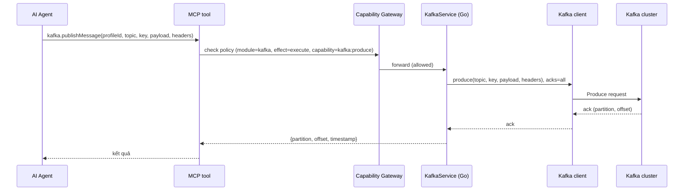

# Kafka UI

Kafka UI là built-in module cho DevKit để làm việc với 1 Kafka cluster — xem topic/partition, peek message, theo dõi consumer group lag, và publish message — mà không rời DevKit hay gõ CLI thủ công. Connection profile (bootstrap servers, SASL/SSL) dùng chung substrate với SSH/Database.

import { Callout } from 'fumadocs-ui/components/callout';

<Callout type="warn" title="Design only">
Chưa có `internal/kafka` trong checkout hiện tại. Trạng thái implementation thật nằm ở [Implementation status](/dev-kit/implementation-status).
</Callout>

Module đăng ký qua `ModuleManifest` như `vault`/`notes`/`database`/`ssh`/`tools`/`codegraph` hiện có — không tạo registry riêng.

## BRD — Business requirement

### Vấn đề

Khi debug 1 consumer bị lag, muốn xem message thật trong topic, hoặc cần gửi 1 message test để trigger lại 1 flow — dev phải rời DevKit sang tool Kafka UI khác hoặc gõ CLI thủ công, mất context và không tận dụng được connection profile/vault đã có sẵn.

### Mục tiêu (goals)

- Quản lý connection profile Kafka (bootstrap servers, SASL/SSL) qua vault, cùng pattern với SSH/Database.
- List topic, describe partition/replication, peek message gần nhất.
- Xem consumer group và lag để chẩn đoán "consumer có đang theo kịp không".
- Publish message vào topic — cho cả người dùng qua UI và agent qua MCP.
- Expose toàn bộ thao tác trên qua MCP để agent tự tra cứu và publish khi debug, không cần hỏi người dùng làm hộ.

### Actors

| Actor | Nhu cầu |
|---|---|
| Developer dùng DevKit | Xem nhanh topic/message/lag và publish message test, không rời app |
| AI agent (qua MCP) | Tra cứu topic/consumer group và publish message khi debug, nhận structured data thay vì phải parse CLI output |
| Người triển khai module | Biết rõ capability nào gate read, capability nào gate publish, để cấp quyền tách bạch |

### Functional requirements

| ID | Requirement |
|---|---|
| FR-1 | User tạo được connection profile Kafka (bootstrap servers, security protocol, SASL mechanism, credential) — lưu qua vaultitem, cùng pattern SSH/Database. |
| FR-2 | List topic trong cluster, kèm số partition + replication factor. |
| FR-3 | Peek N message gần nhất (mặc định nhỏ, ví dụ 50) của 1 topic/partition, từ offset cụ thể hoặc `latest`. |
| FR-4 | List consumer group, kèm lag (current offset vs log-end-offset) theo từng partition. |
| FR-5 | Test connection trước khi lưu profile, trả lỗi rõ ràng nếu auth/broker unreachable. |
| FR-6 | Publish 1 message vào topic chỉ định — nhận `key` (optional), `value`/payload, `headers` (optional), `partition` (optional, mặc định để broker tự chọn theo key). Trả về `partition` + `offset` thật của message vừa ghi. |
| FR-7 | Expose MCP tool cho agent: list profile, list topic, describe topic, peek message, list consumer group, publish message. |

### Non-functional requirements

| ID | Requirement |
|---|---|
| NFR-1 | Secret (SASL password, SSL client key) mã hóa qua vaultitem envelope, cùng contract với SSH/DB — không log plaintext. |
| NFR-2 | TLS/SASL default giữ tinh thần [ADR-007](/dev-kit/architecture-decisions#adr-007-verified-tls-for-remote-db-and-exact-ssh-host-key-pinning) — không hạ chuẩn bảo mật cho remote cluster. |
| NFR-3 | Mọi call tới broker (admin lẫn publish) có timeout, cancel được — không treo UI/MCP nếu broker không phản hồi. |
| NFR-4 | Peek message giới hạn kích thước/số lượng mặc định — không tải nguyên topic lớn vào memory. |
| NFR-5 | Client library thuần Go, không cgo — cùng lý do DevKit đã chọn `modernc.org/sqlite` thay vì driver cgo khác. |
| NFR-6 | Producer **không** tự tạo topic khi topic đích chưa tồn tại (`allow.auto.create.topics = false` phía client) — publish vào topic sai tên phải fail rõ ràng, không âm thầm tạo topic rác. |
| NFR-7 | Publish dùng `acks = all` mặc định — chỉ trả thành công khi broker xác nhận ghi, không báo thành công sớm rồi mất message. |

### Out of scope (v1)

- **Schema Registry / Avro / Protobuf** — v1 chỉ nhận/hiển thị raw bytes hoặc JSON text; không tích hợp Confluent Schema Registry cho cả peek lẫn publish.
- Mutating consumer group action (reset offset, rebalance trigger).
- Batch publish nhiều message trong 1 call — publish v1 chỉ 1 message/lần.
- ACL management, multi-cluster mirroring/replication view.
- Terminal tương tác kiểu `kafka-console-producer`/`consumer`.

### Acceptance criteria

- Tạo 1 profile Kafka hợp lệ, test connection thành công.
- List topic trên cluster có ít nhất 1 topic thật → trả đúng tên + số partition.
- Peek message trên 1 topic có data thật → nội dung khớp message đã biết trước (raw hoặc JSON parse đúng).
- Consumer group có lag thật → số lag hiển thị khớp với giá trị đo được độc lập (vd qua `kafka-consumer-groups.sh`).
- Publish 1 message qua UI vào topic thật → message xuất hiện đúng nội dung khi consume lại bằng tool ngoài (vd `kafka-console-consumer`).
- Agent gọi `kafka.publishMessage` qua MCP với `profileId`/`topic`/`payload` hợp lệ → nhận lại `partition`+`offset` thật, message consume lại đúng nội dung.
- Publish vào topic không tồn tại → lỗi rõ ràng, topic không bị tự động tạo (NFR-6).
- SASL credential sai → lỗi `connection_failed` rõ ràng, không treo UI/MCP.

## Flow

### Peek message flow

### Publish message flow (agent qua MCP)

## Technical design

### Components

- **`internal/kafka`** (Go) — orchestrate Kafka client, đọc/ghi vaultitem profile, expose query method (`ListTopics`, `DescribeTopic`, `PeekMessages`, `ListConsumerGroups`, `PublishMessage`).
- **Kafka client library** — pure Go, không cgo (ứng viên: `github.com/twmb/franz-go` hoặc `github.com/segmentio/kafka-go`) — cần cả admin/consume (read) lẫn producer (publish).
- **Storage** — connection profile qua `vaultitem.Store` chung, **không** phải store riêng — cùng pattern Notes/Database/SSH theo [ADR-008](/dev-kit/architecture-decisions#adr-008-unified-vault_items-store-for-built-in-item-types). Message/topic data **không** persist — chỉ query/publish on-demand, không cache lâu dài.
- **Bridge + MCP adapter** — cùng gọi `KafkaService`, cùng đi qua Capability Gateway, đúng pattern Code Graph/Agent Hub.

### Vaultitem contract

| Field | Value |
|---|---|
| Record `type` | `kafka-profile` |
| Payload `key_id` | `kafka-secret` |
| Metadata (plaintext) | `name`, `bootstrap_servers` (list), `security_protocol` (`PLAINTEXT`/`SSL`/`SASL_PLAINTEXT`/`SASL_SSL`), `sasl_mechanism` (`PLAIN`/`SCRAM-SHA-256`/`SCRAM-SHA-512`), `username` |
| Payload (encrypted) | SASL password **hoặc** SSL client key |

Nhiều profile cùng lúc (giống SSH/Database) — không phải mô hình "1 active" như Code Graph, vì dev thường có nhiều cluster cố định (dev/staging/prod) cần chuyển qua lại.

### Bridge & capability (design)

| Method | Capability | Scope |
|---|---|---|
| `KafkaListProfiles` | `kafka:connect` | `profile:list` |
| `KafkaCreateProfile` | `kafka:connect` | `profile:new` |
| `KafkaDeleteProfile` | `kafka:connect` | `profile:<id>` |
| `KafkaTestConnection` | `kafka:connect` | `profile:<id>` |
| `KafkaListTopics` | `kafka:connect` | `profile:<id>` |
| `KafkaDescribeTopic` | `kafka:connect` | `profile:<id>` |
| `KafkaPeekMessages` | `kafka:connect` | `profile:<id>` |
| `KafkaListConsumerGroups` | `kafka:connect` | `profile:<id>` |
| `KafkaPublishMessage` | `kafka:produce` | `profile:<id>` |

2 capability tách riêng: `kafka:connect` cho toàn bộ thao tác đọc/quản lý profile, `kafka:produce` riêng cho publish. Publish ghi dữ liệu thật vào hệ thống downstream (consumer khác có thể phản ứng ngay với message vừa gửi) — risk khác hẳn nhóm còn lại, nên tách capability để cấp/thu hồi quyền publish độc lập với quyền đọc, đúng pattern đã dùng cho `ssh:connect`/`ssh:forward`.

### MCP tool surface (design)

Xem cơ chế chung + rationale ở [MCP / Agent](/dev-kit/mcp-agent).

| MCP tool | Effect | Map sang | Ghi chú |
|---|---|---|---|
| `kafka.listProfiles` | `read` | `builtin.kafka` / `kafka:connect` / `profile:list` | Chỉ metadata, không có secret |
| `kafka.listTopics` | `read` | `builtin.kafka` / `kafka:connect` / `profile:<id>` | |
| `kafka.describeTopic` | `read` | `builtin.kafka` / `kafka:connect` / `profile:<id>` | |
| `kafka.peekMessages` | `read` | `builtin.kafka` / `kafka:connect` / `profile:<id>` | Giới hạn số message mặc định (NFR-4) |
| `kafka.listConsumerGroups` | `read` | `builtin.kafka` / `kafka:connect` / `profile:<id>` | |
| `kafka.publishMessage` | `execute` (`destructiveHint`) | `builtin.kafka` / `kafka:produce` / `profile:<id>` | Input: `profileId`, `topic`, `key?`, `payload`, `headers?`, `partition?`. Output: `{partition, offset, timestamp}` |

**Không expose `KafkaCreateProfile`/`KafkaDeleteProfile`** qua MCP — nhận secret trực tiếp qua tham số, cùng lý do đã áp cho SSH/Database.

### Error handling

- Broker unreachable / auth fail → `connection_failed`, cùng error contract với SSH/Database (`internal/apperrors`).
- Timeout cho mọi call (admin lẫn publish) → `operation_cancelled`, không treo UI/MCP vô thời hạn (NFR-3).
- Peek message trên topic/partition không tồn tại → lỗi rõ ràng, không trả mảng rỗng ngầm định.
- Publish vào topic không tồn tại → lỗi rõ ràng, topic **không** tự tạo (NFR-6). Publish không nhận `acks` xác nhận từ broker trong timeout → `operation_cancelled`, không báo thành công khi chưa chắc chắn broker đã ghi.

### Known ceiling (v1)

- Message decode/encode chỉ raw bytes hoặc JSON text — không Avro/Protobuf/Schema Registry, cho cả peek lẫn publish.
- Publish chỉ 1 message/lần, không batch.
- Không ACL management, không multi-cluster mirroring view.
- Giới hạn peek mặc định nhỏ (ví dụ 50 message/lần) để tránh treo UI với topic lớn — số cụ thể cần chốt khi implement.

## Open questions

- Giới hạn peek mặc định nên là bao nhiêu message/request — cố định hay user config được?
- Publish có cần rate limit riêng (per profile hoặc per subject) để tránh agent spam 1 topic thật không?
- Có cần thêm Schema Registry decode/encode (Avro/Protobuf) khi có nhu cầu vượt raw/JSON không?

import { Cards, Card } from 'fumadocs-ui/components/card';

<Cards>
  <Card title="Vault" href="/dev-kit/vault" description="Substrate mã hóa profile Kafka adapter vào" />
  <Card title="Database" href="/dev-kit/database" description="Cùng pattern connection-profile" />
  <Card title="SSH" href="/dev-kit/ssh" description="Cùng pattern connection-profile" />
  <Card title="MCP / Agent" href="/dev-kit/mcp-agent" />
  <Card title="Architecture decisions" href="/dev-kit/architecture-decisions" description="ADR-007/008: TLS default và unified vault_items" />
</Cards>
