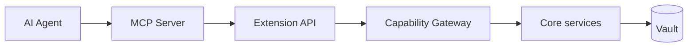

# MCP / Agent

MCP cho phép AI agent gọi tool/resources của DevKit, nhưng phải đi cùng mô hình least privilege của Extension API.

## Mục tiêu

- Agent hỗ trợ workflow (tìm note, chạy tool, thao tác connection) mà không bypass security.
- Mọi tool MCP map sang capability rõ ràng.
- Audit request từ agent giống plugin.

## Kiểm soát

1. Agent chỉ thấy tool đã expose.
2. Vault locked → từ chối thao tác giải mã.
3. Không trả raw secret trừ khi user/capability cho phép tường minh.

import { Cards, Card } from 'fumadocs-ui/components/card';

<Cards>
  <Card title="Plugins" href="/dev-kit/plugins" />
  <Card title="Security model" href="/dev-kit/security" />
</Cards>
