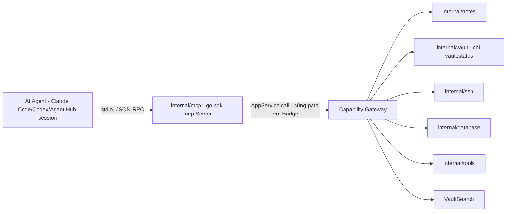

# MCP / Agent

MCP là transport để AI agent (Claude Code, Codex, hoặc 1 session trong [Agent Hub](/dev-kit/agent-hub)) gọi được tool/resources của DevKit. Khác với ACP ở Agent Hub — nơi DevKit đóng vai **Client** (spawn agent CLI, gọi ra) — với MCP thì **DevKit đóng vai Server**: agent là MCP Client kết nối vào DevKit để dùng capability của nó (mở note, chạy SSH command, query DB...).

import { Callout } from 'fumadocs-ui/components/callout';

<Callout type="warn" title="Design only">
Trang này là design cho MCP server runtime. Chưa có `internal/mcp` trong checkout hiện tại — `implementation-status.mdx` đánh dấu MCP là `Design only`. Phần lớn nội dung dưới đây đã được xác thực qua đọc trực tiếp MCP specification (bản `2026-07-28`, final ~10 ngày trước thời điểm viết) và README của Go SDK chính thức — không phải suy đoán từ bản cũ.
</Callout>

MCP không tạo choke point mới. `internal/mcp` chỉ là 1 transport adapter khác gọi thẳng `AppService.call(...)` — **cùng path với Bridge hiện có**, không có đường tắt riêng cho agent (đúng invariant #1 của `docs/architecture/devkit-architecture.md`, và đúng NFR-3 đã áp cho Agent Hub).

## BRD — Business requirement

### Vấn đề

Hiện tại chỉ UI (qua Bridge) gọi được các module đã Implemented (Vault, Notes, SSH, Database, Tools, Search). Agent bên ngoài (Claude Code, Codex) hoặc agent chạy trong Agent Hub không có cách nào chạm vào các module này — muốn tra 1 note hay chạy 1 SSH command, agent phải nhờ người dùng làm hộ. `mcp-agent.mdx` trước đây chỉ là placeholder ("target future"), chưa đủ chi tiết để implement.

### Mục tiêu (goals)

- Agent gọi được built-in module đã Implemented qua tool MCP, không bypass Capability Gateway.
- Danh sách tool phải map rõ ràng sang capability/scope hiện có — không phát minh cơ chế permission song song.
- Audit request từ agent đi qua đúng `internal/audit` hiện có, phân biệt được nguồn gốc MCP so với UI.
- **Không phải "mọi bridge method đều thành tool"** — một số thao tác (unlock vault, trust host-key mới, mở tunnel) vẫn cần con người, dù module đó nói chung agent-reachable.

### Actors

| Actor | Nhu cầu |
|---|---|
| Developer dùng DevKit | Chủ động giới hạn agent chỉ thấy tool cần thiết, xem audit log request từ agent |
| AI agent (Claude Code/Codex/Agent Hub session) | Liệt kê tool khả dụng, gọi tool, nhận lỗi rõ ràng khi bị từ chối thay vì im lặng |
| Người triển khai module mới | Biết ngay module mới cần khai MCP tool gì, theo convention nào |

### Functional requirements

| ID | Requirement |
|---|---|
| FR-1 | `internal/mcp` chạy MCP server qua stdio, dùng Go SDK chính thức (`github.com/modelcontextprotocol/go-sdk`), target protocol `2026-07-28`. |
| FR-2 | Mỗi MCP tool gọi thẳng `AppService.call(...)` với đúng `SubjectID`/`Capability`/`Scope` của module tương ứng — tái dùng nguyên contract đã có ở [Technical contracts](/dev-kit/technical-contracts#capability-contract), không tạo subject/capability song song. |
| FR-3 | `tools/list` trả về danh sách đã lọc theo grant thật của caller — agent không thấy tool mà nó không có quyền gọi (đúng Controls #1 đã có từ bản cũ). |
| FR-4 | Mỗi `CallRequest` từ MCP gắn `Metadata["origin"] = "mcp"` để audit phân biệt được request từ agent so với UI, không cần subject riêng. |
| FR-5 | Annotation của mỗi tool (`readOnlyHint`, `destructiveHint`) phải khớp `effect` (`read`/`execute`) đã dùng nhất quán ở Code Graph và Agent Hub. |
| FR-6 | Vault locked → tool nào cần decrypt trả đúng `vault_locked` (tái dùng `internal/apperrors` hiện có), không trả kết quả rỗng ngầm định. |

### Non-functional requirements

| ID | Requirement |
|---|---|
| NFR-1 | Chỉ **stdio transport** cho v1 — không mở Streamable HTTP (remote), khớp với local-first NFR đã áp dụng cho mọi module khác. |
| NFR-2 | Không cần OAuth 2.1 — theo đúng spec (`stdio SHOULD NOT` theo authorization spec, lấy credential từ môi trường process). Trust boundary là process-level, cùng mức UI hiện đang có, không phát minh auth mới. |
| NFR-3 | Không trả raw secret (SSH secret, DB password, recovery key) qua bất kỳ tool nào, kể cả `read` — giữ đúng redaction rule hiện có (`internal/audit/redact.go`). |
| NFR-4 | Một số action **không bao giờ** thành MCP tool ở v1, bất kể grant: `SetupVault`, `UnlockVault`, `UnlockVaultWithRecovery`, `LockVault` — xem "Hard exclusions" bên dưới. |

### Out of scope (v1)

- Streamable HTTP transport / remote agent.
- Primitive **Resources** và **Prompts** — v1 chỉ có Tools; Resources (đọc note/codegraph output qua URI) để sau nếu cần.
- SSH forwarding tools (`ssh.startForward`/`stopForward`) — mở tunnel network do agent khởi tạo là blast-radius lớn, giữ nguyên non-goal đã ghi ở [Connections](/dev-kit/connections#non-goals-mvp).
- Sync mutation tools (`sync.connect`/`syncNow`/`resolveConflict`) — sync client vẫn `Partial`, và để agent tự trigger sync/resolve conflict là rủi ro dữ liệu chưa cần thiết ở v1.

### Acceptance criteria

- Agent gọi `tools/list` → chỉ thấy tool khớp grant thật của subject đó, không thấy `vault.setup`/`vault.unlock` (vì các tool này không tồn tại, không phải bị ẩn theo policy).
- Agent gọi `notes.get` khi vault đang locked → nhận lỗi `vault_locked` structured, không phải note rỗng hoặc treo.
- Agent gọi `ssh.runCommand` → audit log ghi được `origin: "mcp"` cùng `SubjectID`/`Capability`/`Scope` giống hệt khi UI gọi `SSHRunCommand`.
- Thêm 1 tool mới cho module đã có (ví dụ `db.listProfiles`) chỉ cần đăng ký trong `internal/mcp`, không phải sửa `internal/capabilities/gateway.go`.

## Vì sao quyết định này khác với ACP (Agent Hub)

Ở Agent Hub, quyết định là **tự implement ACP** vì không có SDK chính thức, chỉ có package community rủi ro bus-factor. Với MCP thì ngược lại — có **Go SDK chính thức** (`github.com/modelcontextprotocol/go-sdk`), đồng phát triển bởi Anthropic và Google, hiện tại (v1.7.0+) đã support ngay bản `2026-07-28` (bản mới nhất, stateless) cộng backward-compat 4 bản cũ (`2025-11-25`, `2025-06-18`, `2025-03-26`, `2024-11-05`). Đây là 2 bộ dữ kiện khác nhau dẫn tới 2 kết luận khác nhau, không phải mâu thuẫn: **MCP dùng thẳng SDK chính thức**, không tự build.

Bản `2026-07-28` cũng đáng chú ý vì bỏ hẳn mô hình stateful cũ — không còn handshake `initialize`/`initialized` hay session ID; mỗi request tự khai báo `protocolVersion` trong `_meta`, server không hỗ trợ thì trả `UnsupportedProtocolVersionError`. Mô hình per-request này khớp tự nhiên với `AppService.call` vốn đã là per-call gateway check — dễ tích hợp hơn nếu phải nhắm bản stateful cũ.

Ba primitive từng có — **Roots, Sampling, Logging** — đã bị deprecate chính thức trong bản này (SEP-2577, còn hỗ trợ tối thiểu 12 tháng). DevKit không cần implement cả ba: Sampling là tính năng phía client (server nhờ client's LLM hoàn thành gì đó) — không liên quan vai trò Server của DevKit; Roots liên quan phía client khai báo filesystem boundary — cũng không phải việc của DevKit ở đây; Logging thay bằng structured observability, mà DevKit đã có `internal/audit`.

## Technical design

### Components

- **`internal/mcp`** (Go, mới) — dùng `github.com/modelcontextprotocol/go-sdk/mcp`: `mcp.NewServer(...)` → `mcp.AddTool(...)` cho từng tool → `server.Run(stdioTransport)`. Không tự viết JSON-RPC/transport layer.
- **Tool handler** — mỗi tool handler chỉ làm 1 việc: map `arguments` đã validate theo `inputSchema` sang đúng `CallRequest{SubjectID, Capability, Scope, Metadata: {"origin": "mcp"}, Handler}` rồi gọi `AppService.call(...)` — **không** gọi thẳng service layer, không có logic nghiệp vụ riêng trong `internal/mcp`.
- **Annotation mapping** — `effect: read` → `annotations.readOnlyHint = true`; `effect: execute` → `readOnlyHint = false`, thêm `destructiveHint = true` cho tool có khả năng phá dữ liệu/tài nguyên ngoài (xoá, chạy lệnh remote, ghi DB).

### MCP tool surface — module đã Implemented

Đây là phần lấp khoảng trống chính: các module này đã chạy thật, nhưng chưa agent-reachable. Chi tiết từng tool (map sang capability/scope, ghi chú) nằm ngay tại trang của module đó — trang này chỉ giữ vai trò index để tránh 2 nguồn sự thật lệch nhau khi module cập nhật:

| Module | Trang chi tiết MCP tool surface |
|---|---|
| Vault | [Vault § MCP tool surface](/dev-kit/vault#mcp-tool-surface-design) — chỉ `vault.status`, `vault.search` |
| Notes | [Notes § MCP tool surface](/dev-kit/notes#mcp-tool-surface-design) — `notes.list/search/get/create/delete` |
| SSH | [SSH § MCP tool surface](/dev-kit/connections#mcp-tool-surface-design) — `ssh.listProfiles/testConnection/runCommand` |
| Database, Tools, Search, Sync | [Technical contracts § Bridge contract](/dev-kit/technical-contracts#bridge-contract) — cột "MCP tool (design)" |
| Code Graph | [Code Graph § MCP tool surface](/dev-kit/codegraph#mcp-tool-surface) |
| Agent Hub | [Agent Hub § MCP tool surface](/dev-kit/agent-hub#mcp-tool-surface) |

### Hard exclusion — nguyên tắc chung

Một số action **không bao giờ** thành MCP tool ở v1, bất kể grant — đây là loại trừ cứng theo thiết kế, không phải thứ nới ra được bằng cách sửa policy. Hai ví dụ tiêu biểu (danh sách đầy đủ theo module nằm ở các trang trong bảng trên):

- **Vault unlock/setup/lock** — Master Password là bí mật con người nhập; cho agent gọi được coi như xóa bỏ lý do có `VaultGate`.
- **SSH host-key trust (TOFU)** — trust 1 host-key mới là quyết định bảo mật cần con người xác nhận, nếu không sẽ mất tác dụng chống MITM đã thiết kế ở [ADR-007](/dev-kit/architecture-decisions#adr-007-verified-tls-for-remote-db-and-exact-ssh-host-key-pinning).

Nhóm thứ hai — tạo profile kèm secret, SSH forwarding, sync mutation — không phải loại trừ vĩnh viễn mà để mở ở v2 sau khi có UI permission review cho MCP; xem "Out of scope" ở trên.

### Error handling

- Toàn bộ lỗi tool đi qua đúng `internal/apperrors.AppError` hiện có (`code`/`message`/`recoverable`) — không tạo bộ error code riêng cho MCP.
- `vault_locked`, `permission_denied`, `validation_failed`, `connection_failed`, `operation_cancelled`, `internal_error` — y hệt bảng đã chốt ở [Technical contracts](/dev-kit/technical-contracts#error-contract).
- Tool không tồn tại / method không hỗ trợ → theo đúng JSON-RPC `-32601 Method not found` chuẩn MCP, không tự chế mã lỗi khác.

### Known ceiling (v1)

- Chỉ Tools; Resources/Prompts để sau.
- Chỉ stdio; không remote/HTTP, không OAuth.
- Danh sách tool cố định theo bảng trên — module mới (SSH forwarding, Sync mutation, vault lifecycle) cần thiết kế riêng, không tự động "mở hết" theo effect.
- Chưa có UI để user tự review/tắt từng tool cho agent — v1 dựa hoàn toàn vào grant tĩnh trong `internal/app/container.go`, giống cách Bridge đang làm.

## Open questions

- Có cần UI riêng cho user xem/tắt tool nào agent được gọi (khác với việc chỉ dựa vào container grant tĩnh) không, hay để version sau?
- `db.query` nên tách `read`/`write` dựa trên parse SQL (SELECT vs không) để giảm `destructiveHint` tràn lan, hay chấp nhận coi mọi query là execute cho đơn giản?
- Khi Code Graph và Agent Hub tự implement MCP tool riêng của chúng (`codegraph.*`, `agenthub.*`), có nên dùng chung `internal/mcp` server này hay mỗi module tự đăng ký vào cùng 1 `mcp.Server` instance? (Khuyến nghị: dùng chung 1 instance, mỗi module chỉ đóng góp tool definition — tránh N process MCP server chạy song song không cần thiết.)

import { Cards, Card } from 'fumadocs-ui/components/card';

<Cards>
  <Card title="Code Graph (Java)" href="/dev-kit/codegraph" description="Module đầu tiên định nghĩa MCP tool surface riêng" />
  <Card title="Agent Hub" href="/dev-kit/agent-hub" description="invokeAgent cũng là 1 MCP tool theo cùng convention" />
  <Card title="Plugins" href="/dev-kit/plugins" />
  <Card title="Security model" href="/dev-kit/security" />
  <Card title="Technical contracts" href="/dev-kit/technical-contracts" description="Capability/scope contract mà MCP tool tái dùng nguyên" />
  <Card title="Implementation status" href="/dev-kit/implementation-status" description="Evidence paths và MCP integration scope" />
</Cards>
