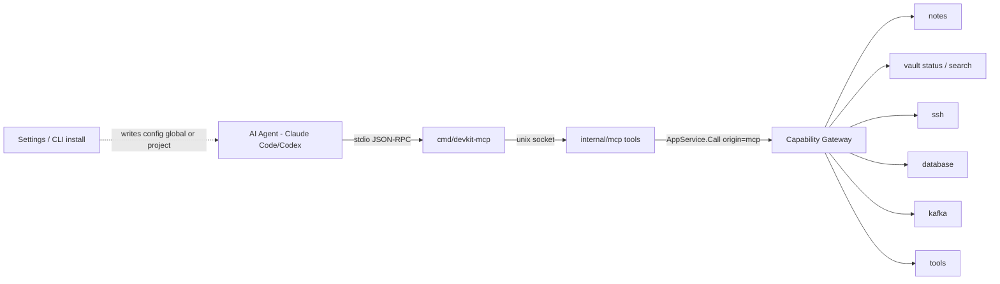

# MCP / Agent

MCP là transport để AI agent (Claude Code, Codex, hoặc 1 session trong [Agent Hub](/dev-kit/agent-hub)) gọi được tool/resources của DevKit. Khác với ACP ở Agent Hub — nơi DevKit đóng vai **Client** (spawn agent CLI, gọi ra) — với MCP thì **DevKit đóng vai Server**: agent là MCP Client kết nối vào DevKit để dùng capability của nó (mở note, chạy SSH command, query DB...).

import { Callout } from 'fumadocs-ui/components/callout';

<Callout type="info" title="Implemented — runtime + install; Resources/HTTP deferred">
Runtime đã có: `internal/mcp` (Unix socket host + tools), `cmd/devkit-mcp` (stdio proxy),
`internal/interaction` (selection/confirmation), install CLI/Settings cho `claude-code` /
`codex` (`global`|`project`). Resources, Prompts, và Streamable HTTP vẫn deferred.
Chưa claim production-tested end-to-end với Claude Code thật trong CI — verify trên desktop.
</Callout>

MCP không tạo choke point mới. `internal/mcp` chỉ là 1 transport adapter khác gọi thẳng `AppService.call(...)` — **cùng path với Bridge hiện có**, không có đường tắt riêng cho agent (đúng invariant #1 của `docs/architecture/devkit-architecture.md`, và đúng NFR-3 đã áp cho Agent Hub).

## BRD — Business requirement

### Vấn đề

Hiện tại chỉ UI (qua Bridge) gọi được các module đã Implemented (Vault, Notes, SSH, Database, Tools, Search). Agent bên ngoài (Claude Code, Codex) hoặc agent chạy trong Agent Hub không có cách nào chạm vào các module này — muốn tra 1 note hay chạy 1 SSH command, agent phải nhờ người dùng làm hộ. `mcp-agent.mdx` trước đây chỉ là placeholder ("target future"), chưa đủ chi tiết để implement.

### Mục tiêu (goals)

- Agent gọi được built-in module đã Implemented qua tool MCP, không bypass Capability Gateway.
- Danh sách tool phải map rõ ràng sang capability/scope hiện có — không phát minh cơ chế permission song song.
- Audit request từ agent đi qua đúng `internal/audit` hiện có, phân biệt được nguồn gốc MCP so với UI.
- **Không phải "mọi bridge method đều thành tool"** — một số thao tác (unlock vault, trust host-key mới, mở tunnel) vẫn cần con người, dù module đó nói chung agent-reachable.

### Actors

| Actor | Nhu cầu |
|---|---|
| Developer dùng DevKit | Chủ động giới hạn agent chỉ thấy tool cần thiết, xem audit log request từ agent |
| AI agent (Claude Code/Codex/Agent Hub session) | Liệt kê tool khả dụng, gọi tool, nhận lỗi rõ ràng khi bị từ chối thay vì im lặng |
| Người triển khai module mới | Biết ngay module mới cần khai MCP tool gì, theo convention nào |

### Functional requirements

| ID | Requirement |
|---|---|
| FR-1 | `internal/mcp` chạy MCP server qua stdio, dùng Go SDK chính thức (`github.com/modelcontextprotocol/go-sdk`), target protocol `2026-07-28`. |
| FR-2 | Mỗi MCP tool gọi thẳng `AppService.call(...)` với đúng `SubjectID`/`Capability`/`Scope` của module tương ứng — tái dùng nguyên contract đã có ở [Technical contracts](/dev-kit/technical-contracts#capability-contract), không tạo subject/capability song song. |
| FR-3 | `tools/list` trả về danh sách đã lọc theo grant thật của caller — agent không thấy tool mà nó không có quyền gọi (đúng Controls #1 đã có từ bản cũ). |
| FR-4 | Mỗi `CallRequest` từ MCP gắn `Metadata["origin"] = "mcp"` để audit phân biệt được request từ agent so với UI, không cần subject riêng. |
| FR-5 | Annotation của mỗi tool (`readOnlyHint`, `destructiveHint`) phải khớp `effect` (`read`/`execute`) đã dùng nhất quán ở Code Graph và Agent Hub. |
| FR-6 | Vault locked → tool nào cần decrypt trả đúng `vault_locked` (tái dùng `internal/apperrors` hiện có), không trả kết quả rỗng ngầm định. |
| FR-7 | User cài được MCP server `devkit` vào **một agent chỉ định** với đúng **2 scope**: `global` (mọi project của user) hoặc `project` (một thư mục project) — DevKit ghi config đúng format của agent đó, idempotent, không xoá server MCP khác. |
| FR-8 | Dialog xác nhận MCP hỗ trợ `allow` / `allow_always` / `deny` khi env **không** yêu cầu confirmation; khi `requiresConfirmation(env) = true`, **env luôn thắng** (xem mục confirmation bên dưới). |

### Non-functional requirements

| ID | Requirement |
|---|---|
| NFR-1 | Chỉ **stdio transport** cho v1 — không mở Streamable HTTP (remote), khớp với local-first NFR đã áp dụng cho mọi module khác. |
| NFR-2 | Không cần OAuth 2.1 — theo đúng spec (`stdio SHOULD NOT` theo authorization spec, lấy credential từ môi trường process). Trust boundary là process-level, cùng mức UI hiện đang có, không phát minh auth mới. |
| NFR-3 | Không trả raw secret (SSH secret, DB password, recovery key) qua bất kỳ tool nào, kể cả `read` — giữ đúng redaction rule hiện có (`internal/audit/redact.go`). |
| NFR-4 | Một số action **không bao giờ** thành MCP tool ở v1, bất kể grant: `SetupVault`, `UnlockVault`, `UnlockVaultWithRecovery`, `LockVault` — xem "Hard exclusions" bên dưới. |
| NFR-5 | Auto-install chỉ ghi file config local trên máy user — không gọi mạng, không sửa grant/capability. |

### Out of scope (v1)

- Streamable HTTP transport / remote agent.
- Primitive **Resources** và **Prompts** — v1 chỉ có Tools; Resources (đọc note/codegraph output qua URI) để sau nếu cần.
- SSH forwarding tools (`ssh.startForward`/`stopForward`) — mở tunnel network do agent khởi tạo là blast-radius lớn, giữ nguyên non-goal đã ghi ở [SSH](/dev-kit/ssh#non-goals-mvp).
- Sync mutation tools (`sync.connect`/`syncNow`/`resolveConflict`) — sync client đã `Implemented`, nhưng để agent tự trigger sync/resolve conflict là rủi ro dữ liệu chưa cần thiết ở MCP v1.
- Cài MCP hàng loạt cho mọi agent cùng lúc; sync config lên cloud; quản lý MCP server không phải `devkit`.

### Acceptance criteria

- Agent gọi `tools/list` → chỉ thấy tool khớp grant thật của subject đó, không thấy `vault.setup`/`vault.unlock` (vì các tool này không tồn tại, không phải bị ẩn theo policy).
- Agent gọi `notes.get` khi vault đang locked → nhận lỗi `vault_locked` structured, không phải note rỗng hoặc treo.
- Agent gọi `ssh.runCommand` → audit log ghi được `origin: "mcp"` cùng `SubjectID`/`Capability`/`Scope` giống hệt khi UI gọi `SSHRunCommand`.
- Thêm 1 tool mới cho module đã có (ví dụ `db.listProfiles`) chỉ cần đăng ký trong `internal/mcp`, không phải sửa `internal/capabilities/gateway.go`.
- User chọn agent + scope `global` → file config global của agent có entry `devkit` trỏ stdio proxy; scope `project` + path → entry nằm ở config project của agent đó.
- Gọi install lần hai với cùng agent/scope → không nhân đôi entry, không xoá server khác.
- Trên env `prod` (hoặc tag `requiresConfirmation=true`), sau khi user từng bấm Allow always cho tool trên `dev`, call gated vẫn **bắt buộc** hỏi lại Allow/Deny (không honor `allow_always`).

## Vì sao quyết định này khác với ACP (Agent Hub)

Ở Agent Hub, quyết định là **tự implement ACP** vì không có SDK chính thức, chỉ có package community rủi ro bus-factor. Với MCP thì ngược lại — có **Go SDK chính thức** (`github.com/modelcontextprotocol/go-sdk`), đồng phát triển bởi Anthropic và Google, hiện tại (v1.7.0+) đã support ngay bản `2026-07-28` (bản mới nhất, stateless) cộng backward-compat 4 bản cũ (`2025-11-25`, `2025-06-18`, `2025-03-26`, `2024-11-05`). Đây là 2 bộ dữ kiện khác nhau dẫn tới 2 kết luận khác nhau, không phải mâu thuẫn: **MCP dùng thẳng SDK chính thức**, không tự build.

Bản `2026-07-28` cũng đáng chú ý vì bỏ hẳn mô hình stateful cũ — không còn handshake `initialize`/`initialized` hay session ID; mỗi request tự khai báo `protocolVersion` trong `_meta`, server không hỗ trợ thì trả `UnsupportedProtocolVersionError`. Mô hình per-request này khớp tự nhiên với `AppService.call` vốn đã là per-call gateway check — dễ tích hợp hơn nếu phải nhắm bản stateful cũ.

Ba primitive từng có — **Roots, Sampling, Logging** — đã bị deprecate chính thức trong bản này (SEP-2577, còn hỗ trợ tối thiểu 12 tháng). DevKit không cần implement cả ba: Sampling là tính năng phía client (server nhờ client's LLM hoàn thành gì đó) — không liên quan vai trò Server của DevKit; Roots liên quan phía client khai báo filesystem boundary — cũng không phải việc của DevKit ở đây; Logging thay bằng structured observability, mà DevKit đã có `internal/audit`.

## Technical design

### Components

- **`internal/mcp`** (Go, mới) — dùng `github.com/modelcontextprotocol/go-sdk/mcp`: `mcp.NewServer(...)` → `mcp.AddTool(...)` cho từng tool → `server.Run(stdioTransport)`. Không tự viết JSON-RPC/transport layer.
- **Tool handler** — mỗi tool handler chỉ làm 1 việc: map `arguments` đã validate theo `inputSchema` sang đúng `CallRequest{SubjectID, Capability, Scope, Metadata: {"origin": "mcp"}, Handler}` rồi gọi `AppService.call(...)` — **không** gọi thẳng service layer, không có logic nghiệp vụ riêng trong `internal/mcp`.
- **Annotation mapping** — `effect: read` → `annotations.readOnlyHint = true`; `effect: execute` → `readOnlyHint = false`, thêm `destructiveHint = true` cho tool có khả năng phá dữ liệu/tài nguyên ngoài (xoá, chạy lệnh remote, ghi DB).

### MCP tool surface — module đã Implemented

Đây là phần lấp khoảng trống chính: các module này đã chạy thật, nhưng chưa agent-reachable. Chi tiết từng tool (map sang capability/scope, ghi chú) nằm ngay tại trang của module đó — trang này chỉ giữ vai trò index để tránh 2 nguồn sự thật lệch nhau khi module cập nhật:

| Module | Trang chi tiết MCP tool surface |
|---|---|
| Vault | [Vault § MCP tool surface](/dev-kit/vault#mcp-tool-surface-design) — chỉ `vault.status`, `vault.search` |
| Notes | [Notes § MCP tool surface](/dev-kit/notes#mcp-tool-surface) — `notes.list/search/get/create/update/delete/set_organization`, `notes.folder.list/create/update/delete` |
| Database | [Database § MCP tool surface](/dev-kit/database#mcp-tool-surface-design) — `db.listProfiles/testConnection/query` |
| SSH | [SSH § MCP tool surface](/dev-kit/ssh#mcp-tool-surface) — `ssh.listProfiles/testConnection/runCommand` |
| Tools | [Tools § MCP tool surface](/dev-kit/tools#mcp-tool-surface-design) — mỗi command 1 tool riêng (`tools.hash`, `tools.base64Encode`...) |
| Kafka UI | [Kafka UI § MCP tool surface](/dev-kit/kafka#mcp-tool-surface) — read + `kafka.publishMessage` (execute, capability riêng `kafka:produce`) |
| Search, Sync | [Technical contracts § Bridge contract](/dev-kit/technical-contracts#bridge-contract) — cột "MCP tool (design)" |
| Code Graph | [Code Graph § MCP tool surface](/dev-kit/codegraph#mcp-tool-surface) |
| Agent Hub | [Agent Hub § MCP tool surface](/dev-kit/agent-hub#mcp-tool-surface) — `agenthub.listAgents/createAgentSession/invokeAgent/getSessionStatus/cancelAgent` (Implemented Claude-only; Codex/Gemini Design) |

### Active target selection — pattern chung cho tool cần 1 target sống

Kafka UI, Database, SSH đều có ít nhất 1 MCP tool thao tác trên "1 target đang chọn" (cluster/profile) thay vì nhận ID làm tham số. Quy ước chung cho pattern này, áp dụng cho mọi module sau này có nhu cầu tương tự:

- Tool đó **không nhận ID** trong `inputSchema` — target lấy từ state "active" nội bộ của service, tách biệt với cách UI vẫn hoạt động (UI tiếp tục nhận ID tường minh mỗi lần gọi, không đổi).
- Chưa có active target khi agent gọi → DevKit hiện popup cho user chọn, **không lỗi ngay** — call gốc block tới khi user chọn xong (có timeout) rồi tự resume.
- Method đổi active target (`*SetActiveProfile`/`KafkaConnect`...) là **bridge-only, không expose qua MCP** — chọn target luôn là hành động của con người, cùng nhóm với Hard exclusion bên dưới.
- Lựa chọn **sticky** — giữ nguyên tới khi user tự đổi qua UI của module đó hoặc sidebar, không tự reset giữa các lần gọi.
- DevKit chạy headless (không có UI để hiện popup) → lỗi ngay lập tức, không chờ.
- Ràng buộc tài nguyên đi kèm (kiểu "chỉ 1 connection sống") là quyết định **riêng của từng module** — không phải phần bắt buộc của pattern này. Kafka giữ đúng 1 connection vì đó là ràng buộc tài nguyên thật; Database/SSH dùng active target chỉ để đơn giản hóa MCP tool, pool/connection phía dưới không đổi, vẫn multi-profile như trước.

### `env` bắt buộc trên mọi profile — hỏi quyền qua MCP theo policy của tag

Mọi profile của Kafka/Database/SSH (module dùng "active target selection") có 1 field **bắt buộc** — `env` — khai báo khi tạo profile, không có giá trị rỗng/bỏ qua được. Giá trị của `env` là tên 1 tag lấy từ registry dùng chung [Environments](/dev-kit/environments) (mặc định có `dev`/`stg`/`prod`, tạo thêm tag tùy chỉnh được). Field này tách biệt với metadata mô tả kết nối (host, port...) — mục đích duy nhất là gắn nhãn rủi ro cho từng target.

Luật gắn với `env`: **mọi MCP call (`origin = "mcp"`) thao tác trên active target phải
tra `requiresConfirmation` của tag đó.** Policy per-tag nằm ở
[Environments](/dev-kit/environments):

- `prod` mặc định `requiresConfirmation = true` và **khóa cứng, không tắt được**.
- `dev`/`stg` mặc định `requiresConfirmation = false` — user bật lên nếu muốn.
- Tag tùy chỉnh tự chọn khi tạo, sửa được (không khóa như `prod`).
- Tên env không resolve được → **fail closed** (`requiresConfirmation = true`).

### Confirmation dialog — `allow_always` có, nhưng env chặn luôn thắng

Dialog xác nhận cho gated tool hỗ trợ ba lựa chọn khi env **không** block:

| Choice | Nghĩa |
|---|---|
| `allow` | Cho phép **một lần** call này |
| `allow_always` | Cho phép call này và **nhớ theo tool** trong process DevKit (tới khi restart) — chỉ khi `requiresConfirmation(env) = false` |
| `deny` | Từ chối → `permission_denied` |

**Env luôn thắng:** nếu `requiresConfirmation(env) = true` (gồm `prod` và fail-closed):

1. **Bỏ qua** mọi `allow_always` đã nhớ trước đó (kể cả user từng Allow always khi đang ở `dev`).
2. Dialog **không** hiện nút Allow always — chỉ Allow / Deny.
3. Mỗi call gated vẫn phải xác nhận lại.

Lý do: `allow_always` tiện trên `dev`/`stg`, nhưng không được phép “dính” khi active target chuyển sang môi trường rủi ro cao. Không có `allow_always` xuyên env.

- Phạm vi áp dụng gate: tool active-target
  (`kafka.listTopics/describeTopic/peekMessages/listConsumerGroups/publishMessage`,
  `db.query`, `ssh.runCommand`). **Không** áp cho
  `listProfiles` / `testConnection` / `connectionStatus` / `activeProfile`.
- **Pin target theo call:** gate trả về đúng profile id đã được confirm; tool execute
  chống lại id đó thay vì re-read active target — một `SetActiveProfile` chạy đồng thời
  giữa lúc confirm và execute không thể chạy lệnh/SQL trên profile chưa được duyệt.
- **Không có secret trong tool arguments** (v1): `ssh.runCommand` không nhận passphrase —
  profile encrypted-PEM phải unlock per-operation qua UI. Agent clients persist
  tool-input JSON trong transcript của chúng, nên secret qua tool arg là leak ngoài
  biên redaction của DevKit.
- **Kafka connect sau confirm:** connection (SASL credentials tới broker) chỉ được thiết
  lập sau khi env confirmation phủ profile id đó — selection dialog không dial.
- Call từ UI (`origin` ≠ `"mcp"`) không bị luật này.
- Đổi `requiresConfirmation` của tag (trừ `prod`) là human-only — xem
  [Environments](/dev-kit/environments).

### Auto-install MCP vào agent (`global` | `project`)

DevKit cung cấp thao tác **cài / gỡ** entry MCP server tên cố định `devkit` vào
**một agent chỉ định**, với đúng **hai scope** product:

| Scope DevKit | Nghĩa | Claude Code | Codex |
|---|---|---|---|
| `global` | User — mọi project | `~/.claude.json` → top-level `mcpServers.devkit` | `~/.codex/config.toml` → `[mcp_servers.devkit]` |
| `project` | Một thư mục project | `<project>/.mcp.json` → `mcpServers.devkit` | `<project>/.codex/config.toml` → `[mcp_servers.devkit]` |

**Agent v1 được hỗ trợ (chỉ định từng cái, không “cài hết”):**

| Agent ID | Ghi chú |
|---|---|
| `claude-code` | JSON merge idempotent; không đụng `~/.claude/settings.json` (file đó **không** load MCP) |
| `codex` | TOML merge idempotent; project scope chỉ có hiệu lực khi Codex trust project |

Entry ghi ra luôn là **stdio** trỏ tới binary/proxy DevKit (`devkit-mcp` /
đường dẫn tuyệt đối do DevKit resolve lúc cài) — không HTTP.

Yêu cầu hành vi:

- Idempotent: cài lại cùng agent+scope chỉ cập nhật entry `devkit`, giữ nguyên MCP server khác.
- `project` bắt buộc có `projectPath` (thư mục tồn tại); `global` bỏ qua path.
- Uninstall chỉ xoá key `devkit`, không đụng server khác.
- Human-only (Settings UI + CLI `task mcp:install` / bridge) — **không** expose
  install/uninstall qua MCP tool (tránh agent tự cài thêm quyền).
- Sau khi cài: user vẫn phải **chạy DevKit desktop** (vault unlock + socket host)
  thì agent mới gọi tool được; install chỉ ghi config.

Đường đi khi cài: UI hoặc CLI gọi `McpInstall(agent, scope, projectPath?)` →
writer trong `internal/mcp/install` (`claude-code` hoặc `codex`) → ghi file
config trên máy. Đường đi lúc chạy: agent spawn `cmd/devkit-mcp` qua stdio →
unix socket → tool của DevKit GUI.

Open question đã chốt cho Cursor IDE: **v1 chưa** auto-install Cursor
(`.cursor/mcp.json`) — thêm agent ID sau khi Claude Code + Codex ổn định.

### Hard exclusion — nguyên tắc chung

Một số action **không bao giờ** thành MCP tool ở v1, bất kể grant — đây là loại trừ cứng theo thiết kế, không phải thứ nới ra được bằng cách sửa policy. Hai ví dụ tiêu biểu (danh sách đầy đủ theo module nằm ở các trang trong bảng trên):

- **Vault unlock/setup/lock** — Master Password là bí mật con người nhập; cho agent gọi được coi như xóa bỏ lý do có `VaultGate`.
- **SSH host-key trust (TOFU)** — trust 1 host-key mới là quyết định bảo mật cần con người xác nhận, nếu không sẽ mất tác dụng chống MITM đã thiết kế ở [ADR-007](/dev-kit/architecture-decisions#adr-007-verified-tls-for-remote-db-and-exact-ssh-host-key-pinning).

Nhóm thứ hai — tạo profile kèm secret, SSH forwarding, sync mutation — không phải loại trừ vĩnh viễn mà để mở ở v2 sau khi có UI permission review cho MCP; xem "Out of scope" ở trên.

### Error handling

- Toàn bộ lỗi tool đi qua đúng `internal/apperrors.AppError` hiện có (`code`/`message`/`recoverable`) — không tạo bộ error code riêng cho MCP.
- `vault_locked`, `permission_denied`, `validation_failed`, `connection_failed`, `operation_cancelled`, `internal_error` — y hệt bảng đã chốt ở [Technical contracts](/dev-kit/technical-contracts#error-contract).
- Tool không tồn tại / method không hỗ trợ → theo đúng JSON-RPC `-32601 Method not found` chuẩn MCP, không tự chế mã lỗi khác.

### Known ceiling (v1)

- Chỉ Tools; Resources/Prompts để sau.
- Chỉ stdio; không remote/HTTP, không OAuth.
- Danh sách tool cố định theo bảng trên — module mới (SSH forwarding, Sync mutation, vault lifecycle) cần thiết kế riêng, không tự động "mở hết" theo effect.
- Per-tool enable/disable Settings UI cho agent vẫn để sau — v1 dựa grant tĩnh trong `internal/app/container.go`, cộng auto-install config theo agent/scope.
- Auto-install v1: Claude Code + Codex; Cursor IDE để phase sau.

## Open questions

- Có cần UI riêng cho user xem/tắt **từng** tool agent được gọi (ngoài grant tĩnh) không, hay để version sau?
- `db.query` nên tách `read`/`write` dựa trên parse SQL (SELECT vs không) để giảm `destructiveHint` tràn lan, hay chấp nhận coi mọi query là execute cho đơn giản? (**Khuyến nghị plan hiện tại:** mọi query = execute + destructive.)
- Khi Code Graph tự implement MCP tool riêng, dùng chung 1 `mcp.Server` instance (khuyến nghị) hay process riêng? (`agenthub.*` đã đăng ký trên cùng server với built-in tools.)
- Có thêm agent ID `cursor` (`.cursor/mcp.json` project + user mcp) ngay sau Claude Code/Codex không?

import { Cards, Card } from 'fumadocs-ui/components/card';

<Cards>
  <Card title="Code Graph (Java)" href="/dev-kit/codegraph" description="Module đầu tiên định nghĩa MCP tool surface riêng" />
  <Card title="Agent Hub" href="/dev-kit/agent-hub" description="Implemented (Claude-only) — agenthub.* MCP; Codex/Gemini Design" />
  <Card title="Plugins" href="/dev-kit/plugins" />
  <Card title="Security model" href="/dev-kit/security" />
  <Card title="Technical contracts" href="/dev-kit/technical-contracts" description="Capability/scope contract mà MCP tool tái dùng nguyên" />
  <Card title="Implementation status" href="/dev-kit/implementation-status" description="Evidence paths và MCP integration scope" />
</Cards>
