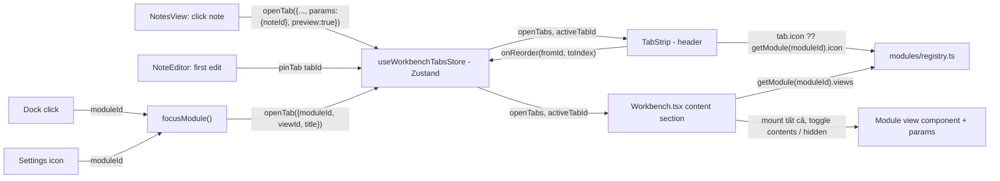

# Module tabs

Cơ chế mở/đóng/focus nhiều tab cùng lúc: kéo-thả sắp xếp, preview tab kiểu VS
Code (single-click, thay double-click mới ghim), nút đóng. Hôm nay
(`frontend/src/workbench/Workbench.tsx`) đây là **1 tab strip toàn cục**,
hiển thị trong dải `<header>` cao 30px ngay cạnh 3 nút đèn giao thông macOS,
trộn tab của mọi module vào 1 mảng phẳng.

import { Callout } from 'fumadocs-ui/components/callout';
import { Cards, Card } from 'fumadocs-ui/components/card';

<Callout type="warn" title="Design — Phase 5 chuyển sang per-module ownership">
[Title bar](/dev-kit/title-bar) bỏ hẳn tab-strip khỏi title bar (chỉ còn 3
vùng icon+tooltip: status / module quick action / app quick action). Tab
**không biến mất** — chuyển xuống content area của module, mỗi module tự quản
store tab riêng thay vì 1 `useWorkbenchTabsStore` toàn cục. Chi tiết ở mục
[Design: per-module ownership](#design-per-module-ownership-phase-5) cuối
trang. Chưa có runtime — toàn bộ nội dung bên dưới (`TabStrip`, `Reorder`,
`openTab`/`pinTab`/`preview`) mô tả đúng checkout hiện tại cho tới khi
migrate; cơ chế tương tác được **kế thừa nguyên trạng** sang model mới, chỉ
đổi nơi render và nơi giữ state.
</Callout>

<Callout type="info" title="Implemented — module tabs + Notes per-note tabs (preview/pin)">
`frontend/src/stores/workbenchTabs.ts` (Zustand store, giờ có thêm
`preview`/`pinTab`/`reorderTab`) + `frontend/src/workbench/tabs/TabStrip.tsx`
(UI, drag-to-reorder qua Motion `Reorder`), wired vào `Workbench.tsx`. Mỗi
module tự đăng ký icon mặc định qua `ModuleManifest.icon`
(`frontend/src/modules/registry.ts`), tab có thể override icon riêng.
Quyết định + alternatives:
[ADR-012](/dev-kit/architecture-decisions#adr-012-workbench-tab-strip-in-the-native-titlebar).
Notes giờ có 1 tab/note với preview-tab kiểu VS Code
(`modules/notes/NotesView.tsx`, `NoteEditor.tsx`). Agent Hub per-session tab +
live status qua `agenthub:sessionUpdate` vẫn chưa implement — xem mục Scope
bên dưới.
</Callout>

## Tabs store

`useWorkbenchTabsStore` (`frontend/src/stores/workbenchTabs.ts`) giữ
`openTabs: WorkbenchTab[]` phẳng + `activeTabId`.

Mỗi `WorkbenchTab` gồm:

| Field | Ý nghĩa |
|---|---|
| `id` | Dedupe key, tính bằng `tabKey(moduleId, viewId, params)` |
| `moduleId`, `viewId`, `title` | Tab thuộc module/view nào, hiện chữ gì |
| `params` | Tham số của view, optional — cũng là phần tạo nên `id` |
| `status` | `idle` / `running` / `success` / `error`, optional |
| `icon` | Optional; đè `ModuleManifest.icon` cho riêng tab này |
| `preview` | Optional; tab preview kiểu VS Code — in nghiêng, bị thay bởi lần single-click kế tiếp |

- **`openTab({moduleId, viewId, title, params?, icon?, preview?})` là
  open-or-focus** — tính `id` qua `tabKey()` (sort key của `params` rồi
  join), nếu tab đã tồn tại chỉ `setActiveTab`, không push trùng. `params`
  sort theo key trước khi join nên `{a:1,b:2}` và `{b:2,a:1}` cố ý collide
  vào cùng 1 tab. **Notes tiêu thụ primitive này rồi** (`NotesView.tsx` gọi
  `openTab({moduleId:"notes", viewId:"notes.editor", params:{noteId}, ...})`
  — 1 tab thật sự riêng biệt cho mỗi note); mọi module khác vẫn chỉ mở đúng 1
  tab "home" (`params` luôn `undefined`, `id` chỉ còn `moduleId:viewId`).
- **`preview: true` = tab kiểu VS Code single-click preview.** Mở tab mới với
  `preview: true` (single-click 1 note trong `NotesDashboard`) **thay thế
  tại chỗ** (cùng index mảng, không đẩy strip nhảy) tab preview hiện có nếu
  có — chỉ 1 preview tab tồn tại cùng lúc, giống browse-through file trong VS
  Code. Mở lại **chính tab đang là preview** với `preview: false` (double-
  click) promote nó tại chỗ thành tab thường. `TabStrip` render title tab
  preview nghiêng (`italic`) để phân biệt.
- **`pinTab(id)`** promote 1 tab preview thành tab thường (bỏ cờ `preview`)
  mà không cần gọi lại `openTab`. `NoteEditor.tsx` gọi hàm này ở lần edit đầu
  tiên (`scheduleSave` → `hasEditedRef` guard) — mở note để đọc chỉ tạo
  preview tab, bắt đầu gõ mới "ghim" nó lại, đúng semantics VS Code.
- **`reorderTab(fromId, toIndex)`** splice tab ra khỏi vị trí cũ rồi chèn vào
  `toIndex` — `TabStrip` chỉ gọi hàm này **1 lần khi thả** (drag-and-drop kéo
  thả xong), không gọi liên tục theo từng frame kéo; xem mục Tab strip UI.
- **`closeTab(id)` focus tab bên trái tab vừa đóng** (fallback
  `openTabs[index - 1] ?? openTabs[0]`), giống hành vi VS Code; không đổi
  `activeTabId` nếu tab bị đóng không phải tab đang active.
- **`setTabStatus(id, status)`** tồn tại sẵn cho tab hiện trạng thái
  running/success/error (dot màu trong `TabStrip`, tái dùng vocabulary
  `--status-running`/`--status-error`/`--status-idle`/`--status-success`) —
  nhưng **chưa module nào gọi hàm này**; đây là primitive dựng trước cho live
  status (vd Agent Hub session running → success/error dù đang đứng tab
  khác), việc nối event `agenthub:sessionUpdate` vào đây là follow-up chưa
  làm (xem mục Scope).

## Tab strip UI

`TabStrip.tsx` render trong `<header>` của `Workbench.tsx` (`h-[30px]`) —
bắt đầu sau khoảng `pl-20` (`pl-1` lúc fullscreen, traffic light ẩn) chừa chỗ
3 nút đèn giao thông, kết thúc trước cụm icon Search/Settings.
`main.go` cố ý để `Mac.InvisibleTitleBarHeight: 0` — Wails beta.8 hiện thực
giá trị này thành 1 native AppKit hit-zone kéo cửa sổ **vô điều kiện**, bắt
mọi `mousedown` đầu tiên trong N pixel đó ở capture phase trước khi web
content (Motion drag-to-reorder) kịp nhận gesture. Thay vào đó vùng kéo
cửa sổ là 1 `
` CSS tường minh, đặt `[--wails-draggable:drag]`
đúng khoảng trống 3 nút đèn giao thông (`w-20`/`w-1` lúc fullscreen) — xem
mục Rules bên dưới.

- **Cuộn ngang** — `overflow-x-auto` + `scrollbar-hide` (plugin Tailwind có
  sẵn), trackpad two-finger swipe hoạt động tự nhiên trong WKWebView, không
  cần JS wheel handler riêng.
- **Kéo-thả sắp xếp lại tab** — `Reorder.Group`/`Reorder.Item` (framer-
  motion), không phải `layout` đơn thuần. Mỗi tab là 1 `Reorder.Item`;
  `Reorder.Group` giữ 1 mảng "visual" cục bộ (`visualTabs` state, sync lại từ
  props `tabs` mỗi khi không có gesture đang chạy) và chỉ commit vào
  Zustand (`onReorder(fromId, toIndex)`) **đúng 1 lần lúc thả tay**
  (`handleDragEnd`) — không gọi theo từng frame kéo, nên các module view
  nặng (đang mount cùng lúc, xem mục Tabs store) nằm ngoài đường high-
  frequency của gesture. `layout="position"` (không phải `layout` scale-
  projecting) trên mỗi item để tab khác trượt mượt khi mảng đổi mà không
  làm biến dạng nội dung tab đang kéo. Cần bundle `domMax` (không phải
  `domAnimation` mà `Dock.tsx` đang dùng cho hiệu ứng scale hover —
  `domAnimation` không có layout animation lẫn `Reorder`).
- **Wails native window-drag vs Motion pointer-drag** — Wails phát hiện
  target kéo-được (window move) từ 1 `mousedown` ở **capture phase**, trước
  khi Motion kịp bắt gesture pointer của nó; nếu Wails thắng trước, OS chiếm
  luôn con trỏ và React không lấy lại được để kéo-sắp-xếp tab. Vì vậy cả
  `<Reorder.Group>` lẫn từng tab phải luôn set `[--wails-draggable:no-drag]`
  tường minh (không dựa vào default) — `Workbench.tsx` bù lại bằng 1 vùng
  drag-handle riêng phủ đúng khoảng trống 3 nút đèn giao thông.
- **`AnimatePresence`** bọc list để tab bị đóng có fade+scale-out thay vì
  biến mất tức thì trong lúc các tab khác đang trượt mượt.
- **Icon mỗi tab** — `tab.icon ?? getModule(tab.moduleId)?.icon ?? Wrench`:
  icon set thẳng trên tab (nếu `openTab` truyền `icon`) thắng icon mặc định
  của module (`ModuleManifest.icon`, cùng nguồn `Dock` dùng), `Wrench` là
  fallback cuối khi cả hai đều thiếu — không có map `moduleId → icon` tách
  rời nào khác cần đồng bộ tay.
- **Tab preview nghiêng** — `italic` trên title khi `tab.preview` true (xem
  mục Tabs store), không có xử lý riêng nào khác trong UI cho preview.
- **Nút đóng** — absolute-positioned trong khoảng `pr-7` luôn được dành sẵn
  trên mỗi tab (không phải toggle `display` hay đổi `width`), animate qua
  `opacity`/`scale` lúc hover/focus. Vì width tab không đổi lúc hover/kéo,
  hover và drag không bao giờ ảnh hưởng layout đo được của tab — đây là lý
  do vấn đề `gap` mô tả ở mục Rules bên dưới (từ thời còn `w-0 → w-4`) không
  còn tái diễn với cách làm hiện tại. Span `role="button"` lồng trong
  `<button>` cha (không lồng `<button>` thật được, invalid HTML) có
  `tabIndex={0}` + `onKeyDown` Enter/Space, cùng pattern chip xoá tag trong
  `NotesDashboard.tsx`.
- **`--wails-draggable`** — root `<header>` mặc định **`no-drag`** (đã đổi
  từ `drag` sang `no-drag` để dọn đường cho drag-to-reorder, xem gotcha ở
  trên); vùng kéo cửa sổ duy nhất là `
` tường minh phủ đúng
  khoảng trống 3 nút đèn giao thông. Mọi phần tử click/kéo được khác (mỗi
  tab, `Reorder.Group`, nút đóng, moduleActions, Search, Settings) tự set
  `no-drag` trên chính nó — không còn dựa vào override từ ancestor `drag`
  nữa. Xem mục Rules bên dưới.
- **`WorkbenchViews` là 1 component `memo` riêng** (`Workbench.tsx`) nhận
  `availableModules`/`hasMetadataWarning`/`openTabs`/`activeTabId` qua props
  tường minh — tách cây module view (nặng: SQL editor, Plate) ra khỏi
  header/`TabStrip` để re-render khi kéo tab (state cục bộ trong `TabStrip`,
  xem `reorderTab` ở mục Tabs store) không chạm tới subtree này. Mỗi view
  còn được bọc `<Suspense>` riêng (fallback `Loading {tab.title}...`) vì
  `view.component` có thể là `React.lazy`.

## Module icon self-registration

`ModuleManifest.icon: LucideIcon` (`frontend/src/modules/registry.ts`, bắt
buộc, validate trong `validateModuleManifest`) — mỗi module tự khai icon
trong `manifest.ts` của chính nó (vd `notesModule.icon = FileText`), thay vì
một map tra cứu `moduleId → icon` tách rời phải sync tay. `Dock.tsx` đọc
`getModule(id)?.icon` trực tiếp; `TabStrip.tsx` đọc cùng nguồn nhưng cho
phép **từng tab** override qua `WorkbenchTab.icon` (set lúc gọi `openTab`) —
module vẫn chỉ khai icon mặc định đúng 1 chỗ, override chỉ cần khi 1 tab
theo-item muốn icon khác icon module (chưa module nào dùng override này ở
Phase hiện tại, Notes tab của note vẫn dùng icon `FileText` mặc định).

## Scope: module tabs + Notes per-note hôm nay, Agent Hub sau

Mọi module khác Notes vẫn chỉ có **1 tab mỗi module** — click Dock icon hoặc
nút Settings đều đi qua `focusModule(moduleId)` (mở-hoặc-focus tab "home",
`view = module.views[0]`, `params` luôn rỗng). Nội dung mỗi tab được mount
**cùng lúc** trong DOM (`contents`/`hidden` toggle theo `activeTabId`, không
unmount) để state dở dang (SQL đang gõ, note đang sửa) không mất khi đổi
tab.

**Notes: 1 tab / note — implemented.** `NotesView.tsx` gọi
`openTab({moduleId:"notes", viewId:"notes.editor", params:{noteId}, preview})`
thay vì tự quản lý list↔editor nội bộ. Single-click 1 note trong
`NotesDashboard` mở **preview tab** (`preview: true`, title nghiêng, thay
thế tại chỗ preview tab trước nếu có); double-click hoặc bắt đầu gõ trong
`NoteEditor` (`scheduleSave` → `pinTab`) promote nó thành tab thường. View
`notes.editor` (`modules/notes/manifest.ts`) lazy-load qua
`lazyModuleView()`, `NotesView` gọi `.preload()` của nó trước khi mở tab để
chunk đã sẵn sàng lúc chuyển — cùng pattern `focusModule()` (`Workbench.tsx`)
dùng chung cho **mọi** module khi mở tab "home" qua Dock/Settings, không
phải riêng Notes; view đang hiển thị luôn được bọc `<Suspense>` nên tab mới
mở show `Loading {title}...` thay vì màn trắng lúc chunk chưa kịp tải xong.
Về nhà (nút back trong `NoteEditor`) gọi lại
`openTab({moduleId:"notes", viewId:"notes.list", ...})` — quay về tab
"home" list, không đóng tab editor.

**Chưa làm, cố ý:**

- **Agent Hub: 1 tab / session + live status.** `AgentHubView` hiện vẫn tự
  quản lý `activeSessionId` nội bộ qua `useAgentSessionsStore`, chưa map
  session → tab (không gọi `openTab`/`setTabStatus` ở đâu cả). Nối
  `agenthub:sessionUpdate` (đã có, `AgentSessionsSubscriber.tsx`) vào
  `setTabStatus` là bước còn thiếu để tab hiện running/success/error dù
  đứng tab khác.

## Rules / gotchas

- **`gap` (Tailwind) vẫn tính khoảng cách cho phần tử `w-0`** — khác `hidden`
  (`display:none`) bị loại hẳn khỏi flex layout. Nút đóng bản đầu tiên đổi từ
  `hidden`/`flex` sang `w-0`/`w-4` (để animate được) mà vẫn giữ `gap-1.5` trên
  container từng làm text tab lệch khỏi giữa (khoảng trống ma ở bên phải).
  Cách làm hiện tại (nút đóng `absolute` trong khoảng `pr-7` cố định, xem
  mục Tab strip UI) không đụng tới `gap` nữa nên bug này không còn tái diễn
  — nhưng nếu sau này đổi lại cơ chế reveal nút đóng bằng cách đổi kích
  thước 1 phần tử flex, nhớ lại gotcha này.
- **Icon lucide-react là `React.forwardRef`, `typeof` ra `"object"`, không
  phải `"function"`.** Validate `ModuleManifest.icon` copy y hệt pattern
  `typeof view.component !== "function"` sẽ throw nhầm cho **mọi** icon hợp
  lệ — check đúng phải chấp nhận cả `"function"` lẫn `"object"`.
- **`--wails-draggable` phải khai báo tường minh, không có default an
  toàn.** `main.go` cố ý để `Mac.InvisibleTitleBarHeight: 0` vì Wails
  beta.8 hiện thực giá trị > 0 thành native AppKit drag hit-zone **vô điều
  kiện** — bắt `mousedown` ở capture phase trước khi Motion (`TabStrip` kéo-
  sắp-xếp) kịp nhận gesture, tab kéo được nửa chừng thì window bắt đầu di
  chuyển theo. `<header>` gốc vì vậy đổi default thành `no-drag`; đúng 1
  `
` tường minh phủ khoảng trống 3 nút đèn giao thông mới
  là `drag`. Bất kỳ phần tử click/kéo-được mới nào thêm vào `<header>` (kể
  cả `Reorder.Group`/`Reorder.Item` của `TabStrip`) phải tự set `no-drag`
  trên chính nó — không còn ancestor `drag` nào để dựa vào (xem mục Tab
  strip UI).
- **`layout`/`Reorder` animation cần `domMax`**, `domAnimation` (Dock đang
  dùng) không đủ — 2 bundle khác kích thước (`domAnimation` 15kb, `domMax`
  25kb), 2 `LazyMotion` boundary độc lập trong cùng cây component vẫn hoạt
  động bình thường (sibling, không phải cha/con).
- **Dedupe theo `tabKey(moduleId, viewId, params)` đã có consumer thật.**
  Notes truyền `params: {noteId}` ổn định (không phải object mới mỗi lần
  render) khi mở tab note — nếu không mỗi lần mở lại cùng note sẽ tạo tab
  trùng thay vì focus tab cũ. Module tiếp theo thêm per-item tabs (Agent Hub,
  xem Scope) phải theo đúng pattern này.
- **`reorderTab` chỉ commit Zustand 1 lần lúc thả tay**, không theo từng
  frame kéo — `TabStrip` tự giữ 1 bản "visual" cục bộ trong lúc kéo
  (`visualTabs`/`visualTabsRef`) và chỉ đồng bộ lại từ store khi không có
  gesture nào đang chạy (`activeDragId.current === null`). Đừng gọi
  `onReorder` bên trong callback `onReorder` của `Reorder.Group` (đó là
  update cục bộ, không phải commit) — chỉ gọi trong `handleDragEnd`.

## Design: per-module ownership (Phase 5)

<Callout type="warn" title="Chưa có runtime">
Mục này mô tả hướng thiết kế mới, đi cùng [Title bar](/dev-kit/title-bar).
Mọi API/behavior ở trên (`useWorkbenchTabsStore`, `openTab`, `TabStrip`) là
checkout hiện tại — mục này là đích đến, chưa implement.
</Callout>

- **Opt-in theo module** — module nào có khái niệm "nhiều item mở cùng lúc"
  mới dùng tab (Notes: 1 tab/note; Agent Hub: 1 tab/session; Database: 1
  tab/table đang xem...). Module không cần tab (Settings, Vault) thì không có
  tab strip nào cả.
- **Mỗi module có store tab riêng** — thay `useWorkbenchTabsStore` toàn cục
  bằng 1 store/module (không còn 1 mảng `openTabs` phẳng trộn mọi
  `moduleId`). Store của module A không biết gì về tab của module B.
- **Render trong content area của module**, không còn trong `<header>` 30px
  — title bar chỉ còn 3 vùng icon+tooltip (xem
  [Title bar](/dev-kit/title-bar)).
- **State giữ nguyên khi rời module** — chuyển sang module khác qua Dock
  không đóng/reset tab đang mở; quay lại module cũ, mọi tab (và nội dung dở
  dang bên trong) vẫn còn nguyên. Cơ chế mount-song-song hiện đã áp dụng ở
  cấp **tab** (xem mục Scope) — Phase 5 áp dụng thêm ở cấp **module**.
- **Click icon Dock của 1 module → sticky theo tab active gần nhất** của
  module đó. Module chưa có tab nào mở (lần đầu, hoặc đã đóng hết) → về view
  "home" mặc định (VD Notes → Dashboard).
- **Cơ chế tương tác giữ nguyên** — kéo-thả (`Reorder`), preview/pin kiểu VS
  Code, nút đóng: xem mục Tab strip UI ở trên, chỉ đổi nơi render/giữ state,
  không đổi hành vi.
- **Non-goal của bản này: điều hướng chéo module.** VD kết quả Agent Hub
  nhắc tới 1 note, click vào cần mở đúng note đó trong Notes. Hướng dự kiến
  là dùng **split panel** ([Shell primitives](/dev-kit/shell-primitives))
  thay vì chuyển hẳn Dock sang module khác — chi tiết thiết kế **chưa viết**,
  nằm ở 1 tài liệu riêng sau này.

<Cards>
  <Card title="Title bar" href="/dev-kit/title-bar" description="3 vùng icon+tooltip thay tab-strip trong title bar" />
  <Card title="ADR-012" href="/dev-kit/architecture-decisions#adr-012-workbench-tab-strip-in-the-native-titlebar" description="Quyết định + alternatives gốc (CSS-only push, per-item tabs ngay từ đầu)" />
  <Card title="Shell primitives" href="/dev-kit/shell-primitives" description="moduleActions, SplitPanel — hướng giải quyết điều hướng chéo module" />
  <Card title="Repo structure" href="/dev-kit/repo-structure" description="Layout frontend/ trong repo" />
  <Card title="Implementation status" href="/dev-kit/implementation-status" description="Evidence: ModuleManifest / Internal Extension API row" />
</Cards>
