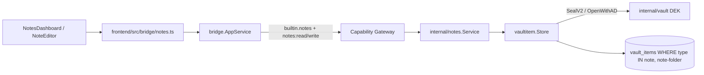
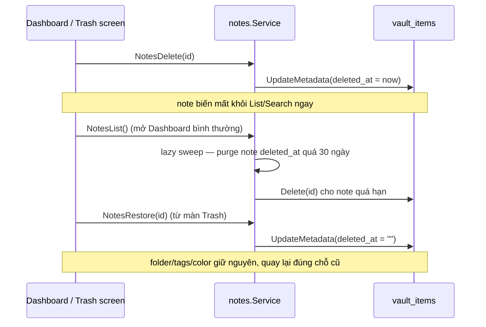
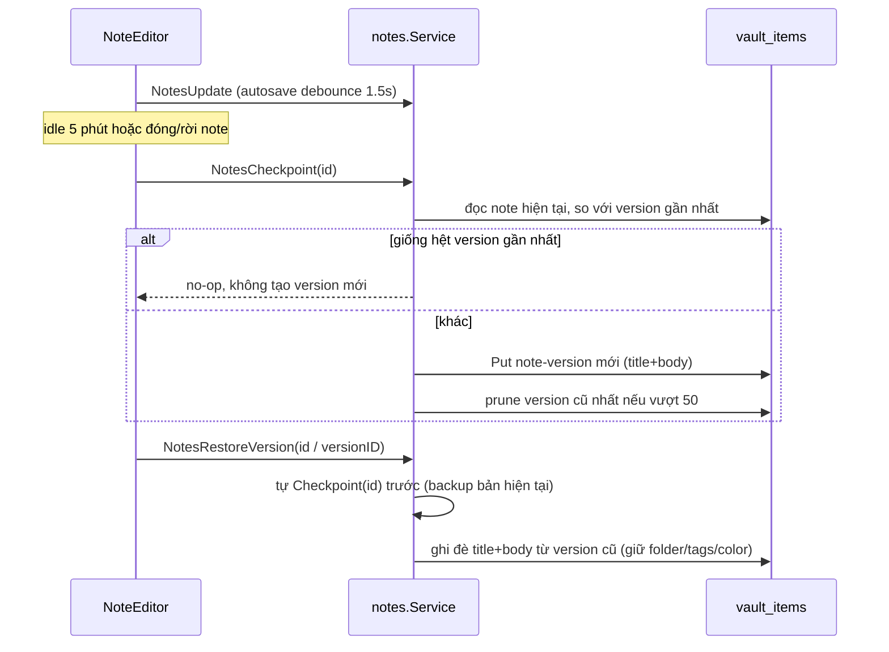
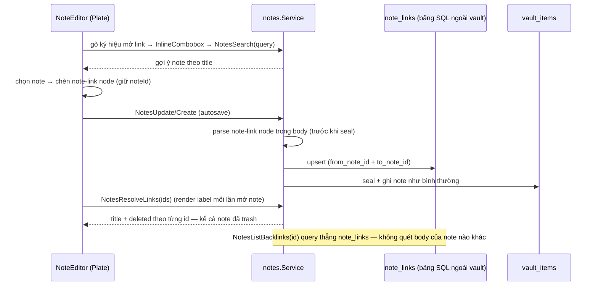

# Notes

Notes là built-in **dock module** (`frontend/src/modules/notes`). Nó
**không** có bảng/repository/crypto riêng: service `internal/notes` là thin
adapter map field vào `vaultitem.Store` chung (cùng substrate với SSH và các
module vault-item khác), qua **hai** record type: `note` và `note-folder`.
Vault lifecycle (Master Password / DEK) nằm ở [Vault](/dev-kit/vault) —
`VaultGate` phải `unlocked` trước khi Workbench (và Notes UI) render.



## Runtime API

| Bridge method | Capability | Scope | Service |
|---|---|---|---|
| `NotesList` | `notes:read` | `note:list` | `List()` → `[]Summary` |
| `NotesSearch` | `notes:read` | `note:search` | `Search(query)` — title, tag, folder name, body |
| `NotesGet` | `notes:read` | `note:<24hex>` | `Get(id)` → decrypt body |
| `NotesCreate` | `notes:write` | `note:new` | `Create(title, body, folderID, tags)` |
| `NotesUpdate` | `notes:write` | `note:<24hex>` | `Update(id, title, body)` — title/body only, **preserves** folder/tags/color |
| `NotesSetOrganization` | `notes:write` | `note:<24hex>` | `SetOrganization(id, folderID, tags, color)` — metadata-only write, no body reseal |
| `NotesDelete` | `notes:write` | `note:<24hex>` | `Trash(id)` — **soft-delete**, set `deleted_at`, không xoá record (xem [Trash](#trash-soft-delete)) |
| `NotesRestore` | `notes:write` | `note:<24hex>` | `Restore(id)` — clear `deleted_at`, giữ nguyên folder/tags/color |
| `NotesPurge` | `notes:write` | `note:<24hex>` | `Purge(id)` — xoá cứng 1 note đang ở trash, không hồi phục |
| `NotesEmptyTrash` | `notes:write` | `note:trash:empty` | `EmptyTrash()` — xoá cứng toàn bộ note đang ở trash |
| `NotesListTrash` | `notes:read` | `note:trash:list` | `ListTrash()` → `[]Summary` (kèm `deleted_at`), chạy lazy purge sweep trước khi trả kết quả |
| `NotesCheckpoint` | `notes:write` | `note:<24hex>` | `Checkpoint(id)` — snapshot title+body hiện tại thành 1 `note-version` mới; no-op nếu giống hệt version gần nhất |
| `NotesListVersions` | `notes:read` | `note:<24hex>` | `ListVersions(id)` → `[]VersionSummary` (`created_at`, `trigger`) |
| `NotesGetVersion` | `notes:read` | `note:<24hex>` | `GetVersion(id, versionID)` → decrypt title+body của 1 version |
| `NotesRestoreVersion` | `notes:write` | `note:<24hex>` | `RestoreVersion(id, versionID)` — checkpoint bản hiện tại trước, rồi ghi đè title+body (giữ nguyên folder/tags/color) |
| `NotesListBacklinks` | `notes:read` | `note:<24hex>` | `ListBacklinks(id)` → `[]Summary` các note có link trỏ tới `id`, kèm cờ `deleted` |
| `NotesResolveLinks` | `notes:read` | `note:list` | `ResolveLinks(ids)` → map `id → {title, deleted}` — dùng để render label link trong editor, bao gồm cả note đã trash |
| `NotesFolderList` | `notes:read` | `note-folder:list` | `ListFolders()` → `[]Folder` |
| `NotesFolderCreate` | `notes:write` | `note-folder:new` | `CreateFolder(name, color, tags)` |
| `NotesFolderUpdate` | `notes:write` | `note-folder:<24hex>` | `UpdateFolder(id, name, color, tags)` |
| `NotesFolderDelete` | `notes:write` | `note-folder:<24hex>` | `DeleteFolder(id)` — copy-down then delete |

Note giờ **có** in-place edit: `Update` chạy autosave (~1.5s debounce) từ
`NoteEditor` (Plate editor), khác hẳn model create-only trước đây. `Update`
đọc lại metadata hiện có và chỉ thay `title`, nên autosave body/title không
bao giờ xoá `folder_id`/`tags`/`color`. Đổi folder/tag/color đi qua
`SetOrganization` riêng (metadata-only, không reseal body), gọi ngay khi user
đổi — không đợi debounce autosave.

Subject luôn `builtin.notes`. Record ID là **24 lowercase hex**
(`vaultitem.NewID`); bridge `recordID()` làm opaque scope, reject ID lệch
format — dùng chung cho cả `note:<id>` và `note-folder:<id>`.

`List()`/`Search()` mặc định **loại bỏ** note có `deleted_at` khác rỗng —
xem [Trash](#trash-soft-delete) cho toàn bộ cơ chế trash.

## MCP tool surface

Xem cơ chế chung + rationale ở [MCP / Agent](/dev-kit/mcp-agent).

| MCP tool | Effect | Map sang | Ghi chú |
|---|---|---|---|
| `notes.list` | `read` | `builtin.notes` / `notes:read` / `note:list` | trả `folder_id`, `tags`, `effective_tags`, `color`, `effective_color`, `preview`. Preview cần decrypt body nên vault locked → lỗi structured `vault_locked` (FR-6 mcp-agent), không trả list thiếu preview ngầm |
| `notes.search` | `read` | `builtin.notes` / `notes:read` / `note:search` | match title/tag/folder-name luôn; body chỉ khi vault unlocked |
| `notes.get` | `read` | `builtin.notes` / `notes:read` / `note:<id>` | trả cả `body` đã decrypt — note là nội dung người dùng, không phải credential như SSH/DB nên không áp rule "không trả raw secret" |
| `notes.create` | `execute` | `builtin.notes` / `notes:write` / `note:new` | `folder_id`, `tags` optional |
| `notes.update` | `execute` | `builtin.notes` / `notes:write` / `note:<id>` | title + body only, giữ nguyên tổ chức |
| `notes.set_organization` | `execute` | `builtin.notes` / `notes:write` / `note:<id>` | `folder_id`, `tags`, `color` — mọi field optional/`omitempty`, gửi thiếu field = giữ nguyên phía đó |
| `notes.delete` | `execute` (`destructiveHint`) | `builtin.notes` / `notes:write` / `note:<id>` | **soft-delete** — move to trash, không xoá record |
| `notes.trash.list` | `read` | `builtin.notes` / `notes:read` / `note:trash:list` | |
| `notes.trash.restore` | `execute` | `builtin.notes` / `notes:write` / `note:<id>` | |
| `notes.version.list` | `read` | `builtin.notes` / `notes:read` / `note:<id>` | |
| `notes.version.get` | `read` | `builtin.notes` / `notes:read` / `note:<id>` | trả title+body đã decrypt của 1 version cũ |
| `notes.backlinks.list` | `read` | `builtin.notes` / `notes:read` / `note:<id>` | hữu ích cho agent truy vết quan hệ giữa các note |
| `notes.folder.list` | `read` | `builtin.notes` / `notes:read` / `note-folder:list` | |
| `notes.folder.create` | `execute` | `builtin.notes` / `notes:write` / `note-folder:new` | |
| `notes.folder.update` | `execute` | `builtin.notes` / `notes:write` / `note-folder:<id>` | |
| `notes.folder.delete` | `execute` (`destructiveHint`) | `builtin.notes` / `notes:write` / `note-folder:<id>` | chạy copy-down ngay, không hỏi confirm (khác UI) |

`notes.purge` và `notes.empty_trash` **không** expose ra MCP — xoá vĩnh viễn
không hồi phục, để agent tự gọi là rủi ro không cần thiết so với lợi ích; hai
thao tác này chỉ có ở UI (màn Trash).

`notes.version.restore` **cũng không** expose ra MCP dù bản thân nó không mất
dữ liệu (đã tự checkpoint trước khi ghi đè) — để agent tự ý thay nội dung
note về 1 bản cũ vẫn là thay đổi bất ngờ với user; restore chỉ có ở UI.

`notes.resolve_links` (`NotesResolveLinks`) **không** expose ra MCP — thuần
phục vụ render label trong editor, agent không cần "tên hiển thị hiện tại
của 1 link", chỉ cần `notes.get`/`notes.backlinks.list` là đủ ngữ cảnh.

## Record shape at rest

### Note — `type = "note"`

| Field | At rest | Notes |
|---|---|---|
| `type` | `"note"` | Schema-validated |
| `metadata` | `{"title":"...","folder_id":"...","tags":["..."],"color":"blue"}` plaintext | `folder_id`/`tags`/`color` optional; title/tag/folder matching không cần decrypt (search vẫn chạy khi locked, chỉ thiếu body match); `notes.list` cần decrypt cho preview nên yêu cầu vault unlocked |
| `payload` | Envelope V2 của body | AAD `(note, <id>, note-body)`; `key_id` phải = `note-body` |
| `key_version` | starts at `1` | Crypto/record version — **không** phải sync entity version |
| `sync_state` | `"local"` on create | Local-only; omitted on sync wire snapshot |

### Folder — `type = "note-folder"`

| Field | At rest | Notes |
|---|---|---|
| `type` | `"note-folder"` | Schema-validated |
| `metadata` | `{"name":"Work","color":"blue","tags":["work"]}` plaintext | `name` + `color` required, `color` ∈ 9-màu palette (`red orange yellow green teal blue violet pink gray`) |
| `payload` | Envelope V2 rỗng `{}` | `key_id` phải = `note-folder` — folder không có secret, envelope chỉ để record hợp lệ với sync validation |
| One-level only | không nesting | sidebar là flat list |

Note's `color` dùng **chung palette** với folder (`vaultitem.ValidNoteFolderColor`), không có hệ màu riêng.

### Version — `type = "note-version"`

| Field | At rest | Notes |
|---|---|---|
| `type` | `"note-version"` | Schema-validated |
| `metadata` | `{"note_id":"<24hex>","trigger":"checkpoint"\|"pre-restore"}` plaintext | `note_id` trỏ về note gốc; `trigger` chỉ để hiển thị/debug, không ảnh hưởng logic |
| `payload` | Envelope V2 của `{title, body}` snapshot | AAD `(note-version, <id>, note-version-body)`; `key_id` phải = `note-version-body` |
| One record per snapshot | không phải diff | full copy title+body tại thời điểm checkpoint |

Chỉ **title+body** được version hoá — cùng phạm vi field với `Update`, không
đụng `folder_id`/`tags`/`color` (những field đó thuộc `SetOrganization`,
version/restore không chạm tới).

<Callout type="warn" title="Blast radius: internal/vaultitem/schema.go">
Thêm `type = "note-version"` đụng **2 switch hardcode dùng chung cho mọi
record type** — `IsSupportedItemType()` và `ValidateRecordSchema()` (whitelist
`key_id` mong đợi mỗi type, hiện có note/note-folder/database/ssh/kafka).
Không phải khai báo type mới ở đâu đó độc lập — đây là file lõi, sửa sai ảnh
hưởng validate của **mọi** module khác đang dùng `vaultitem`, cần review kỹ
hơn 1 thay đổi cục bộ trong `internal/notes`.
</Callout>

Create path (note):

`notes.Create` gọi `store.Create` với record type `note` và key id
`note-body`, kèm metadata JSON và body bytes → `vaultitem` seal bằng vault DEK
+ AAD → `SQLMutationRepository.Put`, cộng sync mutation intent khi đã wire.

## Effective tags / effective color (live inheritance)

- **Effective tags** = hợp của tag riêng của note và tag của folder, khử trùng
  lặp, tag của chính note đứng trước.
- **Effective color** = màu riêng của note nếu có; không có thì lấy màu folder;
  không có folder thì rỗng.

Cả hai đều **live**: đổi tag/màu của folder thay đổi ngay effective value của
mọi note trong folder đó, không rewrite note record nào. `Update`/`List`/
`Get`/`Search` đều compute lại từ `loadFolderMap()` mỗi lần gọi (in-memory
join, không index SQL riêng).

**Di chuyển** note sang folder khác (kể cả về Ungrouped) **không copy** gì —
effective value theo folder mới ngay lập tức.

**Xoá folder** (`DeleteFolder`) chạy copy-down atomic — validate/normalize
trước, chỉ ghi khi mọi note pass:

1. Với mỗi note thuộc folder: `tags = unique(note.tags ∪ folder.tags)`;
   nếu `note.color == ""` (đang inherit) thì `color = folder.color`, note đã
   có color riêng thì giữ nguyên; `folder_id = ""`.
2. Xoá folder record.

Sau bước này effective tags/color của note **không đổi** — chỉ chuyển từ
inherited sang owned. Nếu một note vượt tag cap (32 tags) khi union, toàn bộ
`DeleteFolder` fail **trước khi ghi note nào** (hai-pha: validate hết rồi mới
write) — không còn corrupt-giữa-chừng.

Orphan `folder_id` (folder bị xoá ở device khác, chưa sync copy-down) → coi
như ungrouped, effective tags/color chỉ còn phần own, không crash list.

## Trash (soft-delete)

Chỉ áp dụng cho `note` — **không** áp dụng cho `note-folder` (folder xoá vẫn
theo cơ chế copy-down hard-delete cũ, xem trên).



- **`deleted_at`** — field plaintext mới trong `metadata` của note (cạnh
  `title`/`folder_id`/`tags`/`color`), rỗng khi note bình thường. `NotesDelete`
  set field này (metadata-only write, cùng đường với `SetOrganization`,
  không reseal body); `NotesRestore` clear nó. Không thêm record type/bảng
  mới — tái dùng đúng field đã có sẵn trên `vault_items`.
- **Trash không strip tổ chức** — khác `DeleteFolder` copy-down, trash/restore
  giữ nguyên `folder_id`/`tags`/`color`; note quay lại đúng chỗ cũ khi
  restore. Nếu folder gốc đã bị xoá trong lúc note nằm ở trash, áp dụng đúng
  rule orphan `folder_id` sẵn có (coi như ungrouped).
- **Ẩn hoàn toàn khỏi đường thường** — `List`/`Search` (và `notes.list`/
  `notes.search` qua MCP) loại bỏ note có `deleted_at` khác rỗng. Chỉ thấy qua
  `NotesListTrash`/màn Trash riêng.
- **Retention 30 ngày**, cố định (chưa cấu hình được). Quá hạn thì bị purge
  cứng — xoá thật khỏi `vault_items`, không còn khôi phục được.
- **Purge là lazy sweep, không phải background job** — app desktop không chạy
  nền liên tục nên không đặt cron. Sweep chạy piggyback trong `List()` (mỗi
  lần Dashboard mở là quét luôn, không cần user mở màn Trash) và trong
  `ListTrash()` trước khi trả kết quả — note quá hạn bị xoá cứng ngay khi bất
  kỳ lệnh gọi nào trong hai lệnh trên chạy tới, không đợi cả hai.
- **`NotesPurge`**/**`NotesEmptyTrash`** xoá cứng ngay, không qua trash lần
  hai — chỉ gọi được từ UI (nút "Delete forever" / "Empty trash" trong màn
  Trash), không expose MCP (xem MCP tool surface ở trên).

<Callout type="info" title="Open question">
Note đang mở dưới dạng 1 tab ([Module tabs](/dev-kit/module-tabs)) bị trash từ
nơi khác (vd Dashboard, hoặc sync về từ thiết bị khác) — tab đó nên tự đóng
hay hiện trạng thái "note đã bị xoá"? Chưa quyết định.
</Callout>

## Version history

Snapshot **title+body** theo thời gian, cho phép xem lại/khôi phục nội dung
cũ — record mới `note-version` (xem [Record shape](#record-shape-at-rest)),
cùng substrate `vault_items`, không phải bảng riêng.



- **Trigger: auto-checkpoint theo phiên**, không phải mỗi lần autosave.
  Frontend gọi `NotesCheckpoint(id)` khi note **idle 5 phút không sửa**, hoặc
  khi user **đóng/rời note** (chuyển tab, đóng editor) — không gọi theo mỗi
  debounce autosave 1.5s, tránh version spam.
- **`Checkpoint` tự no-op nếu không đổi gì** — server so nội dung hiện tại
  với version gần nhất cùng `note_id`, giống hệt thì không tạo record mới.
  Nhờ vậy frontend không cần tự track "đã đổi gì chưa từ lần checkpoint
  trước" — gọi vô tư ở mọi điểm trigger, server tự quyết có ghi hay không.
- **Retention: 50 version gần nhất mỗi note.** `vaultitem.Repository` hiện
  chỉ có `List`/`ListByType`/`Get`/`Put`/`Delete` — không đủ để lọc theo
  note, nhưng feature này **chưa build**, nên không phải sống chung với giới
  hạn đó: thêm thẳng 1 method mới vào interface,

  ```go
  ListByTypeAndMetaField(itemType, field, value string) ([]Record, error)
  ```

  implement bằng `json_extract(metadata, '$.' || ?)` trong
  `sqlrepository.go` (SQLite hỗ trợ sẵn, không cần bảng index phụ). `Checkpoint`
  gọi `ListByTypeAndMetaField("note-version", "note_id", id)` — trả đúng tập
  version của **note này**, không quét cả vault; sort theo `created_at` +
  xoá phần dư quá 50 làm trong Go sau đó (tập nhỏ, không cần đẩy xuống SQL).
  Không atomic tuyệt đối (vài lệnh `repo` tuần tự, không phải 1 transaction)
  nhưng không còn là "quét hết rồi lọc" — đây là 1 thay đổi nhỏ, dùng lại
  được cho bất kỳ lookup theo-1-field-metadata nào khác sau này, không phải
  giải pháp vá riêng cho version history.
- **Restore an toàn** — `RestoreVersion(id, versionID)` tự gọi `Checkpoint`
  (trigger `"pre-restore"`) cho bản hiện tại trước khi ghi đè, nên restore
  không bao giờ làm mất nội dung đang có, kể cả khi nó chưa từng được
  auto-checkpoint (vd vừa sửa dưới 5 phút).
- **Cascade khi purge** — `NotesPurge(id)` xoá cứng note thì xoá luôn toàn bộ
  `note-version` có `note_id` trỏ tới nó (không để lại bản ghi mồ côi). Trash
  (soft-delete) thường **không** đụng version — note vào trash vẫn giữ
  nguyên lịch sử, restore từ Trash thì version cũ vẫn còn nguyên.

<Callout type="info" title="Open question">
UI xem/diff version — tái dùng style git-diff line-highlight đã có ở
[Sync conflict `ResolvePanel`](/dev-kit/data-sync) (so version cũ với bản
hiện tại), mở qua 1 nút `History` đăng ký vào title bar giống `PanelRight`
("Note details") đang làm với `NoteMetaPanel`. Vị trí/chi tiết UI chưa thiết
kế — cần 1 lượt riêng.
</Callout>

## Backlink / wiki-link

Link giữa các note ngay trong body — note trở thành networked, không chỉ
phân loại qua folder/tag.



- **Link lưu note ID, hiển thị theo title hiện tại** — trong Plate, link là 1
  **inline void element** riêng (`note-link`, khác hyperlink `https://...`
  thường), giữ `noteId`, **không** giữ text hiển thị. Label luôn render theo
  title hiện tại tại thời điểm mở note (qua `NotesResolveLinks`) — đổi tên
  note ở đâu, mọi link trỏ tới nó tự cập nhật hiển thị, không cần rewrite
  content note nguồn.

  <Callout type="warn" title="Plugin mới hoàn toàn, không phải mở rộng">
  `frontend/src/modules/notes/plate/plugins.ts` hiện **chưa có bất kỳ inline
  void element nào** — `LinkKit` là inline nhưng không void (bọc text
  thường), `ImageUploadPlugin` là void nhưng block-level, không inline.
  `note-link` là plugin wiring từ đầu (schema node, render component, xử lý
  serialize/deserialize), không có sẵn cái tương tự để mở rộng.
  </Callout>

- **Tạo link: gõ `[[` mở autocomplete** — tái dùng `NotesSearch` đã có sẵn
  (match title) để gợi ý, không cần bridge method mới cho bước gõ-tìm. Chọn
  xong Plate chèn 1 `note-link` node giữ `noteId`. Combobox UI dựng trên
  **`InlineCombobox`** (`components/ui/inline-combobox.tsx`) — component
  Plate đã dùng thật cho slash-command `/` (`SlashInput.tsx`,
  `trigger="/"` là prop string) — `[[` là 1 biến thể trigger khác của cùng
  component, **không phải** `cmdk` (`cmdk` là lib khác, backing Command
  Palette/`TabSwitcher` ở tầng app, không phải combobox trong Plate).
- **Click mở note đích như mở note bình thường** — qua
  `useWorkbenchTabsStore.openTab()` **hiện có** (`NotesView.tsx` đã dùng cho
  preview/pin tab của note): note đã có tab thì focus, chưa có thì mở tab
  mới. Doc [Module tabs](/dev-kit/module-tabs) có 1 hướng thiết kế tương lai
  là mỗi module tự có store tab riêng (Phase 5, **chưa có runtime**) — hành
  vi click backlink ở đây gọi API tab đang thật sự chạy hôm nay
  (`useWorkbenchTabsStore`), không giả định trước là store riêng của module
  đã tồn tại; nếu Phase 5 landed trước feature này thì đổi sang gọi store
  riêng của Notes, cơ chế mở/focus tab không đổi.
- **Backlink index: bảng SQL riêng `note_links`, ngoài vault** — cùng tiền lệ
  `ui_state`/`env_tags` ([UI state persistence](/dev-kit/ui-state)) — bảng
  plaintext, không phải `vault_items`:

  ```sql
  note_links(from_note_id TEXT, to_note_id TEXT, updated_at)
  ```

  Ghi/xoá index **là side-effect của `Create`/`Update`** — cả hai đã nhận
  `body` plaintext (input trước khi seal) nên parse `note-link` node ngay
  trong cùng request, diff với row cũ của `from_note_id`, upsert. Không cần
  hook mới, không cần quét lại toàn bộ note nào khác. ID link (tham chiếu)
  không phải nội dung nhạy cảm nên lưu ngoài vault chấp nhận được — cùng lý
  luận đã áp dụng cho `ui_state`.
- **`NotesListBacklinks(id)` query thẳng bảng trên** — nhanh, không quét body
  của mọi note (khác với cách `effective_tags` tính live, vì đây user chủ
  động chọn hướng index để backlink query nhanh ở mọi quy mô vault).
- **Note bị trash/xoá: giữ nguyên link, đánh dấu "note đã xoá"** —
  `NotesResolveLinks` **không** áp dụng filter loại-trừ-trash như
  `List`/`Search`, trả cả note đã trash kèm cờ `deleted: true` để frontend
  render link ở trạng thái mờ/gạch ngang thay vì xoá text link khỏi note
  nguồn. Link tự "hồi sinh" bình thường nếu note đích được restore.
- **Cascade khi purge** — `NotesPurge(id)` xoá cứng note thì xoá luôn mọi row
  `note_links` có `from_note_id = id` **hoặc** `to_note_id = id` (dọn cả 2
  chiều, tránh row mồ côi trỏ tới ID không còn tồn tại).

<Callout type="info" title="Open question">
Note ID trong `note-link` không tồn tại nữa (purge) khác với đang trash —
`NotesResolveLinks` trả gì cho trường hợp không tìm thấy (khác `deleted:
true`)? Cần 1 trạng thái thứ 3 (vd `missing: true`) hay coi chung là
"deleted"? Chưa quyết định.
</Callout>

## Search

- Title: luôn match (plaintext).
- Effective tag + folder name: luôn match (plaintext metadata + in-memory join).
- Body: chỉ khi `OpenPayload` thành công (vault unlocked).
- Empty query → mọi note, newest `updated_at` trước.
- Cross-type metadata search là `VaultSearch` riêng (không qua Notes UI).

Trong app bình thường Notes chỉ mở sau `VaultGate` unlocked, nên body search
luôn available trên UI path; title-only degradaton là property của service/bridge
khi vault locked.

## UI flow (dashboard → editor)

`NotesView` có hai screen trong cùng workbench pane, không còn master-detail:

1. **Dashboard** (`NotesDashboard`, mặc định) — sidebar trái: **All** /
   **Ungrouped** / từng folder (dot màu + tên + count) / **Trash** (cuối
   danh sách, tách biệt — không tính vào count của All/folder). Overflow menu
   per folder (rename, đổi màu, sửa tag, xoá — `AlertDialog` cảnh báo notes
   được giữ lại và tag được copy). Phải: search box + tag-filter chips (AND
   khi chọn nhiều) + grid note card. `NoteCard` có action "Move to trash"
   trong overflow menu (thay cho xoá cứng trực tiếp); màn **Trash** đổi
   action đó thành 2 nút "Restore" / "Delete forever" trên mỗi card, cộng nút
   "Empty trash" toàn cục.
2. **Editor** (`NoteEditor`, Plate) — full pane khi mở 1 note. Back/breadcrumb
   `Notes / {folder|Ungrouped} / {title}` quay lại dashboard, giữ nguyên
   scope sidebar đã chọn.

Note card (`NoteCard`) là "mini-window": khung ngoài `bg-card`/`border-border`
trung tính (giống window chrome của app), title 1 dòng
(`truncate`, không bao giờ xuống dòng), bên trong là panel inset tỉ lệ 3:2
tô màu `effective_color` qua `color-mix()` trên token `--note-folder-*` có sẵn
(30% nền / 45% viền, không gradient/glow) — panel rỗng màu (`bg-muted`) khi
note không có effective color. Preview + tag chip (dot + label) + thời gian
tương đối nằm trong panel đó.

Editor (`NoteEditor`) là cột viết căn giữa, giới hạn `max-w-[720px]`, title
lớn (`text-3xl font-bold`) đứng riêng phía trên body — không còn hàng
metadata chen trong header editor. Folder picker (`Select`), color picker
(`ColorPicker`, có nút "Inherit from folder"), và tag input (Enter/comma, tag
kế thừa hiển thị read-only riêng) chuyển hết vào `NoteMetaPanel`, một panel
cục bộ của Notes được đẩy vào **shared split panel** của toàn app (xem
[Shell primitives](/dev-kit/shell-primitives)),
mở/đóng qua nút `PanelRight` đăng ký vào title bar chung — không phải nút
local trong header editor. Đổi folder/tag/color vẫn gọi `setNoteOrganization`
ngay, không đợi debounce autosave 1.5s của title/body; đổi note (`key={noteId}`
ở `NotesView`) tự đóng panel và unregister nút title-bar do component cũ
unmount hoàn toàn.

`NoteEditor` còn đăng ký thêm nút `History` (mở [Version
history](#version-history) qua cùng shared split panel với `NoteMetaPanel`)
và render `note-link` node như 1 pill trong dòng text — click mở note đích
qua tab của Notes ([Backlink § Click](#backlink--wiki-link)); `[[` mở
combobox chèn link mới ngay trong body.

Manifest: `frontend/src/modules/notes/manifest.ts` khai báo
`notes:read` / `notes:write` (declaration metadata); grant thật nằm ở
`internal/app/container.go` (bao gồm cả 4 grant `note-folder:*`).

## Sync & conflict

Notes + folder sync như mọi `vault_items` record
(`record_type IN (note, note-folder)`), không có pipeline riêng — xem
[Data & sync](/dev-kit/data-sync).

Conflict resolve strategies:

| Strategy | Notes |
|---|---|
| `use-ours` / `use-theirs` | Mọi record type |
| `merge` | **Chỉ notes** — reseal merged text dưới `note-body`; secret types (kể cả folder) → `ErrNotMergeable` |

UI MVP: Git markers trong `ResolvePanel` (3-pane JetBrains vẫn là target).

**Trash vs. edit** — 1 thiết bị trash note trong lúc thiết bị khác sửa
title/body/metadata trước khi sync: rơi vào `use-ours`/`use-theirs` như
conflict thường, **không** phải target của `merge` (`deleted_at` không phải
text mergeable). Chọn "theirs" (bản sửa) tự resurrect note khỏi trash; chọn
"ours" (bản trash) thì bỏ bản sửa, note ở lại trash.

## Known limitations

- Title plaintext local — encrypt riêng nếu title ever sync/sensitive.
- Folder **one level only** — không nested tree, không drag-and-drop reorder.
- Note color giới hạn 9-màu palette dùng chung với folder, không freeform hex.
- Đổi màu note chỉ từ editor — chưa có quick-set màu ngay trên dashboard card.
- Legacy table `notes` đã drop ở migration m6; không còn backfill path.
- Trash chỉ áp dụng cho note — folder xoá vẫn hard-delete (copy-down) ngay,
  không qua trash.
- Trash retention cố định 30 ngày, chưa cấu hình được theo user.
- Version history lưu full snapshot mỗi checkpoint (không diff) — tốn dung
  lượng vault theo số version × kích thước note; idle-checkpoint 5 phút và
  giới hạn 50 version chưa cấu hình được theo user.
- Version chỉ phủ title+body — đổi folder/tag/color không tạo version, không
  khôi phục được tổ chức cũ qua restore.
- Backlink chỉ note-to-note — không link được tới folder/tag, không có graph
  view (chỉ list 1-hop qua `ListBacklinks`, không truy vết nhiều bước).

## Rules

- Không log plaintext body.
- Không giữ raw body ở UI lâu hơn cần sau khi hiển thị detail.
- Không bypass gateway; mọi call đi `AppService.call` + capability check.
- UI class chỉ dùng theme token/CSS variable — không hardcode hex màu dark
  trong component (kể cả folder/tag/note color tokens).

import { Cards, Card } from 'fumadocs-ui/components/card';

<Cards>
  <Card title="Shell primitives" href="/dev-kit/shell-primitives" description="moduleActions + SplitPanel — primitive dùng chung mà editor này là consumer đầu tiên" />
  <Card title="Module tabs" href="/dev-kit/module-tabs" description="Tab riêng của Notes — click backlink mở/focus tab note đích" />
  <Card title="UI state persistence" href="/dev-kit/ui-state" description="Tiền lệ bảng plaintext ngoài vault — note_links dùng chung cách tiếp cận" />
  <Card title="Vault" href="/dev-kit/vault" description="Keyring/DEK + vaultitem substrate" />
  <Card title="SSH" href="/dev-kit/ssh" description="Cùng thin-adapter pattern trên vaultitem" />
  <Card title="Data & sync" href="/dev-kit/data-sync" description="Conflict merge cho notes" />
  <Card title="Technical contracts" href="/dev-kit/technical-contracts" description="Bridge + capability table" />
</Cards>
