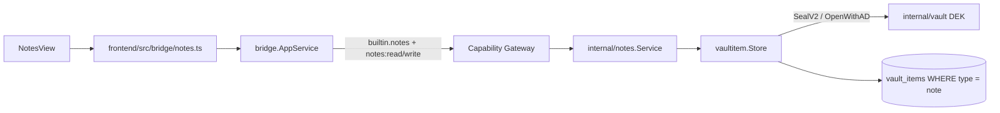

# Notes

Notes là built-in **ActivityBar module** (`frontend/src/modules/notes`). Nó
**không** có bảng/repository/crypto riêng: service `internal/notes` là thin
adapter map field vào `vaultitem.Store` chung (cùng substrate với SSH và các
module vault-item khác).
Vault lifecycle (Master Password / DEK) nằm ở [Vault](/dev-kit/vault) —
`VaultGate` phải `unlocked` trước khi Workbench (và Notes UI) render.



## Runtime API (không có Update)

| Bridge method | Capability | Scope | Service |
|---|---|---|---|
| `NotesList` | `notes:read` | `note:list` | `List()` → `[]Summary` |
| `NotesSearch` | `notes:read` | `note:search` | `Search(query)` |
| `NotesCreate` | `notes:write` | `note:new` | `Create(title, body)` |
| `NotesGet` | `notes:read` | `note:<24hex>` | `Get(id)` → decrypt body |
| `NotesDelete` | `notes:write` | `note:<24hex>` | `Delete(id)` |

**Không có** `NotesUpdate` / `UpdateSecret`. UI hiện tại chỉ create →
list/search → open detail → delete. Sửa nội dung sau create phải xóa + tạo mới
(hoặc resolve conflict qua sync merge).

Subject luôn `builtin.notes`. Record ID là **24 lowercase hex**
(`vaultitem.NewID`); bridge `recordID()` làm opaque scope, reject ID lệch format.

## Record shape at rest

Một note = một `vaultitem.Record` trong `vault_items`:

| Field | At rest | Notes |
|---|---|---|
| `type` | `"note"` | Schema-validated |
| `metadata` | `{"title":"..."}` plaintext | List/search không cần decrypt |
| `payload` | Envelope V2 của body | AAD `(note, <id>, note-body)`; `key_id` phải = `note-body` |
| `key_version` | starts at `1` | Crypto/record version — **không** phải sync entity version |
| `sync_state` | `"local"` on create | Local-only; omitted on sync wire snapshot |

Create path:

```text
notes.Create → store.Create("note", "note-body", metaJSON, bodyBytes)
            → vaultitem seals with vault DEK + AAD
            → SQLMutationRepository Put (+ sync mutation intent when wired)
```

## Search

- Title: luôn match (plaintext).
- Body: chỉ khi `OpenPayload` thành công (vault unlocked).
- Empty query → mọi note, newest `updated_at` trước.
- Cross-type metadata search là `VaultSearch` riêng (không qua Notes UI).

Trong app bình thường Notes chỉ mở sau `VaultGate` unlocked, nên body search
luôn available trên UI path; title-only degradaton là property của service/bridge
khi vault locked.

## UI flow (`NotesView`)

1. Form title + body → **Add encrypted note** (`createNote`).
2. Search box gọi `searchNotes` / `listNotes`.
3. Click title → `getNote` (decrypt body) → detail pane.
4. Delete → `deleteNote`.

Manifest: `frontend/src/modules/notes/manifest.ts` khai báo
`notes:read` / `notes:write` (declaration metadata); grant thật nằm ở
`internal/app/container.go`.

## Sync & conflict

Notes sync như mọi `vault_items` record (`record_type=note`), không có pipeline
riêng — xem [Data & sync](/dev-kit/data-sync).

Conflict resolve strategies:

| Strategy | Notes |
|---|---|
| `use-ours` / `use-theirs` | Mọi record type |
| `merge` | **Chỉ notes** — reseal merged text dưới `note-body`; secret types → `ErrNotMergeable` |

UI MVP: Git markers trong `ResolvePanel` (3-pane JetBrains vẫn là target).

## Known limitations

- Title plaintext local — encrypt riêng nếu title ever sync/sensitive.
- No in-place edit API.
- Legacy table `notes` đã drop ở migration m6; không còn backfill path.

## Rules

- Không log plaintext body.
- Không giữ raw body ở UI lâu hơn cần sau khi hiển thị detail.
- Không bypass gateway; mọi call đi `AppService.call` + capability check.

import { Cards, Card } from 'fumadocs-ui/components/card';

<Cards>
  <Card title="Vault" href="/dev-kit/vault" description="Keyring/DEK + vaultitem substrate" />
  <Card title="SSH" href="/dev-kit/connections" description="Cùng thin-adapter pattern trên vaultitem" />
  <Card title="Data & sync" href="/dev-kit/data-sync" description="Conflict merge cho notes" />
  <Card title="Technical contracts" href="/dev-kit/technical-contracts" description="Bridge + capability table" />
</Cards>
