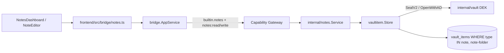

# Notes

Notes là built-in **dock module** (`frontend/src/modules/notes`). Nó
**không** có bảng/repository/crypto riêng: service `internal/notes` là thin
adapter map field vào `vaultitem.Store` chung (cùng substrate với SSH và các
module vault-item khác), qua **hai** record type: `note` và `note-folder`.
Vault lifecycle (Master Password / DEK) nằm ở [Vault](/dev-kit/vault) —
`VaultGate` phải `unlocked` trước khi Workbench (và Notes UI) render.



## Runtime API

| Bridge method | Capability | Scope | Service |
|---|---|---|---|
| `NotesList` | `notes:read` | `note:list` | `List()` → `[]Summary` |
| `NotesSearch` | `notes:read` | `note:search` | `Search(query)` — title, tag, folder name, body |
| `NotesGet` | `notes:read` | `note:<24hex>` | `Get(id)` → decrypt body |
| `NotesCreate` | `notes:write` | `note:new` | `Create(title, body, folderID, tags)` |
| `NotesUpdate` | `notes:write` | `note:<24hex>` | `Update(id, title, body)` — title/body only, **preserves** folder/tags/color |
| `NotesSetOrganization` | `notes:write` | `note:<24hex>` | `SetOrganization(id, folderID, tags, color)` — metadata-only write, no body reseal |
| `NotesDelete` | `notes:write` | `note:<24hex>` | `Delete(id)` |
| `NotesFolderList` | `notes:read` | `note-folder:list` | `ListFolders()` → `[]Folder` |
| `NotesFolderCreate` | `notes:write` | `note-folder:new` | `CreateFolder(name, color, tags)` |
| `NotesFolderUpdate` | `notes:write` | `note-folder:<24hex>` | `UpdateFolder(id, name, color, tags)` |
| `NotesFolderDelete` | `notes:write` | `note-folder:<24hex>` | `DeleteFolder(id)` — copy-down then delete |

Note giờ **có** in-place edit: `Update` chạy autosave (~1.5s debounce) từ
`NoteEditor` (Plate editor), khác hẳn model create-only trước đây. `Update`
đọc lại metadata hiện có và chỉ thay `title`, nên autosave body/title không
bao giờ xoá `folder_id`/`tags`/`color`. Đổi folder/tag/color đi qua
`SetOrganization` riêng (metadata-only, không reseal body), gọi ngay khi user
đổi — không đợi debounce autosave.

Subject luôn `builtin.notes`. Record ID là **24 lowercase hex**
(`vaultitem.NewID`); bridge `recordID()` làm opaque scope, reject ID lệch
format — dùng chung cho cả `note:<id>` và `note-folder:<id>`.

## MCP tool surface

Xem cơ chế chung + rationale ở [MCP / Agent](/dev-kit/mcp-agent).

| MCP tool | Effect | Map sang | Ghi chú |
|---|---|---|---|
| `notes.list` | `read` | `builtin.notes` / `notes:read` / `note:list` | trả `folder_id`, `tags`, `effective_tags`, `color`, `effective_color`, `preview` |
| `notes.search` | `read` | `builtin.notes` / `notes:read` / `note:search` | match title/tag/folder-name luôn; body chỉ khi vault unlocked |
| `notes.get` | `read` | `builtin.notes` / `notes:read` / `note:<id>` | trả cả `body` đã decrypt — note là nội dung người dùng, không phải credential như SSH/DB nên không áp rule "không trả raw secret" |
| `notes.create` | `execute` | `builtin.notes` / `notes:write` / `note:new` | `folder_id`, `tags` optional |
| `notes.update` | `execute` | `builtin.notes` / `notes:write` / `note:<id>` | title + body only, giữ nguyên tổ chức |
| `notes.set_organization` | `execute` | `builtin.notes` / `notes:write` / `note:<id>` | `folder_id`, `tags`, `color` — mọi field optional/`omitempty`, gửi thiếu field = giữ nguyên phía đó |
| `notes.delete` | `execute` (`destructiveHint`) | `builtin.notes` / `notes:write` / `note:<id>` | |
| `notes.folder.list` | `read` | `builtin.notes` / `notes:read` / `note-folder:list` | |
| `notes.folder.create` | `execute` | `builtin.notes` / `notes:write` / `note-folder:new` | |
| `notes.folder.update` | `execute` | `builtin.notes` / `notes:write` / `note-folder:<id>` | |
| `notes.folder.delete` | `execute` (`destructiveHint`) | `builtin.notes` / `notes:write` / `note-folder:<id>` | chạy copy-down ngay, không hỏi confirm (khác UI) |

## Record shape at rest

### Note — `type = "note"`

| Field | At rest | Notes |
|---|---|---|
| `type` | `"note"` | Schema-validated |
| `metadata` | `{"title":"...","folder_id":"...","tags":["..."],"color":"blue"}` plaintext | `folder_id`/`tags`/`color` optional; list/search không cần decrypt |
| `payload` | Envelope V2 của body | AAD `(note, <id>, note-body)`; `key_id` phải = `note-body` |
| `key_version` | starts at `1` | Crypto/record version — **không** phải sync entity version |
| `sync_state` | `"local"` on create | Local-only; omitted on sync wire snapshot |

### Folder — `type = "note-folder"`

| Field | At rest | Notes |
|---|---|---|
| `type` | `"note-folder"` | Schema-validated |
| `metadata` | `{"name":"Work","color":"blue","tags":["work"]}` plaintext | `name` + `color` required, `color` ∈ 9-màu palette (`red orange yellow green teal blue violet pink gray`) |
| `payload` | Envelope V2 rỗng `{}` | `key_id` phải = `note-folder` — folder không có secret, envelope chỉ để record hợp lệ với sync validation |
| One-level only | không nesting | sidebar là flat list |

Note's `color` dùng **chung palette** với folder (`vaultitem.ValidNoteFolderColor`), không có hệ màu riêng.

Create path (note):

```text
notes.Create → store.Create("note", "note-body", metaJSON, bodyBytes)
            → vaultitem seals with vault DEK + AAD
            → SQLMutationRepository Put (+ sync mutation intent when wired)
```

## Effective tags / effective color (live inheritance)

```
effective_tags(note)  = unique(note.tags ∪ folder.tags)      // note's own first
effective_color(note) = note.color != "" ? note.color
                       : (folder exists ? folder.color : "")
```

Cả hai đều **live**: đổi tag/màu của folder thay đổi ngay effective value của
mọi note trong folder đó, không rewrite note record nào. `Update`/`List`/
`Get`/`Search` đều compute lại từ `loadFolderMap()` mỗi lần gọi (in-memory
join, không index SQL riêng).

**Di chuyển** note sang folder khác (kể cả về Ungrouped) **không copy** gì —
effective value theo folder mới ngay lập tức.

**Xoá folder** (`DeleteFolder`) chạy copy-down atomic — validate/normalize
trước, chỉ ghi khi mọi note pass:

1. Với mỗi note thuộc folder: `tags = unique(note.tags ∪ folder.tags)`;
   nếu `note.color == ""` (đang inherit) thì `color = folder.color`, note đã
   có color riêng thì giữ nguyên; `folder_id = ""`.
2. Xoá folder record.

Sau bước này effective tags/color của note **không đổi** — chỉ chuyển từ
inherited sang owned. Nếu một note vượt tag cap (32 tags) khi union, toàn bộ
`DeleteFolder` fail **trước khi ghi note nào** (hai-pha: validate hết rồi mới
write) — không còn corrupt-giữa-chừng.

Orphan `folder_id` (folder bị xoá ở device khác, chưa sync copy-down) → coi
như ungrouped, effective tags/color chỉ còn phần own, không crash list.

## Search

- Title: luôn match (plaintext).
- Effective tag + folder name: luôn match (plaintext metadata + in-memory join).
- Body: chỉ khi `OpenPayload` thành công (vault unlocked).
- Empty query → mọi note, newest `updated_at` trước.
- Cross-type metadata search là `VaultSearch` riêng (không qua Notes UI).

Trong app bình thường Notes chỉ mở sau `VaultGate` unlocked, nên body search
luôn available trên UI path; title-only degradaton là property của service/bridge
khi vault locked.

## UI flow (dashboard → editor)

`NotesView` có hai screen trong cùng workbench pane, không còn master-detail:

1. **Dashboard** (`NotesDashboard`, mặc định) — sidebar trái: **All** /
   **Ungrouped** / từng folder (dot màu + tên + count), overflow menu per
   folder (rename, đổi màu, sửa tag, xoá — `AlertDialog` cảnh báo notes được
   giữ lại và tag được copy). Phải: search box + tag-filter chips (AND khi
   chọn nhiều) + grid note card.
2. **Editor** (`NoteEditor`, Plate) — full pane khi mở 1 note. Back/breadcrumb
   `Notes / {folder|Ungrouped} / {title}` quay lại dashboard, giữ nguyên
   scope sidebar đã chọn.

Note card (`NoteCard`) là "mini-window": khung ngoài `bg-card`/`border-border`
trung tính (giống window chrome của app), title 1 dòng
(`truncate`, không bao giờ xuống dòng), bên trong là panel inset tỉ lệ 3:2
tô màu `effective_color` qua `color-mix()` trên token `--note-folder-*` có sẵn
(30% nền / 45% viền, không gradient/glow) — panel rỗng màu (`bg-muted`) khi
note không có effective color. Preview + tag chip (dot + label) + thời gian
tương đối nằm trong panel đó.

Trong editor: folder picker (`Select`), tag input (Enter/comma, tag kế thừa
hiển thị read-only riêng), và color picker (`Popover` + `ColorPicker` dùng
chung với dialog tạo/sửa folder, có thêm nút "Inherit from folder"). Đổi
folder/tag/color gọi `setNoteOrganization` ngay, không đợi debounce
autosave 1.5s của title/body.

Manifest: `frontend/src/modules/notes/manifest.ts` khai báo
`notes:read` / `notes:write` (declaration metadata); grant thật nằm ở
`internal/app/container.go` (bao gồm cả 4 grant `note-folder:*`).

## Sync & conflict

Notes + folder sync như mọi `vault_items` record
(`record_type IN (note, note-folder)`), không có pipeline riêng — xem
[Data & sync](/dev-kit/data-sync).

Conflict resolve strategies:

| Strategy | Notes |
|---|---|
| `use-ours` / `use-theirs` | Mọi record type |
| `merge` | **Chỉ notes** — reseal merged text dưới `note-body`; secret types (kể cả folder) → `ErrNotMergeable` |

UI MVP: Git markers trong `ResolvePanel` (3-pane JetBrains vẫn là target).

## Known limitations

- Title plaintext local — encrypt riêng nếu title ever sync/sensitive.
- Folder **one level only** — không nested tree, không drag-and-drop reorder.
- Note color giới hạn 9-màu palette dùng chung với folder, không freeform hex.
- Đổi màu note chỉ từ editor — chưa có quick-set màu ngay trên dashboard card.
- Legacy table `notes` đã drop ở migration m6; không còn backfill path.

## Rules

- Không log plaintext body.
- Không giữ raw body ở UI lâu hơn cần sau khi hiển thị detail.
- Không bypass gateway; mọi call đi `AppService.call` + capability check.
- UI class chỉ dùng theme token/CSS variable — không hardcode hex màu dark
  trong component (kể cả folder/tag/note color tokens).

import { Cards, Card } from 'fumadocs-ui/components/card';

<Cards>
  <Card title="Vault" href="/dev-kit/vault" description="Keyring/DEK + vaultitem substrate" />
  <Card title="SSH" href="/dev-kit/ssh" description="Cùng thin-adapter pattern trên vaultitem" />
  <Card title="Data & sync" href="/dev-kit/data-sync" description="Conflict merge cho notes" />
  <Card title="Technical contracts" href="/dev-kit/technical-contracts" description="Bridge + capability table" />
</Cards>
