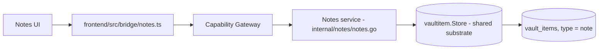

# Notes

Notes là built-in module lưu ghi chú cá nhân. Từ [ADR-008](/dev-kit/architecture-decisions#adr-008-unified-vault_items-store-for-built-in-item-types), Notes **không có storage/crypto riêng** — nó là thin adapter map field vào `vaultitem.Store` chung (cùng substrate với Database/SSH trong [Connections](/dev-kit/connections)), giữ nguyên chữ ký public nên bridge/UI/capability không đổi khi substrate thay đổi.

## Scope (hiện tại)

- Bridge method family: `NotesList`, `NotesSearch`, `NotesCreate`, `NotesGet`, `NotesDelete` (`internal/bridge/notes.go`).
- Record shape (`vaultitem.Record` với `type = "note"`): `Title` là metadata **plaintext** (search/list được kể cả khi vault locked); `Body` **mã hóa** trong `payload` qua envelope với AAD `record_type = "note"`, `key_id = "note-body"`.
- Capability grants: `builtin.notes` / `notes:read` hoặc `notes:write` / scope `note:list`, `note:search`, `note:new`, `note:<id>` — xem [Technical contracts](/dev-kit/technical-contracts).
- Cross-type search: note title tham gia `VaultSearch` chung cùng metadata của Database/SSH profile.

## Known limitation

Title vẫn là plaintext local metadata — chưa mã hóa. Nếu sau này title cần bảo vệ chặt hơn (ví dụ khi title có thể sync ra ngoài), cần thiết kế riêng chứ không tự động theo cùng cơ chế với `Body`.

## Sync & conflict

Khi sync client bật (target/partial — xem [Data & sync](/dev-kit/data-sync)), conflict resolve cho Notes dùng strategy `merge-notes` (bên cạnh `use-ours`/`use-theirs` chung cho mọi record type) — vì note text là nội dung tự do, cần merge thủ công thay vì chỉ chọn 1 bên.

## Rules

- Không log plaintext note body.
- Đọc `Body` yêu cầu vault đã unlock; UI không giữ raw `Body` lâu hơn cần thiết sau khi hiển thị.

import { Cards, Card } from 'fumadocs-ui/components/card';

<Cards>
  <Card title="Vault" href="/dev-kit/vault" description="Substrate mã hóa và unlock/lock mà Notes adapter vào" />
  <Card title="Connections" href="/dev-kit/connections" description="Database/SSH — cùng pattern thin adapter" />
  <Card title="Data & sync" href="/dev-kit/data-sync" description="Conflict resolve merge-notes" />
  <Card title="Technical contracts" href="/dev-kit/technical-contracts" description="Bridge method table và capability grants" />
</Cards>
