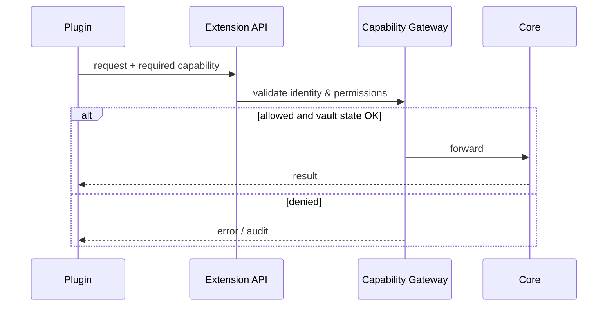

# Plugins

Plugin surface target: chỉ nói chuyện với Extension API khi external plugin runtime ship. Hiện tại DevKit ship built-in modules qua internal registry — xem [ADR-002](/dev-kit/architecture-decisions#adr-002-internal-modules-before-external-plugins).

## Hard rules

- Không expose internal Go services cho plugin future.
- Hook chỉ notify; action phải qua API khi plugin surface có.
- Marketplace/remote loading chỉ sau khi có manifest validation, signing, sandbox strategy.

import { Callout } from 'fumadocs-ui/components/callout';

<Callout type="warn" title="Before marketplace">
External plugin runtime và marketplace vẫn là target architecture — chưa đủ security gates để ship remote third-party plugins.
</Callout>

import { Cards, Card } from 'fumadocs-ui/components/card';

<Cards>
  <Card title="Architecture decisions" href="/dev-kit/architecture-decisions" description="ADR-002: built-in modules trước" />
  <Card title="Implementation status" href="/dev-kit/implementation-status" />
</Cards>
