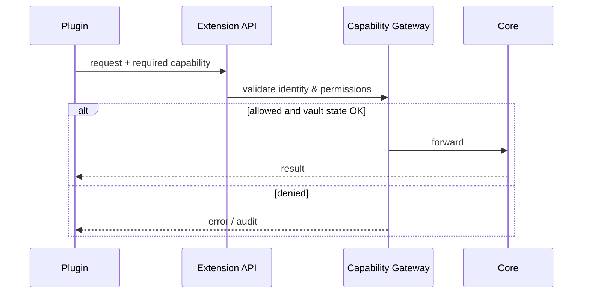

# Plugins

Plugin chỉ nói chuyện với Extension API. Mọi hành động nhạy cảm đi qua Capability Gateway.

## Hard rules

- Không expose internal Go services cho plugin.
- Hook chỉ notify; action phải qua API.
- Marketplace/remote loading chỉ sau khi có manifest validation, signing, sandbox strategy.

import { Callout } from 'fumadocs-ui/components/callout';

<Callout type="warn" title="Before marketplace">
Chưa đủ security gates thì không ship remote third-party plugins.
</Callout>
