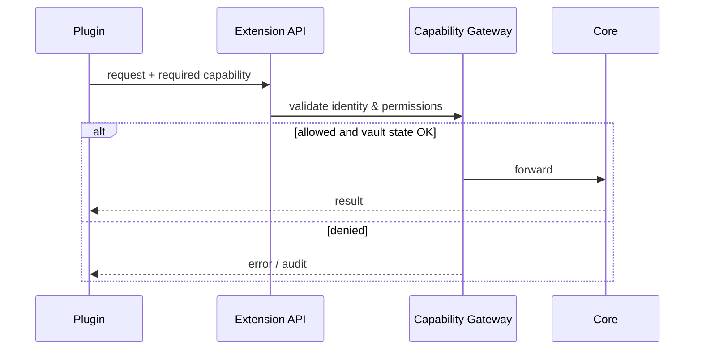

# Plugins

Plugin surface target: chỉ nói chuyện với Extension API khi external plugin runtime ship. Hiện tại DevKit đã chuẩn hoá built-in modules qua `ModuleManifest` và internal registry — xem [ADR-002](/dev-kit/architecture-decisions#adr-002-internal-modules-before-external-plugins). Phase 2 đã `Implemented`; **external plugin runtime là Phase 5–6** trên [Roadmap](/dev-kit/roadmap) — **sau** [Agent Hub (Phase 4)](/dev-kit/agent-hub).

`ModuleManifest` hiện dùng các fields `id`, `title`, `version`, `apiVersion`,
`commands`, `views`, `capabilities`. Backend registry validate manifest, bảo vệ
duplicate module/contribution, trả list deterministic và snapshot caller-owned.
`ListModules` chỉ expose public metadata; frontend built-in manifests parity-check
với backend.

`capabilities` trong manifest chỉ là declaration metadata. Manifest không tự
cấp grant; permission policy/container và Capability Gateway vẫn là nơi quyết
định quyền và thực thi sensitive calls.

## Hard rules

- Không expose internal Go services cho plugin future.
- Hook chỉ notify; action phải qua API khi plugin surface có.
- Không xem manifest declaration là permission grant; mọi sensitive action vẫn phải qua Capability Gateway.
- Không dynamic-load hoặc execute code từ manifest/backend metadata.
- Marketplace/remote loading chỉ sau khi có manifest validation, signing, sandbox strategy.

import { Callout } from 'fumadocs-ui/components/callout';

<Callout type="warn" title="Current boundary">
External plugin runtime, dynamic loading, marketplace, MCP runtime và sync vẫn ngoài scope. Đây là contract metadata cho built-in modules, chưa phải permission hoặc remote code execution surface.
</Callout>

import { Cards, Card } from 'fumadocs-ui/components/card';

<Cards>
  <Card title="Architecture decisions" href="/dev-kit/architecture-decisions" description="ADR-002: built-in modules trước" />
  <Card title="Implementation status" href="/dev-kit/implementation-status" />
</Cards>
