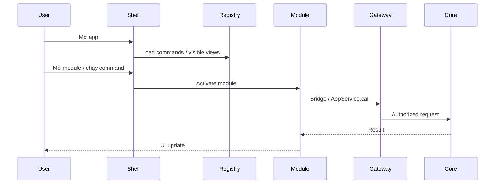

# Runtime & process

Runtime được thiết kế để khởi động nhanh: load shell + trạng thái vault + registry,
rồi lazy-activate module/view còn lại khi cần. Frontend built-in manifests hiện
đã dùng `lazyModuleView()` + Suspense/preload; render, lifecycle tab và dữ liệu
lớn tuân theo [Frontend performance architecture](/dev-kit/frontend-performance).

## Runtime components

- **Shell process** — UI + orchestration.
- **Command registry** — danh sách lệnh built-in (và plugin future).
- **Module loader (target)** — chỉ kích hoạt module khi user mở hoặc chạy command.
- **Capability Gateway** — chặn request thiếu quyền / vault locked.
- **Background workers (target future)** — sync, indexing, health checks chạy lazy, không block startup.

## Performance budgets

| Item | Target |
|---|---|
| Cold start đến UI dùng được | Chỉ shell/visible path; build budget chặn initial asset regression |
| Activate module lần đầu | Lazy + fallback tức thời; không block toàn app |
| Search local | Input phản hồi ngay, query cũ không overwrite query mới |
| Collection/stream lớn | Bridge bounded + virtualization/batching theo module |

import { Callout } from 'fumadocs-ui/components/callout';

<Callout type="info" title="Lazy activation implemented for built-in views">
Frontend manifests giữ metadata eager nhưng load component theo nhu cầu. Đây chỉ
là startup control; module mới vẫn phải đáp ứng render/lifecycle/data budgets ở
[Frontend performance architecture](/dev-kit/frontend-performance).
</Callout>

Chi tiết runtime và evidence theo checkout hiện tại: [Implementation status](/dev-kit/implementation-status).
