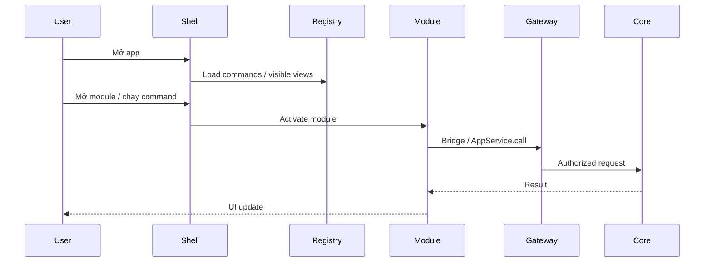

# Runtime & process

Runtime được thiết kế để khởi động nhanh: load shell + trạng thái vault + registry, rồi lazy-activate module còn lại khi cần (target).

## Runtime components

- **Shell process** — UI + orchestration.
- **Command registry** — danh sách lệnh built-in (và plugin future).
- **Module loader (target)** — chỉ kích hoạt module khi user mở hoặc chạy command.
- **Capability Gateway** — chặn request thiếu quyền / vault locked.
- **Background workers (target future)** — sync, indexing, health checks chạy lazy, không block startup.

## Performance budgets

| Item | Target |
|---|---|
| Cold start đến UI dùng được | Nhanh, chỉ load phần visible |
| Activate module lần đầu | Lazy, không block toàn app |
| Search local | Giữ mượt khi vault lớn dần |

import { Callout } from 'fumadocs-ui/components/callout';

<Callout title="Lazy activation (target)">
Thiết kế mục tiêu: không load toàn bộ plugin/module lúc startup. Chỉ shell, vault state, registry và view đang mở.
</Callout>

Chi tiết runtime và evidence theo checkout hiện tại: [Implementation status](/dev-kit/implementation-status).
