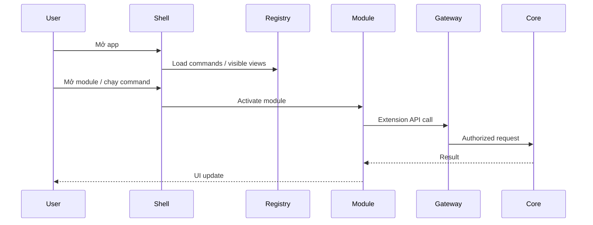

# Runtime & process

Runtime ưu tiên khởi động nhanh: load shell + trạng thái vault + registry, rồi lazy-activate phần còn lại.

## Thành phần runtime

- **Shell process** — UI + orchestration.
- **Command registry** — danh sách lệnh built-in/plugin.
- **Module loader** — kích hoạt module khi cần.
- **Capability Gateway** — chặn request thiếu quyền / vault locked.
- **Background workers** — sync, indexing, health checks (lazy).

## Ngân sách hiệu năng (định hướng)

| Hạng mục | Mục tiêu |
|---|---|
| Cold start đến UI dùng được | Nhanh, chỉ load phần visible |
| Activate module lần đầu | Lazy, không block toàn app |
| Search local | Giữ mượt khi vault lớn dần |

import { Callout } from 'fumadocs-ui/components/callout';

<Callout title="Lazy activation">
Đừng load toàn bộ plugin/module lúc startup. Chỉ shell, vault state, registry và view đang mở.
</Callout>
