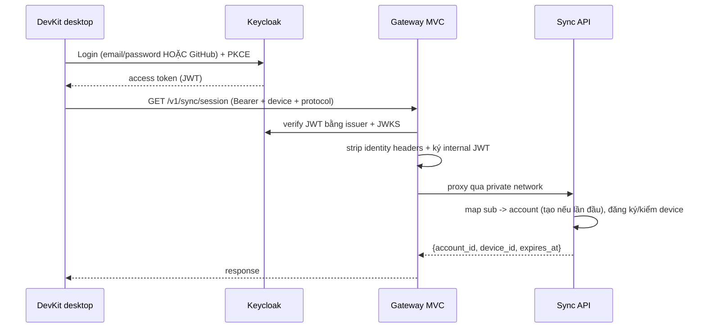
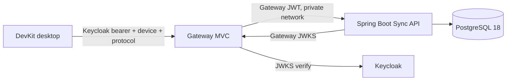
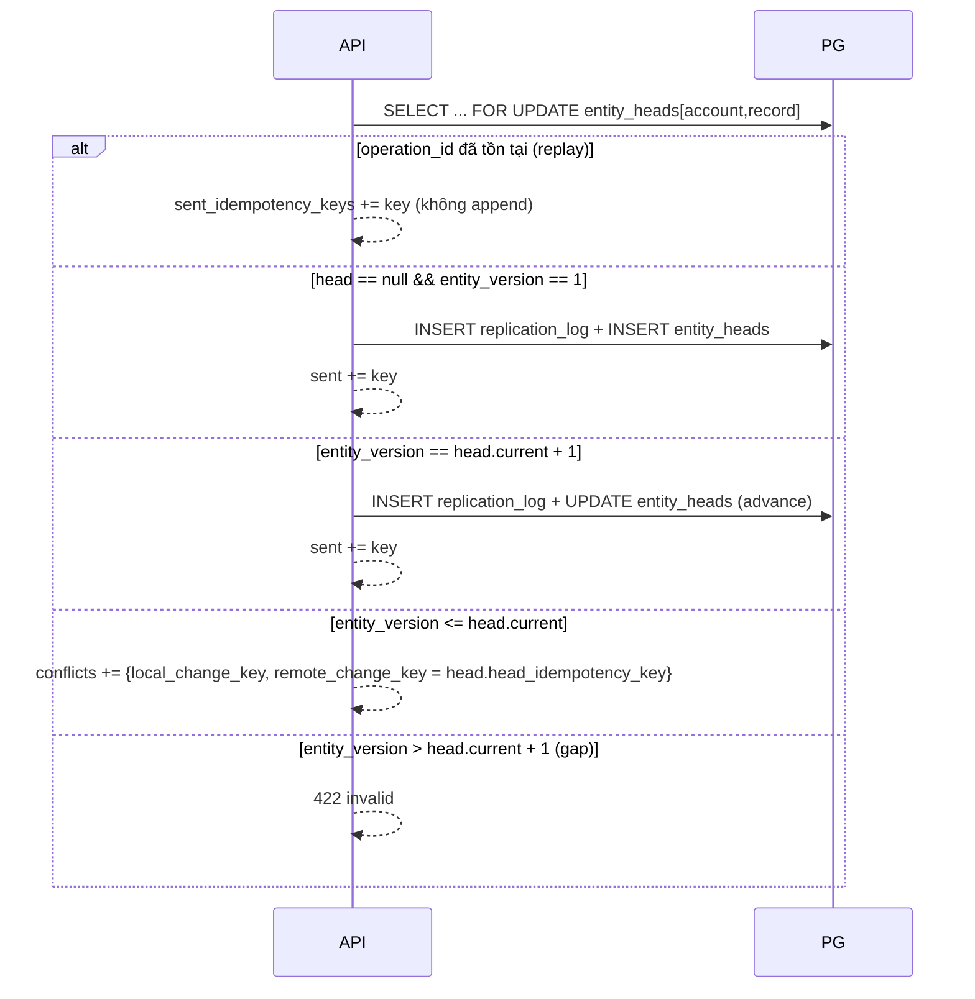

# SaaS sync backend

Backend là **target tùy chọn** của sync: chỉ lưu blob đã mã hóa + metadata routing, phân
xử version per-entity, và **không bao giờ thấy plaintext**. Thiết kế bám đúng contract client
đã có trong `internal/sync` — xem [Data & sync](/dev-kit/data-sync).

> Trạng thái: **Implemented** (Phase A closure). Backend Phase A và Gateway MVC đã có
> runtime trong `dev-kit-backend/` (commit
> `cca601f`); desktop PKCE, enrollment handshake và rotating refresh token đã có
> runtime trong worktree `feat/phase-3-sync-closure` (commit `7708b99`). Deployed
> matrix G1–G4 pass ngày 2026-08-10 qua `go test ./cmd/synce2e/ -count=1 -timeout 15m`
> trên Compose stack (Keycloak → Gateway → Sync API → PostgreSQL).

## Nguyên tắc

- **Zero-knowledge**: server không giữ key, không giải mã. `ciphertext` là opaque; các field
  metadata (record id, versions, account/device, operation) là routing plaintext nhưng đã được
  client bind vào **AEAD associated data**, nên server không thể sửa mà client không phát hiện.
- **Server là nguồn chân lý version** per `(account, record)`: client optimistic, server arbitrate.
- **Least privilege + defense-in-depth**: xem [Security](#security-bảo-mật-tuyệt-đối).
- **App-layer integrity**: DB **không dùng khóa ngoại**; ràng buộc quan hệ do tầng application xử lý
  (unique index + validation), tránh coupling schema và cho phép phân mảnh/scale linh hoạt.

## Stack

| Thành phần | Lựa chọn | Ghi chú |
|---|---|---|
| Runtime | **Java 25** | Virtual threads cho IO-bound sync API. |
| Framework | **Spring Boot 4** | Spring MVC + Spring Security OAuth2 Resource Server. |
| Edge | **Spring Cloud Gateway Server Web MVC 5.0.2** | Validate Keycloak JWT, sanitize header, ký JWT nội bộ ngắn hạn. |
| IdP | **Keycloak** | Email/password + GitHub social; username optional. |
| DB | **PostgreSQL 18** | PK dùng **UUID v7** native `uuidv7()`; append-only log. |
| Cache/lock | **Không dùng trong Phase A** | PostgreSQL unique constraints, transaction và advisory lock là correctness source. |
| Migration | **Liquibase** | Forward-only, versioned. |

## Auth — Phase 1 (Keycloak)

Phương thức đăng nhập giai đoạn đầu:

- **Email + password** — target cho hosted realm; local import hiện tắt
  self-registration để không mở account creation ngoài ý muốn.
- **GitHub login** — Keycloak GitHub Identity Provider (social login, state + PKCE).
- **Username không bắt buộc** khi đăng ký (dùng email hoặc auto-generate), **cập nhật sau** trong profile.

Cấu hình hiện có: realm `devkit`, client `devkit-desktop` (public, PKCE S256).
Desktop lấy access token qua **Authorization Code + PKCE** bằng system browser;
refresh token quay vòng được lưu trong OS keychain và access token chỉ tồn tại
trong memory. Khi Keycloak từ chối refresh, DevKit xóa credential cũ rồi yêu cầu
login browser lại.
Realm import không tạo user và không chứa GitHub secret; social login, password
policy và registration policy phải cấu hình qua secret/deployment riêng.

Gateway là **Keycloak Resource Server**: verify chữ ký, issuer, audience, `exp`,
`nbf` và stable `sub`, loại identity/forwarded header do client gửi, rồi ký JWT
nội bộ RS256 tối đa 45 giây. Spring API chỉ tin JWT nội bộ qua Gateway JWKS và
verify thêm `upstream_iss`/`upstream_exp`. Keycloak `sub` → `account` (bảng
`accounts`, PK UUID v7); `account_id` luôn server-authoritative.



## Kiến trúc



## API contract (khớp client `internal/sync`)

Tất cả request cần headers: `Authorization: Bearer <token>`, `X-DevKit-Device-ID`,
`X-DevKit-Sync-Protocol: 1`. Caps: ciphertext ≤ **1 MiB**/op, batch ≤ **1000** ops,
request/response ≤ **4 MiB**, cursor ≤ 512 ký tự.

### `GET /v1/sync/session`

Response `200`:

Trả `account_id`, `device_id` (phải khớp header), và `expires_at` dạng RFC3339
UTC.

### `POST /v1/sync/push`

Request:

Body là mảng `operations`, mỗi phần tử có `idempotency_key`, `operation`
(`create` | `update` | `delete`), và `envelope`. Envelope mang: `record_id`,
`record_type` (`note` | `db` | `ssh` | …), `key_version`, `envelope_version`
(luôn 2), `account_id`, `device_id`, `protocol_version`, `operation_id`,
`entity_version`, `operation` lặp lại, và `ciphertext` base64 opaque.

Response `200`:

Trả `sent_idempotency_keys` (mảng) và `conflicts` — mỗi conflict gồm `id`,
`record_id`, `record_type`, `local_change_key`, `remote_change_key`,
`detected_at` (RFC3339).

Kiểm tra mỗi op: `envelope.account_id == session.account`, `device_id == session.device`,
`protocol_version == 1`, ciphertext ≤ cap. `sent_idempotency_keys` chỉ chứa key thuộc batch;
`conflict.record_id/record_type` phải khớp op tương ứng (client sẽ reject nếu lệch).

### `GET /v1/sync/pull?cursor=<opaque>&limit=<n>`

Response `200`:

Trả `account_id`, `device_id` (của session), `protocol_version`, mảng
`operations` cùng shape với push, và `next_cursor` opaque.

Trả ops của account có `seq > cursor`, order theo `seq`, ≤ limit; **envelope echo nguyên vẹn**.

### Status codes (khớp kỳ vọng client)

| Code | Ý nghĩa client |
|---|---|
| `2xx` | OK |
| `401/403` | `ErrAuthentication` (token hết hạn / device revoked / account mismatch) |
| `408/429/5xx` | `FailureNetwork` (retry) |
| `400/422` | `FailureInvalidResponse` |

## Arbitration (lõi server)

Mỗi op trong push chạy trong **một transaction + PostgreSQL advisory lock** per
`(account, record)`. Database unique constraints vẫn bảo vệ invariant khi scale
nhiều instance:



- **Replay idempotent**: `operation_id` đã có → coi như đã áp dụng (append vào `sent`), không ghi trùng.
- **Fast-forward**: chỉ chấp nhận khi version == head+1 → head chỉ tiến (chống rollback).
- **Conflict**: version cũ hơn head → trả conflict (không append); client sẽ tạo conflict copy
  (notes) / last-writer-wins (settings) / không merge secret.
- **Cursor**: `seq` là cột monotonic (bigserial) chỉ để order log; `next_cursor` = encode(`seq` cuối).

## ERD

> Quan hệ dưới đây là **logic ở tầng app** — DB **không tạo FOREIGN KEY**. PK dùng
> `uuidv7()` của PostgreSQL 18.


### Ràng buộc DDL (PostgreSQL 18, không FK)

Cột và kiểu đã nằm đủ trong sơ đồ trên; phần dưới chỉ ghi những gì sơ đồ không
diễn đạt được.

| Bảng | Index / constraint | Ghi chú |
|---|---|---|
| `accounts` | `ux_accounts_subject` unique trên `keycloak_subject` | `username` nullable, cập nhật sau |
| `devices` | `ux_devices_account_device` unique trên `(account_id, device_id)` | `status` default `active` |
| `replication_log` | `ux_log_account_op` unique trên `(account_id, operation_id)` — chặn replay | `seq` là `bigserial`, dùng làm cursor ordering |
| `replication_log` | `ix_log_account_seq` trên `(account_id, seq)` | `envelope` là `jsonb` opaque — server không parse ciphertext |
| `entity_heads` | `ux_heads_account_record` unique trên `(account_id, record_id)` | |

Mọi bảng: `id uuid PRIMARY KEY DEFAULT uuidv7()`, timestamp default `now()`.
`account_id` là **logical ref**, cố ý không khai `REFERENCES` — quan hệ enforce
ở app layer.

## Concurrency và idempotency

Phase A không dùng Redis. PostgreSQL là correctness source: unique constraints
chặn replay, transaction bao trọn log + entity head, và advisory lock serialize
arbitration theo account/record. Rate limit phân tán là production-hardening
follow-up, không được thay thế correctness constraint bằng cache.

## Security (bảo mật tuyệt đối)

- **Transport**: TLS 1.3 bắt buộc ở production edge (client ép HTTPS trừ loopback dev), HSTS.
- **Token**: verify đầy đủ `iss/aud/exp/nbf/signature` qua JWKS pinned; từ chối token khác realm/client.
- **Account isolation**: mọi truy vấn `WHERE account_id = <từ token>`; **không bao giờ** tin `account_id`
  trong body. Cross-account → `403`.
- **Device binding + revocation**: `devices.status`; revoked/expired → `401/403`.
- **Zero-knowledge**: lưu `envelope` opaque, echo nguyên vẹn, server không có key và không giải mã.
- **Caps**: mirror client (1 MiB/op, 1000/batch, 4 MiB body) để chống oversize/DoS.
- **Replay**: `UNIQUE(account_id, operation_id)`. **Chống rollback**: head chỉ tiến.
- **Rate limiting** ở edge là follow-up; Keycloak brute-force detection bảo vệ login.
- **DB least-privilege**: role app chỉ có quyền trên đúng các bảng cần; không superuser; PG at-rest
  encryption ở tầng disk.
- **Input validation**: record/account/device/operation identifiers không chứa
  control char hoặc path separator để không phá AAD binding. `idempotency_key`
  là opaque namespaced hash (`dev-kit/sync/queue/v2:<hash>`) và được phép có
  `/`; vẫn bị giới hạn độ dài và cấm control character.
- **Logging/audit**: structured + redaction; **không** log ciphertext/plaintext/token; audit chỉ
  metadata an toàn (`audit_events`). Không trả stack trace cho client.
- **Supply chain**: pin dependency, scan CVE; secrets qua vault/env, không hardcode.
- **Keycloak**: password policy, email verification, MFA optional, GitHub IdP với `state` + PKCE.

## Deployment & ops

- `docker-compose` chạy hai PostgreSQL 18 tách biệt, Keycloak, API và Gateway;
  chỉ Gateway là public sync entrypoint. **Testcontainers** dùng cho backend test.
- API **stateless** → scale ngang; migration forward-only (Flyway/Liquibase).
- Observability: health/metrics/tracing — không lộ secret.

## Testing (bằng chứng "khớp client")

- **Parity/contract test**: chạy **chính `internal/sync` HTTPTransport (Go)** đối với API thật qua
  testcontainers → session/push/pull/**conflict** end-to-end. Đây là bằng chứng server đúng contract.
- **Unit**: arbitration (fast-forward / stale / gap / replay), concurrency 2-device (1 win + 1 conflict),
  account isolation, revoked device, rate limit.
- **Security review**: zero-knowledge invariant, isolation, không plaintext trong log.

Runtime evidence hiện có:

- backend Phase A và Go production-transport contract E2E đã có; commit
  `d54a72f` sửa contract cho namespaced client idempotency key; matrix runbook
  ở `cca601f`;
- `gateway/` có integration test cho Keycloak-compatible JWKS, audience reject,
  header sanitization, internal signature/claims và public-only JWKS;
- `keycloak/realm-devkit.json` cấu hình public client PKCE S256 và audience mapper;
- Compose giữ Keycloak DB, service DB và sync private network tách biệt.
- deployed smoke ngày 2026-08-10 xác nhận Keycloak browser login → Gateway
  session → one encrypted push → pull/apply với desktop thật.
- deployed matrix G1–G4 pass ngày 2026-08-10 qua `cmd/synce2e/` (commit
  `7708b99`): multi-entity pull/apply, retry/idempotency, two-device conflict
  convergence, refresh-expiry và device revoke.

### Deployed matrix (`cmd/synce2e`)

Ma trận hội tụ trên Compose stack thật (không dùng `cmd/mocksyncserver`) chạy
qua opt-in suite `cmd/synce2e/`:

```bash
# Compose stack up (gateway :8082, keycloak :8081, devkit-db)
# Token fixture: DEVKIT_DEPLOYED_E2E_URL + DEVKIT_DEPLOYED_E2E_TOKEN
set -a; . .superpowers/sdd/deployed-e2e.env; set +a
go test ./cmd/synce2e/ -count=1 -timeout 15m
```

| Gate | Test | Pass khi |
|---|---|---|
| G1 | `TestG1MultiEntityPullApply` | Device A tạo/sửa note + database + ssh; device B pull/apply đủ; cursor tiến. |
| G2 | `TestG2PushRetriesWithoutDuplicateLog` | `408`/`429`/`5xx` hoặc connection drop → retry; không tạo bản trùng. |
| G3 | `TestG3Resolve*` | Hai device diverge; capture theirs; resolve ours/theirs/merge hội tụ. |
| G4 | `TestG4RevokedDeviceRejected`, `TestG4ExpiredCredentialsClearSession` | Revoke → `401/403`; expired credentials → clear session. |

Mock server in-memory (`cmd/mocksyncserver`) vẫn giữ regression cho conflict flow
phía client; deployed matrix là evidence chính cho Phase 3 closure.

## Phasing

- **BE Phase A — Implemented**: `session/push/pull`, PostgreSQL arbitration,
  conflicts, zero-knowledge storage, account/device session và revocation guard.
- **Gateway milestone — Implemented**: Keycloak validation, identity sanitization,
  short-lived internal JWT/JWKS, realm/client import và private-network Compose.
- **Desktop auth milestone — Implemented**: Authorization Code + PKCE,
  enrollment handshake, refresh/logout, OS-keychain refresh-token rotation,
  deployed matrix G1–G4 (`cmd/synce2e/`, commit `7708b99`).
- **BE Phase B (device revoke) — Implemented** (`feat/phase-b-device-revoke`,
  backend `2060f39`, app `02afaaa`): self-service `GET/POST /v1/sync/devices`
  list+revoke, last-ACTIVE guard, audit, enrollment cleanup, Redis denylist TTL
  60s (`sync:revoked-device:{sub}:{deviceId}`) do API ghi / Gateway đọc
  (fail-open nếu Redis down), desktop bridge tối thiểu + G4 dùng API. Evidence:
  `./gradlew :test --tests com.synx.devkit.e2e.SyncApiIT`,
  `./gradlew :gateway:test`, desktop unit/bridge tests PASS. G4 API path updated;
  re-run `go test ./cmd/synce2e/ -run TestG4RevokedDeviceRejected` against
  Compose when verifying deployed matrix. UI polish / Keycloak logout / retention
  / multi-region vẫn out of scope. Spec:
  `docs/superpowers/specs/2026-08-11-be-phase-b-device-revoke-design.md`
  (backend mirror: `dev-kit-backend/docs/specs/2026-08-11-sync-backend-phase-b-device-revoke.md`).

import { Cards, Card } from 'fumadocs-ui/components/card';

<Cards>
  <Card title="Data & sync" href="/dev-kit/data-sync" description="Contract client & envelope" />
  <Card title="Security model" href="/dev-kit/security" />
  <Card title="Technical contracts" href="/dev-kit/technical-contracts" />
</Cards>
