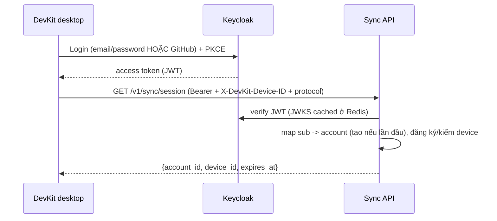
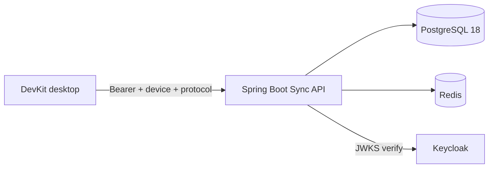
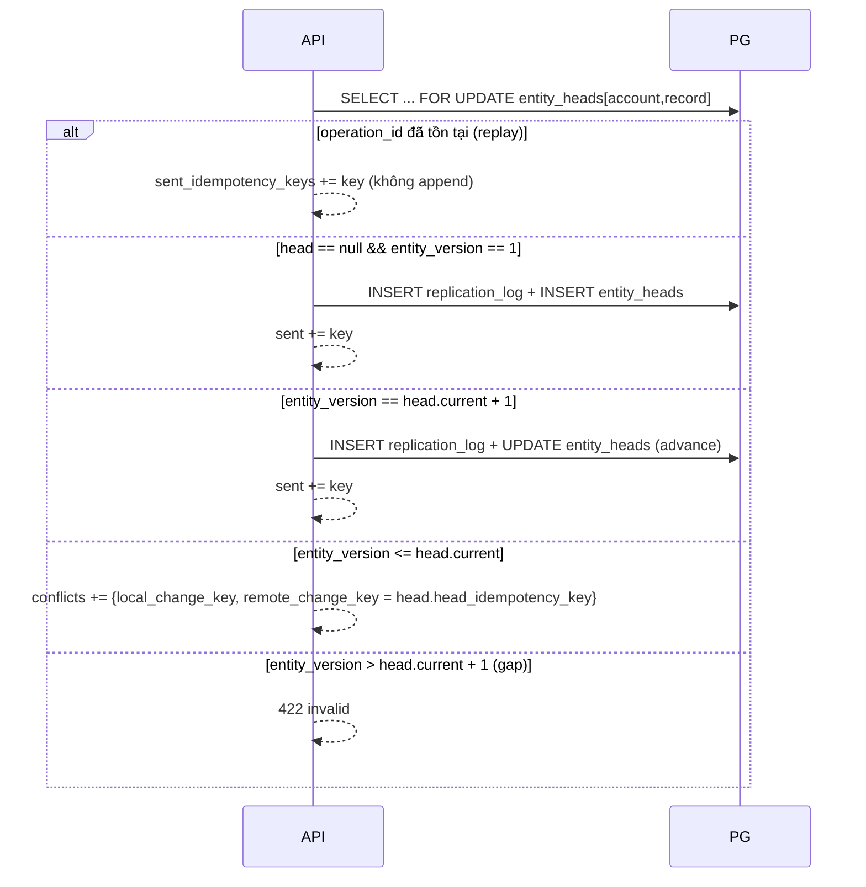
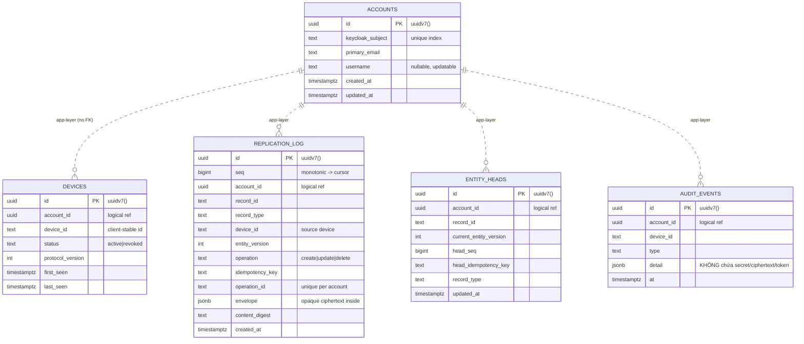

# SaaS sync backend

Backend là **target tùy chọn** của sync: chỉ lưu blob đã mã hóa + metadata routing, phân
xử version per-entity, và **không bao giờ thấy plaintext**. Thiết kế bám đúng contract client
đã có trong `internal/sync` — xem [Data & sync](/dev-kit/data-sync).

> Trạng thái: **Design only**. Chưa có runtime backend. Trang này là spec để triển khai.

## Nguyên tắc

- **Zero-knowledge**: server không giữ key, không giải mã. `ciphertext` là opaque; các field
  metadata (record id, versions, account/device, operation) là routing plaintext nhưng đã được
  client bind vào **AEAD associated data**, nên server không thể sửa mà client không phát hiện.
- **Server là nguồn chân lý version** per `(account, record)`: client optimistic, server arbitrate.
- **Least privilege + defense-in-depth**: xem [Security](#security-bảo-mật-tuyệt-đối).
- **App-layer integrity**: DB **không dùng khóa ngoại**; ràng buộc quan hệ do tầng application xử lý
  (unique index + validation), tránh coupling schema và cho phép phân mảnh/scale linh hoạt.

## Stack

| Thành phần | Lựa chọn | Ghi chú |
|---|---|---|
| Runtime | **Java 25** | Virtual threads cho IO-bound sync API. |
| Framework | **Spring Boot 4** | Spring MVC + Spring Security OAuth2 Resource Server. |
| IdP | **Keycloak** | Email/password + GitHub social; username optional. |
| DB | **PostgreSQL 18** | PK dùng **UUID v7** native `uuidv7()`; append-only log. |
| Cache/lock | **Redis** | Idempotency fast-path, rate limit, distributed lock, JWKS cache. |
| Migration | Flyway/Liquibase | Forward-only, versioned. |

## Auth — Phase 1 (Keycloak)

Phương thức đăng nhập giai đoạn đầu:

- **Email + password** — self-registration bật, email là định danh đăng nhập.
- **GitHub login** — Keycloak GitHub Identity Provider (social login, state + PKCE).
- **Username không bắt buộc** khi đăng ký (dùng email hoặc auto-generate), **cập nhật sau** trong profile.

Cấu hình: realm `devkit`, client `devkit-desktop` (public, PKCE). Desktop lấy access token qua
**Authorization Code + PKCE** (mở system browser) hoặc **Device Authorization Grant**.

Spring API là **Resource Server**: verify JWT (issuer = realm, `aud`, `exp`, `nbf`, chữ ký qua JWKS
cache ở Redis). Keycloak `sub` → `account` (bảng `accounts`, PK UUID v7). `account_id` dùng trong
protocol chính là `accounts.id` (server-authoritative, không lấy từ request body).



## Kiến trúc



## API contract (khớp client `internal/sync`)

Tất cả request cần headers: `Authorization: Bearer <token>`, `X-DevKit-Device-ID`,
`X-DevKit-Sync-Protocol: 1`. Caps: ciphertext ≤ **1 MiB**/op, batch ≤ **1000** ops,
request/response ≤ **4 MiB**, cursor ≤ 512 ký tự.

### `GET /v1/sync/session`

Response `200`:

```json
{ "account_id": "…", "device_id": "<phải == header>", "expires_at": "<RFC3339 UTC>" }
```

### `POST /v1/sync/push`

Request:

```json
{ "operations": [
  { "idempotency_key": "…", "operation": "create|update|delete",
    "envelope": {
      "record_id": "…", "record_type": "note|db|ssh|…",
      "key_version": 1, "envelope_version": 2,
      "account_id": "…", "device_id": "…", "protocol_version": 1,
      "operation_id": "…", "entity_version": 3,
      "operation": "create|update|delete",
      "ciphertext": "<base64 opaque>"
    } } ] }
```

Response `200`:

```json
{ "sent_idempotency_keys": ["…"],
  "conflicts": [ { "id":"…","record_id":"…","record_type":"…",
    "local_change_key":"…","remote_change_key":"…","detected_at":"<RFC3339>" } ] }
```

Kiểm tra mỗi op: `envelope.account_id == session.account`, `device_id == session.device`,
`protocol_version == 1`, ciphertext ≤ cap. `sent_idempotency_keys` chỉ chứa key thuộc batch;
`conflict.record_id/record_type` phải khớp op tương ứng (client sẽ reject nếu lệch).

### `GET /v1/sync/pull?cursor=<opaque>&limit=<n>`

Response `200`:

```json
{ "account_id":"…", "device_id":"<session>", "protocol_version":1,
  "operations":[ { "idempotency_key":"…","operation":"…","envelope":{…} } ],
  "next_cursor":"<opaque>" }
```

Trả ops của account có `seq > cursor`, order theo `seq`, ≤ limit; **envelope echo nguyên vẹn**.

### Status codes (khớp kỳ vọng client)

| Code | Ý nghĩa client |
|---|---|
| `2xx` | OK |
| `401/403` | `ErrAuthentication` (token hết hạn / device revoked / account mismatch) |
| `408/429/5xx` | `FailureNetwork` (retry) |
| `400/422` | `FailureInvalidResponse` |

## Arbitration (lõi server)

Mỗi op trong push chạy trong **một transaction + khóa per `(account, record)`** (PG row-lock
trên `entity_heads`, hoặc `pg_advisory_xact_lock(hash(account,record))`; thêm Redis lock per-account
khi chạy nhiều instance):



- **Replay idempotent**: `operation_id` đã có → coi như đã áp dụng (append vào `sent`), không ghi trùng.
- **Fast-forward**: chỉ chấp nhận khi version == head+1 → head chỉ tiến (chống rollback).
- **Conflict**: version cũ hơn head → trả conflict (không append); client sẽ tạo conflict copy
  (notes) / last-writer-wins (settings) / không merge secret.
- **Cursor**: `seq` là cột monotonic (bigserial) chỉ để order log; `next_cursor` = encode(`seq` cuối).

## ERD

> Quan hệ dưới đây là **logic ở tầng app** — DB **không tạo FOREIGN KEY**. PK dùng
> `uuidv7()` của PostgreSQL 18.



### DDL (rút gọn, PostgreSQL 18, không FK)

```sql
CREATE TABLE accounts (
  id               uuid PRIMARY KEY DEFAULT uuidv7(),
  keycloak_subject text        NOT NULL,
  primary_email    text,
  username         text,                    -- optional, cập nhật sau
  created_at       timestamptz NOT NULL DEFAULT now(),
  updated_at       timestamptz NOT NULL DEFAULT now()
);
CREATE UNIQUE INDEX ux_accounts_subject ON accounts (keycloak_subject);

CREATE TABLE devices (
  id               uuid PRIMARY KEY DEFAULT uuidv7(),
  account_id       uuid        NOT NULL,    -- logical ref, không REFERENCES
  device_id        text        NOT NULL,
  status           text        NOT NULL DEFAULT 'active',
  protocol_version int         NOT NULL,
  first_seen       timestamptz NOT NULL DEFAULT now(),
  last_seen        timestamptz NOT NULL DEFAULT now()
);
CREATE UNIQUE INDEX ux_devices_account_device ON devices (account_id, device_id);

CREATE TABLE replication_log (
  id             uuid PRIMARY KEY DEFAULT uuidv7(),
  seq            bigserial   NOT NULL,      -- cursor ordering
  account_id     uuid        NOT NULL,
  record_id      text        NOT NULL,
  record_type    text        NOT NULL,
  device_id      text        NOT NULL,
  entity_version int         NOT NULL,
  operation      text        NOT NULL,
  idempotency_key text       NOT NULL,
  operation_id   text        NOT NULL,
  envelope       jsonb       NOT NULL,      -- opaque; server không parse ciphertext
  content_digest text        NOT NULL,
  created_at     timestamptz NOT NULL DEFAULT now()
);
CREATE UNIQUE INDEX ux_log_account_op  ON replication_log (account_id, operation_id);
CREATE INDEX        ix_log_account_seq ON replication_log (account_id, seq);

CREATE TABLE entity_heads (
  id                     uuid PRIMARY KEY DEFAULT uuidv7(),
  account_id             uuid        NOT NULL,
  record_id              text        NOT NULL,
  current_entity_version int        NOT NULL,
  head_seq               bigint      NOT NULL,
  head_idempotency_key   text        NOT NULL,
  record_type            text        NOT NULL,
  updated_at             timestamptz NOT NULL DEFAULT now()
);
CREATE UNIQUE INDEX ux_heads_account_record ON entity_heads (account_id, record_id);
```

## Redis

- **Idempotency fast-path**: `acct:{id}:op:{opid}` (TTL) né hit PG cho replay; nguồn chân lý vẫn là
  `UNIQUE(account_id, operation_id)`.
- **Distributed lock** per account cho arbitration khi scale nhiều instance.
- **Rate limit** (token bucket) trên session/push/pull theo account + device + IP.
- **JWKS / token cache** cho verify JWT.

## Security (bảo mật tuyệt đối)

- **Transport**: TLS 1.3 bắt buộc (client ép HTTPS trừ loopback dev), HSTS. Redis AUTH + TLS.
- **Token**: verify đầy đủ `iss/aud/exp/nbf/signature` qua JWKS pinned; từ chối token khác realm/client.
- **Account isolation**: mọi truy vấn `WHERE account_id = <từ token>`; **không bao giờ** tin `account_id`
  trong body. Cross-account → `403`.
- **Device binding + revocation**: `devices.status`; revoked/expired → `401/403`.
- **Zero-knowledge**: lưu `envelope` opaque, echo nguyên vẹn, server không có key và không giải mã.
- **Caps**: mirror client (1 MiB/op, 1000/batch, 4 MiB body) để chống oversize/DoS.
- **Replay**: `UNIQUE(account_id, operation_id)`. **Chống rollback**: head chỉ tiến.
- **Rate limiting** (Redis) + Keycloak brute-force detection cho login.
- **DB least-privilege**: role app chỉ có quyền trên đúng các bảng cần; không superuser; PG at-rest
  encryption ở tầng disk.
- **Input validation**: identifier không chứa control char / path separator (mirror rule client) để
  không phá AAD binding.
- **Logging/audit**: structured + redaction; **không** log ciphertext/plaintext/token; audit chỉ
  metadata an toàn (`audit_events`). Không trả stack trace cho client.
- **Supply chain**: pin dependency, scan CVE; secrets qua vault/env, không hardcode.
- **Keycloak**: password policy, email verification, MFA optional, GitHub IdP với `state` + PKCE.

## Deployment & ops

- `docker-compose` (keycloak, postgres:18, redis, api) cho dev; **testcontainers** cho test.
- API **stateless** → scale ngang; migration forward-only (Flyway/Liquibase).
- Observability: health/metrics/tracing — không lộ secret.

## Testing (bằng chứng "khớp client")

- **Parity/contract test**: chạy **chính `internal/sync` HTTPTransport (Go)** đối với API thật qua
  testcontainers → session/push/pull/**conflict** end-to-end. Đây là bằng chứng server đúng contract.
- **Unit**: arbitration (fast-forward / stale / gap / replay), concurrency 2-device (1 win + 1 conflict),
  account isolation, revoked device, rate limit.
- **Security review**: zero-knowledge invariant, isolation, không plaintext trong log.

### Kiểm thử hoãn tới sau khi deploy BE thật (không phải mock)

Mock server in-memory (`cmd/mocksyncserver`) chỉ đủ để phát triển **conflict flow phía
client** (session/push/pull + arbitration + conflict cùng-version). Các hạng mục sau
**cố ý hoãn** và **phải chạy với BE production** sau khi triển khai xong:

- **Đa entity / đa record**: sync đồng thời nhiều record/nhiều type (note + db + ssh),
  bảo toàn thứ tự per-entity và cursor toàn account.
- **Mô phỏng latency / lỗi → retry/backoff**: server chậm, `408/429/5xx`, ngắt kết nối
  giữa chừng → kiểm outbox retry, lease reclaim, idempotency không tạo bản trùng.
- **Hội tụ conflict 2-device end-to-end** trên BE thật (arbitration bền vững + resolution).
- **Auth thật (Keycloak)**: token hết hạn, refresh, device revoke → `401/403` mapping.

> Nhắc nhở tiến trình: hoàn tất BE (Phase A) → chạy đủ ma trận trên trước khi coi Phase 3
> là **Implemented**.

## Phasing

- **BE Phase A** (đóng Phase 3 sync): Keycloak auth (email/password + GitHub, username optional) +
  `session/push/pull` + arbitration + conflicts + zero-knowledge storage. Cung cấp arbitration +
  conflicts để client hoàn tất **conflict resolution + conflict UX tối thiểu**.
- **BE Phase B** (sau): token refresh, device management UI, server-side revocation flows,
  retention/backup, multi-region.

import { Cards, Card } from 'fumadocs-ui/components/card';

<Cards>
  <Card title="Data & sync" href="/dev-kit/data-sync" description="Contract client & envelope" />
  <Card title="Security model" href="/dev-kit/security" />
  <Card title="Technical contracts" href="/dev-kit/technical-contracts" />
</Cards>
