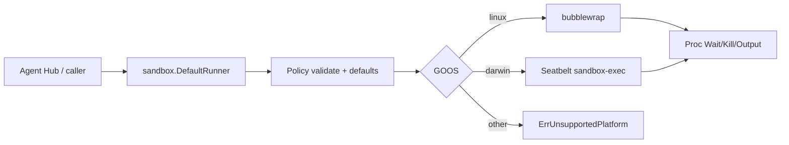

# Agent sandbox

`internal/sandbox` là package **leaf** chạy subprocess dưới isolation OS-level
trước khi Agent Hub (Phase 4) được phép spawn Claude Code / Codex / … Trên Linux
dùng **bubblewrap**; trên macOS dùng **Seatbelt** (`sandbox-exec`). Landlock là
helper best-effort trên Linux, chưa gắn vào đường `Start` mặc định.

import { Callout } from 'fumadocs-ui/components/callout';

<Callout type="info" title="Implemented — prerequisite for Agent Hub">
Package đã merge vào desktop `main` (xem
[Implementation status](/dev-kit/implementation-status)). Agent Hub vẫn
**Design / postponed** cho tới khi adapter vendor gọi
`sandbox.DefaultRunner().Start(...)` và fail-closed khi thiếu backend.
Quyết định stack: [ADR-009](/dev-kit/architecture-decisions#adr-009-os-primitive-sandbox-for-agent-hub-vendor-processes).
</Callout>



## Vì sao cần

Capability Gateway + dialog permission chỉ mediate hành động đi qua DevKit /
ACP client methods. Agent CLI vẫn có bash/fs **trong process của nó** — cùng
user với DevKit. Không có OS jail thì một lệnh `rm` / đọc `~/.ssh` vẫn thành
công sau khi user (hoặc agent-native tool) cho phép.

Sandbox **không thay** consent Gateway/UI; hai lớp bổ sung nhau.

Claude Code (`/sandbox`) và Codex (Landlock/bwrap nội bộ) có sandbox first-party
nhưng không đủ cho Hub multi-vendor và spawn ACP — DevKit cần một `Runner` chung.

## Principles

- Fail closed: thiếu `bwrap` / platform không hỗ trợ → `ErrUnavailable` /
  `ErrUnsupportedPlatform`; Hub vendor thật không được fallback unsandboxed im lặng.
- Allowlist: `WorkDir` (và path khai báo) mới được ghi; mặc định private home.
- Default deny: luôn phủ `~/.ssh`, `~/.gnupg`, `~/.aws`, `~/.config/gcloud` trên
  **host HOME** (và policy `HOME` nếu khác).
- Leaf package: `internal/sandbox` không import bất kỳ `devkit/internal/*` nào
  (ép bởi `go test ./internal/arch`).
- Không nhúng `@anthropic-ai/sandbox-runtime` (TypeScript) vào core Go.

## API bề mặt

```go
r := sandbox.DefaultRunner()
if err := r.Available(ctx); err != nil {
    // bwrap missing / unsupported OS
}
proc, err := r.Start(ctx, sandbox.Policy{
    WorkDir: "/abs/path/to/project",
    Network: sandbox.NetworkNone, // or NetworkHost; unknown → ErrInvalidPolicy
    Env: map[string]string{
        "PATH": "/usr/bin:/bin",
        // HOME forced when private home (default)
    },
}, sandbox.Cmd{Path: "/usr/bin/agent", Args: []string{"--acp"}})
```

| Type / func | Vai trò |
|---|---|
| `Policy` | WorkDir (abs), RO/RW binds, DenyReadPaths, Env, Network, PrivateHome |
| `Cmd` | Path + Args; optional Dir dưới WorkDir |
| `Runner.Start` | Validate → defaults → Backend.Start |
| `DefaultRunner` | Linux → bwrap; Darwin → Seatbelt; else unavailable |
| `Proc` | Wait / Kill / PID / Output (buffers) |
| `LandlockAvailable` / `RestrictSelf` | Linux helper; không gọi tự động từ bwrap Start (v1) |

### Defaults quan trọng

| Field | Default |
|---|---|
| `Network` empty | `none` (`--unshare-net` / seatbelt deny outbound) |
| `PrivateHome` nil | `true` — tmpfs trên home path, force `HOME` + `TMPDIR=/tmp` |
| Sensitive denies | luôn thêm; tắt chỉ với `DangerousAllowSensitive` (test) |

### Lỗi

| Sentinel | Khi |
|---|---|
| `ErrInvalidPolicy` | WorkDir không abs, network lạ, bind/symlink vào vùng deny |
| `ErrUnavailable` | Backend nil / `bwrap` không có trên PATH |
| `ErrUnsupportedPlatform` | Không phải linux/darwin |
| `ErrLandlockSkipped` | Landlock không áp được (best-effort) |

## Linux (bubblewrap)

Yêu cầu host: `apt install bubblewrap` (hoặc tương đương).

Mount recipe (rút gọn):

1. `--unshare-user --unshare-pid --unshare-ipc --die-with-parent`
2. `--unshare-net` khi `NetworkNone`
3. RO bind `/usr`, `/bin`, `/lib`, `/lib64`, `/etc` (bỏ path thiếu)
4. `--bind WorkDir WorkDir` (+ RO/RW extras)
5. Deny: `--tmpfs` thư mục nhạy cảm / null-bind file
6. Private home: `--tmpfs $HOME` rồi **re-bind WorkDir** nếu WorkDir nằm dưới home
7. `--clearenv` + env allowlist; `--chdir` → exec

Bind path được `EvalSymlinks`; nếu resolve vào deny → `ErrInvalidPolicy`.

## macOS (Seatbelt)

Profile SBPL sinh bởi `buildSeatbeltProfile` (unit-test được trên Linux CI).
Runtime: `sandbox-exec -f <profile> -- <cmd>…` (`//go:build darwin`).

Seatbelt read surface rộng hơn bwrap (cần dyld/system); vẫn deny network khi
`NetworkNone` và deny các path nhạy cảm theo policy. Integration test chỉ chạy
trên Darwin.

## Ops / test

```bash
# Unit + integration (skip bwrap tests nếu thiếu binary)
go test ./internal/sandbox/ ./internal/arch/ -count=1

# Smoke có ý nghĩa trên máy có bwrap:
go test ./internal/sandbox/ -run 'TestSmokeAgentShapedProcess|TestBwrapCanWriteWorkDirUnderHome' -v
```

| Host package | Platform |
|---|---|
| `bubblewrap` | Linux (bắt buộc cho DefaultRunner) |
| `sandbox-exec` | macOS (system) |
| Landlock LSM | Linux best-effort; EPERM/ENOSYS → skip |

## Out of scope (v1)

- Domain-allowlist HTTP/SOCKS egress proxy
- Windows backend
- Firejail / gVisor / Firecracker / Docker-as-default
- Auto-install `bwrap` cho end user
- Wire vào Agent Hub UI (Phase 4 resume)

## Liên kết

- [ADR-009](/dev-kit/architecture-decisions#adr-009-os-primitive-sandbox-for-agent-hub-vendor-processes)
- [Agent Hub](/dev-kit/agent-hub) (consumer tương lai)
- [MCP / Agent](/dev-kit/mcp-agent) (lớp consent khác — Gateway)
- [Security model](/dev-kit/security)
- Desktop research/plan (force-added): `docs/superpowers/research/2026-08-12-agent-sandbox-oss.md`,
  `docs/superpowers/plans/2026-08-12-agent-sandbox.md`
