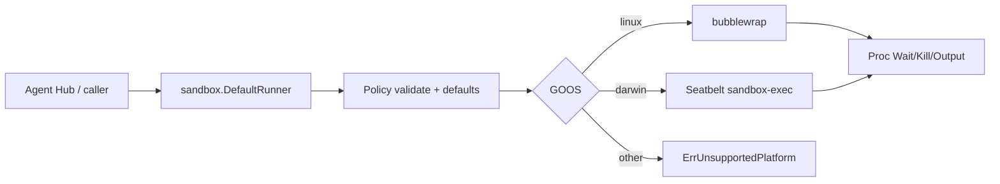

# Agent sandbox

`internal/sandbox` chạy subprocess dưới isolation OS-level để Agent Hub có thể
spawn Claude Code / Codex / … mà không để agent CLI đụng full home directory.
Linux dùng **bubblewrap**; macOS dùng **Seatbelt** (`sandbox-exec`).

import { Callout } from 'fumadocs-ui/components/callout';
import { Cards, Card } from 'fumadocs-ui/components/card';

<Callout type="info" title="Implemented — prerequisite for Agent Hub">
Package đã merge vào desktop `main` — xem
[Implementation status](/dev-kit/implementation-status). Agent Hub vẫn
**Design / postponed** cho tới khi vendor adapter gọi
`sandbox.DefaultRunner().Start(...)` và fail-closed khi thiếu backend. Stack:
[ADR-009](/dev-kit/architecture-decisions#adr-009-os-primitive-sandbox-for-agent-hub-vendor-processes).
</Callout>



Capability Gateway và dialog permission chỉ mediate hành động đi qua DevKit /
ACP. Agent CLI vẫn có bash/fs trong process của nó — cùng user với DevKit — nên
cần OS jail riêng. Sandbox **không thay** consent Gateway/UI; hai lớp bổ sung
nhau. Claude Code (`/sandbox`) và Codex có sandbox first-party nhưng không đủ
cho Hub multi-vendor.

## Principles

- Fail closed: thiếu `bwrap` / platform không hỗ trợ → `ErrUnavailable` /
  `ErrUnsupportedPlatform`.
- Allowlist: chỉ `WorkDir` (và path khai báo) được ghi; private home mặc định.
- Default deny: luôn phủ `~/.ssh`, `~/.gnupg`, `~/.aws`, `~/.config/gcloud` trên
  **host HOME** (và policy `HOME` nếu khác).
- Leaf package: không import `devkit/internal/*` (ép bởi `go test ./internal/arch`).
- Không nhúng `@anthropic-ai/sandbox-runtime` (TypeScript) vào core Go.

## Surface API

```go
r := sandbox.DefaultRunner()
if err := r.Available(ctx); err != nil {
    // bwrap missing / unsupported OS
}
proc, err := r.Start(ctx, sandbox.Policy{
    WorkDir: "/abs/path/to/project",
    Network: sandbox.NetworkNone, // or NetworkHost
    Env:     map[string]string{"PATH": "/usr/bin:/bin"},
}, sandbox.Cmd{Path: "/usr/bin/agent", Args: []string{"--acp"}})
```

| Type / func | Role |
|---|---|
| `Policy` | WorkDir (abs), RO/RW binds, DenyReadPaths, Env, Network, PrivateHome |
| `Cmd` | Path + Args; optional Dir under WorkDir |
| `Runner.Start` | Validate → defaults → Backend.Start |
| `DefaultRunner` | Linux → bwrap; Darwin → Seatbelt; else unavailable |
| `Proc` | Wait / Kill / PID / Output |
| `LandlockAvailable` / `RestrictSelf` | Linux helper; not wired into bwrap Start (v1) |

### Defaults

| Field | Default |
|---|---|
| Empty `Network` | `none` |
| `PrivateHome` nil | `true` — tmpfs on home, force `HOME` + `TMPDIR=/tmp` |
| Sensitive denies | Always on; off only with `DangerousAllowSensitive` (tests) |

### Errors

| Sentinel | When |
|---|---|
| `ErrInvalidPolicy` | Non-abs WorkDir, unknown network, bind/symlink into deny |
| `ErrUnavailable` | Nil backend / `bwrap` not on PATH |
| `ErrUnsupportedPlatform` | Not linux/darwin |
| `ErrLandlockSkipped` | Landlock could not apply (best-effort) |

## Linux (bubblewrap)

Host: `apt install bubblewrap` (or equivalent).

1. `--unshare-user --unshare-pid --unshare-ipc --die-with-parent`
2. `--unshare-net` when `NetworkNone`
3. RO bind `/usr`, `/bin`, `/lib`, `/lib64`, `/etc` (skip missing)
4. `--bind WorkDir WorkDir` (+ RO/RW extras)
5. Deny: `--tmpfs` on sensitive dirs / null-bind files
6. Private home: `--tmpfs $HOME`, then **re-bind WorkDir** if it sits under home
7. `--clearenv` + allowlisted env; `--chdir` → exec

Bind paths are `EvalSymlinks`'d; resolve into a deny path → `ErrInvalidPolicy`.

## macOS (Seatbelt)

`buildSeatbeltProfile` emits SBPL (unit-tested on Linux CI). Runtime:
`sandbox-exec -f <profile> -- <cmd>…` (`//go:build darwin`). Read surface is
wider than bwrap (dyld/system needs); network and sensitive paths still denied
per policy. Integration tests run on Darwin only.

## Ops / tests

```bash
go test ./internal/sandbox/ ./internal/arch/ -count=1

go test ./internal/sandbox/ \
  -run 'TestSmokeAgentShapedProcess|TestBwrapCanWriteWorkDirUnderHome' -v
```

| Host package | Platform |
|---|---|
| `bubblewrap` | Linux (required for `DefaultRunner`) |
| `sandbox-exec` | macOS (system) |
| Landlock LSM | Linux best-effort; EPERM/ENOSYS → skip |

## Out of scope (v1)

- Domain-allowlist HTTP/SOCKS egress proxy
- Windows backend
- Firejail / gVisor / Firecracker / Docker-as-default
- Auto-install `bwrap` for end users
- Wire into Agent Hub UI (Phase 4 resume)

Landlock helper exists but is **not** attached to `BwrapBackend.Start` in v1.

<Cards>
  <Card title="ADR-009" href="/dev-kit/architecture-decisions#adr-009-os-primitive-sandbox-for-agent-hub-vendor-processes" description="Locked stack: bwrap + Landlock / Seatbelt" />
  <Card title="Agent Hub" href="/dev-kit/agent-hub" description="Future consumer — vendor spawn must use DefaultRunner" />
  <Card title="MCP / Agent" href="/dev-kit/mcp-agent" description="Gateway consent layer — complementary, not a substitute" />
  <Card title="Security model" href="/dev-kit/security" description="Threat model and security gates" />
  <Card title="Implementation status" href="/dev-kit/implementation-status" description="Checkout vocabulary: Implemented / Design only" />
</Cards>
