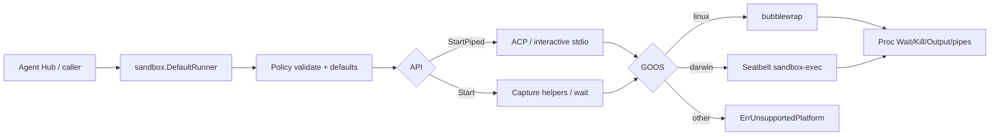

# Agent sandbox

`internal/sandbox` chạy subprocess dưới isolation OS-level để Agent Hub có thể
spawn Claude Code / Codex / … mà không để agent CLI đụng full home directory.
Linux dùng **bubblewrap**; macOS dùng **Seatbelt** (`sandbox-exec`).

import { Callout } from 'fumadocs-ui/components/callout';
import { Cards, Card } from 'fumadocs-ui/components/card';

<Callout type="info" title="Implemented — Start + StartPiped">
Package đã merge vào desktop `main` (PR #22); **`StartPiped`** thêm trên Agent
Hub branch cho ACP interactive stdio. Agent Hub Claude adapter gọi
`sandbox.DefaultRunner().StartPiped(...)` và fail-closed khi thiếu backend —
xem [Agent Hub](/dev-kit/agent-hub) (Implemented — Claude-only) và
[Implementation status](/dev-kit/implementation-status). Stack:
[ADR-009](/dev-kit/architecture-decisions#adr-009-os-primitive-sandbox-for-agent-hub-vendor-processes).
</Callout>



Capability Gateway và dialog permission chỉ mediate hành động đi qua DevKit /
ACP. Agent CLI vẫn có bash/fs trong process của nó — cùng user với DevKit — nên
cần OS jail riêng. Sandbox **không thay** consent Gateway/UI; hai lớp bổ sung
nhau. Claude Code (`/sandbox`) và Codex có sandbox first-party nhưng không đủ
cho Hub multi-vendor — và **không lồng được** với jail DevKit trên macOS:
`sandbox-exec` trong jail fail `sandbox_apply: Operation not permitted` (đo
2026-09-05, không có SBPL operation nào mở). Sandbox vendor là lựa chọn *thay
thế*, không phải lớp *bổ sung*; adapter phải đảm bảo nó tắt khi spawn qua
DevKit, nếu không mọi lệnh bash của agent fail ngầm. Chi tiết và lý do chọn
lớp DevKit: [ADR-009](/dev-kit/architecture-decisions#adr-009-os-primitive-sandbox-for-agent-hub-vendor-processes).

## Principles

- Fail closed: thiếu `bwrap` / platform không hỗ trợ → `ErrUnavailable` /
  `ErrUnsupportedPlatform`.
- Allowlist: chỉ `WorkDir` (và path khai báo) được ghi; private home mặc định.
- Default deny: luôn phủ `~/.ssh`, `~/.gnupg`, `~/.aws`, `~/.config/gcloud` trên
  **host HOME** (và policy `HOME` nếu khác).
- Leaf package: không import `devkit/internal/*` (ép bởi `go test ./internal/arch`).
- Không nhúng `@anthropic-ai/sandbox-runtime` (TypeScript) vào core Go.

## Surface API

Vào bằng `sandbox.DefaultRunner()`. `Available(ctx)` kiểm tra trước — lỗi
nghĩa là thiếu `bwrap` hoặc OS không hỗ trợ.

Hai cách chạy, cùng nhận `Policy` + `Cmd`:

- **`Start`** — capture-and-wait, stdout/stderr buffered. Dùng cho helper và
  lệnh one-shot; thường đi với `NetworkNone`.
- **`StartPiped`** — stdio tương tác cho ACP / vendor agent. Trả về handle có
  `StdinWriter()` / `StdoutReader()` cho JSON-RPC line-delimited. Thường cần
  `NetworkHost` vì agent phải gọi model API.

| Type / func | Role |
|---|---|
| `Policy` | WorkDir (abs), RO/RW binds, DenyReadPaths, Env, Network, PrivateHome; **Design:** `AllowUnixSockets` — socket MCP riêng của session (xem dưới) |
| `Cmd` | Path + Args; optional Dir under WorkDir |
| `Runner.Start` | Validate → defaults → Backend.Start — **capture helpers** |
| `Runner.StartPiped` | Same policy path → Backend.StartPiped — **ACP / interactive stdio** |
| `DefaultRunner` | Linux → bwrap; Darwin → Seatbelt; else unavailable |
| `Proc` | Wait / Kill / PID / Output; StdinWriter / StdoutReader after StartPiped |
| `LandlockAvailable` / `RestrictSelf` | Linux helper; not wired into bwrap Start/StartPiped (v1) |

### Defaults

| Field | Default |
|---|---|
| Empty `Network` | `none` |
| `PrivateHome` nil | `true` — force `HOME` + `TMPDIR=/tmp`; **Linux** thêm `--tmpfs $HOME`. **macOS không có tmpfs**: `HOME` vẫn trỏ home thật, home không đọc được chỉ nhờ `(deny default)` |
| Sensitive denies | Always on; off only with `DangerousAllowSensitive` (tests) |

### Errors

| Sentinel | When |
|---|---|
| `ErrInvalidPolicy` | Non-abs WorkDir, unknown network, bind/symlink into deny |
| `ErrUnavailable` | Nil backend / `bwrap` not on PATH |
| `ErrUnsupportedPlatform` | Not linux/darwin |
| `ErrLandlockSkipped` | Landlock could not apply (best-effort) |

## Linux (bubblewrap)

Host: `apt install bubblewrap` (or equivalent).

1. `--unshare-user --unshare-pid --unshare-ipc --die-with-parent`
2. `--unshare-net` when `NetworkNone`
3. RO bind `/usr`, `/bin`, `/lib`, `/lib64`, `/etc` (skip missing)
4. `--bind WorkDir WorkDir` (+ RO/RW extras)
5. Deny: `--tmpfs` on sensitive dirs / null-bind files
6. Private home: `--tmpfs $HOME`, then **re-bind WorkDir** if it sits under home
7. `--clearenv` + allowlisted env; `--chdir` → exec

Bind paths are `EvalSymlinks`'d; resolve into a deny path → `ErrInvalidPolicy`.

## macOS (Seatbelt)

`buildSeatbeltProfile` emits SBPL (unit-tested on Linux CI). Runtime:
`sandbox-exec -p <profile> -- <cmd>…` (`//go:build darwin`) — profile đi trên
argv, **không** qua temp file: `sandbox-exec` đọc file sau `exec`, nên unlink
ngay sau `Start` từng race với child. Read surface rộng hơn bwrap (dyld/system
needs). Integration tests chạy trên Darwin only.

Bốn điểm Seatbelt **khác** bwrap, đều đã đo trên máy thật và có test. Đối
chiếu chéo với `codex-rs/sandboxing/src/seatbelt.rs` + `seatbelt_tests.rs` của
Codex CLI (cùng bài toán, cùng OS): test của họ cũng cấm dòng
`(allow network-outbound)` trần và cũng chặn rename tổ tiên.

- **Rule sau thắng rule trước.** SBPL không có "deny luôn thắng"; rule khớp
  cuối cùng quyết định. Vì vậy block `(deny …)` cho sensitive path luôn được
  phát **sau** mọi `(allow …)` — `seatbelt_profile_test.go` khoá thứ tự này.
- **`file-read*` và `file-write*` là hai lớp operation độc lập.** Deny một lớp
  không đụng lớp kia. Khi `WorkDir` (hoặc một RW path) là *tổ tiên* của
  `~/.ssh` — ví dụ `cwd=$HOME` — deny read-only để `~/.ssh/authorized_keys`
  **ghi được**. Block deny vì thế phủ cả `file-read* file-write*`
  (`TestSeatbeltDeniesWriteToDenyPathUnderRWAncestor`). bwrap không có vấn đề
  này vì `--tmpfs` che cả hai chiều.
- **`network-outbound` trần bao gồm cả AF_UNIX.** `(allow network-outbound)`
  không filter cho process với tới *mọi* unix socket trên host —
  `/var/run/docker.sock` (= host root qua container privileged), listener của
  ssh-agent, v.v. bwrap không dính vì không bind `/var/run`. `NetworkHost` vì
  thế chỉ allow `(remote ip "*:*")` cộng đúng một unix socket theo literal path
  là `/private/var/run/mDNSResponder` (getaddrinfo đi qua nó) — cùng cách các
  profile trong `/System/Library/Sandbox/Profiles/*.sb` của Apple làm
  (`TestSeatbeltNetworkHostDeniesUnixSockets`, smoke test HTTPS vẫn 200).

- **`(subpath X)` mất tác dụng khi tổ tiên của X bị đổi tên.** Với
  `WorkDir=/Users`, `mv /Users/me /Users/x` rồi ghi `/Users/x/.ssh/…` — deny
  không còn khớp (đo được: `authorized_keys` nhận "pwned"). Vì vậy mỗi tổ tiên
  của một deny path (trừ `/`) nhận thêm
  `(deny file-write-unlink (require-all (vnode-type DIRECTORY) (literal …)))`
  — cùng rule Codex dùng cho protected path
  (`TestSeatbeltDeniesAncestorRenameBypass`). Rename bình thường trong WorkDir
  không bị ảnh hưởng.

Ngoài ra profile allow `/dev/null` (read+write, guard `vnode-type
CHARACTER-DEVICE` như Codex): thiếu nó thì `2>/dev/null` — có trong gần như
mọi lệnh shell agent chạy — và `ssh-add` fail với `Operation not permitted`.

**Còn mở, có chủ đích:** loopback TCP (`127.0.0.1:5432`, dev server) vẫn với
tới được dưới `NetworkHost` — agent có thể nói chuyện thẳng với DB local, bỏ
qua gate của `db.query`. Đóng cái này cần egress proxy (mục Out of scope), không
phải một rule profile.

### `AllowUnixSockets` (Implemented)

Đã triển khai trong `internal/sandbox/policy.go`, `internal/sandbox/seatbelt_profile.go`, `internal/sandbox/backend_bwrap.go` và kiểm chứng qua `internal/sandbox/backend_seatbelt_test.go` (`TestSeatbeltAllowUnixSocketsConnects`). Sau khi `NetworkHost` chỉ còn IP, agent **không nối được** socket MCP của DevKit nữa — đúng ý cho `mcp.sock` chung, nhưng agent cần một đường về DevKit. Field `Policy.AllowUnixSockets` (đường dẫn tuyệt đối, đi qua `validateBindPaths`) mở đúng socket của session đó, và đó cũng chính là cách identity được cưỡng chế ở kernel (xem [Agent Hub § Agent identity](/dev-kit/agent-hub#agent-identity--ranh-giới-giữa-các-session-implemented)).

- **Seatbelt:** mỗi entry phát `(allow network-outbound (literal <path>))` +
  `(allow file-read* (literal <path>))`, **sau** block network và **độc lập
  `NetworkMode`** — đây là IPC cục bộ, agent `NetworkNone` vẫn phải gọi được
  DevKit; vì rule sau thắng, đặt sau `(deny network-outbound)` là đủ. Chưa chắc
  Seatbelt có đòi quyền metadata trên thư mục cha khi lookup path socket
  (comment về `/var` gợi ý có) — test live quyết định, thiếu thì thêm
  `file-read-metadata` đúng chuỗi cha, không hơn.
- **bubblewrap:** socket nằm dưới `$HOME` mà `PrivateHome` phủ tmpfs → phát
  `--bind <path> <path>` sau tmpfs home, cùng slot re-bind WorkDir. Chưa đo trên
  Linux — cùng trạng thái với thứ tự RO/RW ghi ở [Workspace](/dev-kit/workspace).
- Proxy `devkit-mcp` vào `ReadOnlyPaths` theo đường dẫn tuyệt đối từ
  `install.ResolveCommand()`; không tìm thấy → `CreateSession` fail rõ
  (`ErrProxyNotFound`) thay vì spawn một agent không gọi được DevKit.

## Ops / tests

```bash
go test ./internal/sandbox/ ./internal/arch/ -count=1

go test ./internal/sandbox/ \
  -run 'TestSmokeAgentShapedProcess|TestBwrapCanWriteWorkDirUnderHome|TestStartPiped' -v

# macOS: live Seatbelt invariants (unix socket, write-deny, ancestor rename) + DNS smoke
DEVKIT_SANDBOX_SMOKE=1 go test ./internal/sandbox/ -run 'Seatbelt|Smoke' -v
```

| Host package | Platform |
|---|---|
| `bubblewrap` | Linux (required for `DefaultRunner`) |
| `sandbox-exec` | macOS (system) |
| Landlock LSM | Linux best-effort; EPERM/ENOSYS → skip |

## Out of scope (v1)

- Domain-allowlist HTTP/SOCKS egress proxy
- Windows backend
- Firejail / gVisor / Firecracker / Docker-as-default
- Auto-install `bwrap` for end users

Landlock helper exists but is **not** attached to `BwrapBackend.Start` /
`StartPiped` in v1. Agent Hub Claude path already uses `StartPiped`; Codex/Gemini
adapters still Design.

<Cards>
  <Card title="ADR-009" href="/dev-kit/architecture-decisions#adr-009-os-primitive-sandbox-for-agent-hub-vendor-processes" description="Locked stack: bwrap + Landlock / Seatbelt" />
  <Card title="Agent Hub" href="/dev-kit/agent-hub" description="Implemented (Claude-only) — vendor spawn uses StartPiped" />
  <Card title="MCP / Agent" href="/dev-kit/mcp-agent" description="Gateway consent layer — complementary, not a substitute" />
  <Card title="Security model" href="/dev-kit/security" description="Threat model and security gates" />
  <Card title="Implementation status" href="/dev-kit/implementation-status" description="Checkout vocabulary: Implemented / Partial / Design only" />
</Cards>
