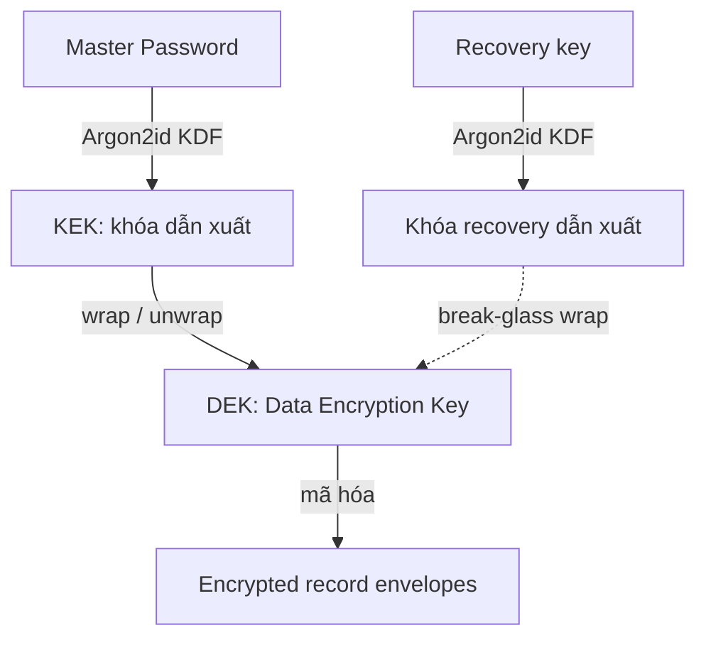

# Security model

Bảo mật là điều kiện tiên quyết: threat model trước implementation, encryption có lifecycle, capability được enforce trong code.

Để xem ma trận control đã implement, evidence path và rủi ro còn lại theo checkout hiện tại, xem [Security controls](/dev-kit/security-controls).



## Khái niệm khóa & mã hóa

Phần này giải thích các thuật ngữ dùng xuyên suốt trang security cho người mới. Chi
tiết implementation nằm ở [Security controls](/dev-kit/security-controls) và
[Technical contracts](/dev-kit/technical-contracts); code nguồn ở
`internal/crypto/keyring.go`, `internal/crypto/kdf.go`, `internal/crypto/envelope.go`,
`internal/crypto/aead.go`.

### KEK vs DEK — tại sao có hai tầng khóa

- **DEK (Data Encryption Key)** là khóa **thật sự** mã hóa nội dung của bạn (note
  body, DB password, SSH secret). DEK là một khóa 32 byte ngẫu nhiên
  (`crypto.NewKeyring` trong `internal/crypto/keyring.go`).
- **KEK (Key Encryption Key)** là khóa **chỉ để bọc DEK**, không trực tiếp mã hóa
  dữ liệu. KEK không lưu trên đĩa — nó được **dẫn xuất lại từ Master Password** mỗi
  lần unlock qua Argon2id (`DeriveKey` trong `internal/crypto/kdf.go`).

Vì sao tách hai tầng: đổi Master Password chỉ cần **bọc lại DEK** bằng KEK mới,
**không** phải giải mã rồi mã hóa lại toàn bộ record. Đó chính là
`Keyring.ChangePassword` — DEK giữ nguyên nên dữ liệu cũ vẫn đọc được.

Trên đĩa, table `vault_keyring` chỉ lưu **DEK đã bị bọc** (`master_wrapped`) cùng
tham số KDF — không bao giờ lưu Master Password, KEK, hay DEK ở dạng plaintext.

### Vault states theo góc nhìn khóa

- **Locked**: DEK còn ở dạng bọc trên đĩa, chưa có trong RAM → không giải mã được gì.
- **Unlocked**: gõ Master Password → Argon2id ra KEK → KEK mở (unwrap) DEK → DEK
  nằm trong RAM → giờ mới đọc được note/secret.
- **Lock**: zeroize DEK khỏi RAM.

### Recovery key

Recovery key là **đường bọc DEK thứ hai** song song với Master Password: cùng một
DEK được bọc hai lần (`master_wrapped` và `recovery_wrapped`). Mất Master Password
nhưng còn recovery key vẫn mở được DEK. Recovery key chỉ trả về **một lần** tại
setup và không bao giờ persist — xem [Operations](/dev-kit/operations#recovery-and-troubleshooting).

### Envelope — "phong bì" chứa dữ liệu đã mã hóa

Mỗi field bí mật không lưu dạng bytes thô mà lưu một **envelope** có cấu trúc, đủ
thông tin để giải mã lại (`internal/crypto/envelope.go`):

```json
{
  "version": 2,
  "algorithm": "xchacha20-poly1305",
  "key_id": "note-body",
  "nonce": "…",
  "ciphertext": "…"
}
```

- `version` / `algorithm`: đọc đúng cách kể cả khi sau này đổi thuật toán.
- `nonce`: số ngẫu nhiên dùng một lần cho mỗi lần mã hóa; cùng nội dung mã hóa hai
  lần ra hai ciphertext khác nhau.
- `ciphertext`: bản mã.

Runtime hiện tại chỉ chấp nhận **envelope V2** — xem
[ADR-005](/dev-kit/architecture-decisions#adr-005-v2-only-envelope-with-aad-binding).

### AAD — chống tráo phong bì

XChaCha20-Poly1305 là mã hóa **có xác thực**: ngoài giấu nội dung còn phát hiện nếu
ciphertext bị sửa. **AAD (Associated Data)** là dữ liệu gắn kèm không mã hóa nhưng
được "ký" chung. DevKit ghép AAD chuẩn là `record_type + NUL + record_id + NUL +
key_id` (`internal/crypto/aead.go`).

Tác dụng: envelope password của DB profile A **không** thể bị đem gắn sang profile B,
vì `record_id` khác nhau nên `OpenWithAD` sẽ fail. Đây là ràng buộc chống swap
ciphertext mô tả ở ADR-005.

## Protected assets

- Master Password và khóa dẫn xuất
- DEK / recovery keys
- Notes, snippets
- SSH keys, DB passwords, API tokens

## Security gates

1. Có threat model
2. Có data classification
3. Document encryption + key lifecycle
4. Permission boundaries được enforce
5. Review sensitive logs
6. Định nghĩa migration/rollback
7. Test recovery/lockout
8. Test abuse paths chính

## Reference baselines

- OWASP Cryptographic Storage Cheat Sheet
- OWASP ASVS
- OWASP MASVS (pattern client-side secrets cũng áp dụng desktop)

import { Callout } from 'fumadocs-ui/components/callout';

<Callout type="info" title="Zero-knowledge">
Sync server không cần plaintext để vận hành. Nếu design đòi server đọc nội dung — đó là lệch hướng.
</Callout>
