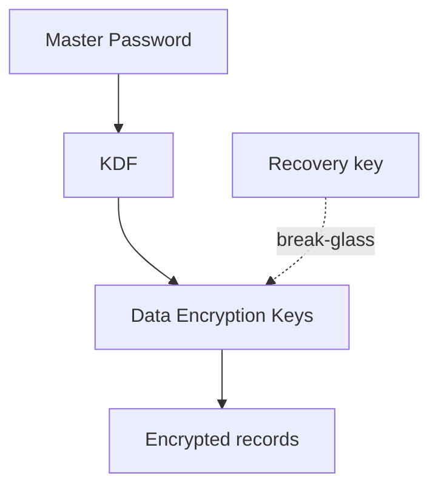

# Security model

Bảo mật là điều kiện tiên quyết: threat model trước implementation, encryption có lifecycle, capability được enforce trong code.

## Protected assets

- Master Password và khóa dẫn xuất
- DEK / recovery keys
- Notes, snippets
- SSH keys, DB passwords, API tokens

## Security gates

1. Có threat model
2. Có data classification
3. Document encryption + key lifecycle
4. Permission boundaries được enforce
5. Review sensitive logs
6. Định nghĩa migration/rollback
7. Test recovery/lockout
8. Test abuse paths chính

## Reference baselines

- OWASP Cryptographic Storage Cheat Sheet
- OWASP ASVS
- OWASP MASVS (pattern client-side secrets cũng áp dụng desktop)

import { Callout } from 'fumadocs-ui/components/callout';

<Callout type="info" title="Zero-knowledge">
Sync server không cần plaintext để vận hành. Nếu design đòi server đọc nội dung — đó là lệch hướng.
</Callout>
