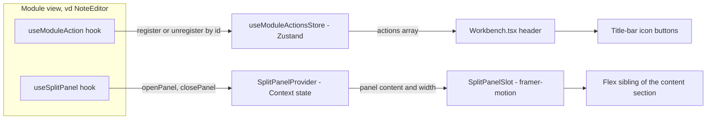

# Shell primitives

`frontend/src/workbench/Workbench.tsx` là root shell render title bar, dock,
command palette, và pane nội dung của module đang active (điều hướng module —
registry + dock — xem [Implementation status](/dev-kit/implementation-status)).
Trang này nói riêng về **hai primitive dùng chung** mà Workbench host, cho
phép bất kỳ module nào mở rộng title bar và side content mà không phải tự vẽ
toolbar/panel riêng.

import { Callout } from 'fumadocs-ui/components/callout';
import { Cards, Card } from 'fumadocs-ui/components/card';

<Callout type="info" title="Implemented — moduleActions + SplitPanel">
`frontend/src/stores/moduleActions.ts` + `frontend/src/components/ui/split-panel.tsx`,
wired vào `Workbench.tsx`. Consumer đầu tiên: Notes editor (metadata panel) —
xem [Notes](/dev-kit/notes#ui-flow-dashboard--editor). Quyết định + alternatives:
[ADR-011](/dev-kit/architecture-decisions#adr-011-shared-title-bar-actions-and-split-panel-for-module-side-content).
</Callout>



## Title-bar action registry

`useModuleActionsStore` (Zustand) giữ một `actions: ModuleAction[]` phẳng.
Module gọi hook `useModuleAction(action: ModuleAction | null)` — truyền
`null` khi chưa muốn hiện nút (vd: note chưa load xong) mà **không** được bọc
hook trong `if` (Rules of Hooks: hook luôn gọi unconditionally, chỉ argument
đổi giữa object và `null`).

```ts
type ModuleAction = {
  id: string;
  icon: LucideIcon;
  label: string;
  isActive?: boolean;
  onClick: () => void;
};
```

- **Đăng ký theo `id`, upsert không push trùng** — `registerAction` tìm
  `findIndex` theo `id` trước khi thêm; React 19 **StrictMode** double-invoke
  effect trong dev vẫn an toàn, không tạo nút trùng trên title bar.
- **`onClick` đọc qua `ref`** (`onClickRef.current`), effect đăng ký chỉ phụ
  thuộc `[id, icon, label, isActive, registerAction, unregisterAction]` —
  không re-run mỗi lần component gọi hook re-render (vd: mỗi keystroke khi
  gõ title note), tránh register/unregister-thrash. Đã cân nhắc
  `useEffectEvent` (React 19, stable) cho việc này nhưng loại vì hook đó bắt
  buộc gọi từ Effect trong **cùng component** định nghĩa nó — không hợp use
  case "component A đăng ký, Workbench (component B) gọi lại onClick sau".
- **Cleanup tự động** — effect trả về `() => unregisterAction(id)`; unmount
  hoặc `action` chuyển `null` đều xoá nút khỏi title bar.
- Render trong `Workbench.tsx`: `moduleActions.map(...)` thành `Tooltip` +
  icon `Button` (`size="icon-sm"`, `aria-pressed={action.isActive}`), đặt
  **trước** nút Search cố định.

## Split panel primitive

`SplitPanelProvider` + `SplitPanelSlot` + `useSplitPanel()`
(`frontend/src/components/ui/split-panel.tsx`) là side panel
**content-squeezing** — flex sibling co giãn `width` qua framer-motion, khác
overlay/Sheet đè lên nội dung. Panel và main content là **hai box `bg-card`
độc lập** (mỗi bên tự có `rounded-xl border border-border`), ngăn cách bởi
một gutter **trong suốt** (`GAP_WIDTH`, khớp margin `mx-1/mb-1` bao quanh
toàn bộ content row của Workbench) — không phải một card chung có đường kẻ
nội bộ như bản đầu tiên.

```ts
const { openPanel, closePanel } = useSplitPanel();

openPanel(<MyPanelContent {...props} />, { width: 420, onClose: () => {} });
closePanel();
```

- `openPanel(content, { width, onClose })` nhận `ReactNode` bất kỳ — Context
  lưu `content` là state, `SplitPanelSlot` render nó tại một vị trí cố định
  trong cây, nên gọi lại `openPanel` (vd: mỗi lần state đổi) chỉ update
  content tại chỗ, không remount.
- **Resize kéo-thả** — gutter trong suốt giữa 2 card có hit-area
  (`pointerdown` + global `pointermove`/`pointerup`), clamp `width` trong
  khoảng `MIN_PANEL_WIDTH`–`MAX_PANEL_WIDTH` (320–720px). Width sau khi kéo
  **giữ nguyên** dù `openPanel` bị gọi lại nhiều lần trong lúc panel đang mở
  (vd: NoteEditor re-push content mỗi lần sửa metadata) — chỉ đồng bộ lại
  theo `width` mặc định của `openPanel` khi panel chuyển từ đóng sang mở
  (`wasOpenRef` theo dõi transition này, không đồng bộ mỗi lần re-render).
  Trong lúc kéo, animation framer-motion tắt (`duration: 0`) để panel bám
  chuột 1:1; chỉ animate mượt (`0.22s easeInOut`) khi mở/đóng.
- Panel tự đóng: `width` animate về `0`; nút `X` (`variant="ghost"
  size="icon-sm"`) gọi `panel.onClose`. `onClose` **không** tự gọi
  `closePanel()` — module gọi tự set state cục bộ (vd: `metaOpen`) rồi effect
  của module tự gọi `closePanel()` theo state đó (xem ví dụ Notes bên dưới).
- Riêng `LazyMotion`/`domAnimation` của `SplitPanelSlot` là instance **của
  chính nó**, không dùng chung với `LazyMotion` của `Dock` — hai component là
  sibling trong cây, không phải cha/con.

## Consumer: Notes editor

`NoteEditor` là consumer đầu tiên: đăng ký nút `PanelRight` ("Note details")
qua `useModuleAction`, và một `useEffect` đồng bộ state cục bộ `metaOpen` với
`openPanel`/`closePanel`, đẩy `NoteMetaPanel` (folder/color/tag editing) vào
panel thay vì header editor. Chi tiết UI/UX cụ thể của Notes (layout cột viết
`max-w-[720px]`, nội dung `NoteMetaPanel`) nằm ở
[Notes → UI flow](/dev-kit/notes#ui-flow-dashboard--editor), không lặp lại ở
đây.

## Rules / gotchas

- `useModuleAction(...)` và effect gọi `openPanel`/`closePanel` phải nằm
  **trước** mọi early-return guard (`if (!data) return ...`) trong component
  gọi — vi phạm Rules of Hooks nếu đặt sau.
- Panel content không tự đóng khi module unmount nếu bạn quên cleanup —
  pattern chuẩn là `useEffect` trả về `() => closePanel()`, giống
  `NoteEditor` đang làm khi `note`/`metaOpen` đổi hoặc component unmount.
- Blast radius: đổi hành vi hai file `moduleActions.ts` / `split-panel.tsx`
  ảnh hưởng **mọi** module consumer cùng lúc — review kỹ hơn một thay đổi cục
  bộ trong module.
- `GAP_WIDTH` phải là nguồn sự thật duy nhất cho độ rộng gutter — từng có bug
  gutter hardcode class Tailwind `w-2` (8px) trong khi `GAP_WIDTH` đã đổi
  xuống 6 rồi 4, khiến đổi hằng số không có tác dụng thị giác gì (width tổng
  vẫn animate đúng theo `GAP_WIDTH`, nhưng gutter tự chiếm `w-2` cố định, che
  mất chênh lệch). Cố định bằng `style={{ width: GAP_WIDTH }}` trên gutter
  thay vì một class Tailwind riêng, để 2 giá trị không thể lệch nhau nữa.

<Cards>
  <Card title="ADR-011" href="/dev-kit/architecture-decisions#adr-011-shared-title-bar-actions-and-split-panel-for-module-side-content" description="Quyết định + alternatives (useEffectEvent, overlay panel)" />
  <Card title="Notes" href="/dev-kit/notes" description="Consumer đầu tiên: metadata panel trong editor" />
  <Card title="Repo structure" href="/dev-kit/repo-structure" description="Layout frontend/ trong repo" />
  <Card title="Implementation status" href="/dev-kit/implementation-status" description="Evidence: ModuleManifest / Internal Extension API row" />
</Cards>
