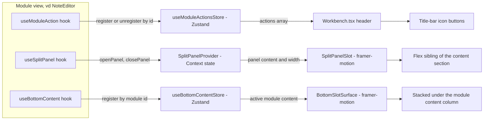

# Shell primitives

`frontend/src/workbench/Workbench.tsx` là root shell render title bar, dock,
command palette, và pane nội dung của module đang active (điều hướng module —
registry + dock — xem [Implementation status](/dev-kit/implementation-status)).
Trang này nói riêng về **ba primitive dùng chung** mà Workbench host, cho
phép bất kỳ module nào mở rộng title bar, side content và khay dưới mà không
phải tự vẽ toolbar/panel riêng.

import { Callout } from 'fumadocs-ui/components/callout';
import { Cards, Card } from 'fumadocs-ui/components/card';

<Callout type="info" title="Implemented — moduleActions + SplitPanel + Bottom slot">
`frontend/src/stores/moduleActions.ts` + `frontend/src/components/ui/split-panel.tsx`,
wired vào `Workbench.tsx`. Consumer đầu tiên: Notes editor (metadata panel) —
xem [Notes](/dev-kit/notes#ui-flow-dashboard--editor). Quyết định + alternatives:
[ADR-011](/dev-kit/architecture-decisions#adr-011-shared-title-bar-actions-and-split-panel-for-module-side-content).
</Callout>

## Title-bar action registry

`useModuleActionsStore` (Zustand) giữ một `actions: ModuleAction[]` phẳng.
Module gọi hook `useModuleAction(action: ModuleAction | null)` — truyền
`null` khi chưa muốn hiện nút (vd: note chưa load xong) mà **không** được bọc
hook trong `if` (Rules of Hooks: hook luôn gọi unconditionally, chỉ argument
đổi giữa object và `null`).

Một `ModuleAction` gồm `id` (khoá upsert), `icon` (Lucide), `label` (tooltip),
`onClick`, và `isActive` optional cho nút toggle.

- **Đăng ký theo `id`, upsert không push trùng** — `registerAction` tìm
  `findIndex` theo `id` trước khi thêm; React 19 **StrictMode** double-invoke
  effect trong dev vẫn an toàn, không tạo nút trùng trên title bar.
- **`onClick` đọc qua `ref`** (`onClickRef.current`), effect đăng ký chỉ phụ
  thuộc `[id, icon, label, isActive, registerAction, unregisterAction]` —
  không re-run mỗi lần component gọi hook re-render (vd: mỗi keystroke khi
  gõ title note), tránh register/unregister-thrash. Đã cân nhắc
  `useEffectEvent` (React 19, stable) cho việc này nhưng loại vì hook đó bắt
  buộc gọi từ Effect trong **cùng component** định nghĩa nó — không hợp use
  case "component A đăng ký, Workbench (component B) gọi lại onClick sau".
- **Cleanup tự động** — effect trả về `() => unregisterAction(id)`; unmount
  hoặc `action` chuyển `null` đều xoá nút khỏi title bar.
- Render trong `Workbench.tsx`: `moduleActions.map(...)` thành `Tooltip` +
  icon `Button` (`size="icon-sm"`, `aria-pressed={action.isActive}`), đặt
  **trước** nút Search cố định.

## Split panel primitive

`SplitPanelProvider` + `SplitPanelSlot` + `useSplitPanel()`
(`frontend/src/components/ui/split-panel.tsx`) là side panel
**content-squeezing** — flex sibling co giãn `width` qua framer-motion, khác
overlay/Sheet đè lên nội dung. Panel và main content là **hai box `bg-card`
độc lập** (mỗi bên tự có `rounded-xl border border-border`), ngăn cách bởi
một gutter **trong suốt** (`GAP_WIDTH`, khớp margin `mx-1/mb-1` bao quanh
toàn bộ content row của Workbench) — không phải một card chung có đường kẻ
nội bộ như bản đầu tiên.

`useSplitPanel()` trả về **hai cặp**: `openPanel`/`closePanel` cho slot trên,
và `openCompanion`/`closeCompanion` cho slot dưới.

### Hai slot, hai chủ sở hữu

Cột phải chia dọc thành hai slot, và **ai sở hữu slot nào là điểm mấu chốt**:

| Slot | Chủ sở hữu | Vòng đời |
|---|---|---|
| Trên (`panel`) | Module đang mở | Chết khi rời module |
| Dưới (`companion`) | Shell | Sống xuyên mọi module |

Nội dung slot trên do module gọi `openPanel` đăng ký, nên nó biến mất cùng
module — đúng ý đồ, vì thứ đang xem thường vô nghĩa ở module khác.

<Callout type="warn" title="Thứ cần sống xuyên module không được đặt ở slot module">
Rời module là **unmount cả subtree**, và cleanup của effect gọi `closePanel()`.
Nên bất kỳ thứ gì phải sống xuyên module — hội thoại với agent, subscription
sự kiện, transcript — đều **không thể** nằm ở slot `panel`. Không phải vì xấu,
mà vì nó sẽ mất. Đó là lý do `companion` tồn tại và do shell giữ.
</Callout>

`openCompanion` **không nhận `width`**: nó dùng chung bề rộng của cột. Cho nó
xin bề rộng riêng nghĩa là cột nhảy mỗi lần companion mở.

### Chia chiều cao

Khi cả hai slot cùng mở, cột chia theo một chiều cao nhớ được, kéo bằng handle
ngang **giống hệt handle dọc**: dải bắt chuột rộng `GAP_WIDTH` nhưng chỉ vẽ 1px,
trong suốt cho tới khi hover, đổi sang màu ring lúc đang kéo. Một đường tóc mà
phải nhắm trúng mới kéo được thì không gọi là handle.

`splitColumn()` (`frontend/src/workbench/splitColumn.ts`) giữ **mọi phép clamp**
và luôn trả về ba phần cộng đúng bằng chiều cao cột, nên caller không phải hoà
giải sai số làm tròn với flex container. Chiều cao lưu là **số tuyệt đối** và
clamp **lúc render**, không phải lúc ghi — một lần mở ở cửa sổ nhỏ không được
làm teo vĩnh viễn tỉ lệ đã kéo ở cửa sổ lớn. Cùng quy tắc với bottom slot.

Chiều cao cột **đo bằng `ResizeObserver`**, không cộng trừ từ title bar và
bottom slot: cộng tay thì lệch ngay lần đầu một trong hai thứ đó đổi.

Chỉ một slot mở thì nó chiếm trọn cột, không có handle.

- `openPanel(content, { width, onClose })` nhận `ReactNode` bất kỳ — Context
  lưu `content` là state, `SplitPanelSlot` render nó tại một vị trí cố định
  trong cây, nên gọi lại `openPanel` (vd: mỗi lần state đổi) chỉ update
  content tại chỗ, không remount.
- **Resize kéo-thả** — gutter trong suốt giữa 2 card có hit-area
  (`pointerdown` + global `pointermove`/`pointerup`), clamp `width` trong
  khoảng `MIN_PANEL_WIDTH`–`MAX_PANEL_WIDTH` (320–720px khi
  [Sidebar](/dev-kit/sidebar) đang đóng; khi cả hai cùng mở, trần thực tế co
  động theo width [Sidebar](/dev-kit/sidebar#resize) đang chiếm + sàn
  `MIN_CONTENT_WIDTH` 480px cho content area giữa — xem Sidebar § Resize).
  Width sau khi kéo
  **giữ nguyên** dù `openPanel` bị gọi lại nhiều lần trong lúc panel đang mở
  (vd: NoteEditor re-push content mỗi lần sửa metadata) — chỉ đồng bộ lại
  theo `width` mặc định của `openPanel` khi panel chuyển từ đóng sang mở
  (`wasOpenRef` theo dõi transition này, không đồng bộ mỗi lần re-render).
  Trong lúc kéo, animation framer-motion tắt (`duration: 0`) để panel bám
  chuột 1:1; chỉ animate mượt (`0.22s easeInOut`) khi mở/đóng.
- Panel tự đóng: `width` animate về `0`; nút `X` (`variant="ghost"
  size="icon-sm"`) gọi `panel.onClose`. `onClose` **không** tự gọi
  `closePanel()` — module gọi tự set state cục bộ (vd: `metaOpen`) rồi effect
  của module tự gọi `closePanel()` theo state đó (xem ví dụ Notes bên dưới).
- Riêng `LazyMotion`/`domAnimation` của `SplitPanelSlot` là instance **của
  chính nó**, không dùng chung với `LazyMotion` của `Dock` — hai component là
  sibling trong cây, không phải cha/con.

## Bottom slot primitive

`useBottomContent` + `BottomSlotSurface` (`frontend/src/components/ui/bottom-slot.tsx`)
là khay ngang dưới nội dung module, bật/tắt bằng
[toggle ở vùng 3 title bar](/dev-kit/title-bar#vùng-3--app-quick-action-area-phải).

`useBottomContent(node)` nhận `ReactNode`, hoặc `null` khi module chưa muốn
đóng góp gì.

**Sao chép hình dạng của [Sidebar](/dev-kit/sidebar), không phải của SplitPanel** —
cờ open là **toàn cục** và persist qua `ui_state`, còn *nội dung* đăng ký
**theo từng module** vào một Zustand store, shell render nội dung của module
đang active. Khác SplitPanel (một panel duy nhất, ai mở cũng được).

- **Chỉ rộng bằng cột nội dung module** — sidebar và split panel chạy **hết
  chiều cao** hai bên, mở khay không làm chúng ngắn đi. Đây là **lệch có chủ
  đích so với App Shell trong Figma**, nơi bottom surface vẽ tràn hết khung và
  cắt ngang sidebar. Lưới dọc (642 / 4 / 220 ở khung 900px) thì giữ nguyên.
- **Cao 220px mặc định**, kéo dọc được, clamp bởi `maxBottomHeight` — sàn
  `CONTENT_MIN_HEIGHT` 240px cho hàng nội dung phía trên. Hàm này **tách
  riêng** khỏi `maxPanelWidth` chứ không tái dùng: 2 panel hai bên clamp lẫn
  nhau vì chung một quỹ ngang, khay dưới không có hàng xóm nào để tranh —
  nhét `otherEffectiveWidth: 0` vào hàm kia sẽ giấu khác biệt đó sau một sự
  trùng hợp.
- **Clamp cả lúc render, không chỉ lúc kéo** — clamp phụ thuộc kích thước cửa
  sổ, mà cửa sổ co lại **sau** khi thả chuột. Thiếu chỗ này thì kéo cao 600px
  rồi thu nhỏ cửa sổ sẽ bóp hàng nội dung phía trên về 0. Chiều cao *lưu* vẫn
  để nguyên, nên mở rộng cửa sổ lại thì khay về đúng cỡ user đã chọn.
  ([Sidebar](/dev-kit/sidebar#resize) hiện còn đúng lỗ này trên trục ngang.)
- **Dock nổi đè lên khay**, không chừa dải trống — dock là `fixed bottom-2`,
  và Figma đặt pill nằm trong lòng bottom surface. Hệ quả chưa xử lý: dock căn
  giữa theo **cửa sổ**, không theo cột module, nên sidebar mở là pill lệch tâm
  so với khay.
- **Chỉ `open` được persist**, chiều cao thì không — khớp `panelWidths.ts` vốn
  cũng không persist width của sidebar/split panel. Persist cỡ của một panel mà
  không persist của các panel kia là bất nhất tệ hơn là không persist gì.

<Callout type="warn" title="Chưa có consumer">
Khay đã dựng xong nhưng **chưa module nào gọi `useBottomContent`** — mở lên chỉ
thấy empty state. Consumer dự kiến đầu tiên là
[Terminal](/dev-kit/terminal) qua Code Graph; backend terminal
(`internal/terminal`, `terminal:io`, `CodeGraphStartTerminal`) đã xong, còn
thiếu wiring `Events.Emit`, xterm.js và tenant.
</Callout>

## Consumer: Notes editor

`NoteEditor` là consumer đầu tiên: đăng ký nút `PanelRight` ("Note details")
qua `useModuleAction`, và một `useEffect` đồng bộ state cục bộ `metaOpen` với
`openPanel`/`closePanel`, đẩy `NoteMetaPanel` (folder/color/tag editing) vào
panel thay vì header editor. Chi tiết UI/UX cụ thể của Notes (layout cột viết
`max-w-[720px]`, nội dung `NoteMetaPanel`) nằm ở
[Notes → UI flow](/dev-kit/notes#ui-flow-dashboard--editor), không lặp lại ở
đây.

## Rules / gotchas

- `useModuleAction(...)` và effect gọi `openPanel`/`closePanel` phải nằm
  **trước** mọi early-return guard (`if (!data) return ...`) trong component
  gọi — vi phạm Rules of Hooks nếu đặt sau.
- Panel content không tự đóng khi module unmount nếu bạn quên cleanup —
  pattern chuẩn là `useEffect` trả về `() => closePanel()`, giống
  `NoteEditor` đang làm khi `note`/`metaOpen` đổi hoặc component unmount.
- Blast radius: đổi hành vi `moduleActions.ts` / `split-panel.tsx` /
  `bottom-slot.tsx` ảnh hưởng **mọi** module consumer cùng lúc — review kỹ hơn
  một thay đổi cục bộ trong module.
- `useBottomContent(...)` cũng phải nằm **trước** mọi early-return, cùng lý do
  Rules of Hooks ở dòng đầu.
- Store nội dung của cả sidebar lẫn bottom slot là **Zustand, không phải
  Context** — và đây là ràng buộc, không phải sở thích: với Context, module
  đang đăng ký cũng là consumer, nên ghi nội dung sẽ re-render chính nó, sinh
  JSX mới, chạy lại effect đăng ký → "Maximum update depth exceeded". Store phá
  vòng đó vì đăng ký chỉ đọc setter (identity cố định). Xem doc comment trong
  `stores/sidebarContent.ts`.
- `GAP_WIDTH` phải là nguồn sự thật duy nhất cho độ rộng gutter — từng có bug
  gutter hardcode class Tailwind `w-2` (8px) trong khi `GAP_WIDTH` đã đổi
  xuống 6 rồi 4, khiến đổi hằng số không có tác dụng thị giác gì (width tổng
  vẫn animate đúng theo `GAP_WIDTH`, nhưng gutter tự chiếm `w-2` cố định, che
  mất chênh lệch). Cố định bằng `style={{ width: GAP_WIDTH }}` trên gutter
  thay vì một class Tailwind riêng, để 2 giá trị không thể lệch nhau nữa.

<Cards>
  <Card title="ADR-011" href="/dev-kit/architecture-decisions#adr-011-shared-title-bar-actions-and-split-panel-for-module-side-content" description="Quyết định + alternatives (useEffectEvent, overlay panel)" />
  <Card title="Notes" href="/dev-kit/notes" description="Consumer đầu tiên: metadata panel trong editor" />
  <Card title="Sidebar" href="/dev-kit/sidebar" description="Cùng hình dạng với bottom slot: cờ open toàn cục, nội dung theo module" />
  <Card title="Terminal" href="/dev-kit/terminal" description="Consumer dự kiến đầu tiên của bottom slot" />
  <Card title="Repo structure" href="/dev-kit/repo-structure" description="Layout frontend/ trong repo" />
  <Card title="Implementation status" href="/dev-kit/implementation-status" description="Evidence: ModuleManifest / Internal Extension API row" />
</Cards>
