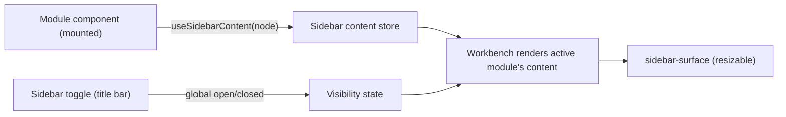

# Sidebar

Cột cố định bên trái content area (320px mặc định), nội dung đổi theo module
đang active. Đóng/mở qua **sidebar toggle** — nút cố định trong title bar,
ngay sau traffic lights, xem [Title bar](/dev-kit/title-bar).

import { Callout } from 'fumadocs-ui/components/callout';
import { Cards, Card } from 'fumadocs-ui/components/card';

<Callout type="warn" title="Design only">
Chưa có runtime. Grounded trên trang **07 App Shell** trong Figma (4 biến thể
`Panel=Open/Closed × Sidebar=Open/Closed`, `_Slot / Sidebar Content`).
</Callout>



## Primitive: `useSidebarContent`

Cùng hợp đồng với `SplitPanel`
([Shell primitives](/dev-kit/shell-primitives)) — nhận `ReactNode` bất kỳ,
primitive không quan tâm hình dạng nội dung bên trong:

```ts
useSidebarContent(content: ReactNode | null)
```

**Khác `SplitPanel` ở 1 điểm quan trọng:** với `SplitPanel`, "có nội dung" và
"đang mở" là cùng 1 hành động (`openPanel()`). Với Sidebar, **đăng ký nội
dung** (module luôn làm, chạy nền) và **hiển thị/ẩn** (toggle global, user
bấm) là **hai việc tách biệt** — xem mục Toggle bên dưới.

## Toggle: global, cần vault unlocked

- **1 flag toàn app** (không phải per-module) — đóng ở module này thì mọi
  module khác cũng đóng cho tới khi user tự mở lại.
- **Cần nhớ qua lần khởi động lại app** — engine lưu local **chưa quyết
  định** ở đây; nhiều chỗ khác trong app cũng sẽ cần persistence tương tự,
  nên cơ chế lưu (localStorage / settings store / khác) để bàn ở 1 tài liệu
  riêng, không thiết kế lẻ tẻ theo từng feature.
- **Chỉ hoạt động sau khi vault `unlocked`.** Trước đó `VaultGate` chặn toàn
  bộ Workbench ([Vault](/dev-kit/vault)) — chưa có module nào mount, sidebar
  không có ý nghĩa. Nút toggle **không xuất hiện/không hoạt động** trong các
  màn hình Vault pre-unlock (setup/unlock/recovery) — chỉ tồn tại trong
  context Workbench sau unlock, đúng phạm vi 3-vùng title bar đã định nghĩa ở
  [Title bar](/dev-kit/title-bar).

## Resize

Dùng lại `react-resizable-panels` (đã có trong `frontend/package.json`,
cùng lib `SplitPanel` dùng) — không thêm dependency mới cho việc này.

<Callout type="info" title="Open question">
**Giới hạn width khi cả Sidebar và SplitPanel cùng mở.** Theo 4 biến thể
trong Figma, cả hai có thể mở đồng thời, ăn width từ 2 phía vào content area
ở giữa. Clamp hiện tại của `SplitPanel` (320–720px,
[Shell primitives](/dev-kit/shell-primitives)) được chốt **từ trước khi có
Sidebar** — chưa tính trường hợp cộng dồn 2 panel. Cần 1 rule đảm bảo content
area giữa luôn còn min-width hợp lý (constrain 1 hoặc cả 2 panel khi cộng
dồn vượt ngưỡng) — **con số cụ thể chưa chốt (TBD)**, cần xác nhận lại range
của `SplitPanel` cùng lúc với việc thêm Sidebar, không audit riêng lẻ.
</Callout>

## Hiệu năng khi nội dung sidebar lớn

Áp dụng cho mọi module đăng ký nội dung, không riêng gì dataset lớn:

1. **Lazy — chỉ đăng ký khi module đã mở ít nhất 1 lần**, không mount sẵn nội
   dung sidebar của module chưa từng mở. Cùng pattern `lazyModuleView()` đã
   dùng cho content chính (xem [Module tabs](/dev-kit/module-tabs)).
2. **Ẩn chứ không huỷ sau lần mở đầu** (`hidden`, không unmount) — khớp
   nguyên tắc "state giữ nguyên khi rời module" đã chốt. Đánh đổi cố ý: tốn
   RAM theo số module đã mở trong phiên, không phải bug.
3. **Virtualize là trách nhiệm của module**, primitive Sidebar không ép hình
   dạng nội dung. Hai helper dùng chung, **opt-in**, sống ở `components/ui/`:
   - **`VirtualList`** — dữ liệu phẳng (vd Agent Hub: list session). Module
     đưa `items[]` + hàm render 1 dòng.
   - **`VirtualTree`** — dữ liệu cây (vd Database: schema/table tree). Build
     **trên `VirtualList`**, không phải 1 engine riêng: tự giữ state
     expand/collapse, mỗi render flatten cây thành mảng phẳng rồi đưa cho
     `VirtualList` windowing — không viết lại logic tính offset lần 2. Module
     chỉ đưa data cây + `getChildren` + hàm render 1 node, không đụng
     virtualization/expand-state.
   - Cả hai dựng trên **`@tanstack/react-virtual`** (dependency mới —
     `frontend/package.json` hiện chưa có lib virtualization nào; chọn lib
     này vì headless, khớp gu "headless kit + tự style shadcn" đang dùng
     — `radix-ui`/`@base-ui/react`/`@ariakit/react` — khác `react-arborist`
     vốn bundle sẵn UI cây riêng).
   - Module có sidebar không phải list/tree (form, filter, …) **không cần
     quan tâm 2 helper này** — không có collection dài thì không có gì để
     virtualize. Hình dạng mới phát sinh sau này (nếu có) thêm helper thứ 3
     khi thật sự cần, không thiết kế trước (YAGNI).
4. **Cô lập re-render** — khung Sidebar (chrome: resize, toggle) là 1
   component `memo` riêng, tách khỏi cây nội dung module đang host bên
   trong, cùng nguyên tắc `WorkbenchViews` đã tách khỏi `TabStrip`
   ([Module tabs § Tab strip UI](/dev-kit/module-tabs#tab-strip-ui)).

## Quan hệ với các trang khác

- **Kế thừa hợp đồng**: [Shell primitives](/dev-kit/shell-primitives) —
  `SplitPanel` là nguồn pattern (`ReactNode` content) và nguồn lib resize
  (`react-resizable-panels`).
- **Điều kiện tiên quyết**: [Vault](/dev-kit/vault) — sidebar chỉ tồn tại
  sau `unlocked`.
- **Nút toggle**: [Title bar](/dev-kit/title-bar) — vị trí cố định ngoài 3
  vùng, luôn hiển thị (trong phạm vi Workbench post-unlock).
- **Không phải tab**: [Module tabs](/dev-kit/module-tabs) — tab (nhiều item
  mở cùng lúc trong content area) và sidebar (1 nội dung phụ trợ bên trái)
  là hai khái niệm độc lập, cùng do module đăng ký nhưng vào hai slot khác
  nhau.

<Cards>
  <Card title="Title bar" href="/dev-kit/title-bar" description="Sidebar toggle — vị trí cố định ngoài 3 vùng" />
  <Card title="Shell primitives" href="/dev-kit/shell-primitives" description="SplitPanel — nguồn pattern ReactNode + resize lib" />
  <Card title="Module tabs" href="/dev-kit/module-tabs" description="Tab trong content area — khái niệm độc lập với sidebar" />
  <Card title="Vault" href="/dev-kit/vault" description="VaultGate — điều kiện tiên quyết để sidebar tồn tại" />
</Cards>
