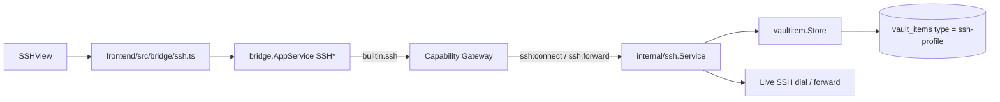
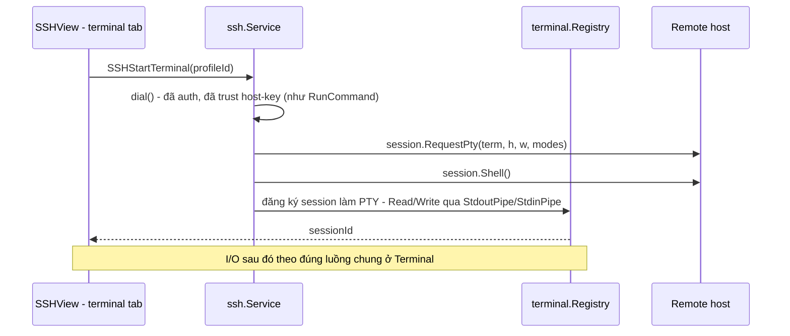

# SSH

Trang này mô tả built-in module **SSH** (ActivityBar title `SSH`, view id
`ssh.connections`). Secrets nằm trong vaultitem substrate; lifecycle Master
Password nằm ở [Vault](/dev-kit/vault).

> Database (`internal/database` + ActivityBar `Database`) là module sibling
> riêng — **không** nằm trong scope trang này. Xem [Database](/dev-kit/database).

## Vaultitem contract

| Field | Value |
|---|---|
| Record `type` | `ssh-profile` |
| Payload `key_id` | `ssh-secret` |
| Metadata (plaintext) | `name`, `host`, `port`, `username`, `auth_method`, `host_key_fingerprint`, **`env`** |
| Payload (encrypted) | password **hoặc** private-key PEM (`auth_method` = `password` \| `key`) |

- **`env` (Implemented):** tên tag trong [Environments](/dev-kit/environments).
  `SSHCreateProfile` reject nếu thiếu hoặc tag không tồn tại
  (`EnvLookup.Exists`). Không copy `requiresConfirmation` vào profile.
- Passphrase của encrypted PEM **không** persist — chỉ truyền per-operation từ UI
  rồi zeroize sau parse.
- Forward sessions **không** phải vault item (in-memory runtime only).

## UI & runtime flows (`SSHView`)

1. **Profile CRUD** — create (name/host/port/username/auth/secret/**env**) →
   list → select → delete. Dropdown env load từ `EnvListTags`. Delete profile
   cũng dừng mọi forward gắn profile đó.
2. **Host-key TOFU** — `ObserveHostKey` dừng handshake trước auth và trả
   SHA-256 fingerprint; user approve → `TrustHostKey` ghi fingerprint vào
   metadata. Dial với pin rỗng **luôn reject**; pin sai reject (exact match).
3. **Test connection** — dial + auth với secret đã seal; không mở shell dài.
4. **Run command** — one-shot remote command; UI có field passphrase tùy chọn;
   output trả về `CombinedOutput`.
5. **TCP forwarding** — start/list/stop local (`-L`) hoặc remote (`-R`):
   - Listen chỉ **loopback** (không public bind).
   - Không persist qua restart; stop / delete profile / app shutdown đều cleanup.
   - Capability riêng `ssh:forward`.

## Bridge & capability

| Method | Capability | Scope |
|---|---|---|
| `SSHListProfiles` | `ssh:connect` | `profile:list` |
| `SSHCreateProfile` | `ssh:connect` | `profile:new` |
| `SSHDeleteProfile` | `ssh:connect` | `profile:<id>` |
| `SSHObserveHostKey` | `ssh:connect` | `profile:<id>` |
| `SSHTrustHostKey` | `ssh:connect` | `profile:<id>` |
| `SSHTestConnection` | `ssh:connect` | `profile:<id>` |
| `SSHRunCommand` | `ssh:connect` | `profile:<id>` |
| `SSHStartForward` | `ssh:forward` | `profile:<id>` |
| `SSHListForwards` | `ssh:forward` | `forward:list` |
| `SSHStopForward` | `ssh:forward` | `forward:<id>` |
| `SSHSetActiveProfile` | `ssh:connect` | `profile:<id>` |
| `SSHActiveProfile` | `ssh:connect` | `profile:active` |
| `SSHStartTerminal` | `ssh:connect` | `profile:<id>` |

Subject luôn `builtin.ssh`. Profile ID là 24 lowercase hex (opaque qua
`recordID()`). Grants thật ở `internal/app/container.go`; manifest chỉ
declaration metadata (`ssh:connect`, `ssh:forward`).

`SSHSetActiveProfile`/`SSHActiveProfile` phục vụ active profile cho agent
(MCP). UI hiện tại (`SSHRunCommand` nhận `profileId` tường minh mỗi lần gọi)
**không đổi** — chọn active profile vẫn human-only (không expose qua MCP).

Packages: `internal/ssh/{ssh,hostkeys,forwarding,active}.go`,
`internal/bridge/{ssh,ssh_active}.go`, `frontend/src/modules/ssh/{SSHView,manifest}.ts`,
`frontend/src/bridge/ssh.ts`.

## MCP tool surface

Xem cơ chế chung + rationale ở [MCP / Agent](/dev-kit/mcp-agent).

| MCP tool | Effect | Map sang | Ghi chú |
|---|---|---|---|
| `ssh.listProfiles` | `read` | `builtin.ssh` / `ssh:connect` / `profile:list` | Chỉ metadata (`host`, `username`...), không có secret |
| `ssh.testConnection` | `execute` | `builtin.ssh` / `ssh:connect` / `profile:<id>` | Nhận `profileId` tường minh — test 1 profile cụ thể, không đụng active profile |
| `ssh.activeProfile` | `read` | `builtin.ssh` / `ssh:connect` / `profile:active` | Trả `{profileId?}` — agent chỉ đọc, không tự đổi |
| `ssh.runCommand` | `execute` (`destructiveHint`) | `builtin.ssh` / `ssh:connect` / `profile:active` | Không nhận `profileId` — chạy trên **active profile cho agent**. Rủi ro cao nhất trong toàn bộ MCP tool surface hiện có. Hỏi quyền theo policy env tag (xem dưới) |

**"Hỏi quyền theo policy env tag" (MCP — Implemented):** field `env` trên
`ssh-profile` **đã Implemented** (create-time validate). `ssh.runCommand` qua
MCP tra `requiresConfirmation` của tag trước khi chạy — nếu bật, xác nhận mỗi
lần gọi (**env thắng** `allow_always`); khi env không bắt confirmation thì có
thể Allow always (cache theo tool). `env=prod` luôn bật (locked); `dev`/`stg`
mặc định tắt nhưng bật được. Unresolvable env name → fail closed (`true`).
Chi tiết: [MCP / Agent](/dev-kit/mcp-agent), [Environments](/dev-kit/environments).
`ssh.listProfiles` / `ssh.testConnection` / `ssh.activeProfile` không bị luật
này.

**Không expose qua MCP ở v1**:

- `SSHObserveHostKey` / `SSHTrustHostKey` — TOFU là quyết định bảo mật cần con
  người xác nhận; agent tự trust host-key mới sẽ vô hiệu hóa chống MITM đã
  thiết kế ở [ADR-007](/dev-kit/architecture-decisions#adr-007-verified-tls-for-remote-db-and-exact-ssh-host-key-pinning).
- `SSHCreateProfile` / `SSHDeleteProfile` — tạo profile nhận secret trực tiếp
  qua tham số; để v2 sau khi có UI permission review cho MCP.
- `SSHSetActiveProfile` — chọn active profile luôn là hành động của con
  người, cùng nguyên tắc human-only action đã áp cho unlock vault / trust
  host-key ở trên.
- `SSHStartForward` / `SSHListForwards` / `SSHStopForward` — mở tunnel network
  do agent khởi tạo là blast-radius lớn, giữ nguyên non-goal bên dưới.

### Active profile cho agent — không đổi resource model hiện có

`ssh.runCommand` qua MCP dùng khái niệm **active profile riêng cho agent**,
tách biệt hoàn toàn khỏi cách UI hoạt động hôm nay:

- UI (`SSHRunCommand` qua bridge) **không đổi gì** — vẫn nhận `profileId`
  tường minh mỗi lần gọi. `SSHStartForward` cũng không đổi — vẫn cho nhiều
  forward chạy song song trên nhiều profile khác nhau như hiện tại.
- Agent qua MCP thì khác: `ssh.runCommand` không nhận `profileId`. Nếu agent
  gọi mà chưa có active profile, DevKit hiện popup cho user chọn 1 trong các
  profile đã lưu (giống hệt cơ chế đã thiết kế cho [Kafka UI](/dev-kit/kafka),
  mục "Agent gọi khi chưa có cluster active"); lựa chọn giữ nguyên (sticky)
  tới khi user tự đổi qua `SSHView` hoặc sidebar.
- Host-key trust (TOFU) vẫn hoạt động độc lập, theo từng profile như hiện
  tại — chọn active profile không tự động trust host-key của profile đó nếu
  chưa được approve trước.
- Khác Kafka: đây không phải ràng buộc tài nguyên — SSH vẫn dial theo từng
  request như hiện tại, không giữ 1 session sống duy nhất. "Active profile"
  chỉ là lớp chọn target cho agent.
- Timeout cho popup và fallback khi DevKit chạy headless áp dụng y hệt NFR-9
  của Kafka UI.

## Terminal tương tác (PTY)

`RunCommand` (mục trên) chỉ one-shot — không có shell tương tác thật. Bổ
sung **terminal tương tác**, dùng
[Terminal](/dev-kit/terminal) (primitive dùng chung, consumer thứ 2 là
CodeGraph). SSH đóng vai trò implementation "remote" của primitive đó:

- **Tái dùng `dial()` nguyên vẹn** — cùng đường auth + host-key pin đã có
  cho `RunCommand`/`TestConnection`, không có code path auth riêng cho
  terminal.
- **Resize** qua `Session.WindowChange(h, w)` — remote server tự biết kích
  thước terminal đổi, chạy đúng như SSH client thật (`ssh` CLI cũng dùng
  đường này).
- **Không đổi `RunCommand`** — vẫn giữ nguyên cho one-shot command (kể cả
  qua MCP agent); terminal tương tác là tính năng UI **mới**, không thay thế
  cái cũ.
- Chi tiết I/O loop, capability `terminal:io`, lifecycle kill-on-close: xem
  [Terminal](/dev-kit/terminal).

## Non-goals (MVP)

- Public-facing tunnel / unrestricted network bind
- Persist forward definitions across restart
- Per-destination allowlist hoặc enterprise policy
- Team share connection profile qua cloud plaintext
- Custom CA pinning ngoài system trust (N/A cho SSH host-key path hiện tại)

## Known limitations

- Host-key trust UX vẫn manual (observe → approve).
- Passphrase đi qua bridge call metadata — phụ thuộc redaction + UI không log.
- Target host/port do user chọn; chưa có policy prompt giàu hơn.
- Terminal tương tác không expose MCP — agent chỉ có `ssh.runCommand`
  one-shot, không có session tương tác riêng.
- Đóng tab terminal kill process ngay — không giữ session chạy nền qua lúc
  chuyển tab (khác Agent Hub).

import { Cards, Card } from 'fumadocs-ui/components/card';

<Cards>
  <Card title="Vault" href="/dev-kit/vault" description="Keyring/DEK + vaultitem substrate" />
  <Card title="Terminal" href="/dev-kit/terminal" description="Primitive PTY dùng chung — SSH là implementation remote" />
  <Card title="Database" href="/dev-kit/database" description="Sibling module — cùng pattern connection-profile" />
  <Card title="Implementation status" href="/dev-kit/implementation-status" description="SSH evidence + remaining scope" />
  <Card title="Technical contracts" href="/dev-kit/technical-contracts" description="Bridge SSH family" />
  <Card title="Architecture decisions" href="/dev-kit/architecture-decisions" description="ADR-007: host-key pinning" />
  <Card title="Security controls" href="/dev-kit/security-controls" description="SSH pinning + forward loopback" />
</Cards>
