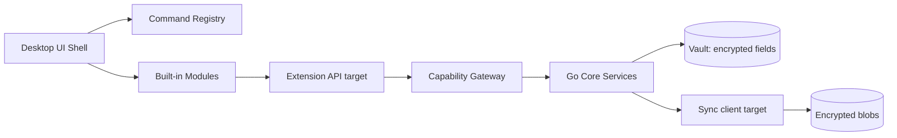

# System overview

DevKit tách UI shell, built-in modules, vault với mã hóa application-layer, và sync tùy chọn (target kiến trúc). Mọi truy cập nhạy cảm đi qua biên giới rõ ràng.

## Layers

1. **UI Shell** — điều hướng, command palette, theme, cửa sổ.
2. **Built-in modules** — vault, notes, connections, tools; plugins host là target future.
3. **Capability Gateway** — choke point cho built-in calls hiện tại; Extension API cho plugin/MCP là target.
4. **Go core services** — crypto, storage, SSH/DB adapters; sync client là target future.
5. **Local vault** — record fields nhạy cảm mã hóa ở application layer trên SQLite local.
6. **Optional sync (target)** — client phải mã hóa blob trước upload/download.

## Key boundaries

- UI/plugin **không** đọc DEK/Master Password trực tiếp.
- Sync server **không** nên cần plaintext notes/secrets (zero-knowledge là mục tiêu sync future).
- Hook chỉ notify; hành động nhạy cảm phải qua Capability Gateway (built-in hiện tại) hoặc Extension API (target cho plugin/MCP).

Chi tiết runtime và evidence theo checkout hiện tại: [Implementation status](/dev-kit/implementation-status).

import { Cards, Card } from 'fumadocs-ui/components/card';

<Cards>
  <Card title="Runtime & process" href="/dev-kit/runtime" />
  <Card title="Data & sync" href="/dev-kit/data-sync" />
  <Card title="Security model" href="/dev-kit/security" />
</Cards>
